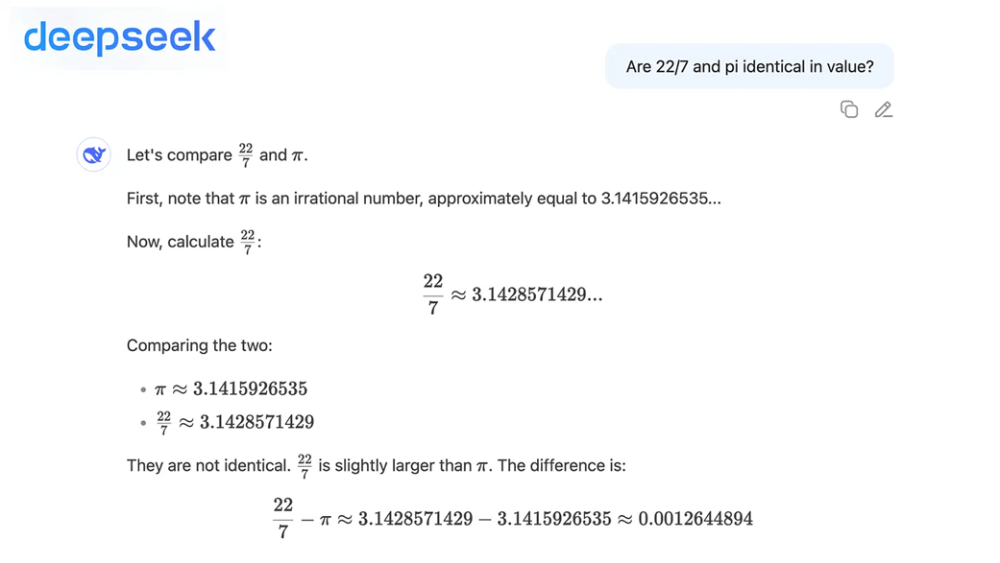
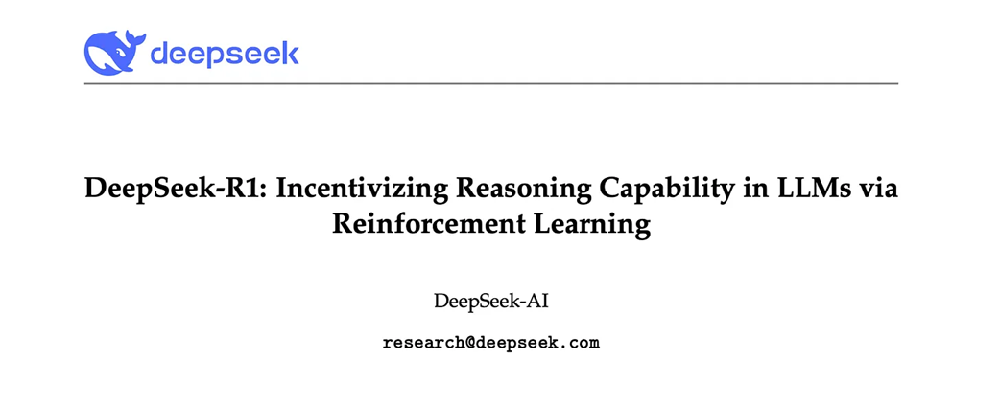
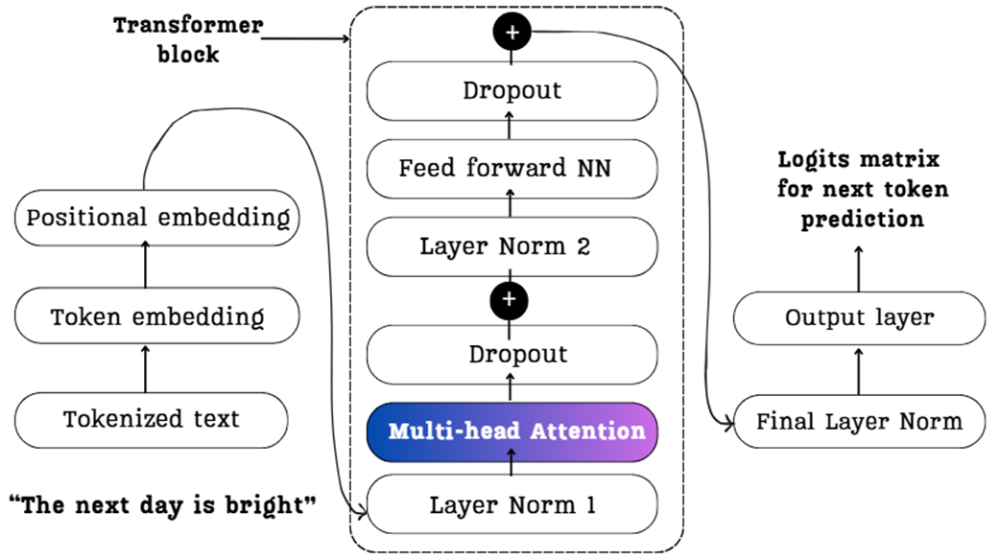
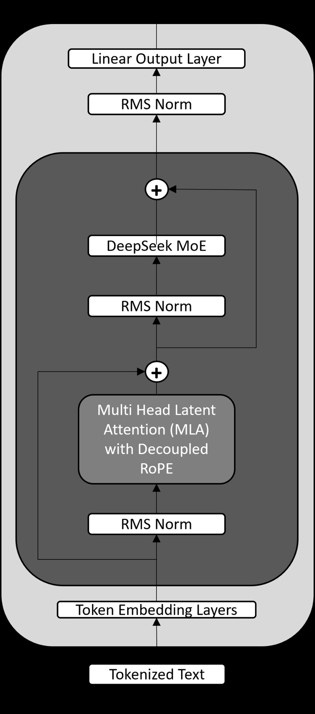
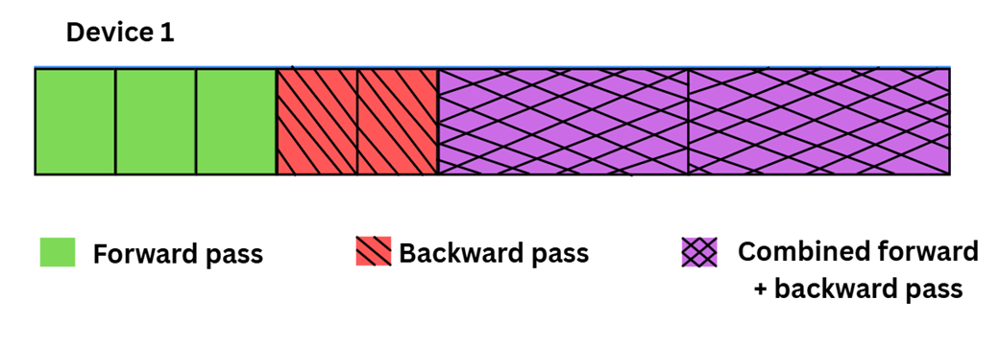
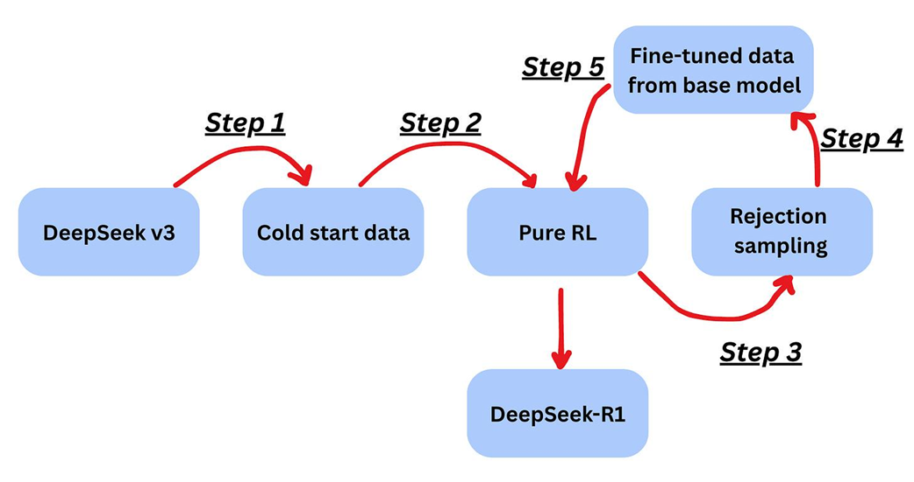
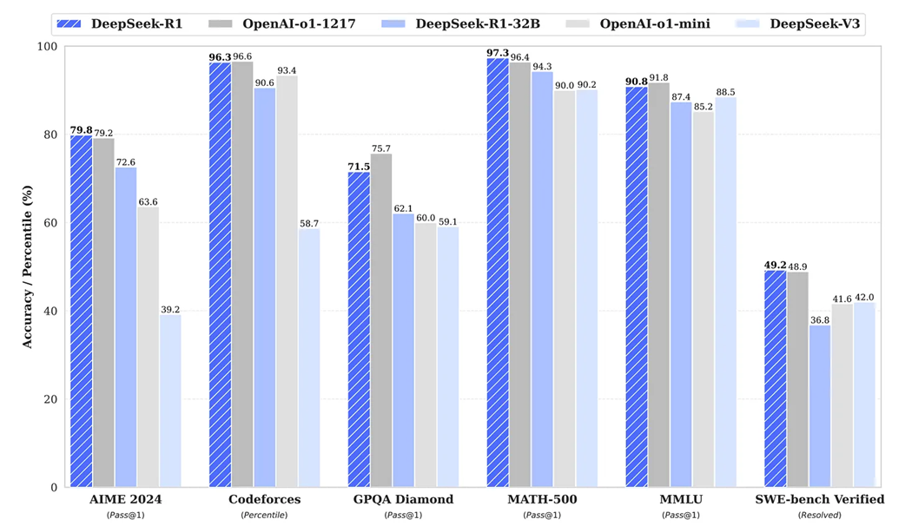
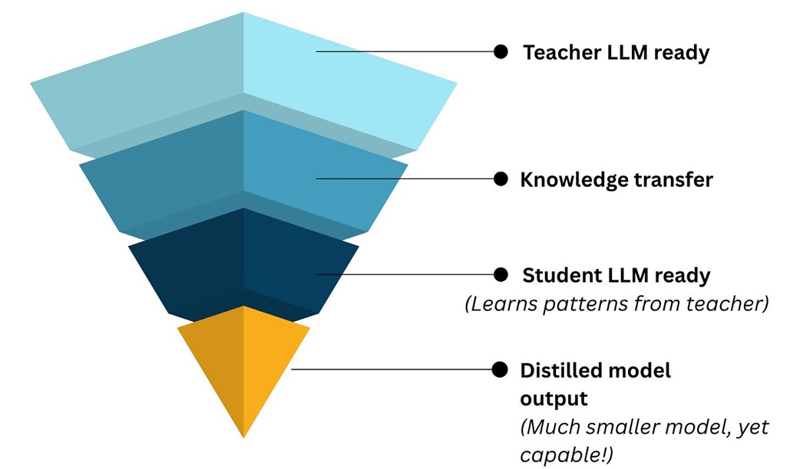
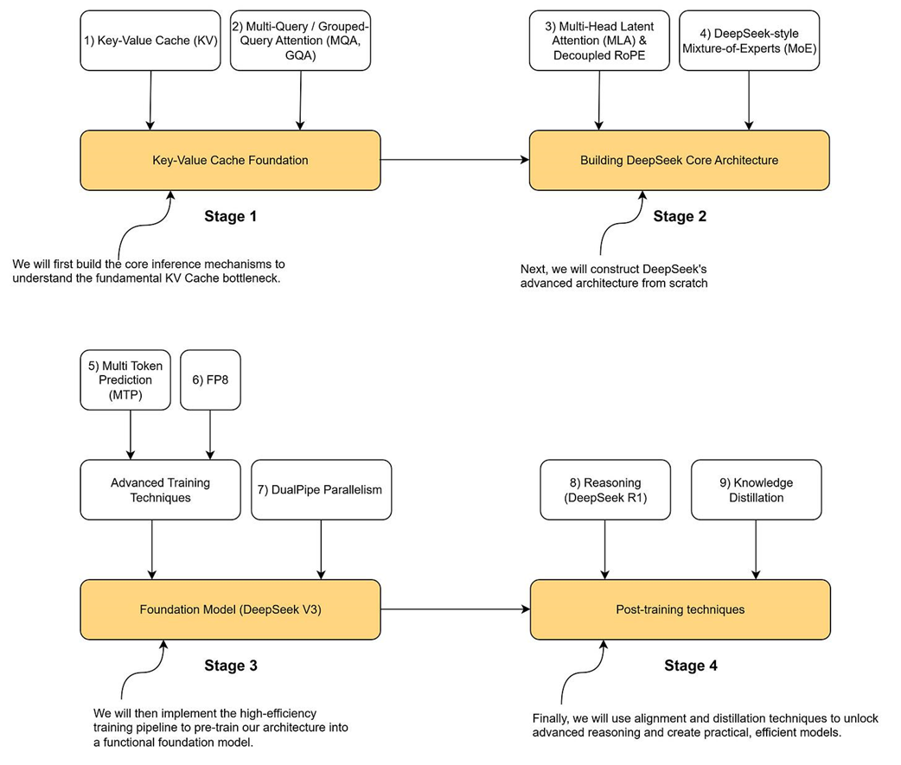

# 第1章 DeepSeek 简介

本章涵盖：
- 为什么DeepSeek代表了开源AI的转折点
- 本书将构建的核心创新的高级路线图
- 本书的结构、范围和前置要求

大型语言模型（LLM）近年来已经改变了技术格局。我们现在生活在一个AI系统能够对话、编写代码、起草论文，甚至以近乎人类的方式解决复杂问题的世界里。但是，如果你——一个对技术充满好奇的读者——能够从零开始构建这样一个强大的AI模型呢？如果你能够通过代码和理论结合的方式，逐步构建来理解最先进LLM的内部运作呢？这正是本书计划教你的内容。

我们将深入理解一个名为DeepSeek的尖端开源LLM的各个层次，从零开始重现其关键创新。最终，你不仅会理解DeepSeek的独特之处，还能亲自实现这些创新，在此过程中获得对现代AI开发的宝贵洞察。

我们将首先理解为什么DeepSeek如此重要：它是如何成为开源AI的转折点的，以及为什么我们选择它作为本书的核心焦点。接下来，我们将展示DeepSeek核心创新的路线图——诸如多头潜在注意力（Multi-Head Latent Attention）、混合专家（Mixture-of-Experts）、多token预测（Multi-Token Prediction）和8位浮点格式（FP8）量化等术语现在听起来可能令人生畏，但我们将以通俗易懂的方式介绍它们，并解释为什么它们如此重要。

然后，我们将阐明本书的结构、你将学到什么（以及什么不在我们的范围内），确保我们的目标与你的目标一致。接下来，我们将概述你需要什么来跟随本书，从背景知识到硬件和软件要求。别担心，你不需要超级计算机！

在深入之前，先提供一些背景：本书的灵感来自Vizuara的YouTube系列"Build DeepSeek from Scratch"。在该系列中，数千名学习者观看了我们逐步编写LLM每个组件的过程。通过本书，我们将来自学术界和行业的经验，以及我们广受欢迎的DeepSeek YouTube系列的实践教训，提炼成一段结构化的学习之旅。

## 1.1 为什么选择DeepSeek？开源AI的转折点

有这么多语言模型，你可能会想：为什么聚焦DeepSeek？是什么让这个模型如此特殊，以至于我们决定写一整本关于构建它的书？

简短的回答是，DeepSeek代表了开源AI的转折点，首次证明了一个公开可用的模型可以与最好的专有模型的性能相媲美。

*图1.1 与DeepSeek聊天界面的简单交互*

让我们退后一步，看看DeepSeek出现之前AI的状况。在2020年代初期，大型语言模型由少数拥有大量资源的科技巨头和研究实验室主导。OpenAI的GPT系列、Google的PaLM等闭源模型在能力上领先，但它们是（并且仍然是）专有的，通常只能通过付费API访问。开源社区取得了像BERT和小型GPT风格模型的成功，但性能上存在差距。开源模型往往落后闭源模型一代。然后，大约在2023-2024年，我们看到了一个转变：Meta向研究人员开放了LLaMA和后来的LLaMA-2，其他组织开始强调AI的开放科学。

DeepSeek在这种背景下出现，但它将开放性推向了新的高度，无论是在向公众自由发布权重方面，还是在突破技术边界方面。DeepSeek于2023年成立（作为中国的一个AI实验室，由研究员梁文锋领导），在短时间内，它通过开源性能极佳的大型LLM而引起了轰动。

DeepSeek的重要性在其第一个主要模型发布时变得清晰，通常被称为DeepSeek-R1。介绍DeepSeek-R1的论文截图如图1.2所示（https://arxiv.org/pdf/2501.12948）。

*图1.2 DeepSeek-R1研究论文的标题和摘要*

这个模型立即震惊了AI社区。尽管是公开可用的，R1展示了与OpenAI和Google等巨头的顶级模型相媲美的智能水平，有效地将开源和闭源AI之间的差距缩小到了历史最小。在2025年初发布时，它在一系列具有挑战性的推理基准测试中与OpenAI的o1-1217不相上下或表现更好，包括数学问题求解（AIME 2024）和竞技编程（Codeforces）。

这一成就有效地将开源和闭源AI之间的差距缩小到了历史最小。

另一个令人震惊的宣布是，DeepSeek的训练成本仅为领先OpenAI模型的一小部分。对于我们这些学习者和构建者来说，DeepSeek-R1是一个完美的案例研究，因为它的成功来自于我们可以理解的技术突破。

这引发了几个关键问题，我们将在本书中逐一回答：

- DeepSeek-R1如何以一小部分的训练成本实现了最先进的结果？
- DeepSeek-R1架构中有哪些新颖之处？
- DeepSeek-R1的预训练和后训练中有哪些新颖之处？

你将在后续章节中学到上述所有问题的答案。DeepSeek团队公开发表了他们的许多方法，我们将在本书中利用这些洞察。通过复现DeepSeek的关键要素，我们得以在实践中探索最先进的技术。这包括我们之前预览的主题：新型注意力机制、新训练目标、大规模模型扩展策略以及压缩模型的新方法。

从历史角度来看，我们可以说DeepSeek标志着一个时刻——开源AI真正与科技巨头正面对抗并站稳了脚跟。通过复制DeepSeek的部分内容，我们实际上追溯了当今一些最先进的AI研究的步骤。如果你有志于从事AI研究，这是极其有价值的。

最后，还有一个哲学层面的原因：DeepSeek体现了AI民主化的精神。曾经被限制的知识现在被共享。在撰写本书时，我们与这种精神保持一致。DeepSeek的作者发布了详细描述其方法的技术报告，而我们更进一步，将这些方法转化为一个易于理解的教程。

当你亲手构建某样东西时，你以一种阅读论文或使用API无法提供的方式拥有了那份知识。我们希望通过赋予更多人理解和构建先进模型的能力，加速创新并扩大能够为AI做出贡献的人群基础。今天是DeepSeek。明天，也许在从这次经历中学习之后，下一个伟大创意将来自你。

## 1.2 我们将构建的核心创新

现在，让我们列出从零构建DeepSeek的架构路线图，识别使DeepSeek区别于标准基于Transformer的语言模型的关键创新。理解这些特定组件至关重要，因为它们是针对扩展语言模型基本瓶颈的有针对性的解决方案。从多头潜在注意力到混合专家的每一项创新都解决了一个与计算复杂度、内存带宽或参数扩展相关的独特挑战。通过解构和实现这些系统，我们获得了对现代LLM设计中涉及的工程权衡的第一性原理理解。我们在本书中的方法是将每项创新作为一个案例研究，首先分析标准方法的局限性，然后从零构建其高级替代方案。

### 1.2.1 架构

DeepSeek的架构建立在为GPT-3和ChatGPT等模型提供动力的成熟Transformer基础之上。然而，它引入了重大创新来克服关键性能瓶颈。要理解DeepSeek的独特之处，我们必须首先看看标准的Transformer构建块。

大多数现代LLM的核心是一堆相同的层。每层由两个主要子组件组成：一个多头自注意力机制，允许模型权衡输入中不同token的重要性；以及一个前馈神经网络，进一步处理信息。图1.3展示了这个标准架构的详细视图。

*图1.3 标准Transformer块的详细视图，这是LLaMA和GPT系列等模型使用的基础架构。它由一个多头注意力块和一个前馈网络（NN）组成。*

DeepSeek的关键架构创新在于用更高效和强大的替代方案替换这两个标准子组件。如图1.4所示，标准的多头注意力被**多头潜在注意力（MLA）**取代，前馈网络被**DeepSeek混合专家（MoE）**结构取代。

*图1.4 DeepSeek模型架构的简化视图。它通过用多头潜在注意力（MLA）和混合专家（MoE）层替换核心组件来修改标准Transformer。该设计还使用了RMS Norm（均方根归一化）和专门的解耦RoPE（旋转位置嵌入）。*

这两个架构变化——MLA和DeepSeek-MoE——是针对扩展LLM主要挑战的有针对性解决方案。

在这些架构变化之上，DeepSeek引入了先进的训练和效率技术。一种称为**多token预测（MTP）**的新训练目标提高了学习和推理速度，而**FP8量化**（8位浮点格式）则解决了计算效率和资源利用问题。

总之，这四项创新——MLA、MoE、MTP和FP8量化——构成了DeepSeek技术进步的支柱。每一项都是针对扩展语言模型不同基本挑战的有针对性解决方案：

- **MLA** 解决长序列注意力中的速度和内存瓶颈
- **MoE** 解决扩展和模型容量问题
- **MTP** 通过一次预测多个token来提高学习和推理速度
- **FP8量化** 解决计算效率和资源利用问题

### 1.2.2 训练

除了核心架构，DeepSeek在模型训练和精炼方式上也有创新。训练流水线经过精心设计，使大规模训练尽可能高效。例如，DeepSeek采用了一种优化的调度策略（内部昵称为DualPipe），它重叠不同的训练任务以保持高硬件利用率。在实践中，这意味着数据加载、预处理和神经网络计算被协调，使GPU永远不会空闲。当一个批次正在被模型处理时，下一个批次正在并行准备。

*图1.5 单设备上DualPipe训练流水线的示意图。通过重叠前向传播（初始块）、反向传播（阴影块）和组合计算，这种调度策略在大规模训练期间最小化GPU空闲时间并最大化硬件利用率。*

图1.5展示了设备1在双管道流水线中运行任务的时间线。过程从前向传播开始，然后是反向传播。关键的是，流水线随后进入稳态，新批次的前向传播与前一批次的反向传播同时执行（由交叉阴影块表示）。这种重叠确保了设备在整个训练过程中保持充分利用。

### 1.2.3 后训练

DeepSeek训练的基础模型被称为DeepSeek-V3。DeepSeek-V3经历了多个后训练步骤，最终产生了DeepSeek-R1。这些步骤如图1.6所示。

*图1.6 从DeepSeek-V3基础模型创建DeepSeek-R1的多步后训练流水线。该过程涉及强化学习（纯RL）、数据生成（拒绝采样）和微调的组合，以灌输高级推理能力。*

以下是DeepSeek R1后训练所涉及的五个步骤的简化解释：

**步骤1（基础）**：从一个使用相对较小的"冷启动"数据集进行了轻微微调的基础模型（DeepSeek-V3）开始。

**步骤2（纯RL）**：实施强化学习算法，允许模型通过试错学习探索和发展推理模式。这种无监督方法使模型能够在没有明确人类指导的情况下发现有效的解决问题的策略。

**步骤3（自标注）**：引入拒绝采样技术。模型生成多个候选回答，并选择最高质量的输出来创建自己的合成训练数据。

**步骤4（混合数据）**：将此合成数据与监督示例合并，以平衡质量和领域广度。

**步骤5（最终RL）**：训练以使用多样化提示分布的综合强化学习阶段结束。这个最终优化步骤增强了模型在各种任务类别和输入格式上的鲁棒性和泛化能力。

图1.7取自DeepSeek-R1论文，该论文于2025年1月发布。在这里我们可以看到DeepSeek-R1在多个测试基准上与OpenAI推理模型不相上下或表现更好。

*图1.7 DeepSeek-R1与其他领先模型的基准性能（截至2025年1月）。*

另一个重要的后训练技术是**知识蒸馏**和模型压缩。其理念是将大型"教师"模型（完整的DeepSeek）的知识压缩到一个或几个更小、更实用的"学生"模型中。这如图1.8所示。

*图1.8 知识蒸馏的概念。一个大型、强大的"教师"模型（如DeepSeek-R1）用于生成训练数据来教授一个小得多、更高效的"学生"模型，在不承担高计算成本的情况下传递其能力。*

DeepSeek R1模型基于DeepSeek V3，后者约有6710亿参数。当DeepSeek论文发布时，团队还发布了小至15亿参数的蒸馏模型。特别是，DeepSeek基于Qwen2.5和Llama3系列向社区开源了1.5B、7B、8B、14B、32B和70B的检查点。这些较小的模型高性能且高效。

总之，DeepSeek的路线图包括多个层面的创新：

- 新颖的架构组件（MLA和MoE）
- 更智能的训练目标（MTP）与尖端精度技术（FP8）
- 高效的大规模训练流水线（重叠计算和通信等）
- 后训练（基于RL的推理技能和模型蒸馏）

在接下来的章节中，我们将逐步构建这些组件中的每一个，并展示它们如何组合成一个有凝聚力的迷你DeepSeek模型。

## 1.3 本书结构和范围

我们将本书组织成一个清晰的四阶段路线图。这种结构被设计为渐进式的，每个阶段直接建立在前一个阶段的知识和代码之上。我们将从现代LLM推理的基本构建块开始，贯穿DeepSeek的核心架构创新，然后探索赋予模型强大能力的高级训练和后训练技术。

图1.9提供了整个过程的高级概览。它可视化了四个不同阶段并列出了我们将在每个阶段中实现的关键技术概念。将此视为我们项目的主蓝图和你学习旅程的目录。

*图1.9 本书中构建迷你DeepSeek模型的四阶段路线图。我们将从基础概念（阶段1）和核心架构（阶段2）进展到高级训练（阶段3）和后训练技术（阶段4），在每个阶段实现关键创新。*

阶段1和2与DeepSeek的架构创新相关。阶段3与训练流水线相关，阶段4与后训练流水线相关。

在**阶段1**中，我们将理解键值缓存（KV Cache）的含义以及为什么它是最终理解多头潜在注意力（MLA）的基础构建块，而MLA是DeepSeek架构的关键创新之一。

在**阶段2**中，我们将研究多头潜在注意力（MLA）和混合专家（MoE）。我们将直观地理解MLA和MoE的工作原理，并在实践中编写代码实现它们。

在**阶段3**中，我们将实现DeepSeek训练流水线。在这个阶段，我们将学习：

1. 多token预测（MTP）
2. FP8量化
3. DualPipe并行

最后，在**阶段4**中，我们将研究DeepSeek实施的后训练技术：

1. 监督微调
2. 强化学习（RL）
3. 模型蒸馏

## 1.4 本书将教你什么以及不会教你什么

本书被设计为一次深入DeepSeek架构创新的手把手之旅。我们相信理解这些复杂系统的最佳方式是自己亲手构建它们。

你将在本书中学到的内容涵盖理论理解和实践实现：

- 你将发现多头潜在注意力（MLA）如何显著减少内存需求同时保持模型质量，实现允许DeepSeek在传统Transformer难以运行的硬件上高效运行的机制。
- 你将掌握混合专家（MoE）架构的精妙之处，理解如何将不同的token路由到专门的子网络并在专家之间平衡计算负载。
- 通过多token预测（MTP），你将看到同时预测多个未来token如何加速训练和推理。
- 通过FP8量化，你将学习将模型权重和激活压缩到仅8位同时保留模型能力的方法。
- 你还将了解DeepSeek如何预训练其模型。
- 最后，你将了解DeepSeek实施的后训练技术的细节，包括强化学习（RL）和蒸馏。

本书**不会**做的是复制DeepSeek的专有训练数据或尝试复现其精确的模型权重。我们不会深入探讨训练数千亿参数模型所需的大规模分布式训练基础设施——那将需要大多数读者无法获得的资源。我们也不会涵盖生产部署问题，如为数百万用户服务模型或实施安全过滤器和内容审核系统。

相反，我们专注于清晰性和理解力。每个概念都以对先前知识的最少假设引入，从第一性原理逐步构建。例如，当我们实现MLA时，我们将从标准注意力开始，理解其局限性，然后逐渐将其转化为潜在版本。这种方法意味着你不仅会知道如何实现这些技术，还能深入理解它们，足以修改和改进它们。

## 1.5 跟随本书所需

跟随本书需要对机器学习概念有一定基础，但不需要专业知识。如果你熟悉Python，并且已经学习过入门级深度学习材料，你就可以开始了。具体来说，你应该理解神经网络如何通过反向传播学习，熟悉PyTorch或类似框架的基本操作，并且对Transformer架构有所了解，即使你还没有亲自实现过一个。

在硬件方面，我们设计了所有实现使其易于访问。虽然训练大型语言模型通常需要大量计算资源，但我们将使用缩小版本来捕捉核心思想同时在消费级硬件上保持可行。

一台拥有不错CPU的笔记本电脑可以运行大多数示例，尽管训练会很慢。一块拥有8-12GB显存的消费级GPU会让体验更加流畅，让你更自由地实验并更快看到结果。对于更有雄心的实验，特别是使用MoE架构时，拥有24-48GB显存会开启更多可能性，尽管这不是必需的。

我们将为每章提供完整的环境规范，确保你可以精确复现我们的结果。我们将包括Google Colab和类似平台的配置，使你可以在没有任何本地设置的情况下跟随。虽然DeepSeek是在数万亿token上训练的，但我们将使用较小的数据集，仍然允许我们观察关键现象，同时保持训练时间合理。

让我们一起构建令人惊叹的东西！

## 1.6 总结

- 大型语言模型（LLM）已成为技术领域的主导力量，但构建它们的知识往往被限制在少数大型实验室中。
- DeepSeek标志着一个关键时刻，发布了性能与最好的专有系统相媲美的开源模型，证明尖端AI可以被开放开发和共享。
- 本书将引导你通过亲手构建迷你DeepSeek模型的过程，聚焦其关键技术创新，提供对现代LLM架构和训练的深入、实践性理解。
- 我们将实现的核心创新分为四个阶段：(1) KV Cache基础，(2) 核心架构（MLA和MoE），(3) 高级训练技术（MTP和FP8），(4) 后训练（RL和蒸馏）。
- 通过自己构建这些组件，你将获得的不仅是理论知识，还有实现和改进最先进AI技术的实践技能。
