# 第2章 用键值缓存解决推理瓶颈

本章涵盖

- 自回归 LLM 推理的低效性
- Key-Value Cache：一种有代价的解决方案
- MQA 和 GQA：KV Cache 内存限制的第一代解决方案

要理解 DeepSeek 架构中的关键创新，我们必须从它们旨在解决的技术问题开始。我们的旅程遵循本书开头概述的四阶段路线图，而本章完全致力于第一阶段：Key-Value Cache 基础。这一阶段解决了现代 LLM 推理中最根本的瓶颈。在我们欣赏 Stage 2 中 DeepSeek 的 Multi-Head Latent Attention (MLA) 等高级架构选择之前，我们必须首先掌握它所演化的机制以及它旨在解决的问题。

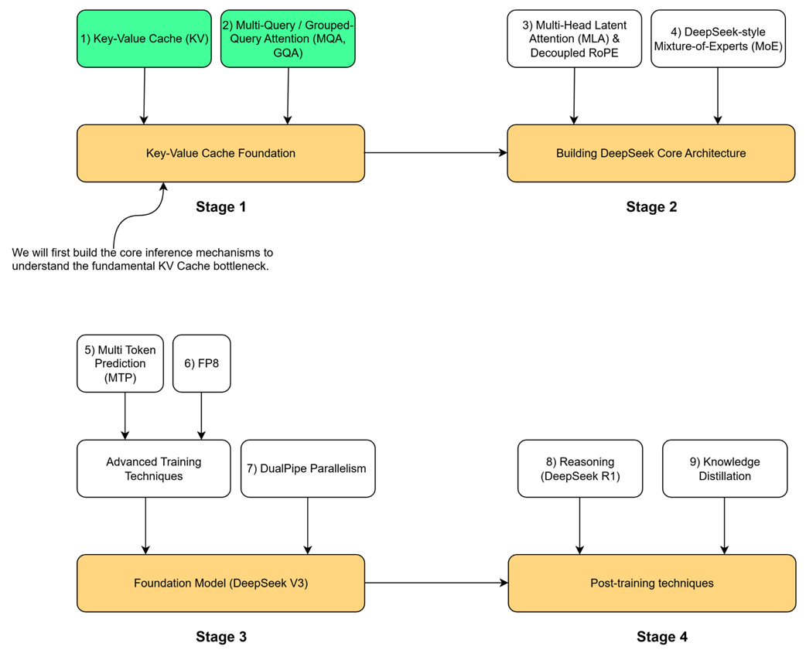
*图2.1 构建 DeepSeek 模型的四阶段路线图。Stage 1 建立了 Key-Value Cache 基础，这将在本章中详细介绍。*

如图所示，该基础建立在两个核心概念之上：Key-Value (KV) Cache 本身及其第一代优化——Multi-Query Attention 和 Grouped-Query Attention (MQA & GQA)。这些技术构成了更高级架构的基石。路线图的 Stage 2 引入了 DeepSeek-V2 的核心架构创新：Multi-Head Latent Attention (MLA)、Decoupled RoPE 和 DeepSeek-Mixture-of-Experts (MoE)。在解决这些之前，我们必须首先建立对这些创新旨在解决的问题的基础理解。本章分为三个部分，从头开始建立这种基础理解：

首先，我们将编写一个完整的自回归生成循环，可视化语言模型如何逐个 token 生成文本。这个动手实现将让我们亲眼见证传统方法的计算低效性。

其次，我们将实现 KV Cache 本身——这个优雅的优化解决了最初的性能问题。通过我们的代码，我们将展示其显著的加速效果，但也会揭示其"阴暗面"：巨大的内存开销，这造成了一个新的、严重的瓶颈。

最后，我们将构建 Multi-Query Attention (MQA) 和 Grouped-Query Attention (GQA) 的功能性 PyTorch 层。这些是旨在缓解 KV Cache 内存问题的第一代架构解决方案。重要的是要理解，这些解决方案并非免费午餐；MQA 和 GQA 都明确地以模型质量和表达能力换取内存效率和推理速度的提升。MQA 代表了这一谱系中的极端，将内存节省置于一切之上，而 GQA 则提供了更平衡的折衷。通过构建这些行业标准技术并理解其固有的权衡，我们将拥有在后续章节中解决 DeepSeek 独特创新所需的完整背景——这些创新旨在实现两全其美。

## 2.1 LLM 推理循环：逐个 token 生成文本

首先要掌握的最重要概念是，KV cache 仅在语言模型的推理阶段才相关。这一区别至关重要，因此让我们澄清 LLM 生命周期的两个主要阶段。

### 2.1.1 区分预训练与推理

每一个大型语言模型，从 GPT-2 到 DeepSeek-R1，都经历两个截然不同的阶段：

1. **训练**：这是大规模的、计算昂贵的学习阶段。模型在海量数据集（数万亿 token）上进行训练，以学习语法、事实、推理模式和单词之间的统计关系。在此阶段，其参数（或权重）会被调整。一旦预训练完成，模型的参数就被固定下来，产生一个预训练的 LLM。

2. **推理**：这是"使用"阶段。预训练模型及其固定参数现在被用于执行任务。当您与 ChatGPT 交互或使用 API 要求模型"制定一个意大利旅行计划"时，您正在执行推理。模型不再学习；它正在使用已学到的知识来预测序列中的下一个 token。

本章的全部讨论仅适用于推理阶段。我们假设已有一个完全训练好的模型，我们的目标仅仅是使用它来生成文本。

### 2.1.2 自回归过程：追加 token 以构建上下文

在推理期间，语言模型逐个 token 生成文本。虽然 ChatGPT 等用户界面可能让人觉得整个回复是同时出现的，但在底层，一个有条不紊的逐步过程正在展开。这被称为自回归生成。

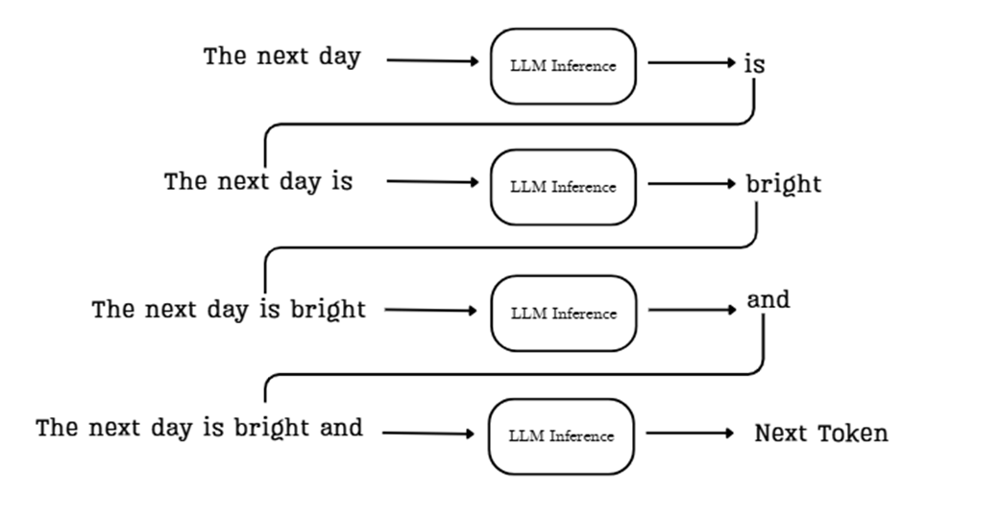
*图2.2 在自回归生成循环中，模型一步的输出被追加到下一步的输入中，逐步扩展上下文。*

核心思想简单而强大：模型生成的每一个新 token 都会立即被添加回输入序列，成为生成下一个 token 的上下文的一部分。这创建了一个反馈循环，允许模型构建连贯且与上下文相关的文本。

让我们追踪图中所示的流程：

"The next day."

模型的任务是预测最可能跟随该序列的 token。该过程如下：

1. **初始上下文**：我们首先为模型提供一个初始提示，例如 "The next day."
2. **第一次预测**：该序列被输入到 LLM 推理流程中，流程处理上下文并预测最可能的下一个 token，在本例中为 "is"。
3. **追加并重复**：新 token "is" 被追加到序列中。下一步的输入现在是扩展后的上下文："The next day is." 这个新的、更长的序列被反馈到模型中。
4. **第二次预测**：模型现在处理 "The next day is" 并预测下一个 token "bright." 此过程继续，上下文每次增加一个 token。

这个循环持续进行，每个新生成的 token 被添加回输入序列以进行下一次预测步骤。当模型生成特殊的序列结束 token 或达到新 token 数量的预设限制时，该过程停止。

这种迭代的、反馈驱动的过程是自回归 LLM（如 Transformer）构建连贯且与上下文相关文本的基础。请牢记这一流程，因为这是理解 KV cache 在此架构范式中为何既必要又存在问题的关键。

### 2.1.3 用 GPT-2 可视化自回归生成

以下代码演示了使用预训练 GPT-2 模型的自回归循环。代码从一个初始提示开始，然后进入循环。在此循环中，它执行核心任务：将当前序列传递给模型，获取对下一个 token 的预测，并立即将该新 token 追加到序列中以进行下一次迭代。这个简单的可视化清楚地表明，模型为其生成的每一个新 token 执行一次完整的计算过程。

您可以在官方 GitHub 仓库中找到此代码以及本书中的所有其他代码清单：https://github.com/Vizuar aAI/DeepSeek-From-Scratch。

运行此代码会产生以下输出，其中初始提示之后的文本是逐个 token 生成的：

```
'The next day is bright' and sunny, and the sun is shining. The sun is shining, and the
moon is shining.
```

这个简单的演示清楚地表明了一个关键点：模型为其生成的每一个新 token 执行一次完整的架构计算过程。

**清单 2.1 用 GPT-2 可视化自回归生成**

```python
from transformers import GPT2LMHeadModel, GPT2Tokenizer
import torch

tokenizer = GPT2Tokenizer.from_pretrained("gpt2")
model = GPT2LMHeadModel.from_pretrained("gpt2")
prompt = "The next day is bright"
inputs = tokenizer(prompt, return_tensors="pt")
input_ids = inputs.input_ids
print(f"Prompt: '{prompt}'", end="")
for _ in range(20):
    outputs = model(input_ids)  #A
    logits = outputs.logits
    next_token_logits = logits[:, -1, :]  #B
    next_token_id = next_token_logits.argmax(dim=-1).unsqueeze(-1)
    input_ids = torch.cat([input_ids, next_token_id],
➥ dim=-1)  #C
    new_token = tokenizer.decode(next_token_id[0])
    print(new_token, end="", flush=True)
print("\n")
```

#A 模型在每次计算时处理整个当前 token 序列。
#B 我们只使用最后一个 token 的 logits 来预测下一个 token。
#C 新预测的 token 被追加到输入序列中，然后在下一个循环中反馈给模型。这是自回归过程的核心。

这一点很明显，因为 `outputs = model(input_ids)` 的调用发生在 `for` 循环内部，而包含到目前为止整个序列的 `input_ids` 张量在每次迭代时都被传递给模型。这一观察引导我们提出一个关键问题：该计算中究竟发生了什么，其中所有内容真的都是必要的吗？

## 2.2 核心任务：预测下一个 token

现在我们知道 LLM 为每个新 token 执行一次完整的计算过程。让我们剥开架构的层层，理解该计算包含什么。让我们聚焦于 Transformer 块的核心：Multi-Head Attention 机制。这是模型确定 token 之间关系的地方。

下图提供了这段旅程的高层地图。它展示了我们的示例 "The next day is bright" 如何流经我们将在后续章节中拆解的关键组件。请记住这张图，因为它代表了我们将要构建的整个流程。

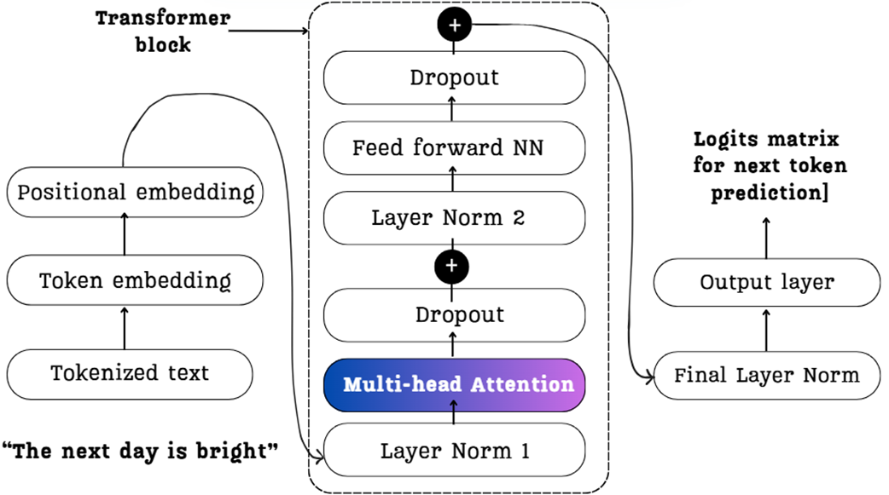
*图2.3 Transformer 块架构的高层概览。此图展示了从初始输入 token（"The next day is bright"）经过嵌入、Multi-Head Attention 和 Feed-Forward 层，最终产生用于下一 token 预测的 logits 的完整数据流。*

### 2.2.1 从输入嵌入到上下文向量：数学 walkthrough

图 2.3 向我们展示了主要组件，但要理解在推理期间可能重复的计算，我们需要放大最关键的组件：Multi-Head Attention 块。这是模型计算 token 之间关系并创建构成其理解基础的丰富"上下文向量"的地方。

让我们追踪输入序列 "The next day is" 通过单个注意力计算的路径，看看底层究竟发生了什么。

**步骤 1：将输入投影到 Query、Key 和 Value**

在 tokenization 和嵌入之后，我们的输入被表示为一个矩阵，我们称之为 X。在本 walkthrough 中，我们将使用较小的、简化的维度，使数学和图表易于理解。假设我们的矩阵 X 的形状为 (4, 8)，表示我们的四个 token，每个具有 8 维嵌入。在实际模型中，此嵌入维度会大得多，例如 DeepSeek-V2 中为 5120，DeepSeek-V3 中为 7168，但底层数学原理保持不变。

Attention 块内的第一步是将此输入矩阵投影为三种不同的表示：Query (Q)、Key (K) 和 Value (V) 矩阵。这是通过将 X 与三个独立的、可训练的权重矩阵相乘来完成的：Wq（用于 Query）、Wk（用于 Key）和 Wv（用于 Value）。

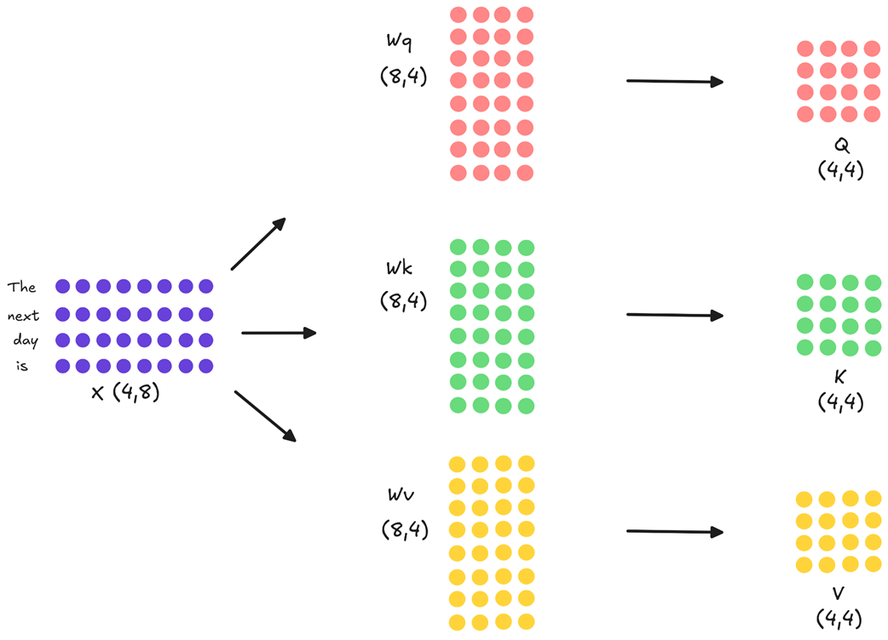
*图2.4 输入嵌入矩阵 X 被投影为三个新矩阵：Query、Key 和 Value。每次投影都是与一个独特的、学习到的权重矩阵的矩阵乘法。*

如图所示：

- 输入 X（形状 4x8）乘以 Wq（形状 8x4）产生 Query 矩阵（形状 4x4）。
- 输入 X（形状 4x8）乘以 Wk（形状 8x4）产生 Key 矩阵（形状 4x4）。
- 输入 X（形状 4x8）乘以 Wv（形状 8x4）产生 Value 矩阵（形状 4x4）。

这三个新矩阵以不同角色表示我们的输入 token。Query 矩阵表示每个 token 正在"寻找"什么，而 Key 和 Value 矩阵表示每个 token "提供"什么作为上下文。

**步骤 2：计算注意力分数**

接下来，模型需要确定每个 token 与其他所有 token 的相关程度。这是通过计算注意力分数来完成的。我们取 Query 矩阵并与 Key 矩阵的转置（Keys.T）执行矩阵乘法。

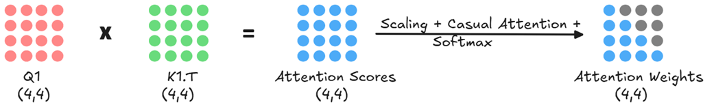
*图2.5 Query 矩阵与转置 Key 矩阵之间的点积产生注意力分数矩阵。此矩阵中的每个元素表示一个 token 对另一个 token 的相关性。*

产生的注意力分数矩阵（形状 4x4）量化了每对 token 之间的关系。例如，第四行第二列的值将表示 token "is" 应该对 token "next" 给予多少注意力。

**步骤 3：从分数到上下文向量**

这些原始分数随后被进一步处理。它们被缩放（以稳定训练），并应用因果掩码以确保 token 只能从序列中先前的 token 收集上下文，防止它通过查看尚未知道的 token 来"作弊"。该掩码有效地将注意力分数矩阵的上三角置零。最后，应用 softmax 函数将分数转换为注意力权重——一组每行总和为 1 的概率。

这些最终的注意力权重然后与 Value 矩阵相乘。

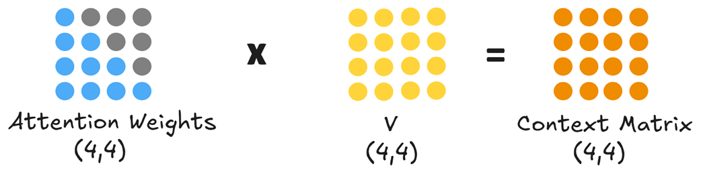
*图2.6 注意力权重与 Value 矩阵相乘产生最终的上下文矩阵。每行现在都是原始 token 的上下文感知表示。*

此最终乘法产生上下文矩阵（形状 4x4）。此矩阵中的每一行都是我们每个输入 token 的新的、丰富的向量。例如，"is" 的上下文向量现在是其之前所有 Value 向量的加权和，包含了关于整个前置序列的丰富信息。

**步骤 4：扩展到 Multi-Head Attention**

我们刚才描述的过程是针对单个注意力计算的。然而，模型可能需要同时跟踪不同类型的关系；例如，句法依赖（如主谓一致）和语义关系（如词义）。单个注意力计算可能难以捕捉这种多样性。

这就是 Multi-Head Attention 的用武之地。模型不使用一组大型投影矩阵（Wq, Wk, Wv），而是使用多个更小的、独立的集合——每个"头"一个。

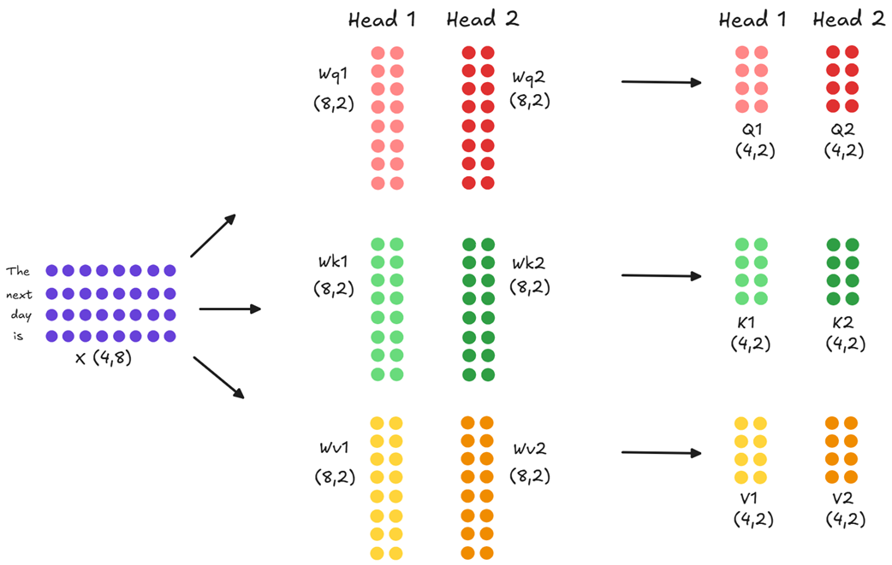
*图2.7 Multi-Head Attention 中的并行投影。输入嵌入 X 被投影为每个注意力头的独立 Query、Key 和 Value 矩阵。*

如图 2.7 所示，如果我们的模型有两个头，初始的 (4, 8) 输入嵌入不会被投影为三个 (4, 4) 矩阵。相反，它被并行投影为六个更小的 (4, 2) 矩阵：Head 1 的 Q1, K1, V1，以及 Head 2 的 Q2, K2, V2。

接下来，每个头独立且并行地计算自己的注意力分数。Head 1 计算其查询（Q1）与键（K1）之间的相关性，而 Head 2 使用 Q2 和 K2 执行相同的操作。

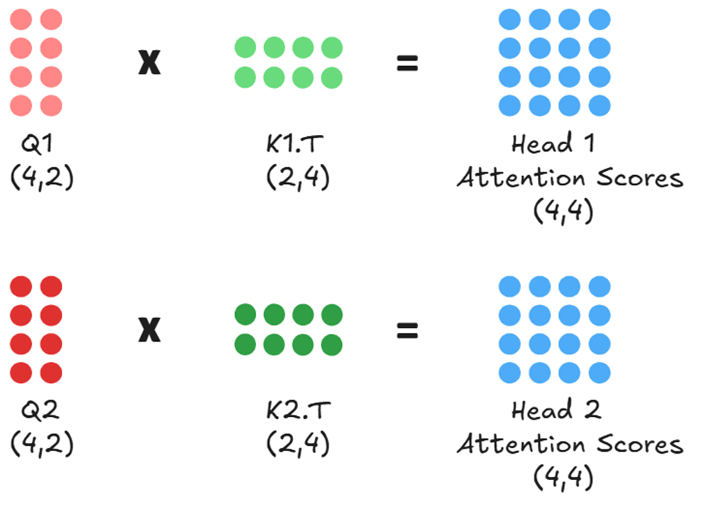
*图2.8 每个注意力头并行计算自己独特的注意力分数矩阵。*

这种从多个视角同时分析输入的能力是 Multi-Head Attention 威力的核心。通过拥有自己独特的投影矩阵，每个头学会在不同的表示子空间中查看输入。这允许专门化：Head 1 可能学会关注语法结构，而 Head 2 可能关注语义含义——所有这些都来自同一输入序列。

在每个头独立计算其原始注意力分数后，这些分数代表了原始的、未归一化的相关性度量。对于 Head 1，其 (4, 4) 注意力分数矩阵告诉它每个查询与每个键的连接强度。然而，这些原始分数尚未处于创建加权平均的可用格式中。

要使它们有用，每个头通过一系列变换处理其分数矩阵，如图 2.9 所示。

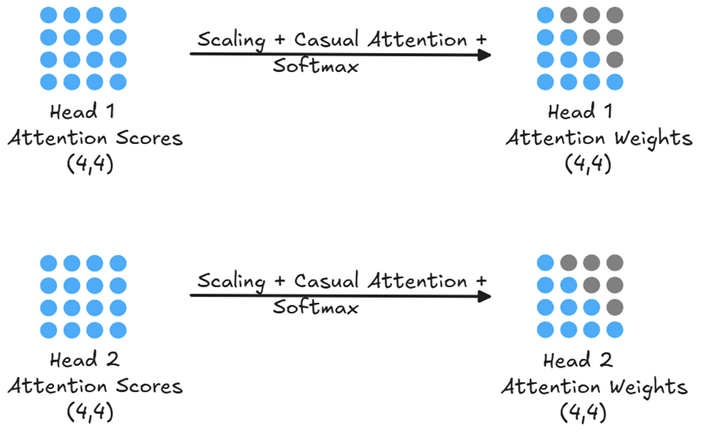
*图2.9 每个头的注意力分数被独立处理以创建最终的注意力权重。*

就像单头情况一样，每个头的原始注意力分数随后被缩放、掩码，并通过 softmax 函数转换为注意力权重的概率分布。

有了每个头的最终的、归一化的注意力权重，模型现在可以创建其丰富的输出。这是通过将每个头的注意力权重矩阵与其对应的 Value 矩阵相乘来实现的。

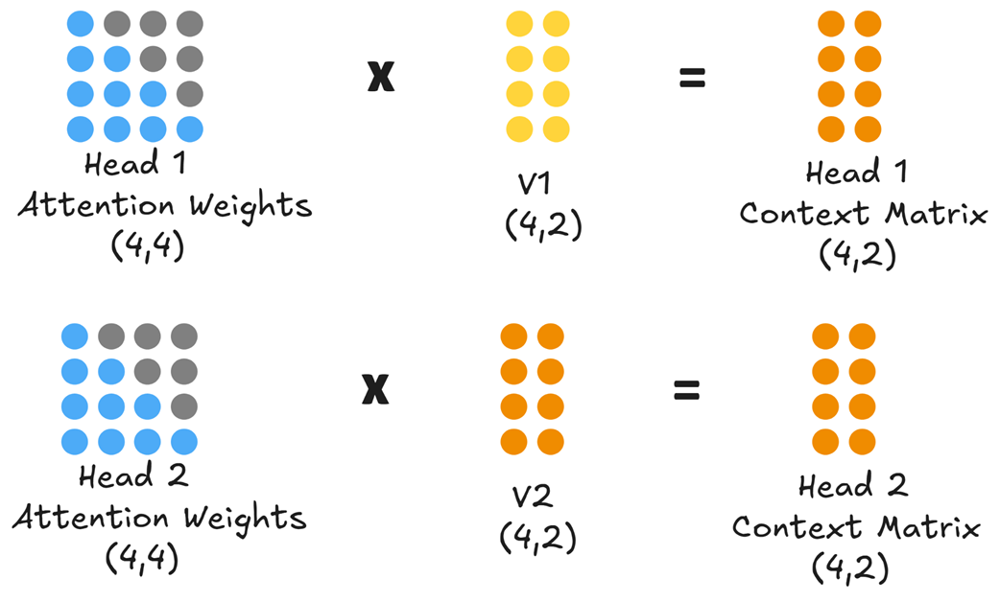
*图2.10 每个头产生自己的上下文矩阵，代表其对输入序列独特的、上下文感知的视角。*

在此步骤结束时，我们有两个独立的上下文矩阵：Head 1 上下文矩阵和 Head 2 上下文矩阵，两者形状均为 (4, 2)。每个矩阵都是原始输入的不同上下文化表示。Multi-Head Attention 块的最后一步是将这些并行信息流统一回下一个层可以使用的单一表示。这分两个阶段完成。

首先，所有头的独立上下文矩阵沿其最后一个维度（按列方向）拼接。

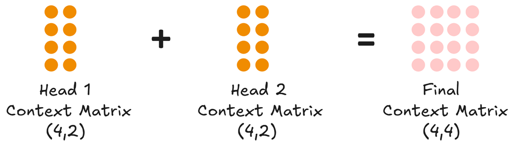
*图2.11 所有头的上下文矩阵被拼接形成一个更丰富的单一矩阵，然后通过最终投影层。*

如图 2.11 所示，将 Head 1 上下文矩阵（形状 4, 2）和 Head 2 上下文矩阵（形状 4, 2）拼接产生形状为 (4, 4) 的组合矩阵。此新矩阵现在包含了两个头的见解。

其次，此拼接矩阵通过一个最终的线性层，通常称为输出投影层。该层有自己的可学习权重，负责混合来自不同头的信息并将其投影回模型主维度，产生退出 Multi-Head Attention 块的最终上下文矩阵（形状 4, 4）。

这种并行的、多面的、最终统一的方法赋予了 Transformer 架构其表达能力。它产生的上下文矩阵将被传递到后续层，最终产生用于下一 token 预测的 logits。

### 2.2.2 从上下文向量到 logits

我们看到了注意力机制如何处理我们的输入嵌入并产生丰富的上下文矩阵。对于我们的输入 "The next day is,"，这是一个 (4, 4) 矩阵，其中每行是每个 token 的新的、上下文感知向量。

这是模型理解序列中单词之间关系的努力的结晶。现在，此矩阵被传递到 Transformer 块中的后续层，最终产生用于下一 token 预测的 logits。

**步骤 1：Feed-Forward Network**

上下文矩阵首先通过 Transformer 块内的 Feed-Forward Network (FFN)。与关注所有 token 的注意力机制不同，FFN 独立处理每个 token 的上下文向量。它通常由两个线性层和中间的一个非线性激活函数组成。此步骤允许模型对每个 token 的上下文化表示执行更复杂的计算。关键是，FFN 被设计为输出与输入形状完全相同的矩阵，保持上下文矩阵的维度。

**步骤 2：迭代通过 Transformer 块**

FFN 的输出不会立即退出模型。它首先经过当前 Transformer 块的最终组件，包括另一个 Layer Normalization 和将块的输入添加到其输出的残差连接。这整个过程——注意力、前馈网络、归一化和残差连接——构成了一个完整的 Transformer 块。产生的矩阵然后作为下一个 Transformer 块的输入。此循环对模型架构中的每个块重复（例如，GPT-2 small 重复 12 次）。

**步骤 3：最终投影到 logits**

序列经过模型堆栈中最后一个 Transformer 块处理后，得到的上下文向量矩阵经过一次最终的 Layer Normalization。此归一化矩阵然后被传递到最终输出层，模型在此进行预测。

输出层执行将上下文向量投影到模型词汇表广阔空间的关键步骤。让我们定义一个关键术语：logits。

> **定义：什么是 logits？** Logit 是一个原始的、未归一化的分数。对于序列中的任何给定位置，模型为其词汇表中的每个单词产生一个 logit。特定单词的 logit 分数越高，该单词是正确下一 token 的可能性就越大。

输出层是一个简单的线性层，其工作是将最终上下文矩阵转换为 Logits 矩阵。

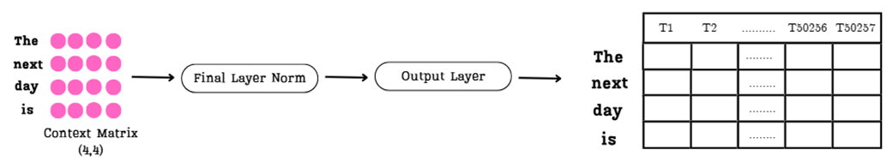
*图2.12 从最终上下文矩阵到 logits 矩阵的旅程。输出层将每个上下文感知向量投影为一个长分数向量，词汇表中的每个单词对应一个分数。*

如图 2.12 所示，整个上下文矩阵被处理。其每一行被转换为一个很长的 logits 向量：

- **输入**：来自最后一个 Transformer 块的最终上下文矩阵，形状为 (4, 4)。
- **变换**：输出层将 4 行中的每一行投影为大小为 50,257 的向量（GPT-2 的词汇表大小）。
- **输出**：最终 Logits 矩阵，形状为 (4, 50257)。

这个巨大矩阵中的每一行代表一个完整的预测。第一行包含模型对 "The" 之后应该跟随什么 token 的分数，第二行对 "next" 之后应该跟随什么，以此类推。

既然我们有了这个原始分数矩阵，模型如何做出最终的、单个 token 的决策？接下来的步骤包含优化整个推理过程的最重要洞见。

### 2.2.3 关键洞见：为什么只有最后一行重要

我们现在有了 Logits 矩阵——一个包含输入序列每个位置预测的形状为 (4, 50257) 的巨大张量。然而，我们的目标非常具体：我们只想预测跟随我们完整输入 "The next day is" 之后的单个 token。

这意味着我们可以丢弃 Logits 矩阵中的几乎所有信息。

- 第一行（对 "The" 之后应该跟随什么的预测）无关紧要。
- 第二行（对 "next" 之后应该跟随什么的预测）无关紧要。
- 第三行（对 "day" 之后应该跟随什么的预测）无关紧要。

我们唯一关心的是最后一行——对应于 token "is" 的 logits 向量。这单个向量掌握着我们下一个 token 的关键。这就是关键洞见：由于我们只使用最后一行来进行预测，在每一步重新计算所有早期行的 logits 是极其浪费的。这一观察是 KV cache 及其衍生技术 MQA 和 GQA 等优化的根本动机。

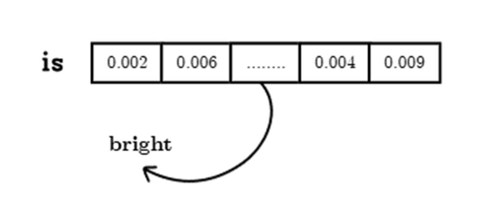
*图2.13 最终预测步骤。最后一个 token 的 logits 向量被转换为概率分布，概率最高的 token 被选为输出。*

要为我们的输入选择下一个 token，我们：

1. **提取最终 Logits 向量**：我们从 Logits 矩阵中仅选择最后一行。这给了我们一个形状为 (1, 50257) 的向量，包含模型对其词汇表中每个可能单词的未归一化置信度分数。
2. **应用 Softmax 函数**：这些原始 logits 使用 softmax 函数转换为概率。此函数将整个向量转换为概率分布，其中每个值在 0 和 1 之间，且所有值之和为 1。输出是一个概率向量，如图中所示的 0.002、0.006 等值。
3. **选择最可能的 Token**：我们现在只需找到此分布中最高概率的索引（一个 argmax 操作）。此索引对应于模型词汇表中的特定 token。如图所示，如果最高概率指向 token "bright"，那么它就成为模型此步骤的最终生成输出。

从原始文本到单个预测 token 的这整个多步骤过程，对模型生成的每个 token 都会执行。这给了我们一个关键洞见：经过所有复杂的上下文构建工作后，最终预测仅依赖于最后一个 token 的上下文向量。至关重要的是要记住，这最后一个上下文向量之所以重要，是因为得益于 Self-Attention 机制，它已经包含了来自序列中所有先前 token 信息的加权和。

这应该让您产生怀疑。如果我们不断地将增长的序列反馈给模型，我们在 Attention 块本身是否在执行大量不必要的、重复的工作？正如我们将在下一节数学证明的那样，答案是一个响亮的"是"。

## 2.3 冗余计算的问题

到目前为止，我们已经建立了关于 LLM 推理的两个关键事实：

1. 模型在自回归循环中逐个 token 生成文本，将其自身输出作为输入反馈。
2. 要预测单个下一个 token，模型只需要当前序列中最后一个 token 的上下文向量。

现在，让我们将这两个想法联系起来。如果模型不断重新处理增长的 token 序列，而只需要最后一个 token 的信息来做出下一个决策，那么似乎可能执行了大量不必要的计算。直觉上，我们可能一次又一次地执行相同的计算。

我将向您展示在推理期间，我们确实在重复许多计算。然后我们将看到如何避免这些重复，这将直接引向 KV Cache 的概念。

### 2.3.1 直觉：我们是否在反复计算相同的东西？

让我们从直觉转向具体的数学证明。我们将首先通过追踪每一步的数据来直观地展示冗余性，然后通过分析计算复杂度来量化其性能影响。让我们重新审视图 2.2 中的自回归循环，但这次让我们关注每一步传递给模型的数据。

假设我们从提示 "The next day." 开始。

**推理步骤 1：**

- **输入**："The next day"
- **处理**：三个 token 经过整个 LLM 流水线。
- **输出**："is"

**推理步骤 2：**

新 token 被追加。

- **输入**："The next day is"
- **处理**：四个 token 经过整个 LLM 流水线。
- **输出**："bright"

**推理步骤 3：**

新 token 再次被追加。

- **输入**："The next day is bright"
- **处理**：五个 token 经过整个 LLM 流水线。
- **输出**："and"

注意这个模式。在步骤 2 中，我们正在重新处理 token "The"、"next" 和 "day"。我们在步骤 1 中已经处理过它们。在步骤 3 中，我们正在重新处理 "The"、"next"、"day" 和 "is"——所有这些在之前的步骤中都已处理过。似乎我们一次又一次地将相同的 token 通过整个架构，只是为了在末尾添加一个新 token。

这个过程感觉很低效。就像每次你想读一个新章节时都要重新阅读一本书的前九章。如果阅读每一章需要固定的时间，那么读到第 n 章需要 1 + 2 + ... + n 的工作量——呈二次方增长，O(n²)。

这些重复计算的主要缺点是其爆炸性的代价：对于每个额外的 token，GPU 必须重新处理和存储越来越大量的数据，使得时间和内存需求随序列长度快速增长。

这种关于重复的直觉实际上是正确的。让我们通过一个动手示例，数学证明我们在推理的每一步中确实在重复注意力机制中完全相同的计算。

### 2.3.2 数学证明：可视化重复计算

我们的直觉表明我们在执行冗余工作。现在，让我们通过两个连续推理步骤的注意力机制来证明这一点。我们将亲眼看到我们在多次计算完全相同的值。

**步骤 A：时间 T=4 的推理（输入："The next day is"）**

首先，让我们考虑模型处理输入 "The next day is" 并即将预测下一个 token 时的状态。这是一个有 4 个 token 的输入序列。如图 2.14 所示，此序列即将被单个注意力头处理。

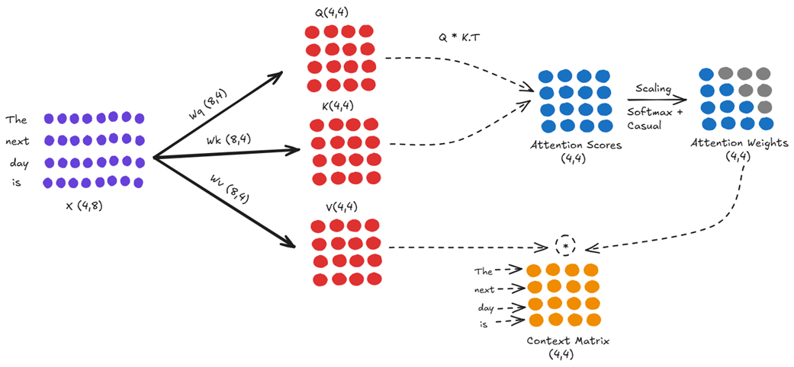
*图2.14 输入序列 "The next day is" 的完整注意力计算。*

让我们逐步追踪图 2.14 中的数据流：

1. **输入嵌入 (X)**：我们从最左边的输入嵌入矩阵 X 开始，对于我们的四个 token，其形状为 (4, 8)。
2. **投影**：此 X 矩阵与固定的、预训练的权重矩阵 Wq、Wk 和 Wv 相乘。此投影创建 Query (Q)、Key (K) 和 Value (V) 矩阵，在此示例中它们的形状均为 (4, 4)。
3. **注意力分数**：接下来，模型计算 token 之间的原始相关性。Query 矩阵与 Key 矩阵的转置相乘（Q * K.T），产生 (4, 4) 注意力分数矩阵。
4. **注意力权重**：此原始分数矩阵然后被处理（缩放并通过因果 softmax）以产生最终的 (4, 4) 注意力权重矩阵。灰色的点代表被掩码为零的未来位置。
5. **上下文矩阵**：最后，注意力权重与 Value 矩阵相乘以产生 (4, 4) 上下文矩阵。

此上下文矩阵然后穿过 Transformer 架构的其余部分。正如我们已经确定的，此矩阵中只有最后一行——"is" 的上下文向量——被用于生成最终 logits 并预测下一个 token。假设模型正确预测了 token "bright"。

现在，我们进入自回归循环的下一步，这里低效性变得极其明显。

**步骤 B：时间 T=5 的推理（输入："The next day is bright"）**

按照自回归循环，新预测的 token "bright" 被追加到我们的序列中。模型的新输入现在是 "The next day is bright"，一个 5 个 token 的序列。这个新的、更长的序列被反馈到完全相同的注意力机制中，使用完全相同的已学习权重矩阵（Wq, Wk, Wv）。

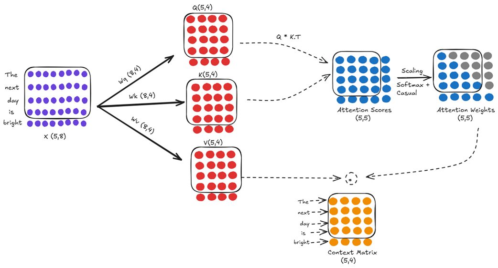
*图2.15 这个新的 5 个 token 输入的完整注意力计算。*

乍一看，这像是一个全新的计算。但让我们仔细将其与图 2.15 中刚执行的计算进行比较。

我们新输入矩阵 X（形状 5, 8）的前四行与上一步整个输入矩阵完全相同。由于权重矩阵（Wq, Wk, Wv）在推理期间是固定的，这意味着我们新的 Query、Key 和 Value 矩阵（现在形状均为 5, 4）的前四行与上一步的整个 Query、Key 和 Value 矩阵完全相同。

这种冗余直接级联到注意力分数计算中。位置 (i, j) 的分数是第 i 个查询向量与第 j 个键向量的点积。由于前四个查询向量和前四个键向量与上一步相同，我们新的 (5, 5) 注意力分数矩阵的整个左上 (4, 4) 子块也与刚才计算的整个分数矩阵完全相同。

我们正在执行大量冗余计算。我们在每一步都重新计算整个序列历史的投影和注意力分数。这是计算资源的巨大浪费。最低效的部分是什么？正如我们已经确定的，在所有这些冗余工作之后，我们实际用于预测下一个 token 的唯一信息是从新 token "bright" 派生的上下文向量。

我们重新计算整个历史交互只是为了计算一个新行，然后我们还是丢弃了旧行的大部分最终输出。这是推理优化技术必须解决的核心问题。

### 2.3.3 性能影响：从二次到线性复杂度

我们识别出的冗余计算不仅在理论上低效；它们对性能有严重影响，特别是随着输入序列变长。这种影响最好通过计算复杂度的视角来理解。

> **注意** 需要澄清的是，此讨论严格关于推理阶段。

在没有任何优化的情况下，注意力机制的核心本质上是二次的。对于每一层和每个注意力头，计算注意力分数所需的计算量与输入序列的长度 (n) 呈二次方关系，通常表示为 O(n²)。虽然总计算量乘以层数 (L) 和头数 (H) 等常数，但与序列长度 n 的二次关系主导了性能。

为什么是二次的？想想注意力分数矩阵。

- 对于 4 个 token 的输入，我们计算一个 4x4 矩阵（16 个分数）。
- 对于 5 个 token 的输入，我们计算一个 5x5 矩阵（25 个分数）。
- 对于 1,000 个 token 的输入，我们将计算一个 1,000 x 1,000 矩阵（1,000,000 个分数）。

在自回归生成的每一步，我们重新计算整个 n x n 矩阵，重复执行 O(n²) 的工作。随着序列长度 n 增长，计算量爆炸式增长。这种二次复杂度是未缓存推理对长序列计算昂贵且极其缓慢的主要原因。每个新 token 的生成速度比前一个越来越慢，因为模型必须执行越来越多的历史重新计算。

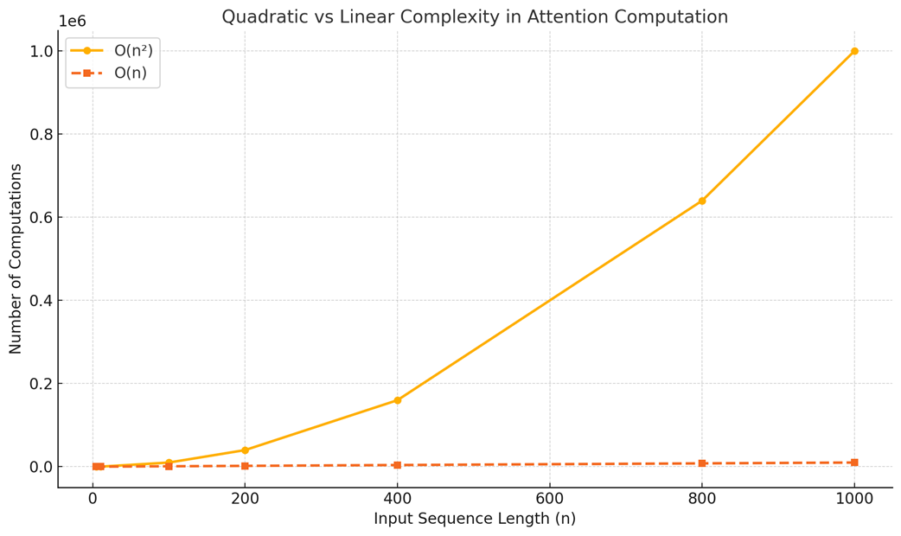
*图2.16 对比未缓存自回归推理的二次 (O(n²)) 计算增长与理想线性 (O(n)) 增长的图表。*

推理优化的目标是将此二次过程转换为线性过程（O(n)）。在线性复杂度场景中，生成新 token 所需的计算量随序列长度线性增长，而非二次增长。这意味着虽然为长序列生成新 token 仍然比短序列需要更多计算，但增量要可控得多。例如，上下文长度加倍大约会使下一个 token 的工作量加倍，而不是四倍，避免了未缓存方法的爆炸性增长。

这正是缓存使我们能够实现的。通过存储过去计算的结果而不是重复它们，我们可以摆脱二次陷阱。正如我们在视觉上看到的，我们需要为新 token 执行的唯一新计算仅与该 token 本身相关。所有先前 token 的计算可以从内存中检索。

这种从二次到线性复杂度的转变是缓存不仅是优化、而且是使具有大上下文窗口的 LLM 变得实用的基础要求的原因。它解释了我们将在代码中展示的显著加速：

- **无缓存（二次）**：生成第 100 个 token 比生成第 10 个 token 慢得多。
- **有缓存（线性）**：生成第 100 个 token 所需时间大致与生成第 10 个 token 相同。

既然已经确定了对解决方案的迫切需求，我们现在准备好构建它了。

## 2.4 解决方案：缓存以提高效率

这个问题的解决方案既优雅又直观：如果我们反复计算相同的值，为什么不只计算一次并存储以备将来使用？这就是缓存的核心原则。

通过存储过去计算的结果，我们可以避免为我们已经见过的 token 重复工作。这使我们能够摆脱二次陷阱，实现更高效的线性计算时间。这种强大的优化被称为 Key-Value Cache，或 KV Cache。

### 2.4.1 缓存什么？逐步推导

要理解我们需要缓存什么，我们必须从最终目标开始，逆向推理。正如在 2.2.3 节中确定的，我们在每一步推理中的整个目标是产生最新 token 的单个上下文向量。

以模型刚处理完 "The next day is" 并生成 "bright" 的例子为例。新输入序列现在有 5 个 token 长。要预测下一个 token，我们只需要 "bright" 的上下文向量。

图中方框中显示的值来自之前的步骤。由于这些值在各步骤之间保持不变，我们缓存它们。相同的原则适用于本节后续的图。

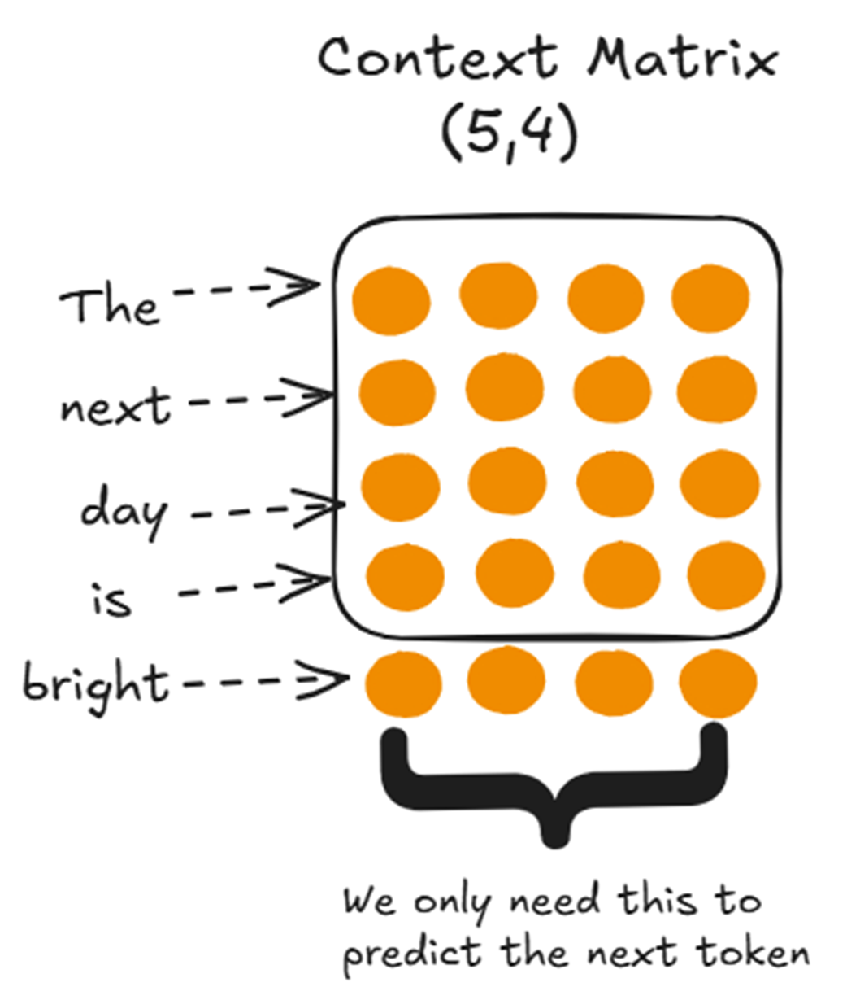
*图2.17 在整个上下文矩阵中，只有对应于最新 token 的最后一行是预测序列中下一个 token 所需的。*

所以，我们的直接目标是计算这一个向量。让我们回溯以找出产生它所需的最少计算集。

**"bright" 的上下文向量是如何计算的？**

从我们之前对注意力机制的探索中，我们知道上下文向量是注意力权重与 Value 矩阵相乘的结果。由于我们只需要 "bright" 的上下文向量，我们只需要为该特定行执行计算。

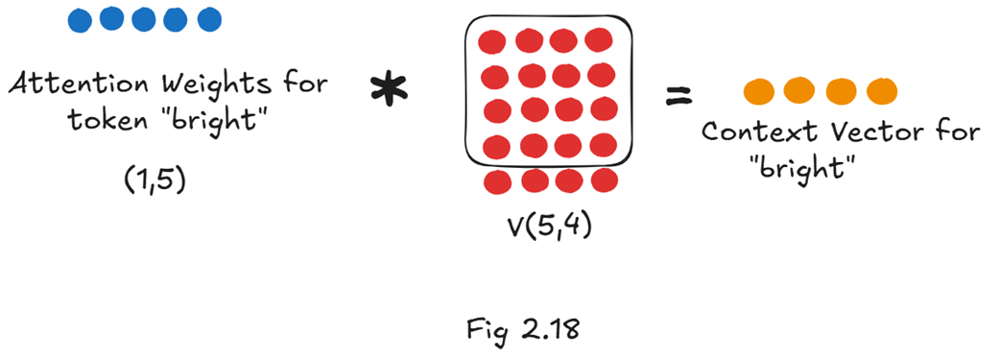
*图2.18 "bright" 的上下文向量是通过将 "bright" 的注意力权重与完整 Value 矩阵相乘来计算的。*

如图 2.18 所示，要获取我们的目标向量，我们需要两个组件：

- **"bright" 的注意力权重**：这是一个单行向量（形状 1x5），告诉我们 "bright" 应该关注序列中每个 token 的程度（包括其自身）。
- **完整 Value 矩阵**：这是一个形状为 (5x4) 的矩阵，包含序列中每个 token 的"内容"表示。

让我们继续回溯。我们如何获取这两个组件？

**"bright" 的注意力权重是如何计算的？**

注意力权重简单地是 softmax 归一化的注意力分数。因此，要获取 "bright" 的权重，我们首先需要 "bright" 的原始注意力分数。这些分数是通过取 Query 向量与完整 Key 矩阵转置的点积来计算的。

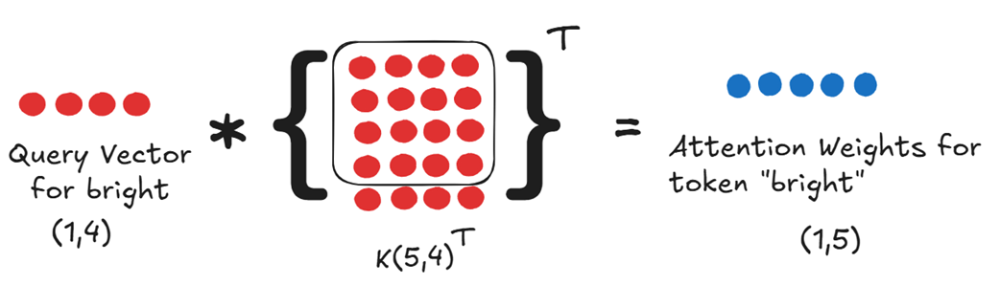
*图2.19 "bright" 的注意力权重源自其 Query 向量和序列中所有 token 的 Key 向量。*

要获取注意力权重，我们根本上需要：

- 我们新 token 的 Query 向量。
- 完整 Key 矩阵，包含序列中所有五个 token 的 Key 向量。

所以，我们的需求列表现在增加了。要获取 "bright" 的单个上下文向量，我们需要：

- "bright" 的 Query 向量 (q_bright)。
- 完整 Key 矩阵 (K)。
- 完整 Value 矩阵 (V)。

这最终将我们带到源头：这些 Query、Key 和 Value 向量是如何创建的？

Query、Key 和 Value 向量都是通过已学习的权重矩阵 Wq、Wk 和 Wv 投影输入嵌入来创建的。在这里我们可以区分什么是新的、什么是旧的。

当新 token "bright" 到达时，我们必须计算其特定的 Query、Key 和 Value 向量。这是通过使用其输入嵌入 X_bright 进行三个简单的矩阵乘法来完成的。

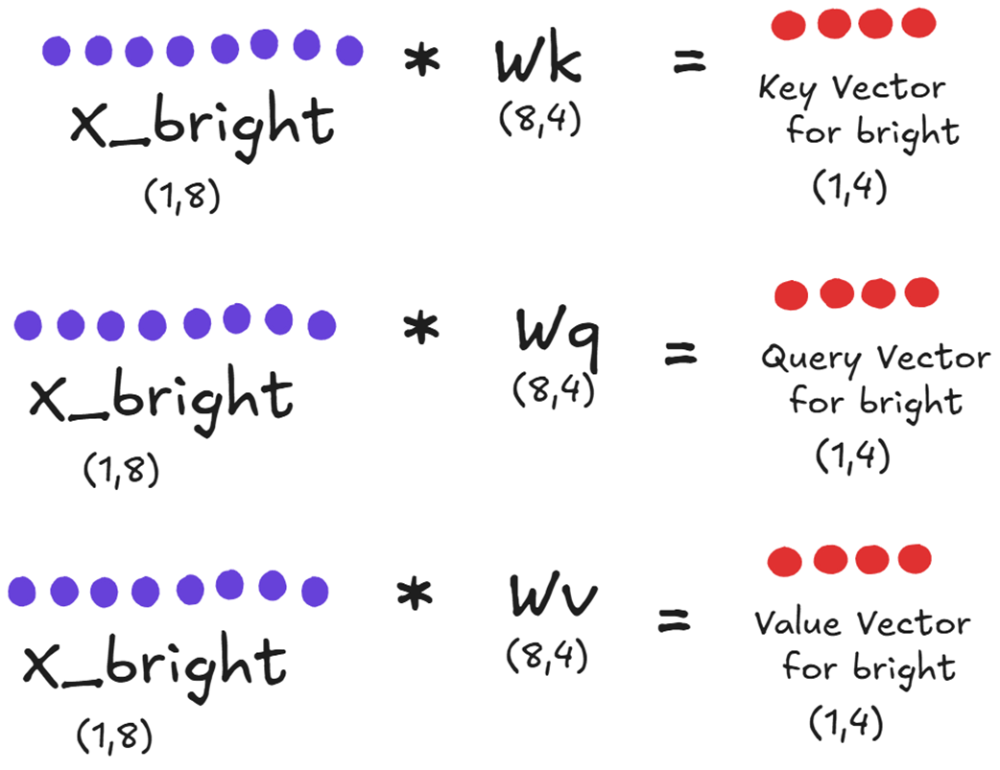
*图2.20 新 token 的三个基本计算。"bright" 的输入嵌入被投影以创建其独特的 Query、Key 和 Value 向量。*

如图 2.20 所示，这些是唯一需要的新投影：

- 我们计算 "bright" 的 Query 向量。
- 我们计算 "bright" 的 Key 向量。
- 我们计算 "bright" 的 Value 向量。

现在我们终于可以回答核心问题了：所有先前 token（"The"、"next"、"day"、"is"）的 Key 和 Value 向量怎么办？

在我们在 2.3 节中看到的低效、未缓存方法中，我们会从头重新计算它们。但现在我们理解这是浪费的。那些先前的 Key 和 Value 向量已经在之前的推理步骤中计算过了。它们不会改变。

这正是缓存概念发挥作用的地方。与其重新计算它们，我们可以简单地将上一步的 Key 和 Value 矩阵存储在内存中。这存储的数据就是 Key-Value (KV) Cache。这引导我们得出最终的、高效的工作流程，并回答了为什么我们只缓存 Key 和 Value，而不缓存 Query：

1. **为新 Token 计算**：当 token "bright" 到达时，我们执行图 2.20 中所示的三个基本矩阵乘法，以获取其 Query、Key 和 Value 向量。
2. **组装完整 Key 和 Value 矩阵**：
   - 我们从 Key Cache 中检索 "The next day is" 的 Key 矩阵（一个 4x4 矩阵）。
   - 我们将 "bright" 的新 Key 向量追加到其中，创建完整的 5x4 Key 矩阵。
   - 我们对 Value 矩阵执行完全相同的操作，从 Value Cache 中检索旧的 Value 矩阵并追加新的 Value 向量。
3. **计算注意力**：我们使用 "bright" 的新 Query 向量和完整的、更新后的 Key 和 Value 矩阵来执行注意力计算，获取我们需要的单个上下文向量。
4. **更新缓存**：我们通过存储新的、更大的 5x4 Key 和 Value 矩阵来更新缓存，为下一个 token 做好准备。

这就是 Key-Value Cache 的本质。我们在每一步只对新 token 执行昂贵的投影计算。所有历史信息都保留在缓存中。我们不需要缓存 Query 向量，因为正如我们已经确定的，我们只需要当前 token 的查询，而它必须始终重新计算。这种简单而强大的缓存 Key 和 Value 的技术正是将注意力计算从令人绝望地缓慢的二次操作转变为高效线性操作的关键。

### 2.4.2 带 KV 缓存的新推理循环

有了对缓存什么的理解，我们现在可以定义一个新的、高效的自回归生成工作流程。在每一步，我们不重新计算整个历史，而是利用我们存储的 Key 和 Value 矩阵。

让我们总结生成 token 时的过程：

1. **接收新 Token**：模型接收单个新 token 的嵌入。
2. **计算新投影**：执行三个基本矩阵乘法，仅为此新 token 获取 Query、Key 和 Value 向量。
3. **从缓存检索**：从 KV Cache 加载所有先前 token 的现有 Key 和 Value 矩阵。
4. **追加到缓存**：将新的 Key 和 Value 向量追加到缓存矩阵中，形成整个序列的完整的、更新后的 Key 和 Value 矩阵。
5. **计算注意力**：将新 Query 向量与完整的、更新后的 Key 矩阵的转置相乘以产生原始注意力分数，然后将其转换为注意力权重。
6. **计算上下文向量**：将注意力权重与完整的、更新后的 Value 矩阵相乘，获取新 token 的单个上下文向量。
7. **预测下一 Token**：将此上下文向量通过模型其余层以预测下一个 token。
8. **更新缓存**：将更新后的 Key 和 Value 矩阵保存回 KV Cache 以供下一次迭代。

此循环避免了朴素方法的大量冗余。过去 token 的矩阵乘法等重活只做一次，其结果直接被重用。重要的是要记住，这种缓存在架构的每一层独立发生：KV Cache 按层和按头维护。这意味着模型中的每个 Transformer 层为其每个注意力头保留自己独立的 Key 和 Value 缓存，确保在每层学到的专业化上下文得到保留。

### 2.4.3 演示 KV 缓存的加速

从二次过程转变为线性过程的理论好处是显而易见的，但现实世界的影响更加惊人。我们可以使用 Hugging Face 的预训练 GPT-2 模型进行简单测试来演示这一点，该模型允许我们通过简单的标志 (use_cache) 启用或禁用 KV cache。

以下代码将从提示生成 100 个新 token，先启用 KV cache，然后禁用它，并计时两个过程。

**清单 2.2 演示 KV 缓存的加速**

```python
prompt = "The next day is bright"
inputs = tokenizer(prompt, return_tensors="pt")
input_ids = inputs.input_ids
attention_mask = inputs.attention_mask

# Timing without KV cache
start_time_without_cache = time.time()
output_without_cache = model.generate(input_ids,
➥ max_new_tokens=100,
➥ use_cache=False,                          #A
➥ attention_mask=attention_mask)
end_time_without_cache = time.time()
duration_without_cache = end_time_without_cache - start_time_without_cache
print(f"Time without KV Cache: {duration_without_cache:.4f} seconds")

# Timing with KV cache
start_time_with_cache = time.time()
output_with_cache = model.generate(input_ids,
➥ max_new_tokens=100,
➥ use_cache=True,                           #B
➥ attention_mask=attention_mask)
end_time_with_cache = time.time()
duration_with_cache = end_time_with_cache - start_time_with_cache
print(f"Time with KV Cache: {duration_with_cache:.4f} seconds")

# Calculate and print the speedup
speedup = duration_without_cache / duration_with_cache
print(f"\nKV Cache Speedup: {speedup:.2f}x")
```

#A 生成明确禁用 KV cache 进行。这迫使模型为其生成的每个 token 重新计算整个序列的 Key 和 Value 矩阵，这在计算上是昂贵的。
#B 我们通过设置 use_cache=True 启用 KV cache。现在，模型只计算最新 token 的投影，并重用所有先前 token 的缓存 Key 和 Value，从而实现显著的加速。

在标准机器上运行此代码揭示了该技术的效率。

```
Time without KV Cache: 30.9818 seconds
Time with KV Cache: 6.1630 seconds
KV Cache Speedup: 5.03x
```

结果是不含糊的。仅通过启用 KV cache，我们在生成 100 个 token 时实现了超过 5 倍的加速。对于非常大的模型和更长的序列，这个加速因子可以更显著，通常达到 6 倍或更多。这是 KV cache 的巨大优势：它通过消除重复计算的昂贵代价，使实时交互式生成成为可能。

然而，这种惊人的速度是有代价的。缓存不是免费的。将这些 Key 和 Value 矩阵存储在内存中引入了其自身的重要挑战——KV Cache 的"阴暗面"。

## 2.5 KV cache 的阴暗面：内存代价

现在我们已经看到了 KV Cache 提供的惊人加速。通过消除冗余计算，它使交互式的长序列生成成为可能。然而，这种效率是以一个陡峭的、不可协商的代价换来的：内存。

这不仅仅是存储容量的问题；推理过程变成了内存带宽受限的。在每个生成步骤中，所有先前 token 的大量 Key 和 Value 矩阵必须从 GPU 的主内存 (HBM) 读取到其更快的片上计算核心中。这种持续的数据移动成为新的性能瓶颈，这就是为什么为 AI 设计的现代 GPU 优先考虑更高容量的 HBM 和更大的内存带宽，往往比原始计算能力 (FLOPs) 更甚。

缓存本质上是一种权衡。我们用内存空间换取计算时间。虽然我们避免了重新计算 Key 和 Value 矩阵，但我们现在必须将它们存储在 GPU 的内存中。对于具有长上下文窗口的大型模型，这个内存占用可能成为新的主要瓶颈。

### 2.5.1 KV cache 公式：拆解大小

我们可以使用一个简单的公式精确计算 KV cache 所需的内存。图 2.21 拆解了此计算的每个组件。

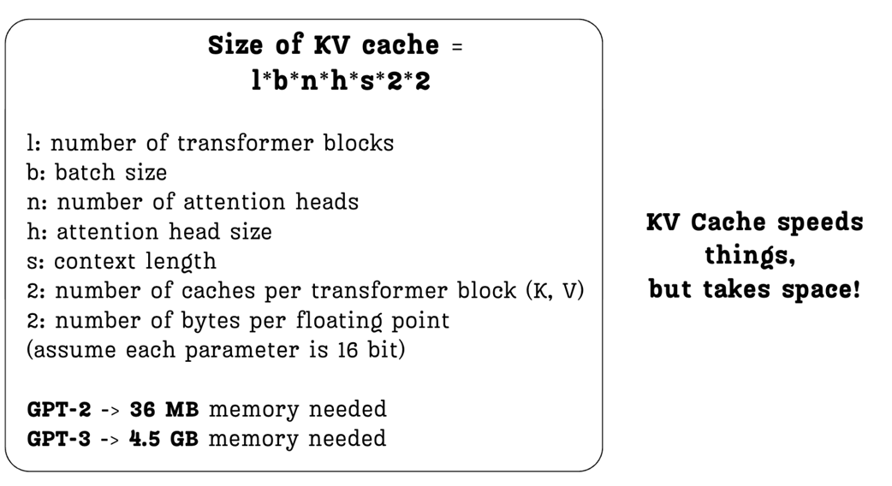
*图2.1 计算 KV cache 大小的公式及其对知名模型的应用。*

让我们逐步分析公式：

- **l（层数）**：模型中 Transformer 块的总数。我们需要为每层设置单独的缓存。
- **b（批量大小）**：我们并行处理的序列数量。
- **n（头数）**：每层的注意力头数。
- **h（头维度）**：每个注意力头的 Key 和 Value 向量的维度。
- **s（序列长度）**：上下文中的 token 数。这是一个关键因素。
- **第一个 *2**：我们需要缓存两个矩阵：一个用于 Key，一个用于 Value。
- **第二个 *2**：这表示每个参数的字节数。标准 16 位浮点数（如 float16 或 bfloat16）占用 2 字节的内存。

公式使权衡明确。每次我们想增加模型的上下文长度 (s)，或使用具有更多层 (l) 和头 (n) 的更大模型时，KV cache 所需的内存按比例增长。

图中的例子突出了现实世界的影响：

- 原始 GPT-2 (128M) 模型的 KV cache 只需要相对适度的 36 MB。
- GPT-3，一个更大、更强大的模型，同样目的需要惊人的 4.5 GB 内存——超过 100 倍！

### 2.5.2 实践中的扩展问题

这种指数级的内存消耗增长是扩展 Transformer 模型的根本挑战。随着模型变得更大并支持更长的上下文窗口，KV cache 往往成为部署的主要限制因素。

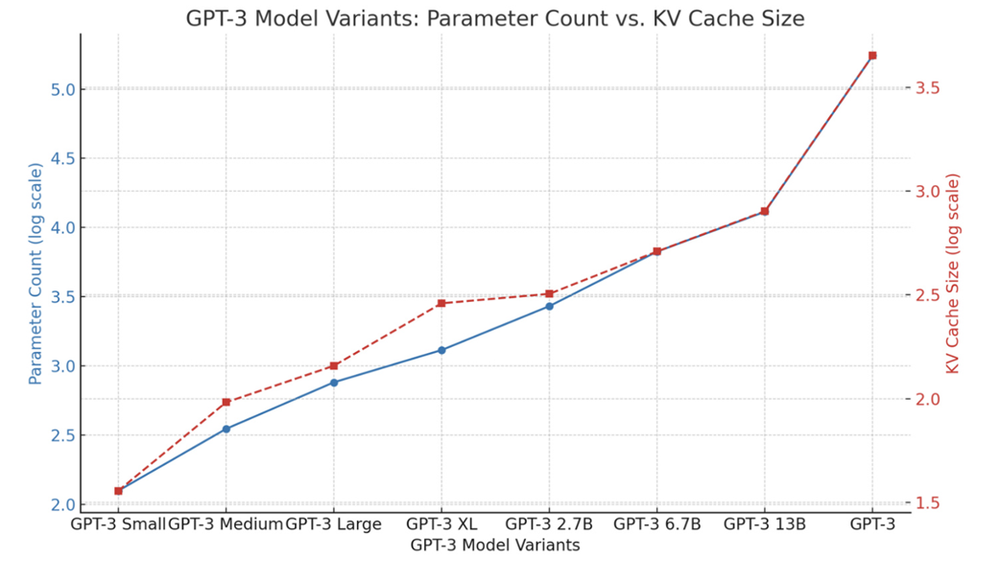
*图2.22 不同 GPT-3 模型变体的模型参数数量与 KV cache 大小的比较。虚线显示随着模型变大，其 KV cache 的内存需求以类似陡峭的速率增长。*

如图 2.22 所示，模型大小与其 KV cache 大小之间存在强相关性。这种内存负担限制了我们可以在单个批次中处理的序列数量，并对模型在给定硬件上可以支持的最大上下文长度设置了硬性上限。

让我们基于我们的注释考虑两个现代例子：

- 对于一个具有 48 层、7168 总头维度 (n*h) 和 1024 上下文长度的大型 30B 参数模型，批量大小为 128 的 KV cache 将是巨大的 180 GB。这甚至超出了最强大的现代 GPU 的内存容量。
- 对于具有 DeepSeek-V3 架构规模（61 层，128 个大小为 128 的头）和 100,000 个 token 的超大上下文长度的模型，单个序列的 KV cache 将约为 400 GB。

这就是 KV cache 的阴暗面。它加快了速度，但占用了大量空间。这种内存压力是 API 提供商（如 OpenAI）对具有更大上下文窗口的模型收取显著更高费用的直接原因；支持该内存的硬件成本是巨大的。

这一瓶颈促使研究人员寻找更好的方法。我们如何才能获得缓存的速度好处而不在内存上付出如此高昂的代价？这个问题引导我们找到第一代架构解决方案：Multi-Query Attention 和 Grouped-Query Attention。

## 2.6 内存优先的方法：Multi-Query Attention (MQA)

解决 KV Cache 内存问题最简单、最直接的方法是什么？Multi-Query Attention (MQA) 用一个激进的提案回答了这个问题：如果所有注意力头简单地共享相同的 Key 和 Value 矩阵会怎样？

### 2.6.1 核心思想：共享单个 Key 和 Value

要理解 MQA 的创新，我们必须首先回顾标准 Multi-Head Attention (MHA) 的工作原理。在标准 Transformer 中，每一层内，每个注意力头充当一个独立的专家。这意味着它拥有自己独特的、已学习的 Key 权重矩阵 (Wk) 和 Value 权重矩阵 (Wv)，与该层中所有其他头不同。这可以总结为：在普通 MHA 中，每个头有不同的 Wk 和 Wv。

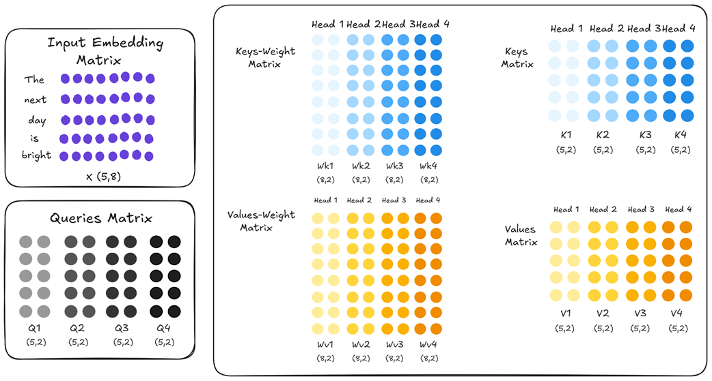
*图2.23 标准 Multi-Head Attention (MHA)。四个注意力头中的每一个都有自己独特的 Key 和 Value 权重矩阵，用不同的颜色表示。这允许每个头专业化并学习不同的模式。*

如图 2.23 所示，如果我们有四个注意力头，Key 权重矩阵实际上被分割为四个独特的部分：Wk1、Wk2、Wk3 和 Wk4。Value 权重矩阵也是如此。由于这些权重随机初始化并独立训练，每个头学会将输入嵌入投影到不同的表示空间。K1 不同于 K2，V1 不同于 V2，以此类推。这种多样性是 MHA 威力的源泉；它允许模型同时捕捉多个视角。

然而，这也是其内存问题的根源。为了实现快速推理，我们必须为每个头缓存完整的 Key 和 Value 矩阵。Multi-Query Attention 采取直接而激进的方法来解决这个问题。它提出了一个简单的改变：虽然每个头仍然获得自己独特的 Query 投影（允许每个头"问"不同的问题），但所有头被迫共享一个单一、公共的 Key 和 Value 投影集。

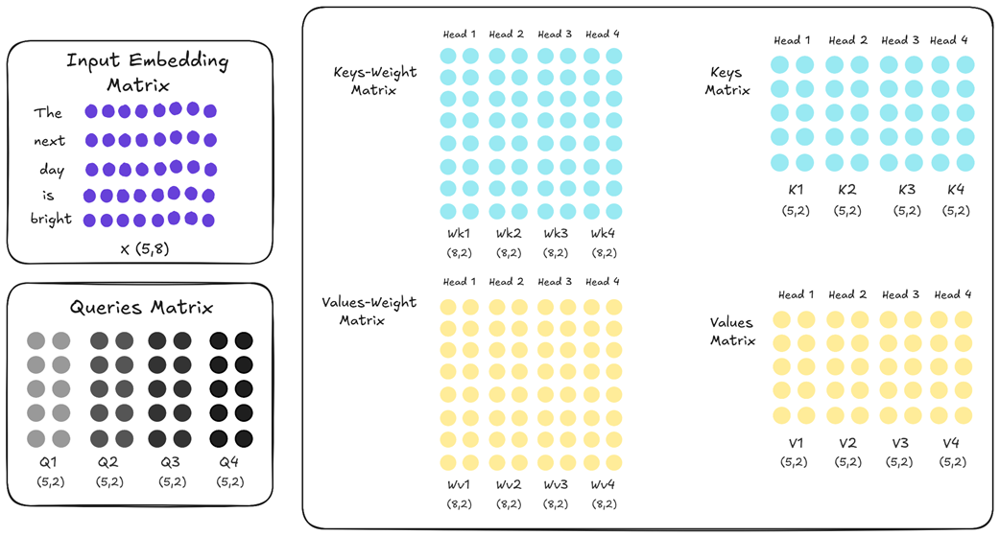
*图2.24 Multi-Query Attention (MQA)。所有四个头仍然有独特的 Query 投影，但它们现在共享一个单一的、公共的 Key 和 Value 投影，用统一的浅蓝色和黄色表示。*

仔细看图 2.24 中的区别。所有头的 Key 权重矩阵（Wk1 到 Wk4）现在完全相同，Value 权重矩阵也是如此。这意味着当输入嵌入被投影时，产生的 K1、K2、K3 和 K4 矩阵都是彼此的精确副本。Value 矩阵同样如此。

对缓存的影响是直接而深远的。我们不再需要在缓存中存储四个独立的 Key 矩阵和四个独立的 Value 矩阵，而只需要存储一个 Key 矩阵和一个 Value 矩阵。在推理期间，四个 Query 头中的每一个将简单地关注这个单一的、共享的 Key 和 Value 集。

这种简单的架构调整是 Multi-Query Attention 背后的核心思想。它将内存节省置于一切之上。在接下来的小节中，我们将探讨这对 KV Cache 公式的显著影响以及不可避免的模型性能折衷。

### 2.6.2 对 KV cache 公式的影响

从 MHA 到 MQA 的架构变化对 KV Cache 的大小有显著而直接的影响。让我们重温在 2.5.1 节中建立的公式：

Size_MHA = l * b * n * h * s * 2 * 2

这里的关键变量是 n，即注意力头数。在 MHA 中，因为每个头都有自己独特的 Key 和 Value 矩阵，所需总内存与头数线性缩放。

在 Multi-Query Attention 中，由于所有头共享相同的单一 Key 和 Value 对，我们不再需要存储 n 个不同版本。我们只需要存储一个。公式变为：

Size_MQA = l * b * 1 * h * s * 2 * 2

在此修订公式中，n 项被有效地替换为 1，其中 n 是注意力头的总数，消除了与头数的线性缩放。这使 KV Cache 的大小减少了 n 倍。这种减少对大型模型的影响是惊人的：

- **GPT-3 (175B)**：该模型有 96 个注意力头 (n=96)。使用 MQA 将其 KV Cache 大小减少 96 倍，从 4.5 GB 降至仅 48 MB。
- **DeepSeek-V3 (671B)**：该模型有 128 个注意力头 (n=128)。MQA 将其理论 KV Cache 大小减少 128 倍，从约 400 GB 降至仅 3 GB 多一点。

这是内存占用的惊人减少，并且直接转化为更快的推理（正如我们将在代码中看到的），因为每一步需要从内存加载的数据更少了。那么，如果 MQA 在解决内存问题方面如此有效，为什么不是每个模型都使用它？

### 2.6.3 性能折衷：表达能力的损失

MQA 的显著内存节省看起来几乎好得难以置信，在某种程度上，确实如此。这种效率以重大代价换来：模型性能及其理解复杂语言能力的退化。要理解这种折衷，我们必须回顾我们首先使用 Multi-Head Attention 的根本原因。

让我们考虑以下有歧义的句子：

"The artist painted the portrait of a woman with a brush."

这个句子至少有两种可能的解释：

1. **解释 A（工具）**：艺术家用画笔画了肖像。（painted with a brush）
2. **解释 B（属性）**：肖像画的是一个拿着画笔的女人。（woman with a brush）

一个精密的语言模型需要能够同时理解和梳理这两种潜在关系。这正是 Multi-Head Attention (MHA) 旨在做到的。

**MHA 如何处理歧义？**

在标准 MHA 块中，每个注意力头是一个独立的"专家分析师"，拥有自己的一组已学习权重（Wk 和 Wv）。这种独立性允许它们专业化。在训练期间，模型可能学到以下内容：

- **Head 1** 可能专注于句法关系。其已学习的权重可能使其 Key 和 Value 向量关注动词-工具配对。当其对 token "painted" 的 Query 查看 "brush" 的 Key 时，它会计算一个非常高的注意力分数，有效地捕捉这个含义："绘画的动作是使用画笔完成的。"
- **Head 2** 另一方面，可能专注于语义或描述性关系。其独特的权重可能使其 Key 和 Value 向量关注名词-属性配对。当其对 "woman" 的 Query 查看 "brush" 的 Key 时，它可能计算出一个高分，捕捉另一种含义："肖像中的女人与画笔相关联。"

因为 K1 不同于 K2，V1 不同于 V2，模型可以并行处理两种解释。最终的上下文向量包含所有头检测到的所有不同关系的丰富、混合的理解。这是 MHA 表达能力的源泉。

**MQA 如何失去这种能力？**

现在，让我们考虑在 Multi-Query Attention 中会发生什么。MQA 强制所有头共享一个单一的、公共的 Key 和 Value 矩阵。K1 现在与 K2 相同，V1 与 V2 相同。

这产生了一个关键问题。单一的、共享的 Key 矩阵不能再专业化了。它必须试图成为一个万金油，编码句子信息的通用表示。它不能同时成为理解两种不同关系类型的专家。例如，它难以精确捕捉画笔既是绘画工具又是女人持有的对象。

当 Head 1（句法专家）和 Head 2（语义专家）都发出它们独特的查询时，它们都看着完全相同的、通用的 Key 集。"brush" 的共享 Key 不能同时有效地发出"我是绘画工具"和"我是女人持有的对象"两种信号。其中一个细微差别可能会被削弱或完全丢失。

这是 MQA 的根本缺点：

通过强制所有头共享相同的 Key 和 Value 表示，MQA 严重限制了它们专业化的能力。模型失去了大量捕捉文本中多样而微妙关系的能力，导致整体性能的退化。

虽然 MQA 是解决内存问题的杰出方案，但它通过从根本上损害多头设计的核心优势来实现。这就是为什么它常被视为"内存优先"的方法。这种显著的性能折衷促使研究人员寻找更平衡的中间方案，我们将在 Grouped-Query Attention 中探讨。但首先，让我们看看如何在代码中实现这种节省内存的 MQA 架构。

### 2.6.4 从头实现 MQA 层

在 PyTorch 中实现 Multi-Query Attention 很直接。注意力计算的核心逻辑保持不变；唯一的变化在于如何处理 Key 和 Value 投影。我们不再创建 n_heads 个不同的投影，而是只创建一个，然后为所有头重复它。

以下代码定义了一个 MultiQueryAttention 模块。请特别注意 `__init__` 方法，其中架构差异最为明显。

**清单 2.3 从头实现 MQA 层**

```python
import torch
import torch.nn as nn

class MultiQueryAttention(nn.Module):
    def __init__(self, d_model, num_heads, dropout=0.0):
        super().__init__()
        assert d_model % num_heads == 0, \
            "d_model must be divisible by num_heads"
        self.d_model = d_model
        self.num_heads = num_heads
        self.d_head = d_model // num_heads
        self.W_q = nn.Linear(d_model, d_model)     #A
        self.W_k = nn.Linear(d_model, self.d_head) #B
        self.W_v = nn.Linear(d_model, self.d_head) #B
        self.W_o = nn.Linear(d_model, d_model)
        self.dropout = nn.Dropout(dropout)
        self.register_buffer('mask', torch.triu(
➥ torch.ones(1, 1, 1024, 1024), diagonal=1))

    def forward(self, x):
        batch_size, seq_len, _ = x.shape
        q = self.W_q(x).view(batch_size, seq_len, self.num_heads,
➥ self.d_head).transpose(1, 2)
        k = self.W_k(x).view(batch_size, seq_len, 1,
➥ self.d_head).transpose(1, 2)
        v = self.W_v(x).view(batch_size, seq_len, 1,
➥ self.d_head).transpose(1, 2)
        k = k.repeat(1, self.num_heads, 1, 1)  #C
        v = v.repeat(1, self.num_heads, 1, 1)  #C
        attn_scores = (q @ k.transpose(-2, -1)) / (self.d_head ** 0.5)
        attn_scores = attn_scores.masked_fill(
➥ self.mask[:,:,:seq_len,:seq_len] == 0, float('-inf'))
        attn_weights = torch.softmax(attn_scores, dim=-1)
        attn_weights = self.dropout(attn_weights)
        context_vector = (attn_weights @ v).transpose(1, 2) \
➥ .contiguous().view(batch_size, seq_len, self.d_model)
        output = self.W_o(context_vector)
        return output
```

#A Query 投影与标准 Multi-Head Attention 保持相同。它投影到完整的模型维度，然后分配给各个头。这允许每个头"问"一个独特的问题。
#B Key 和 Value 投影现在是单一的、共享的线性层。它们投影到单个头的维度 (d_head)，因为只创建一个投影，而不是 num_heads 个。这是节省 KV cache 内存的核心架构变化。
#C 单一的 Key 和 Value 张量被"重复"或广播以匹配 Query 头的数量。这是如何使所有头共享相同的 K 和 V 信息而不在内存中创建昂贵数据副本的实现方式。这是"共享"机制的实现。

让我们分解此 MultiQueryAttention 模块与标准 MultiHeadAttention 模块之间的关键区别：

- **Key 和 Value 投影**：在标准 MHA 中，W_k 和 W_v 的输出维度将是 d_model。这里，它们投影到 d_head——单个头的大小。这是因为我们只创建一个投影，而不是之后分割的 num_heads 个投影。
- **重复 K 和 V**：MQA 的魔法在前向传播中发生。计算单个 Key 和 Value 投影后，我们使用 `.repeat()` 方法。这实际上并不会像完整矩阵那样在内存中复制数据；相反，它创建了一个数据的"视图"，其中相同的 Key 和 Value 张量呈现给 num_heads 个 Query 头中的每一个。这就是"共享"如何高效实现的。
- **效率增益**：主要收益来自 Key 和 Value 缓存大小的减少。在 MHA 实现中，我们需要缓存形状为 (batch_size, num_heads, seq_len, d_head) 的张量用于 Key 和 Value。在 MQA 中，我们只需要缓存形状为 (batch_size, 1, seq_len, d_head) 的张量，大幅减少了内存占用。

通过此实现，我们有了一个功能性的注意力层，它激进地优化内存，尽管是以我们讨论过的性能折衷为代价。这为探索更平衡的解决方案完美地做好了准备。

## 2.7 中间方案：Grouped-Query Attention (GQA)

牺牲模型表达能力以换取内存效率的这种折衷并不理想。它促使研究人员寻找一种更平衡的方法——一种可以提供大量内存节省而不完全破坏多头设计威力的技术。这个解决方案就是 Grouped-Query Attention (GQA)。

GQA 在 MHA 的高表达能力和 MQA 的显著内存效率之间提供了务实的折衷。它处于中间位置，提供了一个可调旋钮来平衡这些竞争优先级。

### 2.7.1 核心思想：在组内共享 Key 和 Value

Grouped-Query Attention 的核心思想简单而有效：与其强制所有注意力头共享相同的 Key 和 Value 矩阵，如果我们创建注意力头组并只在组内共享 Key 和 Value 会怎样？

让我们可视化这意味着什么。在我们的四头示例中，与其将所有四个头视为一个单一单元（像在 MQA 中那样），我们可以将它们划分为两个组。

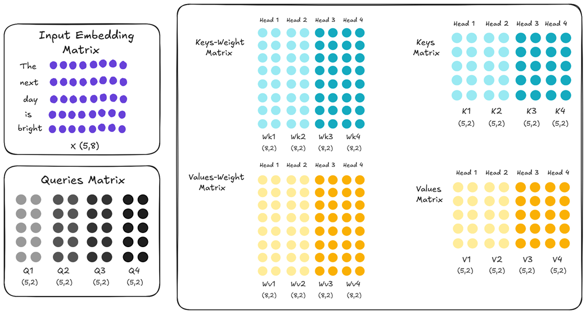
*图2.25 Grouped-Query Attention (GQA)。四个注意力头被分为两组。在组 1（浅蓝/浅黄）中，Head 1 和 Head 2 共享相同的 Key 和 Value 投影。在组 2（深蓝/深黄）中，Head 3 和 Head 4 共享一组不同的、独特的 Key 和 Value 投影。*

如图 2.25 所示，我们创建了一个混合模型：

- **组 1 内部**：Head 1 和 Head 2 共享相同的 Wk 和 Wv 矩阵。它们产生的 K1 和 K2 相同，V1 和 V2 也相同。
- **组 2 内部**：类似地，Head 3 和 Head 4 共享它们自己的一组 Wk 和 Wv 矩阵，使 K3 与 K4 相同，V3 与 V4 相同。
- **组之间**：关键是，组 1 的 Key/Value 对不同于组 2 的 Key/Value 对。浅蓝色的 K1/K2 矩阵不同于深蓝色的 K3/K4 矩阵。

这种分组策略优雅地解决了 MQA 的主要缺点。我们不再强制所有头查看相同的信息。现在，Head 1（在组 1 中）和 Head 3（在组 2 中）有不同的 Key 和 Value 矩阵，允许它们专业化和捕捉不同视角，就像标准 MHA 中一样。我们重新引入了系统的多样性。

同时，与 MHA 相比，我们仍然节省了大量内存。我们不再缓存四个独特的 Key 矩阵，而只需要缓存两个：一个用于组 1，一个用于组 2。GQA 提供了一个中间地带，允许我们在模型性能和内存成本之间找到最佳平衡点。

### 2.7.2 可调旋钮：平衡内存与性能

GQA 中组的引入提供了一个强大的"可调旋钮"来平衡内存效率和模型表达能力之间的折衷。组的数量，我们称之为 g，直接控制这种平衡。

让我们重温 KV Cache 大小公式。

- 对于 MHA，大小与 n（注意力头总数）缩放。
- 对于 MQA，大小与 1（单个共享 K/V 对）缩放。
- 对于 GQA，大小现在与 g（唯一组数）缩放。

公式变为：

Size_GQA = l * b * g * h * s * 2 * 2

这为我们提供了一系列可能性：

- 如果我们将组数设置为等于头数 (g = n)，GQA 变得与 MHA 相同。我们有最大性能和最大内存使用。
- 如果我们将组数设置为一 (g = 1)，GQA 变得与 MQA 相同。我们有最大内存节省和最低性能。
- 通过为 g 选择 1 和 n 之间的值，我们可以找到一个实际的中间地带。

例如，像 Llama 3 8B 这样的模型有 32 个总注意力头。它不是使用 MHA 的极端方案（32 个独特的 K/V 对）或 MQA（1 个独特的 K/V 对），而是使用具有 8 个组的 GQA。这意味着每 4 个 Query 头共享一个单一的 Key/Value 头。

这将 KV cache 大小减少了 4 倍（从 32 到 8），提供了显著的内存节省，同时保留了比 MQA 多得多的表达能力。这种平衡的方法使 GQA 成为现代开源 LLM 中非常流行的选择。它提供了一种管理 KV cache 瓶颈的实用方法，而不会对模型性能造成严重打击。

然而，它仍然根本上是一种折衷。我们正在用一些模型表达能力换取内存减少。虽然 GQA 是一种聪明而有效的优化，但它并没有解决性能与内存之间的核心张力；它只是允许我们在折衷曲线上选择一个更好的点。

这引导 DeepSeek 团队提出了一个不同的、更深刻的问题：我们能否从根本上改变这种折衷的本质？是否可以在保持每个头有独特投影的完整表达能力（像 MHA 那样）的同时实现显著的内存减少？

这个问题的答案是肯定的，解决方案是 Multi-Head Latent Attention。但在开始探索这一开创性技术之前，让我们通过从头实现 GQA 来巩固我们的理解。

### 2.7.3 从头实现 GQA 层

实现 Grouped-Query Attention 是我们 MQA 代码的自然扩展。关键区别在于，我们不再为 Key 和 Value 设置一个共享投影，而是现在有 num_groups 个。然后我们确保每组内的 Query 头关注对应的 Key/Value 组。

以下清单实现了一个 GroupedQueryAttention 模块。关键变量是 num_groups，它充当"可调旋钮"。它直接控制 Key 和 Value 投影的数量，允许我们平衡内存节省和模型性能。

**清单 2.4 从头实现 GQA 层**

```python
import torch
import torch.nn as nn

class GroupedQueryAttention(nn.Module):
    def __init__(self, d_model, num_heads, num_groups,
➥ dropout=0.0, max_seq_len: int = 0):
        super().__init__()
        assert d_model % num_heads == 0, \
            "d_model must be divisible by num_heads"
        assert num_heads % num_groups == 0, \
            "num_heads must be divisible by num_groups"
        self.d_model = d_model
        self.num_heads = num_heads
        self.num_groups = num_groups
        self.d_head = d_model // num_heads
        self.W_q = nn.Linear(d_model, d_model)
        self.W_k = nn.Linear(d_model,
➥ self.num_groups * self.d_head) #A
        self.W_v = nn.Linear(d_model,
➥ self.num_groups * self.d_head) #A
        self.W_o = nn.Linear(d_model, d_model)
        self.dropout = nn.Dropout(dropout)
        # Optional causal mask pre-allocation logic...
        self._register_mask_buffer(max_seq_len)

    def forward(self, x):
        B, T, _ = x.shape
        q = self.W_q(x).view(B, T, self.num_heads,
➥ self.d_head).transpose(1, 2)
        k = self.W_k(x).view(B, T, self.num_groups,
➥ self.d_head).transpose(1, 2) #B
        v = self.W_v(x).view(B, T, self.num_groups,
➥ self.d_head).transpose(1, 2) #B
        heads_per_group = self.num_heads // self.num_groups
        k = k.repeat_interleave(heads_per_group, dim=1) #C
        v = v.repeat_interleave(heads_per_group, dim=1) #C
        # ... rest of attention calculation ...
        attn_scores = (q @ k.transpose(-2, -1)) * (self.d_head**-0.5)
        causal_mask = self._get_causal_mask(T, x.device)
        attn_scores = attn_scores.masked_fill(causal_mask, float("-inf"))
        attn_weights = torch.softmax(attn_scores, dim=-1)
        attn_weights = self.dropout(attn_weights)
        context = (attn_weights @ v).transpose(1, 2).contiguous() \
➥ .view(B, T, self.d_model)
        return self.W_o(context)

    # Helper methods for mask management
    def _register_mask_buffer(self, max_seq_len):
        if max_seq_len > 0:
            mask = torch.triu(torch.ones(1, 1, max_seq_len, max_seq_len,
➥ dtype=torch.bool), diagonal=1)
            self.register_buffer("causal_mask", mask, persistent=False)
        else:
            self.causal_mask = None

    def _get_causal_mask(self, seq_len, device):
        if self.causal_mask is not None and \
➥ self.causal_mask.size(-1) >= seq_len:
            return self.causal_mask[:, :, :seq_len, :seq_len]
        return torch.triu(torch.ones(1, 1, seq_len, seq_len,
➥ dtype=torch.bool, device=device), diagonal=1)
```

#A 我们不再像 MQA 那样创建单个投影 (d_head)，而是创建 num_groups 个投影。此参数充当"可调旋钮"：如果 num_groups 为 1，这就是 MQA；如果 num_groups 等于 num_heads，这就变成标准 MHA。
#B 输入被投影并重塑为 num_groups 个不同的 Key 和 Value 组。
#C repeat_interleave 将 K/V 组广播到 Query 头。num_groups 个 Key 和 Value 中的每一个被 heads_per_group 个 Query 共享。例如，如果有 8 个 Query 头和 2 个 K/V 组，第一个 K/V 组被前 4 个 Query 头共享，第二个组被后 4 个 Query 头共享。

此实现提供了我们讨论的"可调旋钮"。通过简单地更改 num_groups 参数，我们可以沿从 MQA 类行为（num_groups=1）到 MHA 类行为（num_groups=num_heads）的谱系无缝移动。

## 2.8 性能与内存的折衷

我们现在已经探讨了 KV Cache 内存危机的第一代解决方案：Multi-Query Attention (MQA) 和 Grouped-Query Attention (GQA)。这两种技术都提供了 KV cache 内存占用的显著减少，使在现有硬件上运行具有更长上下文长度的更大模型成为可能。

然而，它们都基于相同的基本原则运作：它们通过减少独特 Key 和 Value 投影的数量来节省内存。

- MQA 是最极端的情况，将 n 个独特的 K/V 头缩减为仅一个。
- GQA 提供了更温和的折衷，将 n 个头缩减为 g 个组。

虽然有效，但这根本上是一种折衷。我们牺牲了来自拥有完全独立、专业化注意力头的表达能力，以换取内存节省。GQA 允许我们在性能与内存曲线上选择一个更可接受的点，但它并没有改变曲线本身。我们仍然被迫在最大性能 (MHA) 和最大内存效率 (MQA) 之间做出选择，或选择其间的折衷 (GQA)。

这种未解决的张力正是 DeepSeek 架构如此创新的原因。开发者们提出了一个不同的问题：与其减少头的数量，我们能否使每个头内的信息更紧凑？我们能否压缩 Key 和 Value 矩阵本身？

这种从减少头数到压缩信息的思维转变，正是直接引向 Multi-Head Latent Attention 的概念飞跃，我们将在第 3 章中讨论。它代表了解决 KV Cache 瓶颈的一种根本性新方法，旨在保留 MHA 的完整表达能力的同时实现显著的内存节省。

## 2.9 总结

- 自回归生成中，每个新 token 被追加到输入，在朴素实现中导致每一步重新处理整个序列。
- 这种重复计算导致二次 O(n²) 复杂度问题，使得生成长文本序列在计算上不切实际。
- Key-Value (KV) Cache 通过存储过去 token 的 Key 和 Value 矩阵来优化推理，避免冗余计算并将过程转换为线性时间 O(n) 操作。
- 虽然 KV Cache 显著加速计算，但它引入了严重的内存瓶颈，因为其大小随序列长度、层数和注意力头数成比例增长。
- Multi-Query Attention (MQA) 通过强制所有注意力头共享单个 Key 和 Value 投影来大幅减少 KV cache 的内存占用，但这通过阻止头专业化显著降低了模型性能。
- Grouped-Query Attention (GQA) 通过让注意力头组共享 Key 和 Value 投影提供了可调的折衷，允许在内存节省和模型表达能力之间取得平衡。
- MQA 和 GQA 等架构根本上通过减少独特 Key/Value 对的数量来运作，建立了内存效率与模型表达能力之间的固有折衷。
