# 第3章 DeepSeek的突破：多头潜在注意力（MLA）

本章涵盖：
- 使用多头潜在注意力（Multi-Head Latent Attention，MLA）压缩KV Cache
- 使用旋转位置编码（Rotary Positional Encoding，RoPE）注入位置感知
- 使用解耦架构融合MLA和RoPE

在上一章中，我们通过构建高效LLM推理的坚实基础，完成了我们旅程的第1阶段。我们从重复计算的问题开始，用KV Cache解决了它。然而，我们随后看到了KV Cache的阴暗面：其巨大的内存开销。我们探索了第一代解决方案——MQA和GQA，它们有助于减少内存使用，但通过牺牲多头注意力（Multi-Head Attention，MHA）的表达能力引入了一个痛苦的权衡。这让我们在性能和效率之间留下了未解决的张力。


*图3.1 我们构建DeepSeek模型的四阶段旅程。已完成Key-Value Cache基础（第1阶段），现在我们开始第2阶段。本章聚焦于高亮组件——多头潜在注意力（MLA）与解耦RoPE，这是核心架构中的首个重大创新。*

正如我们的路线图图3.1所强调的，我们将构建的第一个架构组件是多头潜在注意力（Multi-Head Latent Attention，MLA）。这是DeepSeek开创的核心创新，用于打破性能和内存之间的权衡。MLA首次在DeepSeek-V2中引入，并延续到其后续版本中，被证明在大幅减少KV Cache占用方面非常有效。然而，解决内存问题只是成功了一半。为了理解上下文，我们的模型还需要位置感知，我们将使用最先进的技术——旋转位置编码（Rotary Positional Encoding，RoPE）来提供它。

这就引出了本章的核心挑战：标准RoPE与MLA从根本上不兼容。为了解决这个冲突，我们将从零开始构建一个完整的、可用于生产的注意力块，逐步实现DeepSeek的关键创新。

首先，我们将实现多头潜在注意力（MLA）。通过编码下投影和上投影层，我们将演示MLA如何在保持标准多头注意力的表达能力的同同时，大幅减少KV Cache的内存占用。

其次，我们将通过构建现代解决方案——旋转位置编码（RoPE）来解决位置感知问题。我们将从探索更简单方法的缺陷开始，理解为什么RoPE有效，然后从零开始实现其旋转机制。

最后，我们将通过实现DeepSeek的解耦RoPE架构来结合这两个概念。这涉及构建两条并行处理路径——一条用于内容，一条用于位置——然后将它们的输出相加。这个最终实现将提供一个平衡高性能和内存效率的功能性PyTorch模块，构成DeepSeek模型的核心。

## 3.1 MLA：两全其美

在DeepSeek出现之前，注意力机制的状态让人面临一个困难的选择。我们被迫在权衡曲线上导航：一端是具有巨大内存开销的多头注意力（MHA）的最大性能；另一端是具有妥协表达能力的多查询注意力（MQA）的内存效率。

这促使DeepSeek团队提出了一个更深刻的问题：我们能打破这个权衡本身吗？

是否可能设计一种注意力机制，使其同时实现：

1. **低缓存大小**：与高效的MQA或GQA相当的内存占用。
2. **高性能**：MHA的完整表达能力，其中每个注意力头都有独特、专门的视角。

这似乎是不可能的。要减少缓存大小，我们感觉必须减少存储的唯一信息量。我们怎么可能在不全部缓存的情况下，让每个头的Key和Value都有不同的值？

答案在于一个巧妙的技巧——一种全新的思考问题的方式。MLA的核心创新是将焦点从减少头的数量转移到压缩其中的信息。

洞察是这样的：如果我们不必分别缓存Key和Value矩阵呢？如果我们能先将输入投影到一个单一的、组合的、小得多的矩阵——一个潜在矩阵（latent matrix）——然后只缓存它呢？

这就是多头潜在注意力的核心思想。我们不再缓存两个大的、完整维度的矩阵（K和V），而是缓存一个更小的、低维度的矩阵（cKV）。这个单一的潜在矩阵成为我们新的、高效的缓存。然后，当我们需要注意力计算的完整Key和Value矩阵时，我们可以从这个压缩的潜在表示中即时重建它们。

这就是MLA的魔力：

- **用于缓存**：我们存储一个单一的、小的、压缩的矩阵。
- **用于计算**：我们将其解压缩，为每个头获取完整大小的、唯一的Key和Value矩阵。

这种方法有望实现两全其美。它通过巧妙地将Key和Value投影因式分解为两步过程来实现这一点：先压缩到更小的潜在空间以进行高效缓存，然后重建回完整维度空间以进行注意力计算。要理解它的工作原理，我们必须首先了解使这种压缩和解压缩成为可能的新架构。

## 3.2 MLA架构：视觉详解

为了实现这种"存储时压缩，使用时解压缩"的策略，多头潜在注意力引入了一组新的投影层，并修改了注意力块内的数据流。它不再将输入直接投影为Key和Value，而是首先将输入投影到一个压缩的潜在空间。

让我们来看完整的工作流程，如图3.2所示。

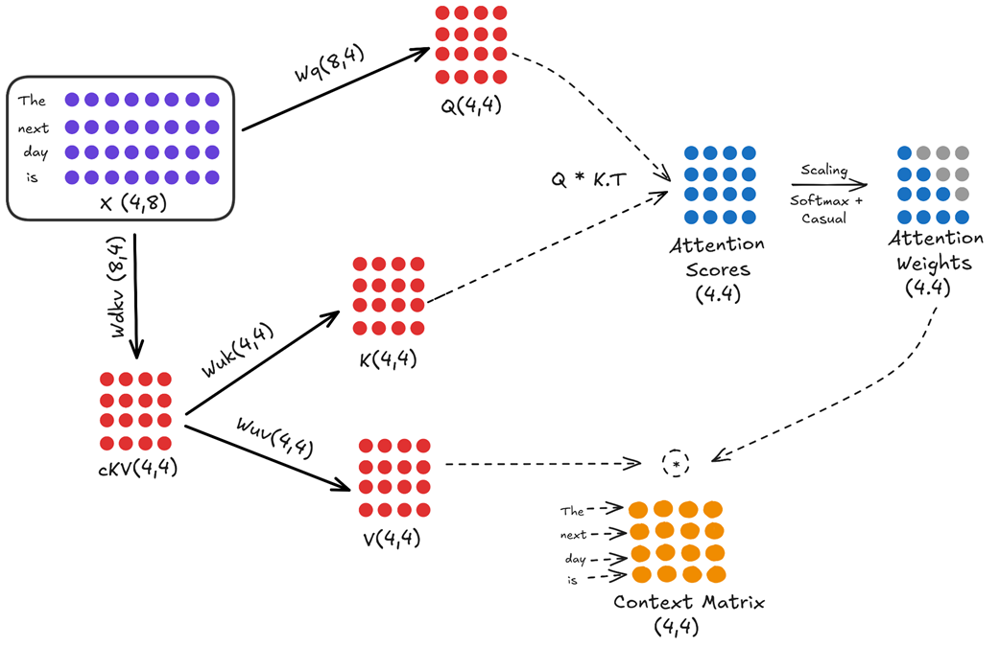

*图3.2 多头潜在注意力（MLA）的完整架构数据流*

这个图乍一看很复杂，但它是对我们已知内容的逻辑扩展。让我们将其分解为两条主要路径：查询路径和键/值路径。

### 3.2.1 查询路径（不变）

在这个简化版本的MLA中，查询路径与标准多头注意力保持相同。目标是创建一个完整大小的查询矩阵，能够对整个上下文"提问"。

- 输入嵌入矩阵X（形状4, 8）乘以Wq权重矩阵（形状8, 4）。
- 这产生最终的Query矩阵Q（形状4, 4），准备好进行注意力计算。在这个例子中，头维度（d_head）为4。

（注意：更高级版本的MLA也会压缩查询，但为了理解核心KV缓存创新，我们可以将查询路径视为标准的。）

### 3.2.2 键/值路径（创新所在）

这是魔力发生的地方。现在不再是Key和Value的两次独立投影，而是一个涉及新的中间潜在矩阵的两步过程。

**步骤1：下投影到潜在空间**

输入嵌入矩阵X首先乘以一个新的可学习权重矩阵，称为KV下投影器（KV Down-Projector，Wdkv）。

- X（形状4, 8）乘以Wd-kv（形状8, 4）。
- 这产生一个单一的、更小的、压缩矩阵，称为潜在KV矩阵（Latent KV Matrix，cKV），形状为(4, 4)。

> **注意** 在我们的例子中，潜在维度（4）恰好与token数量相同。这纯粹是为了简化图表的巧合。在实践中，这些维度完全独立且差异很大。对于DeepSeek-V3这样的模型，模型维度为7168，潜在维度为512。

所以，KV下投影器（Wdkv）的形状将是(7168, 512)，将大型7168维向量压缩为更小的512维向量。我们例子中的数字保持很小，仅用于建立直觉。

这个cKV矩阵是推理期间唯一被缓存的内容。注意两件事：

- 我们只缓存一个矩阵，而不是两个。
- 这个矩阵的维度（本例中为4，但实际DeepSeek模型中为576）远小于Key和Value组合的完整维度。

**步骤2：从潜在空间上投影**

现在我们有了压缩的cKV矩阵，每当需要注意力计算时，我们可以从中重建完整的Key和Value矩阵。这通过两个新的上投影矩阵完成：

- cKV矩阵（形状4, 4）乘以Key上投影器（Key Up-Projector，Wuk，形状4, 4）以产生最终的Key矩阵K（形状4, 4）。
- cKV矩阵（形状4, 4）也乘以Value上投影器（Value Up-Projector，Wuv，形状4, 4）以产生最终的Value矩阵V（形状4, 4）。

经过这个两步过程，我们得到了三个必需的矩阵：Q（来自标准路径），以及K和V（从潜在矩阵重建）。从此以后，注意力计算的其余部分——计算分数、应用softmax和计算上下文矩阵——与标准多头注意力完全相同。

这种方法的高效性来自于两步过程。首先，我们将历史Key和Value信息存储在一个单一的压缩矩阵中以节省内存。其次，我们在需要计算时即时解压缩这个矩阵，为每个头重建完整的、唯一的Key和Value矩阵。这引出了一个关键问题：添加投影和重建步骤怎么实际上能让过程更高效？答案在于矩阵乘法的一个特定应用，我们称之为"吸收技巧"（absorption trick）。

## 3.3 数学魔力：潜在矩阵如何发挥作用

我们已经看到了MLA的新架构，它引入了一个潜在的cKV矩阵。乍一看，这似乎增加了复杂性。引入一个额外的矩阵和两个额外的投影步骤（Wd-kv和Wuk/Wuv）怎么实际上能带来更高效的系统？

答案在于DeepSeek团队利用的矩阵乘法的一个性质——一种我们称之为"吸收技巧"的技术。通过巧妙地重新排列注意力公式，我们可以证明潜在矩阵是我们需要缓存的唯一历史信息片段，使我们能够同时拥有小缓存和完全独特的、富有表达力的头。要理解这一点，我们需要用数学方式写出完整的计算序列。

### 3.3.1 MLA中Q、K和V的逐步推导

让我们将架构图中看到的步骤形式化。我们将使用X来表示我们的输入嵌入矩阵。

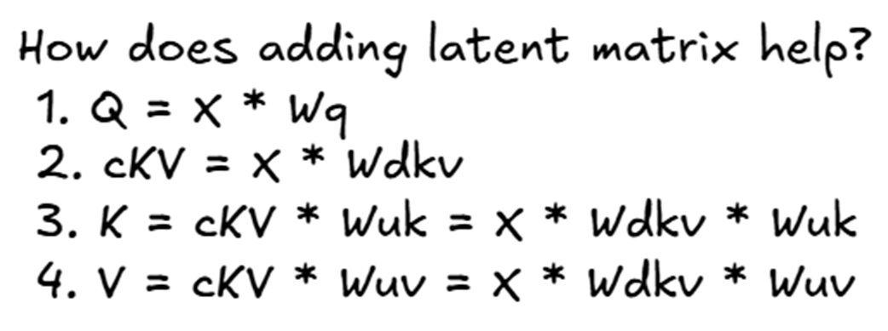

*图3.3 MLA架构中Query、Key和Value矩阵的逐步数学推导*

按照图3.3中的步骤：

1. **Query矩阵（Q）**：查询计算保持标准。它是输入嵌入的直接投影。

2. **潜在KV矩阵（cKV）**：这是第一个新步骤。输入嵌入被向下投影到压缩的潜在空间。这个cKV矩阵是我们最终要缓存的内容。

3. **Key矩阵（K）**：最终的Key矩阵不再是X的直接投影。相反，它是潜在矩阵cKV的上投影。

   如果我们代入步骤2中cKV的定义，我们可以看到从原始输入的完整变换：

4. **Value矩阵（V）**：同样，最终的Value矩阵也是同一潜在矩阵cKV的上投影。

   再次代入cKV的定义：

到目前为止，看起来我们只是添加了额外的步骤。理解效率提升的关键在于当我们将K和V的这些新定义代入主要注意力分数公式时。这就是魔力开始的地方。

### 3.3.2 吸收技巧：注意力分数如何计算

现在我们有了Query、Key和Value矩阵的新数学定义，让我们看看当我们将它们代入注意力分数的核心公式时会发生什么：

我们首先代入Q和K的新定义：

使用矩阵转置的规则 (AB)ᵀ = Bᵀ Aᵀ，我们可以展开转置项：

再次应用该规则：

这个方程看起来很复杂，但它揭示了一些令人难以置信的东西。注意可训练权重矩阵（Wq, Wukᵀ, Wdkvᵀ）都聚集在中间。因为矩阵乘法是可结合的，我们可以重新分组这些项。

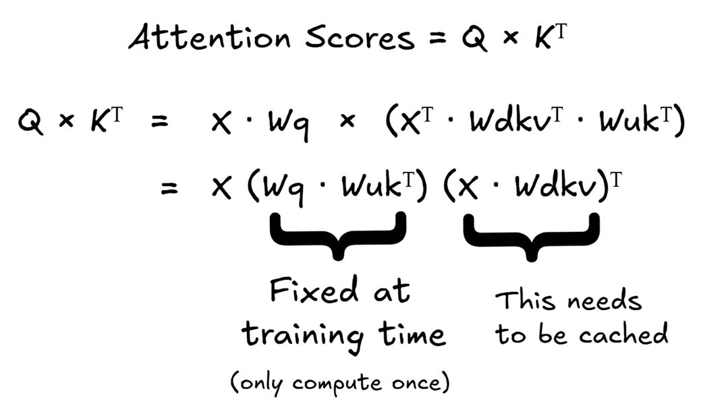

*图3.4 MLA中注意力分数计算的数学重排*

如图3.4所示，我们可以将方程重排如下：

让我们分析这个重排公式的两个主要组成部分：

1. 这是我们两个学习权重矩阵的乘积。由于Wq和Wuk在推理期间是固定的（它们在预训练期间学习），这个整体乘积也是一个固定矩阵。我们可以预先计算一次并重复使用。它不需要在每一步都重新计算。

2. 这个项应该看起来很熟悉。X * Wdkv正是我们的潜在KV矩阵cKV的定义。

这就是"吸收技巧"。Key的上投影矩阵Wuk已经被数学重排到查询投影矩阵Wq旁边。因为Wq和Wuk都是预训练期间学习的固定矩阵，它们的乘积（Wq * Wukᵀ）也只是一个单一的固定矩阵，我们在推理期间不需要重新计算。

这简化了过程。要获得我们的注意力分数，原始公式Q * Kᵀ现在实际上变成了：

这是一个深刻的变化。我们从一个需要完整Query矩阵和完整Key矩阵的公式开始。经过这次数学重排后，我们看到计算只需要两件事：

1. 原始输入X。
2. 潜在矩阵cKV = X * Wdkv。

关键的是，当我们生成新token且输入序列增长时，表示这个不断增长的历史的矩阵X也会扩展。因此，总结这个历史的潜在矩阵cKV也必须通过追加新token的潜在向量来扩展。这证明了cKV矩阵是需要更新和存储的唯一历史信息片段，用于计算注意力分数。我们成功地将注意力分数计算重新表述为仅依赖于这个单一的、紧凑的、缓存的矩阵，完全消除了缓存完整K和V矩阵的需要。

### 3.3.3 最后一步：计算上下文向量

我们已经成功地将注意力分数计算重新表述为依赖于单一的、缓存的潜在矩阵cKV。现在，让我们看看这种效率是否也适用于最后一步：创建上下文向量矩阵（Context Vector Matrix）。

标准公式是：

我们知道Attention Weights来自注意力分数（Q * Kᵀ），我们刚刚简化了它。我们还有Value矩阵的新定义：

让我们把一切组合在一起。

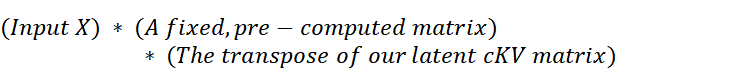

*图3.5 MLA中计算最终输出的数学重排*

如图3.5所示，上下文向量的完整计算（在传递给最终输出投影层Wo之前）如下：

同样，我们可以识别出项(X * Wdkv)。这就是我们缓存的潜在矩阵。

就像之前一样，我们可以利用矩阵乘法的结合性质。Wuv矩阵可以被最终输出投影层Wo"吸收"。乘积(Wuv * Wo)只是另一个在预训练期间学习的单一固定矩阵。

这证实了我们的核心论点：我们只需要缓存潜在矩阵。

让我们总结这个工作流程的美妙之处：

1. 当新token到达时，我们计算它对cKV缓存的贡献。
2. 我们使用完整的、更新的cKV缓存来帮助计算注意力分数。
3. 我们也使用同一个更新的cKV缓存来帮助计算最终的上下文向量。

通过引入这个中间潜在空间，DeepSeek团队设计了一个系统，其中一个单一的、紧凑的缓存矩阵可以被高效地用于注意力计算的Key侧和Value侧。这就是他们如何实现两全其美的：缓存占用的内存大幅减少，同时不牺牲每个注意力头拥有独特的、富有表现力的投影所带来的性能优势。

## 3.4 使用MLA的新推理循环

现在我们理解了MLA背后的数学魔力，让我们把一切整合起来，定义生成单个新token的新的、高效的工作流程。这个过程巧妙地利用缓存的潜在矩阵来避免重新计算整个历史。

我们将跟踪一个新token——"bright"——进入系统的旅程，假设模型已经处理了"The next day is"并将其潜在表示存储在cKV缓存中。

### 3.4.1 当新token到达时会发生什么？

整个过程设计得极其高效，执行绝对最少数量的必要计算。当像"bright"这样的新token到达时，模型遵循以下步骤：

**步骤1：计算新投影**

第一步是为我们的新token计算三个基本向量。我们获取"bright"的输入嵌入，我们称之为X_bright，并执行三次并行乘法。

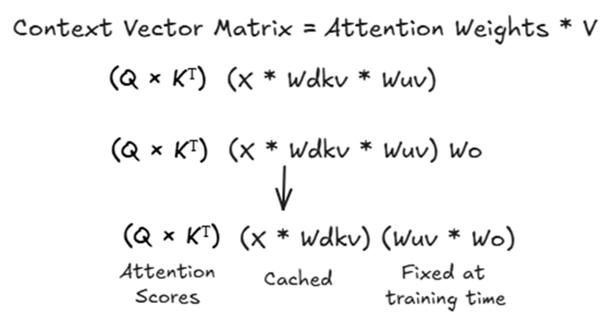

*图3.6 为新token计算Query向量*

首先，我们计算"bright"的Query向量。这是标准投影，总是为当前token重新计算。

接下来，也是最重要的，我们计算token对我们新的压缩缓存的贡献。

```
Query_bright = X_bright * Wq
```

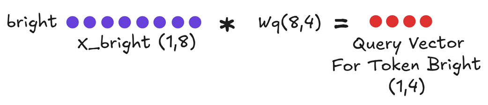

*图3.7 为"bright"计算新的潜在向量cKV*

我们将输入嵌入X_bright乘以KV下投影器（Wdkv）。这产生了一个单一的、小的、压缩的Token Bright潜在向量。这个微小向量以压缩格式包含了该token所有必需的Key和Value信息。

这些是我们需要执行的唯一新投影。我们不直接从输入计算完整的Key和Value向量。相反，我们将使用我们的缓存。

### 3.4.2 缓存潜在向量：我们唯一存储的内容

现在我们有了Token Bright的新潜在向量，下一步是更新我们的缓存。在上一次推理步骤（对于输入"The next day is"）中，我们已经计算并将那些token的潜在向量存储在我们的cKV缓存中。

我们的任务现在只是将新的潜在向量追加到这个现有缓存中。

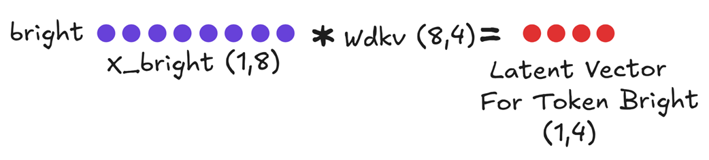

*图3.8 更新潜在KV缓存。"bright"新计算的潜在向量被追加到之前token的现有缓存中。*

如图3.8所示，我们原始的cKV缓存的形状为(4, 4)，包含压缩的历史。通过追加新的(1, 4)潜在向量，我们现在有了一个形状为(5, 4)的更新潜在矩阵。

这个单一的、紧凑的矩阵是我们在步骤之间存储在内存中的唯一历史信息。我们不需要为Key设置单独的缓存，也不需要为Value设置单独的缓存。这就是MLA内存效率的来源。

### 3.4.3 解压缩缓存并计算注意力

有了我们更新的缓存和"bright"的新鲜Query向量，我们现在拥有了执行注意力计算所需的一切。

首先，我们必须将我们的潜在缓存"解压缩"回完整维度的Key和Value矩阵。这是即时完成的，仅为此单次计算。

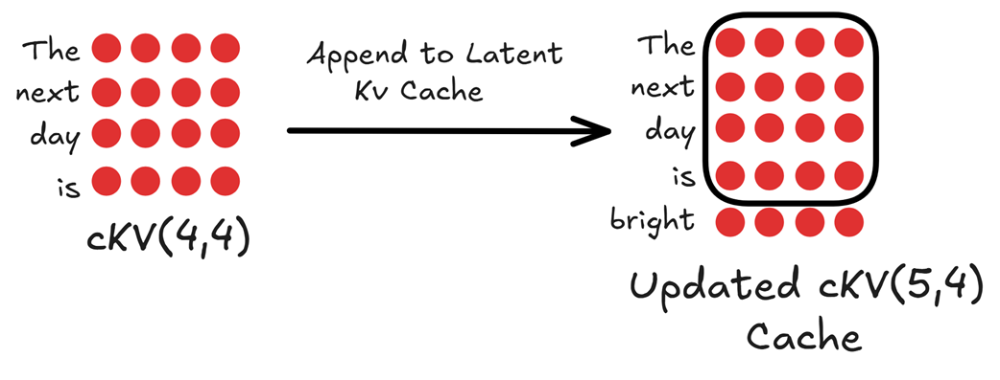

*图3.9 使用上投影矩阵将更新的潜在缓存解压缩为完整的Key和Value矩阵*

如图3.9所示，我们执行两次并行乘法：

1. 更新的cKV缓存（形状5, 4）乘以Key上投影器（Wuk）以产生完整的Key矩阵K（形状5, 4）。
2. 同一个更新的cKV缓存（形状5, 4）乘以Value上投影器（Wuv）以产生完整的Value矩阵V（形状5, 4）。

现在，我们拥有了标准注意力机制所需的一切：当前token的新鲜Query向量，以及从我们紧凑缓存忠实重建的整个历史的完整Key和Value矩阵。

最后的步骤按照我们之前看到的方式继续。

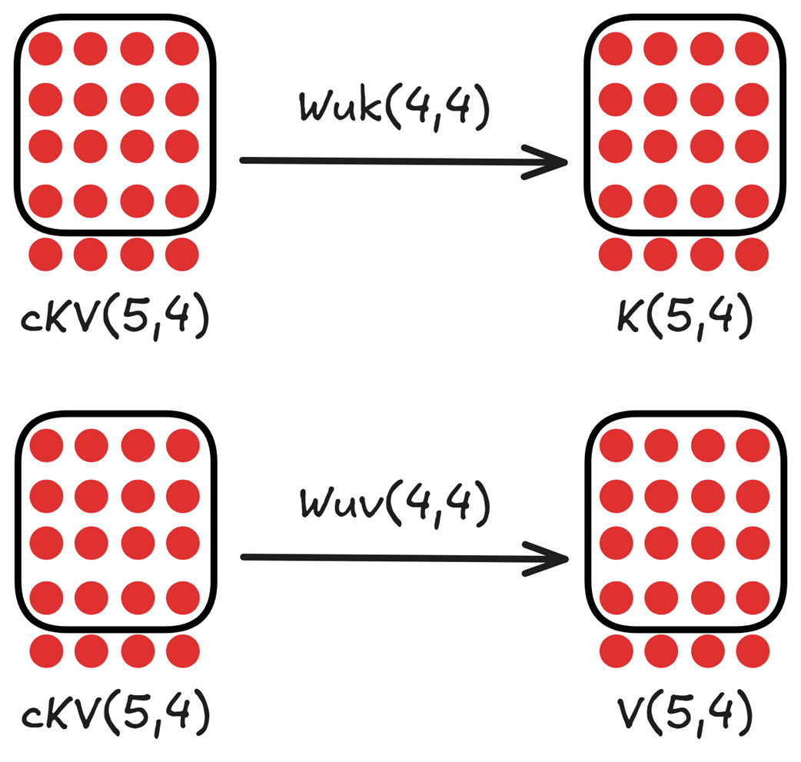

*图3.10 使用新鲜Query和解压缩的Key和Value矩阵进行最终注意力计算*

1. **计算Attention Weights**：我们将"bright"的Query向量乘以转置后的完整、更新的Key矩阵K。经过缩放和softmax后的结果就是token "bright"的Attention Weights。这是我们唯一需要的一行，因为正如我们在第2章中确立的，下一个token的预测仅取决于序列中最后一个token的上下文向量。

2. **计算Context Vector**：我们将这些Attention Weights乘以完整、更新的Value矩阵V，以产生token "bright"的单一的、最终的Context Vector。

这个单一的上下文向量然后通过Transformer的其余层来预测下一个token。我们已经成功生成了输出，同时在缓存中只存储了小的潜在cKV矩阵。

## 3.5 量化收益

MLA的压缩、缓存和解压缩的多步过程是一项精彩的工程。但它在实践中实现了什么？让我们量化两个主要收益：缓存大小的减少和性能的保持。

### 3.5.1 新的KV缓存公式：64倍减少

在第2章中，我们确立了标准MHA KV缓存大小的公式：

关键项是2 * (n * h)，表示两个独立的缓存（Key和Value），每个缓存的维度等于头的数量（n）乘以头维度（h）。

有了MLA，这个项被完全替换。我们不再存储两个缓存，存储的维度不是n * h，而是更小的潜在维度d_latent。

新公式变为：

让我们为DeepSeek-V3规模的模型代入数字：

- n（头数）= 128
- h（头维度）= 128
- n * h（总维度）= 16,384
- d_latent（潜在维度，如DeepSeek论文中所使用的）≈ 512

让我们比较核心因子：

- MHA缓存维度：2 * (n * h) = 2 * 16,384 = 32,768
- MLA缓存维度：d_latent = 512

缓存数据大小的减少为：32,768 / 512 = 64倍。

这是一个了不起的成就。通过缓存单一的、压缩的潜在矩阵，MLA将KV缓存的内存占用减少了64倍。我们为DeepSeek规模模型计算的理论400 GB缓存大小崩溃到一个更易管理的约7 GB。

### 3.5.2 保持性能：为什么头的多样性得以维持

更重要的是，MLA在不出现MQA和GQA中看到的性能下降的情况下实现了这种巨大的内存减少。为什么？

答案在于上投影矩阵Wuk和Wuv。在DeepSeek架构中，这些上投影矩阵本身是多头的。这意味着每个注意力头都有一个独特的、学习得到的Wuk和Wuv。

当我们解压缩共享的潜在缓存cKV时，每个头使用自己专门的上投影器。这意味着：

- Head 1重建K1和V1。
- Head 2重建不同的K2和V2。
- ……以此类推，对所有128个头。

在注意力计算的时刻，每个头都在使用自己独特的Key和Value矩阵，就像标准MHA一样。我们没有在头之间共享任何内容。我们保持了多头设计的完整多样性和表达能力。

这就是MLA如何实现两全其美的。

## 3.6 从零构建MLA模块

现在我们对MLA的理论和数学工作流程有了扎实的理解，我们准备好用代码实现它了。我们将构建一个PyTorch模块，封装整个逻辑：下投影、上投影和最终注意力计算。

对于这个实现，我们将聚焦于MLA核心机制本身。我们将在主推理循环之外处理缓存逻辑，并将在本章后面处理位置编码。

```python
import torch
import torch.nn as nn

class MultiHeadLatentAttention(nn.Module):
    def __init__(self, d_model, num_heads, d_latent, dropout=0.0):
        super().__init__()
        assert d_model % num_heads == 0, \
            "d_model must be divisible by num_heads"

        self.d_model = d_model
        self.num_heads = num_heads
        self.d_head = d_model // num_heads
        self.d_latent = d_latent

        self.W_q = nn.Linear(d_model, d_model)  #A
        self.W_dkv = nn.Linear(d_model, d_latent)  #B
        self.W_uk = nn.Linear(d_latent, d_model) #C
        self.W_uv = nn.Linear(d_latent, d_model) #C
        self.W_o = nn.Linear(d_model, d_model)

        self.dropout = nn.Dropout(dropout)
        self.register_buffer('mask', torch.triu(torch.ones(
            1, 1, 1024, 1024), diagonal=1).bool())

    def forward(self, x):
        batch_size, seq_len, _ = x.shape

        # 1. Query Path
        q = self.W_q(x).view(
            batch_size, seq_len, self.num_heads, self.d_head
        ).transpose(1, 2)

        # 2. Key/Value Path (The MLA Innovation)
        # Down-project to the latent space
        c_kv = self.W_dkv(x)  #D

        # Up-project from latent space to get full K and V
        k = self.W_uk(c_kv).view(
            batch_size, seq_len, self.num_heads, self.d_head
        ).transpose(1, 2)  #E
        v = self.W_uv(c_kv).view(
            batch_size, seq_len, self.num_heads, self.d_head
        ).transpose(1, 2)  #E

        # 3. Standard Attention Calculation
        attn_scores = (q @ k.transpose(-2, -1)) / \
            (self.d_head ** 0.5)
        attn_scores = attn_scores.masked_fill(
            self.mask[:, :, :seq_len, :seq_len], float('-inf'))
        attn_weights = torch.softmax(attn_scores, dim=-1)
        attn_weights = self.dropout(attn_weights)

        context_vector = (attn_weights @ v).transpose(1, 2) \
            .contiguous().view(batch_size, seq_len, self.d_model)

        # 4. Final Output Projection
        output = self.W_o(context_vector)
        return output
```

虽然多头潜在注意力优化了Transformer高效处理信息的能力，但我们的注意力模块在根本上仍然是"时间盲"的。它没有对词序的固有感知，将句子当作"词袋"处理。要让LLM真正理解上下文并生成连贯的文本，它们需要知道每个token的位置。这引导我们走向路径上的下一个关键步骤：位置感知。

## 3.7 顺序的问题

注意力机制虽然强大，但有一个根本性的限制：它没有内置的序列顺序感知。默认情况下，它将句子当作"词袋"处理，其中单词的位置无关紧要。对于原始注意力机制来说，句子"the dog chased the cat"和"cat the chased dog the"看起来是一样的。这是一个巨大的问题，因为词序对句子含义至关重要。

让我们考虑一个例子：

"The dog chased another dog."

这个句子包含两个"dog"的实例。在语义上，第一个"dog"（追逐者）和第二个"dog"（被追逐者）的token嵌入是相同的。如果我们不添加任何位置信息就将这些token嵌入直接输入到Transformer块中，模型就无法区分它们。

如图3.11所示，两个token输入到Transformer块的输入将完全相同。因此，注意力机制产生的输出上下文向量也将相同。模型将无法看到一个dog是主语而另一个是宾语的事实。它无法理解句子的真正上下文。

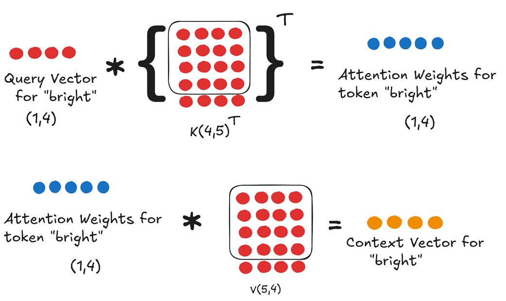

*图3.11 没有位置信息时，Transformer以完全相同的方式处理不同位置的相同token，导致相同的上下文向量和关键上下文理解的丢失*

为了解决这个问题，我们必须找到一种方法来告诉模型每个token在序列中的位置。我们需要在位置2的第一个"dog"和位置5的第二个"dog"之间创建区别。执行此操作的机制称为位置编码（positional encoding）：我们创建一个表示token位置的向量，并将其添加到token的语义嵌入中。

挑战在于以一种对模型有用且不会破坏原始token嵌入中有价值的语义信息的方式注入位置信息。正如我们将看到的，这是一个出奇地难以平衡的问题。让我们从探索最直接、最直观的解决方案开始——首先直接使用整数位置数字。

## 3.8 尝试#1：朴素方法——整数位置编码

现在我们已经确立了对位置信息的关键需求，让我们从第一性原理思考。如果你被指派设计一个编码token位置的系统的任务，你能想象到的最简单、最直接的方法是什么？最可能的建议是直接使用位置数字本身。

### 3.8.1 简单想法：直接使用位置数字

这是整数位置编码（Integer Positional Encoding）的核心思想。我们只需取token在序列中的整数索引，并使用该值创建其位置嵌入。

让我们回到我们的例子："The dog chased another dog."

- 第一个"dog"在位置2。
- 第二个"dog"在位置5。

要创建一个可以添加到token嵌入的位置嵌入向量，我们需要一个相同维度的向量。如果我们的token嵌入维度为8，我们只需创建一个每个元素都是位置数字的向量。

- 第一个"dog"（位置2）的位置嵌入：[2, 2, 2, 2, 2, 2, 2, 2]
- 第二个"dog"（位置5）的位置嵌入：[5, 5, 5, 5, 5, 5, 5, 5]

当我们将这些向量添加到"dog"的相同token嵌入时，输入到Transformer的最终输入嵌入将不同。

问题解决了吧？我们现在成功地为模型提供了一种区分两个dog的方法。Transformer将为它们产生不同的上下文向量，它可以学习它们在句子中扮演的不同角色。

然而，这个简单的解决方案引入了一个新的、更严重的问题。

### 3.8.2 重大缺陷：用大数值污染语义嵌入

整数位置编码的主要问题在于值的幅度（magnitude）。捕获单词语义含义的token嵌入通常初始化为聚集在零附近的小值。这是深度学习中为了训练稳定性而做的刻意选择。一个"dog"的token嵌入可能看起来像[0.1, 0.3, 0.2, 0.8, ...]，其中值很小。

```
InputEmbedding_dog1 = TokenEmbedding_dog + [2, 2, 2, ...]
InputEmbedding_dog2 = TokenEmbedding_dog + [5, 5, 5, ...]
```

现在，考虑位置嵌入。虽然前几个token的值很小（2、5等），但在具有大上下文窗口的模型中会发生什么？位置200处的token将具有位置嵌入[200, 200, 200, ...]。位置1000处的token将具有[1000, 1000, 1000, ...]。

当我们将这两个向量相加时，位置编码的大整数值完全淹没了token嵌入的小的、精细的值。

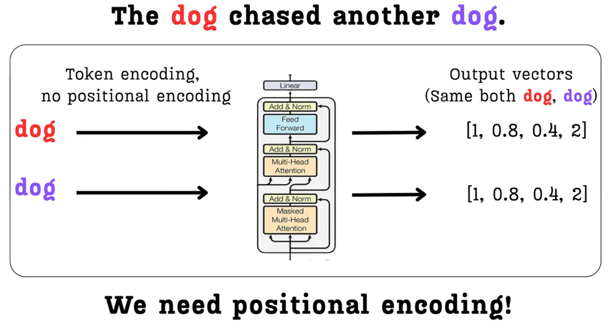

*图3.12 整数位置编码的问题。位置值的大幅度完全主导了token编码的小的、语义的值，使模型很难分离两种信息源*

如图3.12所示，两个向量的和将被位置信息主导。微妙的语义信息——单词"dog"的真正含义——被有效淹没在噪声中。我们正在污染语义。

这首先违背了拥有丰富token嵌入的目的。我们希望模型从单词的含义中学习，但这种朴素方法迫使位置信息淹没它。如果位置200处的token和位置500处的token恰好都是单词"dog"，模型将难以学习它们的关联。

理想情况下，我们需要一种满足两个标准的方法：

1. 它必须为每个位置提供唯一的编码。
2. 编码的值必须限制在一个小范围内（例如0到1之间），这样它们就不会压倒token嵌入。

这种思路直接引出了我们的第二次尝试：使用一种内在受限的数字系统。

## 3.9 尝试#2：向前一步——二进制位置编码

整数位置编码的失败教会了我们宝贵的一课：位置值的幅度很重要。我们需要一个能表示唯一位置而不使用会压倒语义token嵌入的大而无界数字的系统。

这引导我们到一个自然的下一步：如果我们使用一个值内在受限的数字系统呢？这就是二进制位置编码（Binary Positional Encoding）的核心思想。

### 3.9.1 用二进制表示解决幅度问题

我们不使用位置的原始整数，而是用其二进制形式表示它。二进制系统只使用两个数字——0和1——完美地解决了我们的幅度问题。

让我们考虑位置200的token。如果我们的模型嵌入维度为8，我们可以用8位二进制数表示这个位置：

- 位置200（整数）：200
- 位置200（8位二进制）：11001000

我们现在可以直接从这个二进制表示创建位置嵌入向量：[1, 1, 0, 0, 1, 0, 0, 0]。

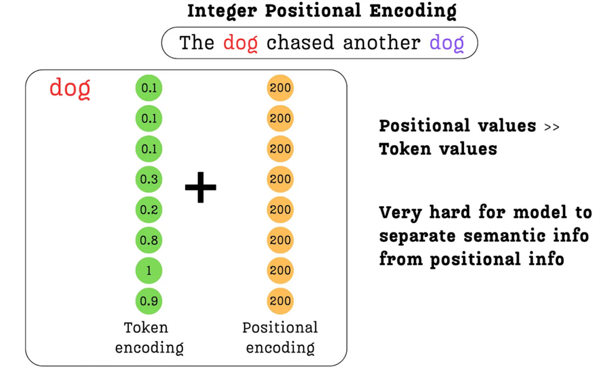

*图3.13 二进制位置编码。位置数字被转换为其二进制表示，产生一个由0和1组成的向量，可以安全地添加到token嵌入中而不会压倒其语义信息*

如图3.13所示，这种方法是一个重大改进。位置值现在全部是0或1，与token嵌入中的小浮点数量级相似。当我们将它们相加时，语义信息被保留，而不是被污染。我们已经成功解决了整数编码的主要问题。

这似乎是一个很好的解决方案。它为每个位置提供了一个唯一的、固定长度的和有界的表示。然而，通过仔细观察这些二进制数的结构，我们可以发现一个更深的、更有趣的模式，最终将引导我们到最先进的技术。

### 3.9.2 发现更深的模式：振荡频率

二进制位置编码解决了幅度问题，但它也打开了一扇新的思考位置方式的大门。让我们更仔细地分析这些二进制数的结构。在每个二进制表示中，我们可以将每个数字视为占据一个索引，从右边的最低有效位（LSB）到左边的最高有效位（MSB）。

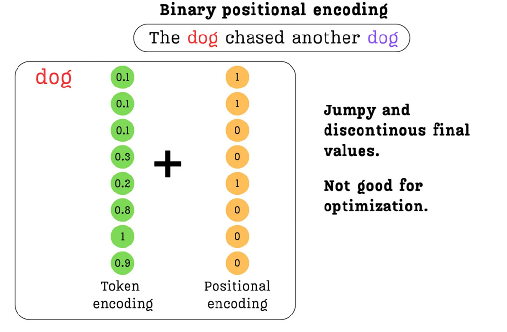

*图3.14 二进制位置编码中位的振荡频率。较低的索引（如LSB）在位置间快速振荡，而较高的索引（如MSB）缓慢振荡*

如图3.14所示，当我们观察一系列连续位置（从64到75）时，不同索引处的位如何变化出现了清晰的模式：

- **索引1（LSB）**：看最右边的列。值在每个位置翻转：0, 1, 0, 1, 0, 1...。这个位振荡非常快。
- **索引2**：下一位每两个位置翻转：0, 0, 1, 1, 0, 0...。它振荡了，但频率是LSB的一半。
- **索引3**：这位每四个位置翻转：0, 0, 0, 0, 1, 1...。它的频率更慢。
- **索引8（MSB）**：最左边的位在这个范围内完全没有变化。它振荡最慢，每128个位置才翻转一次。

这引导我们到一个深刻的观察：低索引在位置之间快速振荡，而高索引在位置之间缓慢振荡。我们可以直接将索引位置与其振荡频率之间的关系可视化。

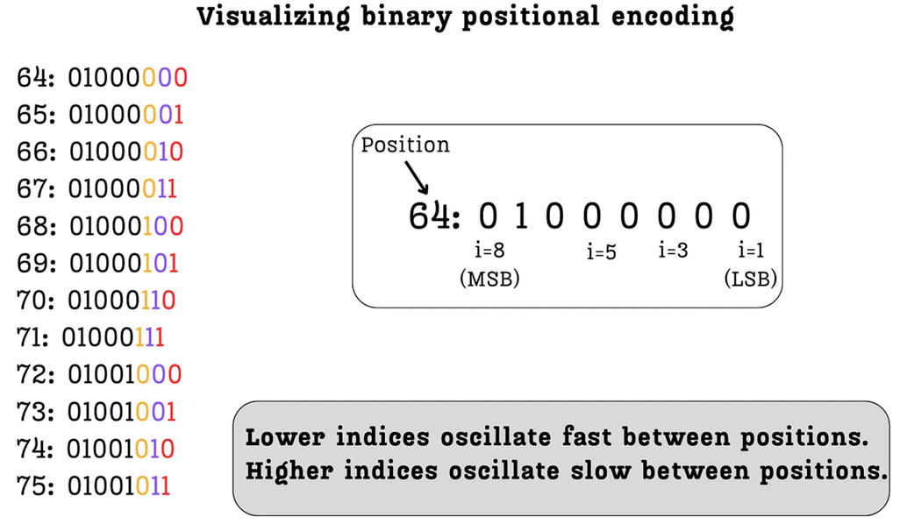

*图3.15 8位二进制表示中每个位索引的振荡频率。频率在最低索引处最高，并在较高索引处指数级降低*

当我们在更长范围的位置上绘制每个索引的值时，这个模式可以看得更清楚。

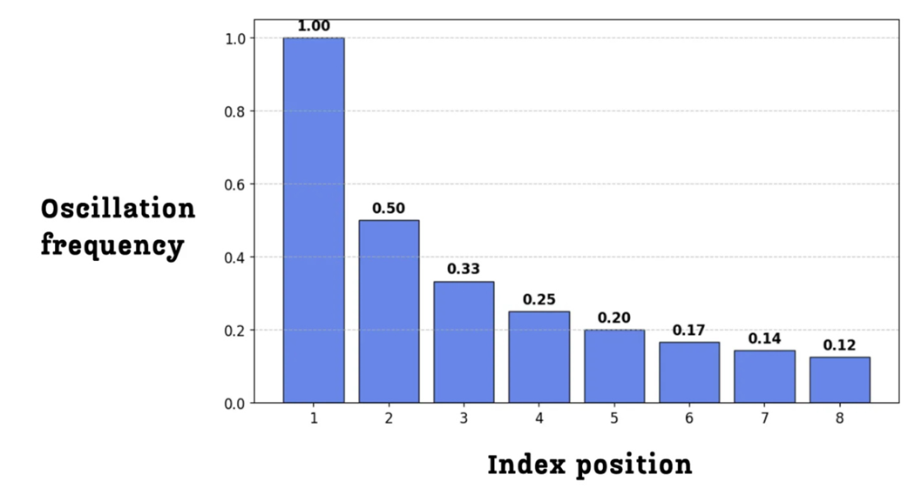

*图3.16 每个位索引在128个位置上的振荡模式。索引1（顶部）振荡非常快，而索引8（底部）振荡非常慢*

图3.16中展示的可视化极其重要。它揭示了二进制编码不仅仅给每个位置一个唯一的ID；它将位置分解为一组波或振荡信号，每个具有不同的频率。

1. **快速变化的低索引**（如索引1和2）提供细粒度信息。它们非常擅长区分相邻位置（例如位置64 vs. 65）。
2. **缓慢变化的高索引**（如索引7和8）提供粗粒度信息。它们擅长告诉模型两个远距离位置（例如5和100）相距很远，因为它们的高索引位将不同。

这个发现——我们可以使用快速和慢速振荡信号的组合来表示位置——是导致正弦位置编码以及最终旋转位置编码发展的关键直觉。然而，二进制编码仍然有一个最后的、关键的缺陷。

### 3.9.3 新问题：不连续跳变的问题

二进制位置编码已经让我们 tantalizingly 接近完美的解决方案。它为每个位置提供了一个唯一的、有界的表示，甚至将这些信息分解为一组有意义的、多频率信号。那么，问题是什么？

问题在于振荡本身的性质。再看图3.16的图。任何给定索引从0到1的转换是瞬间和突然的。这些是离散跳变，产生一系列"方波"而不是平滑曲线。

这些"跳跃的"和不连续的值对优化不好。深度学习模型，包括Transformer，使用基于梯度的优化进行训练。当涉及的函数平滑和连续时，这个过程效果最好。二进制编码中从0到1的尖锐、阶梯式变化为优化算法创建了一个"颠簸的"地形来导航。当底层位置信号如此突然时，模型很难学习位置之间的微妙关系。

理想情况下，我们想要一个系统，保持我们在二进制编码中发现的精彩多频率振荡模式，但使转换平滑。我们想要一个与图3.16具有相同属性的图，但用平滑的连续波代替尖锐的方波阶跃。这立即暗示了一个直觉：如果我们想要平滑的、振荡的波，最著名的产生它们的数学函数是什么？正弦和余弦。

正是这条推理路线，引导"Attention Is All You Need"论文的作者开发出位置编码的下一个重大创新。通过用正弦函数的平滑、连续波替换二进制编码的离散、跳跃信号，他们创造了一种在数学上优雅且在训练深度神经网络方面远更有效的方法。

## 3.10 尝试#3："Attention Is All You Need"的突破——正弦位置编码

到目前为止，我们已经看到整数编码因其大而无界的值而失败，而二进制编码虽然解决了幅度问题，但引入了不良的不连续性。这引导我们到一个关键洞察：我们需要一种能够使用二进制编码的多频率振荡模式来表示位置，但使用平滑、连续值的方法。

这正是"Attention Is All You Need"论文的作者通过引入正弦位置编码（Sinusoidal Positional Encodings）所解决的问题。这种优雅的技术使用正弦和余弦函数创建平滑、连续的波，远更适合训练深度神经网络。

### 3.10.1 从离散跳变到平滑波：引入正弦和余弦

正弦位置编码的核心思想是用介于-1到1之间的连续值替换二进制编码的跳跃0和1。这是通过一个现在著名的公式实现的，虽然乍一看令人生畏，但它建立在我们已经发现的相同原理之上。

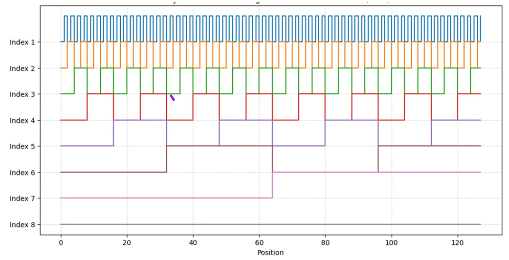

*图3.17 正弦位置编码。二进制值被替换为从正弦和余弦函数导出的连续值，然后添加到token嵌入中*

任何给定token的位置编码PE取决于两个变量，和之前一样：

- **pos**：token在序列中的绝对位置。
- **i**：嵌入向量内的维度索引。

公式分两部分定义：

- 对于偶数索引（2i），值使用sin函数计算。
- 对于奇数索引（2i + 1），值使用cos函数计算。

让我们拆解它。不要被数学吓倒。这个公式的核心就是做二进制编码所做的事情：创建一组以不同频率振荡的波。项1 / 10000^(2i / d_model)简单地就是波的频率。注意索引i在分母中。这意味着：

- 对于低索引（小i），频率高，波振荡非常快。
- 对于高索引（大i），频率低，波振荡非常慢。

这与我们用二进制编码发现的性质完全相同！正弦编码保留了使用快速变化信号获取细粒度局部信息和慢速变化信号获取粗粒度全局信息的关键直觉。

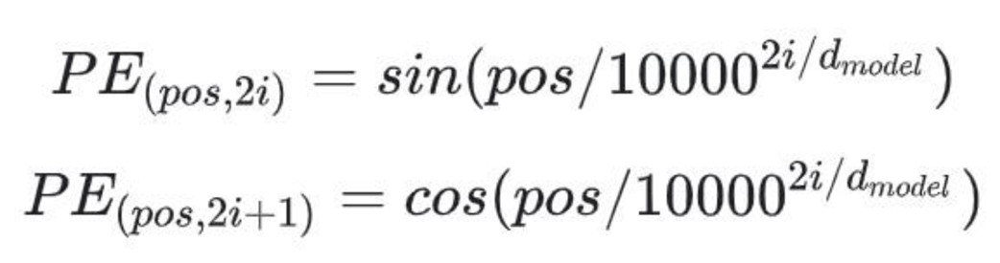

*图3.18 GPT-2大小模型的正弦位置编码可视化。图表显示了不同索引(i)在1024个位置上的编码值*

如图3.18所示，所得曲线正是我们想要的：

- **它们与二进制编码具有相同的多频率属性**：索引i=1的波比i=150的波振荡快得多。
- **它们是平滑和连续的**：跳跃的、离散的阶跃已被平滑的正弦和余弦波替代，这对训练LLM所使用的基于梯度的优化更好。

这个公式是工程上的杰作。它解决了二进制编码的不连续性问题，同时保留了其最重要的特性。然而，同时使用正弦和余弦解锁了一个更深的、更强大的性质。

### 3.10.2 旋转的力量：编码相对位置

正弦公式有效，但为什么选择将sin用于偶数索引、cos用于奇数索引的特定配对？这不是一个任意的决定。这种特定配对赋予了位置编码一个显著的性质：任何位置的编码都可以表示为任何其他位置编码的线性旋转。

这是一个关键的性质。它意味着不同位置的编码之间存在一个简单、一致的数学关系。如果模型能学习这个简单的关系，它就能比独立记忆每个位置编码更有效地推广其对位置的理解。

要理解这是如何工作的，让我们将其可视化。在正弦位置编码中，我们可以将每对维度（2i和2i+1）视为2D向量的坐标。

- 将y坐标定义为偶数索引(2i)处的值，即sin(θ)。
- 将x坐标定义为奇数索引(2i+1)处的值，即cos(θ)。

这里，角度θ由两个因素决定：token在序列中的位置和维度对的索引。公式为：

其中p表示token在输入序列中的绝对位置（或索引）。

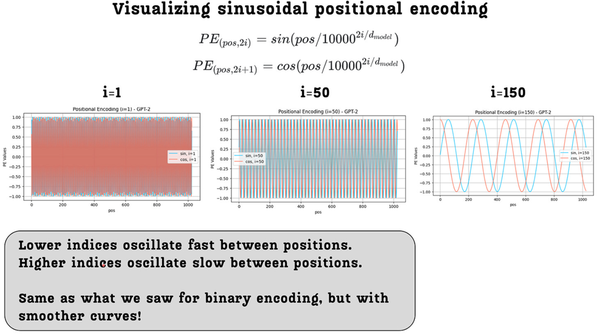

*图3.19 一对正弦位置编码值可以视为单位圆上2D向量v1的坐标，由角度θ定义*

如图3.19所示，对于给定位置p和索引对i，位置编码值在圆上形成一个向量v1。现在，这是一个谜题：我们如何使用我们已有的位置p的编码来找到距离k步的新位置p + k的位置编码？

答案异常优雅。结果表明，位置p + k的位置编码向量简单地就是位置p的原始向量旋转一个固定角度。

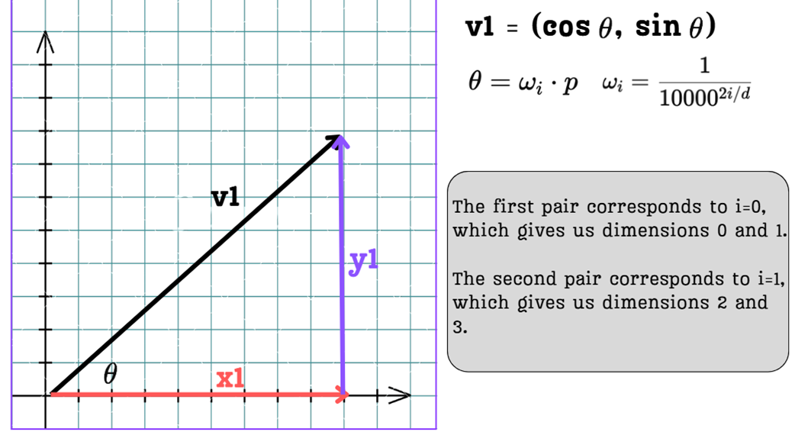

*图3.20 未来位置p + k的位置编码向量v2是位置p的原始向量v1的简单旋转*

如图3.20所示，如果我们想找到距离k步的位置的位置编码，我们只需要将原始向量v1旋转角度θ₁ = k * ωᵢ。这是三角恒等式sin(A+B)和cos(A+B)的直接结果。

这意味着相对位置关系被编码为简单的旋转。模型不需要学习复杂的、任意的模式。它可以学到，要理解位置p处的token和位置p+2处的token之间的关系，它只需要应用一个一致的"两步旋转"。

这就是使用sin和cos配对的精妙之处。

- 它提供了我们需要的平滑、多频率信号。
- 它在位置之间嵌入了一个简单的、线性的关系，使Transformer更容易学习和推广位置模式。

这种强大的技术，在原始Transformer论文中引入，成为了多年来位置编码的黄金标准。然而，它仍然有一个微妙的、挥之不去的缺陷。

### 3.10.3 剩余的缺陷：仍然在污染token嵌入

正弦位置编码是一个绝妙的解决方案。它们是连续的，它们捕获多频率位置信号，它们将相对位置编码为简单的旋转。它们似乎解决了我们所有的问题。那为什么领域又转向了RoPE这样的其他方法呢？

答案在于这些位置编码如何集成到模型中。

如果我们回顾整体架构（图3.11），我们看到位置嵌入在进入第一个Transformer块之前直接添加到token嵌入中。

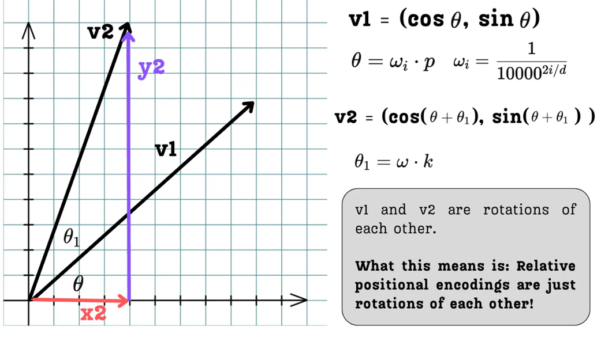

*图3.21 正弦位置编码的根本问题。位置信息直接添加到token的语义嵌入中，可能改变或"污染"其原始含义*

如图3.21所强调的，即使正弦值的幅度很小（在-1和1之间），相加的行为本身将位置信号与语义信号混合了。代表单词"dog"含义的向量在模型甚至开始处理它之前就被根本性地改变了。这就是语义污染（semantic pollution）问题，或者更正式地说，表示纠缠（representation entanglement）。

值得注意的是，虽然这是一个理论问题，但不是一个灾难性的问题。Transformer极其强大；它们深层堆叠的层可以学习分离和重新解释混合的token和位置信息。实际上，使用加性正弦编码训练的模型多年来取得了优异的性能。然而，核心洞察仍然存在：我们能否找到一种更清洁的方法，从一开始就避免这种纠缠？

理想情况下，我们希望token嵌入中的语义信息尽可能干净地保留。这引导研究者提出了一个关键问题：我们必须在最开始就注入位置信息吗？

注意力机制是模型中token之间的关系——因此它们的相对位置——真正重要的部分。一个token对另一个token的影响由它们的Query和Key向量之间的交互来量化。

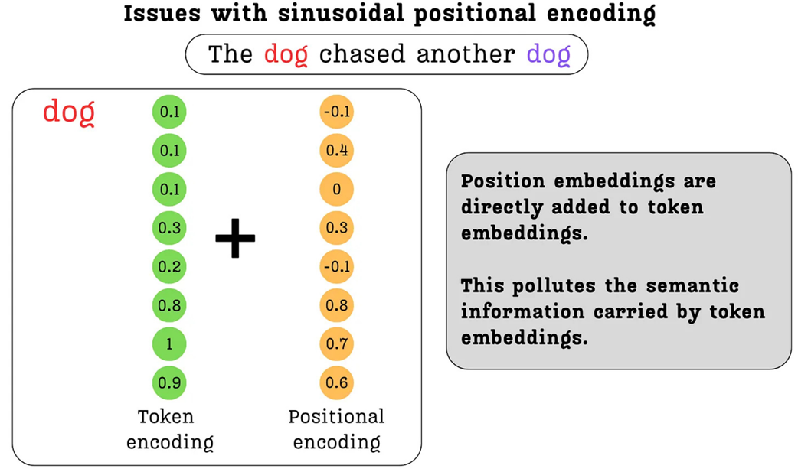

*图3.22 注意力分数计算。一个token对另一个token的影响由它们各自Query和Key向量的点积量化。这个核心交互是相对位置真正重要的地方*

图3.22中图表所揭示的洞察是我们旅程的最后一步。该图提醒我们，token之间的整个相关性度量归结为它们的Query和Key向量之间的交互。这引出了一个关键问题：如果位置关系在这里被量化，为什么我们在最开始就修改token嵌入？

这引导到一个新的、更清洁的方法：

1. **不要触碰初始token嵌入。**让它们将纯粹的语义信息带入Transformer块中。
2. **稍后注入位置信息，**直接在计算注意力分数之前注入Query和Key向量中。

但我们该如何注入这些信息？如果我们简单地将位置向量添加到Query和Key向量中，我们可能仍然改变它们的幅度并改变它们学习到的表示。这引导到最终的、优雅的想法。

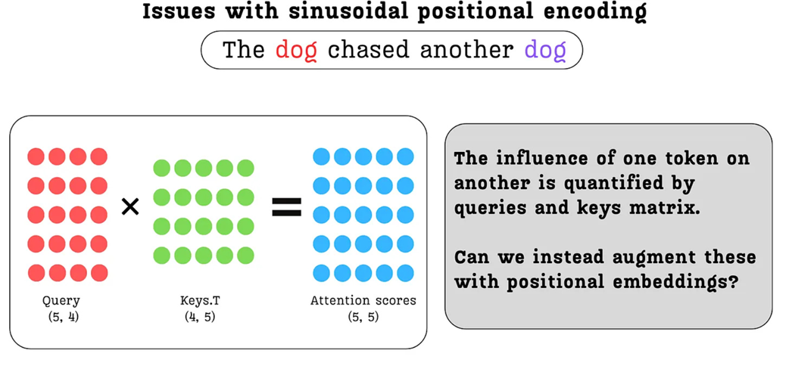

*图3.23 RoPE的核心思想。我们可以通过旋转原始向量而不是添加到它们来避免污染，并且我们可以将这种旋转直接应用于位置信息最相关的Query和Key向量*

如图3.23所示，如果我们结合我们发现的最佳想法呢？

- 如果我们将位置信息直接注入Query和Key向量中呢？
- 如果我们不是添加一个向量，而只是旋转它们，保持它们原始的幅度和学习到的语义方向呢？

这两个想法一起构成了旋转位置编码（Rotary Positional Encoding，RoPE）的基础——我们现在将详细探索的最先进技术。

## 3.11 最先进的技术：旋转位置编码（RoPE）

我们已经看到了朴素方法的缺陷和正弦编码的精妙之处，后者引入了将相对位置编码为旋转的强大概念。然而，正弦编码仍然存在一个挥之不去的问题：它们通过在Transformer块开始时直接添加到token嵌入来污染语义token嵌入。

这就是旋转位置编码（RoPE）登场的地方。RoPE采纳了正弦编码的最佳想法，并将它们精炼成一个更优雅、更有效的解决方案。它建立在两个简单但深刻的洞察之上，解决了最后剩余的问题。

### 3.11.1 核心洞察：将位置注入注意力并保持幅度

RoPE的发展始于回答两个基本问题：

**问题1：添加位置信息的最佳位置在哪里？**

注意力机制是模型中token之间的关系——因此它们的相对位置——真正重要的部分。一个token对另一个token的影响由它们的Query和Key向量之间的交互来量化。与其在最开始修改token嵌入，为什么不将位置信息直接注入Query和Key向量中——在最需要的地方？这将允许纯粹的、语义的token嵌入信息不受触碰地流入Transformer块。

**问题2：如何在不破坏向量的情况下添加这些信息？**

当我们将位置向量添加到token嵌入时，我们改变了它在向量空间中的幅度和方向。这"污染"了原始的语义表示。有没有一种方法可以修改向量以编码新信息，同时保持其原始长度，并在某种程度上保持其核心方向？答案是旋转。如果我们简单地旋转一个向量，我们改变了它的坐标，但它的幅度保持不变。

这两个想法一起构成了旋转位置编码的基础：

与其将位置向量添加到初始token嵌入中，RoPE在注意力机制内直接旋转Query和Key向量。旋转的角度由token的位置决定。

这种方法非常出色，因为它同时解决了两个问题。我们通过在过程的更后面修改Q和K向量来避免语义污染，并通过使用旋转而不是加法来保持向量学习到的幅度。在高维向量空间中，向量的方向捕获了其核心语义含义。通过仅旋转向量，我们改变它们的方向以编码位置信息，而不改变它们的长度（幅度）或根本性地扭曲它们学习到的语义方向。这确保了模型对token含义的理解保持完整，同时被增强了位置上下文。

现在，让我们看看这在实践中是如何实现的。

### 3.11.2 机制：旋转查询和键向量

现在我们有了核心想法——旋转Query和Key向量——我们需要理解这实际上是如何完成的机制。如果你理解了这个机制，你永远不会忘记RoPE，因为这是一个非常视觉化和直观的概念。这个过程可以分解为几个简单的步骤。对于这个演示，我们将聚焦于单个Query向量（完全相同的过程也适用于Key向量）。

**步骤1：将向量分组为对**

旋转操作是一个2D概念。然而，我们的Query和Key向量是高维的（例如，在我们简化示例中是4维向量）。我们如何旋转一个4D向量？

RoPE的巧妙解决方案是不把它当作一个单一的4D向量。相反，它将维度分组为对。对于这个例子，让我们假设单个注意力头的维度（d_head）为4。我们将处理该头内单个token的个别Query或Key向量。

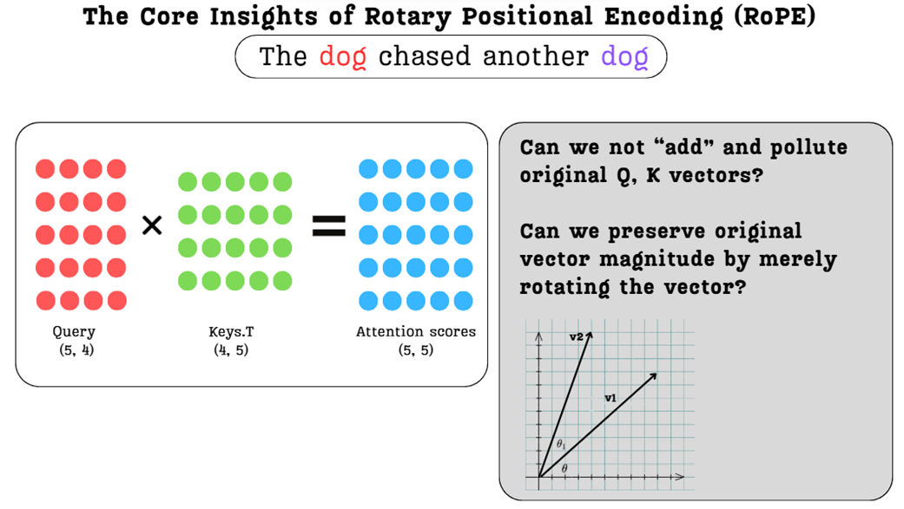

*图3.24 Query或Key向量的维度被配对用于旋转*

如图3.24所示，对于一个4维向量[x1, x2, x3, x4]，我们创建两个独立的2D组：

- **组1**：由前两个维度组成，(x1, x2)。
- **组2**：由接下来的两个维度组成，(x3, x4)。

每一对现在将被视为我们可以在平面上旋转的2D向量。这个过程在向量的整个长度上重复。如果向量是128维的，我们将有64对需要旋转。

**步骤2：以依赖位置的角度旋转每一对**

有了将维度分组为2D对后，我们现在可以应用旋转。每一对以角度θ旋转，该角度编码了token的位置。

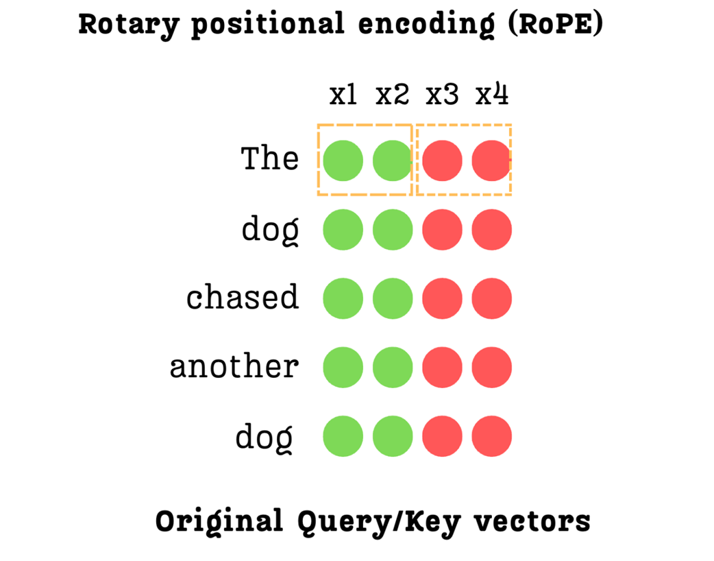

*图3.25 每一对维度被视为2D向量，并以依赖位置的角度θ旋转*

如图3.25所示，每个组的过程是相同的：

- 对(x1, x2)被视为2D向量。然后以角度θ旋转以产生坐标为(x1', x2')的新向量。
- 同时，对(x3, x4)被视为另一个2D向量。以不同的角度旋转以产生(x3', x4')。

这个旋转是RoPE的核心。它将位置信息注入到向量中。但什么决定了旋转的角度？

角度θ使用我们在正弦编码中发现的完全相同的逻辑计算。它取决于两件事：token的绝对位置（p）和该对的索引（i）。

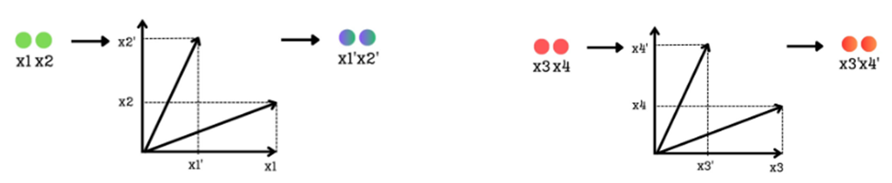

*图3.26 旋转角度θ的公式*

公式为θ = p * ωᵢ，其中ωᵢ = 1 / 10000^(2i / d)。

让我们拆解它：

- **p**：token的绝对位置（例如0, 1, 2, ...）。序列中更后面的token将具有更大的p，因此更大的基础旋转。
- **i**：我们正在旋转的对的索引。对于第一对(x1, x2)，i=0。对于第二对(x3, x4)，i=1，以此类推。
- **d**：向量的总维度（在我们的情况下为4）。

这个公式巧妙地重新实现了多频率振荡模式。

- 第一对(i=0)将以高频率旋转，随着每个新位置p显著变化。
- 第二对(i=1)将以较低的频率旋转，在位置间变化更慢。

这就是RoPE如何保持使用快速振荡捕获细粒度局部关系和慢振荡捕获粗粒度、长距离依赖的关键性质。

**步骤3：组装最终的位置编码向量**

在独立旋转每一对维度后，我们将它们重新组装形成最终的、位置编码的Query或Key向量。

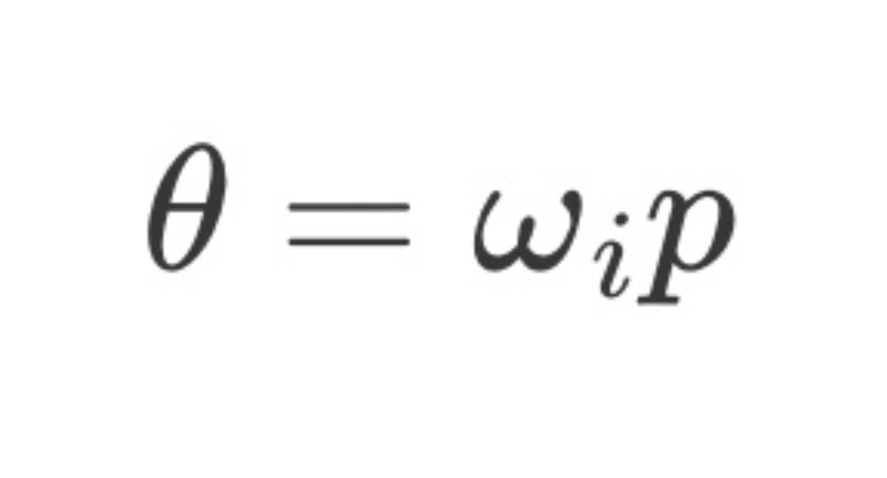

*图3.27 RoPE机制的最后一步。旋转后的2D对被重新组装以创建最终的位置编码Query或Key向量*

如图3.27所示，原始向量[x1, x2, x3, x4]被变换为新向量[x1', x2', x3', x4']。

这个新向量是信息工程的杰作。它成功地将token的位置信息直接编码到其结构中，并同时实现了以前方法无法达到的两个关键目标。

**收益1：幅度被保持**

2D旋转最重要的性质是它不改变向量的长度（幅度）。

- 向量(x1, x2)的幅度与旋转后的向量(x1', x2')相同。
- 向量(x3, x4)的幅度与旋转后的向量(x3', x4')相同。

因为我们只旋转原始向量的部分，最终向量的整体幅度被保持。这是一个巨大的优势。这意味着我们可以注入丰富的位置信息而不扭曲Query和Key向量学习到的语义表示。我们已经解决了"语义污染"问题。

**收益2：相对位置被编码**

就像正弦编码一样，旋转的使用意味着不同位置的token之间的关系可以表示为简单的线性变换。位置m的Query和位置n的Key之间的注意力分数将取决于它们的相对距离(m-n)，这被编码在它们旋转角度的差中。这允许模型以一种更自然和可推广的方式学习相对位置关系。

这就是旋转位置编码的完整几何直觉。它是一个极其优雅的解决方案，结合了我们所见到的最佳想法：

- 它将位置信息直接注入Query和Key向量，避免修改初始token嵌入的需要。
- 它使用旋转来保持原始向量的幅度。
- 它复用了正弦编码的精彩多频率公式来捕获细粒度和粗粒度位置关系。

这种强大而高效的机制已成为大多数现代高性能LLM的标准。然而，正如我们将看到的，将这种优雅的解决方案与DeepSeek同样创新的MLA架构集成提出了最后一个迷人的挑战。

## 3.12 新挑战：为什么标准RoPE和MLA不兼容

我们现在已经掌握了现代Transformer架构中两个最重要的创新：

1. **多头潜在注意力（MLA）**：KV Cache内存瓶颈的绝妙解决方案，通过缓存Key和Value的单一的、压缩的潜在表示来工作。
2. **旋转位置编码（RoPE）**：通过在注意力计算之前旋转Query和Key向量来编码位置信息的优雅解决方案。

单独来看，这些技术中的每一个都是精心设计的工程解决方案。自然的下一步是将它们结合起来，创建一个真正最先进的注意力块。

然而，当我们试图这样做时，我们遇到了根本性的不兼容。

让我们思考逻辑流程。标准RoPE实现要求我们在计算注意力之前根据其绝对位置旋转Key向量。但MLA的核心思想是计算Key的与位置无关的潜在表示，我们可以将其存储在缓存中。

冲突就在这里：

- **RoPE说**："我需要根据每个Key向量在序列中的独特位置对其进行不同的修改。"
- **MLA的缓存说**："我需要存储一个不依赖位置的简单、压缩表示，这样我才能高效地解压缩它。"

如果我们在尝试用MLA的下投影器压缩Key向量之前对其应用RoPE，压缩将会失败。下投影器将必须学会在压缩底层内容之前"反旋转"每个向量的独特位置信息，这是一项不可能完成的复杂任务。潜在缓存的美丽简洁性被打破了。

反过来，如果我们在解压缩缓存之后应用RoPE，那就太晚了。注意力计算是接下来的步骤，我们将不得不在每一步为整个历史中的每个key重新计算旋转，这将完全抵消缓存的速度收益。

这种RoPE的位置依赖性质和MLA缓存的位置无关性质之间的不兼容是我们必须解决的最后一个谜题。DeepSeek团队对这个问题的解决方案是对RoPE机制本身的一个巧妙而优雅的修改，我们将在本章后面从零构建它。

## 3.13 不兼容问题：为什么标准MLA和RoPE不能协同工作

要看清楚标准MLA和RoPE为什么不能协同工作，我们必须审视使MLA如此高效的"吸收技巧"的数学原理。

正如我们所确立的，MLA的高效性来自注意力分数公式的一个巧妙数学重排。原始公式Q * Kᵀ被变换为：

```
Attention Scores = X * (Wq * Wukᵀ) * (X * Wdkv)ᵀ
```

这个技巧之所以有效，是因为两个权重矩阵Wq和Wuk彼此相邻。它们的乘积(Wq * Wukᵀ)可以预先计算为一个单一的固定矩阵。这允许模型避免缓存完整的Key矩阵，而是只缓存更小的潜在矩阵cKV = X * Wd-kv。这种吸收只有在权重矩阵是位置无关的情况下才可能——它们的值不会基于token的位置而改变。

现在，让我们回忆RoPE是如何工作的。它通过在Query和Key向量被投影之后直接对其应用旋转函数RoPE()来注入位置信息。关键是，RoPE()函数是位置依赖的。应用于位置5的token向量的旋转与应用于位置10的token向量的旋转不同。

```
Q_rotated = RoPE(Q, position)
K_rotated = RoPE(K, position)
```

问题就在这里。如果我们尝试简单地组合这两种技术，RoPE()函数最终坐落在我们需要吸收的两个矩阵之间。注意力分数计算看起来像这样：

位置依赖的RoPE()函数充当一个屏障，阻止Wq和Wuk被相乘在一起。吸收技巧被破坏了。

这对推理效率有严重的后果。没有吸收技巧，我们将被迫在每个生成步骤为整个历史中的每个token重新计算完整的、旋转后的Key矩阵。这将完全抵消缓存的速度收益，并违背MLA的全部目的。

这种RoPE的位置依赖性质和MLA缓存的位置无关要求之间的不兼容是我们必须解决的最后一个谜题。DeepSeek团队对这个问题的解决方案是对架构本身的一个巧妙而优雅的修改，我们现在将从零构建它。

## 3.14 DeepSeek的解决方案：解耦旋转位置嵌入

为了解决MLA和RoPE之间的不兼容，DeepSeek团队设计了一个优雅的解决方案：如果位置信息正在破坏我们的吸收技巧，那就直接把它从主路径中拿出来。这就是解耦旋转位置嵌入（Decoupled Rotary Position Embedding）的核心思想。

洞察是将注意力计算分成两条并行的流：

- **内容路径（Content Path）**：这条路径负责理解token的语义含义（"是什么"）。它将使用纯粹的、标准的MLA机制，不包含任何位置信息，使吸收技巧完美工作。
- **位置路径（Position Path）**：这条路径负责理解token的相对顺序（"在哪里"）。它将使用一组新的、专门的投影，RoPE可以自由地应用于其上。

最终的注意力分数将是这两个独立路径分数的总和。这允许模型分别计算基于内容的相关性和基于位置的相关性，然后将它们组合以做出最终的、明智的决定。

### 3.14.1 新架构：视觉和数学深入探究

这种解耦方法要求我们引入一组专门用于位置路径的新权重矩阵。让我们详细了解完整的架构，逐一查看每条路径。

**A. 内容路径（无RoPE）**

这条路径几乎与我们在3.3节中构建的"纯"MLA相同。其目标是产生纯粹基于输入token语义内容的Query、Key和Value矩阵。

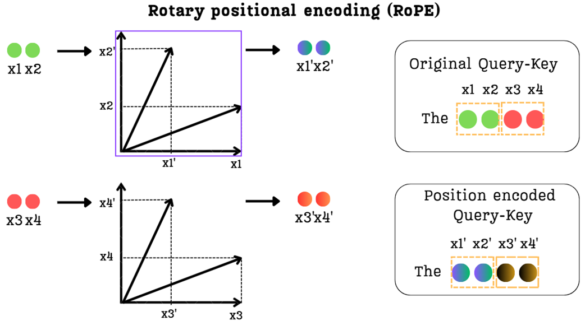

*图3.28 解耦架构的内容路径。这是一个标准MLA块，产生基于内容的Query (Qc)、Key (Kc)和Value (Vc)矩阵*

如图3.28所示，过程如下：

- 输入X被下投影以创建潜在查询cQ和潜在键值cKV。
- 然后上投影以创建最终的、完整维度的矩阵：

```
Qc = (X * Wdq) * Wuq
Kc = (X * Wdkv) * Wuk
Vc = (X * Wdkv) * Wuv
```

关键是，这条路径中没有地方应用RoPE。这意味着当我们计算基于内容的注意力分数（Qc * Kcᵀ）时，吸收技巧完全保持完好。cKV矩阵是这条路径中唯一需要缓存的内容。Vc矩阵将稍后用于计算最终的上下文向量。

**B. 位置路径（应用RoPE）**

与内容路径并行运行的是一条新的、专门用于处理位置信息的专门路径。其目标是产生编码了RoPE的Query和Key矩阵。

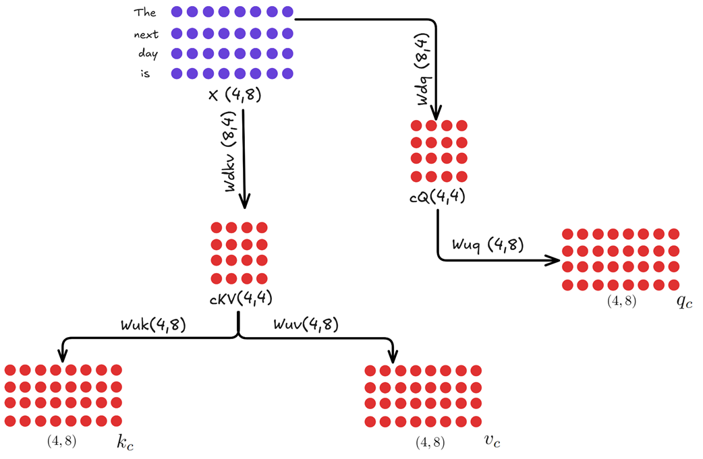

*图3.29 解耦架构的位置路径。这条新路径创建了被注入旋转位置编码的专门Query (Qr)和Key (Kr)矩阵*

1. **计算位置Key (Kr)**：

   - 输入X乘以一个新的权重矩阵Wkr。
   - 然后对结果应用RoPE。

   DeepSeek论文在这里指出了一个关键优化：这个Kr投影在所有头之间共享。得到的单头矩阵然后被重复或"乘以"以匹配完整的头数。这节省了大量的内存和计算。最终结果是Kr矩阵。

2. **计算位置Query (Qr)**：

   - Query路径稍微更复杂，镜像内容路径的下投影/上投影以节省激活内存。
   - 输入X首先使用Wdq下投影以获得与内容路径相同的潜在查询cQ。
   - 这个cQ然后乘以一个新的权重矩阵Wqr。
   - 最后，RoPE应用于此结果以产生最终的Qr矩阵。

   与Key不同，位置Query不共享。Wqr是一个完整的多头矩阵，为每个头产生唯一的位置查询。

在这条路径的末尾，我们有两个新矩阵Qr和Kr，包含丰富的相对位置信息。这条路径中唯一需要缓存的部分是共享的、旋转后的Key矩阵Kr。

位置Query矩阵Qr不需要缓存。这遵循了我们在第2章中为标准KV缓存确立的相同基本原理：在自回归生成期间，我们只需要最近的单个token的查询信息来预测下一个。由于当前token的查询向量总是需要重新计算的，缓存过去token的查询向量没有好处。

### 3.14.2 合并路径以计算最终注意力

现在我们有了两条并行路径的输出，我们可以将它们组合起来计算最终的注意力分数。完整的Query矩阵Q是内容查询Qc和位置查询Qr的拼接。完整的Key矩阵K是Kc和Kr的拼接。最终的注意力分数是这两个组合矩阵的点积。

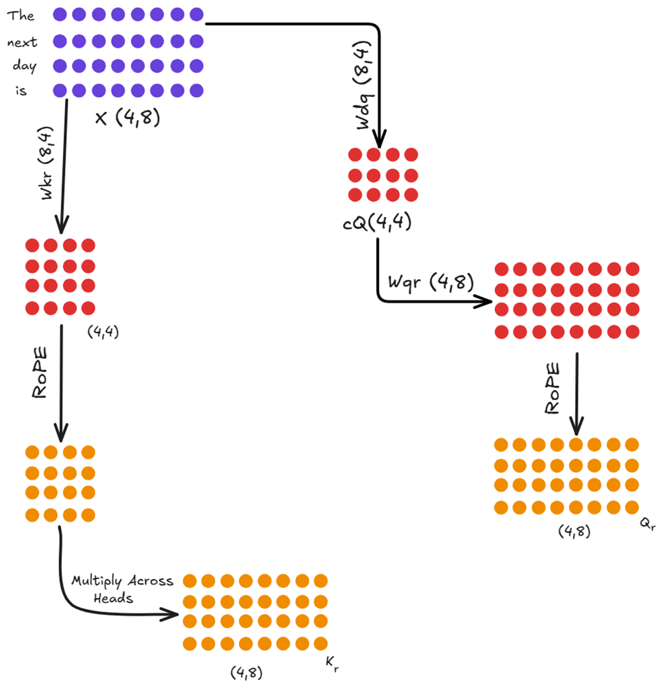

*图3.30 最终注意力分数计算。分数是基于内容的分数和基于位置的分数之和*

如图3.30中的数学恒等式所示，这等价于分别计算每条路径的注意力分数然后相加：

这是解耦设计的美妙之处。我们计算与位置无关的、缓存友好的内容分数，并将它们添加到位置依赖的、注入RoPE的分数中。最后，这些组合的分数用于创建注意力权重，然后乘以仅内容的Value矩阵以产生最终的上下文向量。

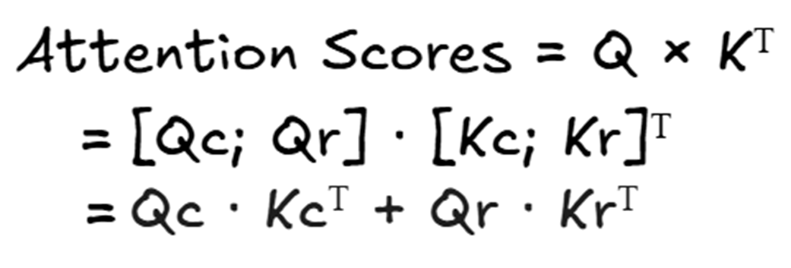

*图3.31 最后一步。组合的注意力分数被处理并乘以基于内容的Value矩阵(Vc)以产生最终输出*

这个优雅的、解耦的系统成功解决了不兼容问题。它允许吸收技巧在计算的侧重内容部分（Qc * Kcᵀ项）使用，同时仍然在一个独立的、专门的路径中整合了RoPE的全部能力。它真正实现了两全其美。

### 3.14.3 解耦的代价：内存和计算之间的权衡

解耦RoPE架构是一个绝妙的解决方案，但它并不完全是"免费"的。通过为位置信息创建独立的并行路径，我们引入了新的计算和新的权重矩阵。让我们分析这种设计的成本和权衡。

**新的计算成本**

在标准MHA甚至我们设计的"纯"MLA中，注意力分数的核心计算是单一的大型矩阵乘法：Q * K.T。

在解耦架构中，我们现在执行两个单独的矩阵乘法并将它们相加：

1. Qc @ Kc.T（内容分数）
2. Qr @ Kr.T（位置分数）

此外，我们添加了新的投影步骤来首先生成Qr和Kr。这意味着对于每个token，模型执行比简单架构更多的浮点运算（FLOPs）。这是一个刻意的权衡：我们接受计算成本略有增加，以获得内存成本的大幅减少。

**为什么这是一个好的权衡？**

在现代大规模LLM中，长上下文推理期间的主要瓶颈几乎总是内存带宽，而不是原始计算。将巨大的KV缓存从GPU的高带宽内存（HBM）加载到快得多的片上SRAM进行计算的过程是整个过程中最慢的部分。

- **标准MHA**：计算更少，但严重受限于读取其巨大400 GB KV缓存所需的时间。
- **解耦MLA+RoPE**：计算略多，但总体上更快，因为它只需要读取一个微小的约7 GB缓存。

通过避免内存瓶颈所节省的时间远超过额外矩阵乘法所花费的额外时间。DeepSeek做出了一个经过计算的工程决策，用他们充裕的资源（计算）来换取一个严重稀缺的资源（内存带宽）。

**新的参数成本**

解耦路径还引入了新的可学习权重矩阵：Wqr和Wkr。这意味着模型的总参数量略有增加。然而，与每个Transformer块中庞大的前馈网络相比，这些矩阵相对较小。模型整体大小的增加微乎其微，但这是一个需要考虑的因素。

总而言之，解耦架构不是魔法——它是一件精湛的工程，做出了非常有利的权衡。它策略性地少量增加计算量和参数数量，以解决更大的、更关键的内存带宽问题，最终带来一个更快、更高效的模型。

### 3.14.4 新推理循环的实际运行：当新token到达时会发生什么

现在我们理解了完整的解耦架构，让我们跟踪单个新token的完整的、端到端的旅程。这将巩固我们对MLA和RoPE如何在高效的、自回归循环中协同工作的理解。

想象我们的模型已经处理了序列"The next day is"并刚刚生成了token "bright"。这个推理步骤的输入只是"bright"的嵌入，我们称之为X_bright。我们的目标是使用这个单一的新token来预测下一个。

过程在两条并行路径——内容路径和位置路径——中进行，然后合并。

**内容路径：利用吸收技巧**

这条路径负责计算基于内容的注意力分数。它使用纯MLA机制，由于吸收技巧和潜在KV缓存，效率极高。

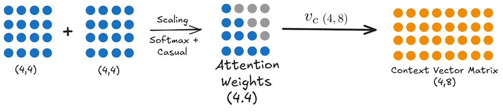

*图3.32 基于内容的注意力分数的计算流程*

如图3.32所示，最终的注意力分数qc * kcᵀ是从一系列矩阵乘法中计算出来的。让我们分解它如何为我们的新token "bright"工作。

我们需要的第一件事是我们新token的查询。由于吸收技巧，我们不只是计算一个标准查询。相反，我们计算一个已经包含Key上投影矩阵的"吸收查询"。

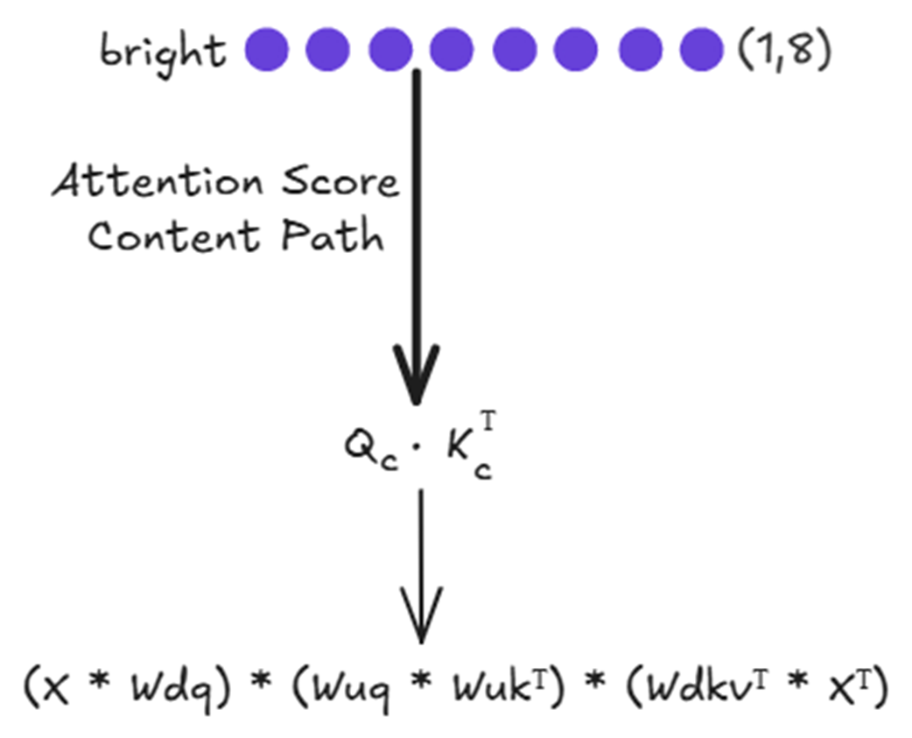

*图3.33 这单次乘法给了我们内容分数所需的查询部分*

接下来，我们需要更新我们的历史上下文。我们获取新token的输入嵌入X_bright并计算其压缩表示。


*图3.34 更新潜在KV缓存。新token的嵌入被下投影以创建新的潜在向量，然后追加到现有缓存中*

如图3.34所示：

1. X_bright（形状1, 8）乘以下投影器Wdkv（形状8, 4）。
2. 这产生"bright"的新潜在向量（形状1, 4）。
3. 这个新向量被追加到现有的潜在KV缓存（之前形状为4, 4），产生形状为(5, 4)的更新KV缓存。

这个更新的缓存是整个内容路径中唯一需要的历史信息。现在我们可以计算内容分数。我们将"吸收内容查询"乘以更新KV缓存的转置。这给了我们token "bright"的最终的基于内容的注意力分数。

**位置路径：注入旋转信息**

与内容路径并行运行的是专门用于处理位置信息的路径。其目标是使用RoPE计算基于位置的注意力分数。

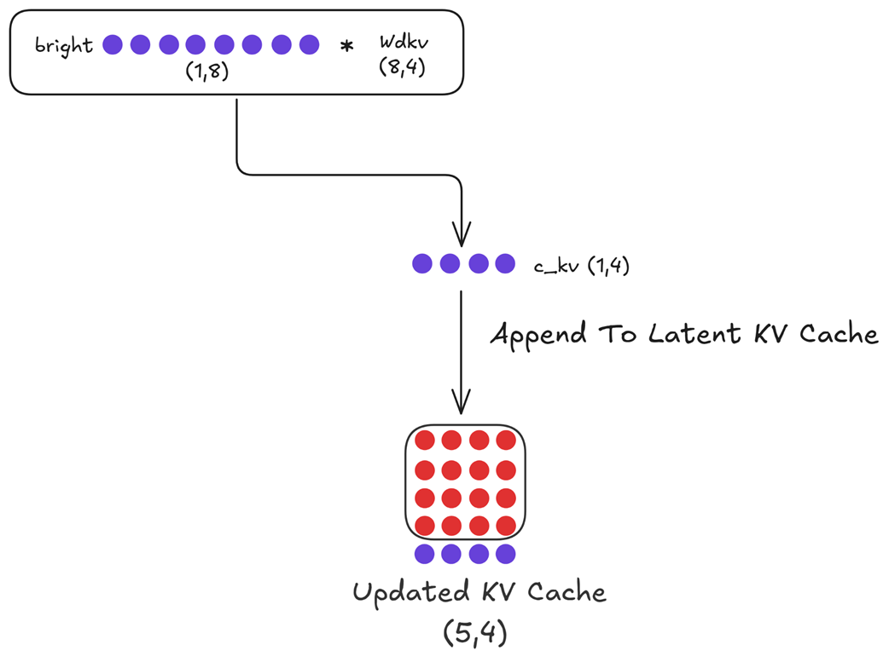

*图3.35 基于位置的注意力分数的计算流程*

如图3.35所示，最终的位置分数qr * krᵀ也是一系列变换的结果。你可能还记得，RoPE的位置依赖性质是我们最初尝试将其与MLA组合时破坏吸收技巧的原因。那为什么这里不是问题呢？

答案在于解耦设计。位置路径独立并行运行，不依赖内容路径的cKV潜在缓存。由于这条专门的路径中没有"吸收技巧"可以破坏，我们可以自由地根据需要应用RoPE来为Qr和Kr向量注入位置信息。

让我们分解它如何为我们的新token "bright"工作——"bright"位于位置4（假设从0开始索引）。

首先，我们需要创建将被编码位置信息的查询向量。这涉及下投影和上投影，就像内容查询一样，以节省激活内存。

接下来，我们需要位置路径的Key矩阵。这涉及为"bright"计算新key并将其追加到之前token的缓存key中。有了新鲜的Qr和更新的Kr缓存，我们现在可以通过取它们的点积来计算最终的位置注意力分数：Qr * Kr_cacheᵀ。

## 3.15 量化收益：最终缓存内存比较

融合的MLA-RoPE架构的多步骤、解耦过程是工程上的杰作。但它在实践中实现了什么？让我们量化我们着手实现的两个主要收益：缓存大小的大幅减少和模型表达性能的保持。

在上一章中，我们确立了MHA、MQA和GQA内存成本的公式。现在，我们可以为我们带有解耦RoPE的高级MLA定义最终公式。

关键的洞察是，在每一步，我们只需要在内存中存储两件事：

- **潜在KV缓存**：存储所有过去token的压缩内容信息。其每个token的维度为d_latent。
- **解耦Key缓存**：存储所有过去token的旋转位置信息。其每个token的维度为d_rope。

因此，缓存大小的新公式为：

让我们拆解它：

- l（层）、b（批量大小）、s（序列长度）和2（每个参数的字节数）与之前相同。
- (d_latent + d_rope)项替换了GQA的g * h或MHA的n * h。
- 之前用于说明存储两个独立矩阵（一个用于Key，一个用于Value）的* 2因子消失了。在这个新架构中，我们缓存的是专门的、组合的表示（d_latent用于内容，d_rope用于位置Key），而不是独立的K和V矩阵。

让我们为DeepSeek-V2规模的模型代入数字，其中n=128，h=128：

- MHA缓存维度：2 * 128 * 128 = 32,768
- MLA+RoPE缓存维度：在DeepSeek论文中，d_latent为4 * h = 512，d_rope为h / 2 = 64。总计为512 + 64 = 576。

缓存数据大小的最终减少为：32,768 / 576 ≈ 57倍。

这是一个令人难以置信的结果。通过解耦内容和位置并使用压缩的潜在缓存，MLA+RoPE架构将KV缓存的内存占用减少了相比标准MHA近两个数量级。我们计算的理论400 GB缓存崩溃到更易管理的约7 GB。

## 3.16 从零构建MLA + 解耦RoPE

我们现在已经涵盖了多头潜在注意力和解耦旋转位置嵌入的所有理论和数学基础。最后一步是将这些知识转化为一个功能性的PyTorch模块。本章的完整、可执行代码可以在本书的官方GitHub仓库中找到。我们强烈建议在阅读时打开代码以便跟随实现：

https://github.com/Vizuar aAI/DeepSeek-From-Scratch/tree/main/ch03

我们的实现将构建DeepSeekAttention模块，它包含整个解耦架构。在我们编写代码之前，让我们先看看图3.36中模块前向传播的完整视觉蓝图。

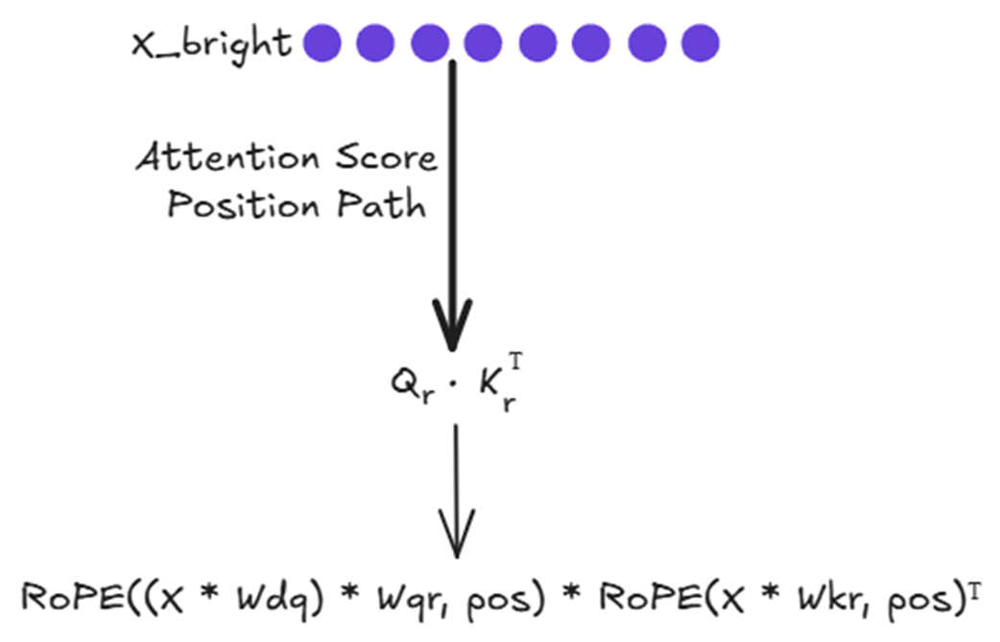

*图3.36 DeepSeekAttention模块的详细流程图。输入张量x通过两条并行流处理：蓝色内容路径使用纯MLA实现缓存效率，紫色位置路径应用RoPE。两个缓存张量c_kv和k_r用钥匙图标高亮显示。输出被组合以产生最终的上下文向量*

这个图是我们即将构建的代码的直接映射。它清晰地显示了两条并行路径：

1. **路径A：内容路径**：这条流负责理解token的语义内容。它使用纯MLA架构，创建压缩的潜在张量c_kv——这是我们唯一需要缓存的内容值。它还产生基于内容的Query (q_c)、Key (k_c)和Value (v_c)矩阵。
2. **路径B：位置路径**：这条流专门用于理解token的相对位置。它创建专门的Key (k_r_unrotated)和Query (q_r_unrotated)向量，然后由RoPE模块注入位置信息。得到的旋转Key k_r是我们缓存的第二个值。

这两条路径的注意力分数被加在一起。得到的注意力权重然后应用于仅内容的Value (v_c)以产生最终的上下文向量。

将像这样复杂的架构分解为更小的、可管理的部分是一项关键的工程技能。我们将遵循这一原则，分阶段构建我们的DeepSeekAttention模块，从自包含的RoPE辅助类开始。

**第1部分：RotaryPositionalEncoding辅助类**

在我们构建主要注意力模块之前，我们需要一种方法来实现RoPE。它是一个自包含的概念，使其成为我们第一个代码片段的完美候选。我们将完整展示RotaryPositionalEncoding类，因为它是一个单一的、内聚的单元。

```python
import torch
import torch.nn as nn

class RotaryPositionalEncoding(nn.Module):
    def __init__(self, d_head, max_seq_len=2048):
        super().__init__()
        theta = 1.0 / (10000 ** (
            torch.arange(0, d_head, 2).float()
            / d_head))  #A
        self.register_buffer('theta', theta)

        positions = torch.arange(max_seq_len).unsqueeze(1)
        freqs = positions * self.theta.unsqueeze(0)
        self.register_buffer('freqs_cis',
            torch.polar(torch.ones_like(freqs),
            freqs))  #B

    def forward(self, x):
        seq_len = x.shape[2]
        x_complex = x.float().reshape(*x.shape[:-1], -1, 2)
        x_complex = torch.view_as_complex(x_complex)  #C
        freqs_cis = self.freqs_cis[:seq_len, :].unsqueeze(0).unsqueeze(0)
        x_rotated = x_complex * freqs_cis  #D
        x_rotated = torch.view_as_real(x_rotated)
        x_rotated = x_rotated.flatten(3)
        return x_rotated.type_as(x)
```

**步骤2：初始化主要注意力类**

有了我们的RotaryPositionalEncoding模块，我们就可以定义主要的DeepSeekAttention类。__init__方法负责创建所有可学习权重矩阵（nn.Linear层）并实例化我们的RoPE辅助模块。

注意代码中权重矩阵如何被分成两个不同的部分，映射我们的解耦架构。一组用于内容路径，使用标准MLA投影。另一组用于位置路径，创建将通过RoPE注入位置信息的专门Query和Key向量。

```python
class DeepSeekAttention(nn.Module):
    def __init__(self, d_model, num_heads, d_latent, d_rope, dropout=0.0):
        super().__init__()
        # ... (asserts and initializations) ...
        self.d_rope = d_rope

        # --- Content Path (Pure MLA) ---
        self.W_q_content = nn.Linear(d_model, d_model)
        self.W_dkv_content = nn.Linear(d_model, d_latent)  #A
        self.W_uk_content = nn.Linear(d_latent, d_model)
        self.W_uv_content = nn.Linear(d_latent, d_model)

        # --- Position Path (RoPE Applied) ---
        self.W_k_pos = nn.Linear(d_model, d_rope * num_heads)  #B
        self.W_q_pos = nn.Linear(d_model, d_rope * num_heads)
        self.rope = RotaryPositionalEncoding(d_rope)  #C

        # --- Final Output Projection ---
        self.W_o = nn.Linear(d_model, d_model)
        # ... (dropout and mask) ...
```

**步骤3：前向传播——组合内容和位置**

forward方法处理整个解耦的注意力计算。它接收输入张量x并将其同时通过内容和位置路径以计算两个独立的注意力分数矩阵。然后将它们相加以形成最终分数，用于生成上下文向量。

这个实现是我们推导的架构的直接转换。它使缓存友好的"吸收技巧"在内容路径中保持可用，同时在独立的并行流中干净地整合了位置依赖的旋转。

```python
    def forward(self, x):
        batch_size, seq_len, _ = x.shape

        # --- Content Path Calculation ---
        q_c = self.W_q_content(x).view(
            batch_size, seq_len, self.num_heads, self.d_head
        ).transpose(1, 2)

        c_kv = self.W_dkv_content(x)
        k_c = self.W_uk_content(c_kv).view(
            batch_size, seq_len, self.num_heads, self.d_head
        ).transpose(1, 2)
        v_c = self.W_uv_content(c_kv).view(
            batch_size, seq_len, self.num_heads, self.d_head
        ).transpose(1, 2)

        # --- Position Path Calculation ---
        q_r_unrotated = self.W_q_pos(x).view(
            batch_size, seq_len, self.num_heads, self.d_rope
        ).transpose(1, 2)
        k_r_unrotated = self.W_k_pos(x).view(
            batch_size, seq_len, self.num_heads, self.d_rope
        ).transpose(1, 2)

        q_r = self.rope(q_r_unrotated) #A
        k_r = self.rope(k_r_unrotated)

        # --- Combining Paths for Final Attention Score ---
        content_scores = (q_c @ k_c.transpose(-2, -1)) / \
            (self.d_head ** 0.5)
        position_scores = (q_r @ k_r.transpose(-2, -1)) / \
            (self.d_rope ** 0.5)
        attn_scores = content_scores + position_scores  #B

        # --- Final Steps (Masking, Softmax, Output) ---
        attn_scores = attn_scores.masked_fill(
            self.mask[:, :, :seq_len, :seq_len], float('-inf'))
        attn_weights = torch.softmax(attn_scores, dim=-1)
        attn_weights = self.dropout(attn_weights)

        context_vector = (attn_weights @ v_c).transpose(1, 2) \
            .contiguous().view(batch_size, seq_len, self.d_model)
        output = self.W_o(context_vector)
        return output
```

有了这最后一段代码，我们已经构建了DeepSeekAttention模块的完整的、从零开始的实现。这个单一类封装了一系列先进技术：

- 使用多头潜在注意力的内存高效内容路径。
- 处理相对位置的独立、专门的位置路径。
- 在最有效处干净整合旋转位置编码。
- 通过简单加法实现的这两条路径的解耦融合。

该架构巧妙地解决了MLA位置无关缓存和RoPE位置依赖性质之间的固有冲突。通过用计算成本的轻微增加换取内存带宽需求的大幅减少，这种设计实现了两全其美，实现了高效且强大的长上下文推理。

## 3.17 验证：实证的面对面比较

在探索了多头潜在注意力及其与解耦RoPE融合的理论基础后，是时候把我们的知识付诸测试了。理论是一回事，但实证结果提供最终裁决。MLA的核心承诺是打破MHA高性能和其更精简的表亲MQA和GQA内存效率之间的痛苦权衡。它真的实现了两全其美吗？

为了回答这个问题，我们通过从零构建和训练四个模型进行了面对面比较。每个模型使用不同的注意力机制，但所有其他超参数——从模型大小和数据集到训练迭代次数——都保持恒定，以确保公平和直接的比较。这个实验将使我们能够超越理论，量化DeepSeek架构创新的现实世界影响。

用于运行此实验并生成以下结果的代码可在本书的GitHub仓库中探索和复制。

额外代码链接：
https://github.com/Vizuar aAI/DeepSeek-From-Scratch/tree/main/ch03/02-bonus-code

为了正确评估权衡，我们将训练和基准测试四种不同的注意力架构：

1. **多头注意力（MHA）**：我们最大性能的基线。每个头有自己的唯一Query、Key和Value投影，以大的KV缓存为代价提供最高的表达能力。
2. **多查询注意力（MQA）**：第一个聚焦效率的变体。所有头共享单一的Key和Value投影，大幅减少KV缓存大小但可能限制模型的学习能力。
3. **分组查询注意力（GQA）**：MHA和MQA之间的折中。查询头被分成组，每组共享一个公共的Key和Value投影。这在性能和效率上提供了中间地带。
4. **多头潜在注意力（MLA）**：DeepSeek的创新。正如我们所见，它使用压缩的潜在缓存和解耦RoPE，旨在实现MHA的性能，同时内存占用更接近MQA/GQA。

在开始训练过程之前，确认我们的模型大小是可比的至关重要。可学习参数总数的显著差异将导致不公平的比较。下表显示了四种模型变体各自的参数计数，证明它们都在非常相似的范围内。

**表3.1 模型变体的参数**

| 注意力类型 | 总参数 |
|-----------|--------|
| 多头注意力（MHA） | 17,653,248 |
| 分组查询注意力（GQA） | 16,965,120 |
| 多查询注意力（MQA） | 17,260,032 |
| 多头潜在注意力（MLA） | 17,391,104 |

所有四种架构的可学习参数总数几乎相同，确保了其性能和效率的公平比较。微小的差异源于每种注意力机制所需的独特投影矩阵。

我们的首要目标是回答最关键的问题：MLA节省内存的设计是否损害了其学习性能？更低的验证损失表示对未见数据的更好泛化，这是我们衡量模型有效性的主要指标。

图3.37的图表追踪了所有四个模型在5,000次训练迭代中的验证损失。

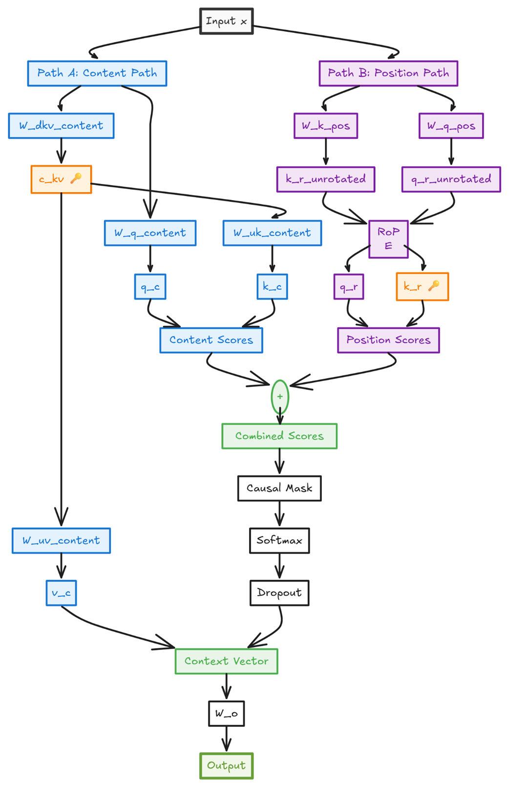

*图3.37 四种注意力机制的验证损失曲线比较。MHA和MLA模型达到持续更低的最终损失，表明学习效果更优。两个模型都训练了5,000次迭代*

学习曲线揭示了一个有趣的发现。虽然所有四个模型都成功学会了处理TinyStories数据集，但它们的性能出现了分化。MHA和MLA曲线紧密跟随，达到最低的验证损失并展示了最强的学习能力。MQA如预期的那样由于其减少的表达能力而略微落后，GQA占据中间地带。这个图表提供了我们第一份有力的证据：MLA架构没有牺牲性能。它学习得与完整的、资源密集的MHA模型一样有效，成功保持了拥有唯一的、多头投影的表达能力。

**表3.2 注意力类型比较**

| 注意力类型 | 最佳验证损失 | KV缓存内存大小(MB) | 最佳验证困惑度 |
|-----------|-------------|-------------------|--------------|
| MHA | 2.3721 | 48.00 | 10.72 |
| MQA | 2.4080 | 6.00 | 11.11 |
| GQA | 2.3776 | 24.00 | 10.78 |
| MLA | 2.3089 | 12.00 | 10.06 |

表3.2中的结果是确凿的。虽然验证困惑度证实了我们在学习曲线中看到的现象——MLA实现了最佳性能(10.06)，紧随其后的是MHA(10.72)——但KV缓存列揭示了故事的另一半。MLA与MHA相比大幅减少了内存占用4倍(12.00 MB vs. 48.00 MB)，验证了潜在缓存架构的核心动机。

这个面对面实验提供了清晰的裁决。通过解耦内容和位置路径并利用压缩的潜在缓存，DeepSeek架构成功打破了性能-内存的权衡。结果是一个不仅强大而且显著高效的注意力机制，为我们旨在构建的可扩展和智能模型提供了坚实的基础。我们将在第4章转向Transformer层的另一个关键组件。我们将探索混合专家（Mixture-of-Experts，MoE）如何替代标准前馈网络以解锁高效扩展的另一个维度，我们也将看到DeepSeek的创新。

## 3.18 总结

- **多头潜在注意力（MLA）**通过缓存Key和Value的压缩潜在表示打破了性能-内存的权衡，该表示在注意力计算期间被即时解压缩以重建每个头的唯一的、完整大小的矩阵。
- 通过将位置信息添加到初始token嵌入来应用位置信息会在注意力机制处理之前污染它们的语义含义。
- **旋转位置编码（RoPE）**通过在注意力块内直接旋转Query和Key向量来解决这个问题，在过程的更后面注入位置信息并保持向量原始学习到的幅度。
- MLA的高效依赖于需要位置无关权重的数学"吸收技巧"，这与标准RoPE的位置依赖变换根本不兼容。
- **解耦RoPE架构**通过将注意力分离为两条并行流来解决这个冲突：使用缓存高效MLA的内容路径，以及处理RoPE的位置路径。最终的注意力分数是两条路径输出的总和。
