# 第4章 DeepSeek中的混合专家：高效扩展智能

本章涵盖

- Mixture of Experts (MoE) 以及稀疏性如何实现高效扩展
- MoE 层的动手数学推导详解
- DeepSeek 针对 load balancing 的高级解决方案

Mixture of Experts (MoE) 的思想并不新鲜；它的根源可以追溯到 1991 年一篇关于自适应专家系统的开创性论文。然而，它在大规模语言模型中的应用是更近的发展，DeepSeek 将其推向了显著的极限。

虽然 Mistral 的 Mixtral 等其他模型将 MoE 引入了 LLM 的主流，DeepSeek 在此基础上构建，引入了自己的新颖技巧和技术。

现在让我们打开这个机制的黑箱。如图 4.1 所示，我们的路线图将涵盖：

1. MoE 背后的核心直觉以及稀疏性 (sparsity) 的概念。
2. MoE 机制实现的详细、数学的、动手的演示。
3. 探索 "load balancing" 这一关键挑战及其标准解决方案。
4. 深入探讨 DeepSeek 在其 MoE 架构中引入的具体创新，从 Shared Expert 到其 auxiliary-loss-free balancing。
5. 最后，我们将把所有内容整合在一起，从零开始编写一个完整、功能齐全的 MoE 语言模型。

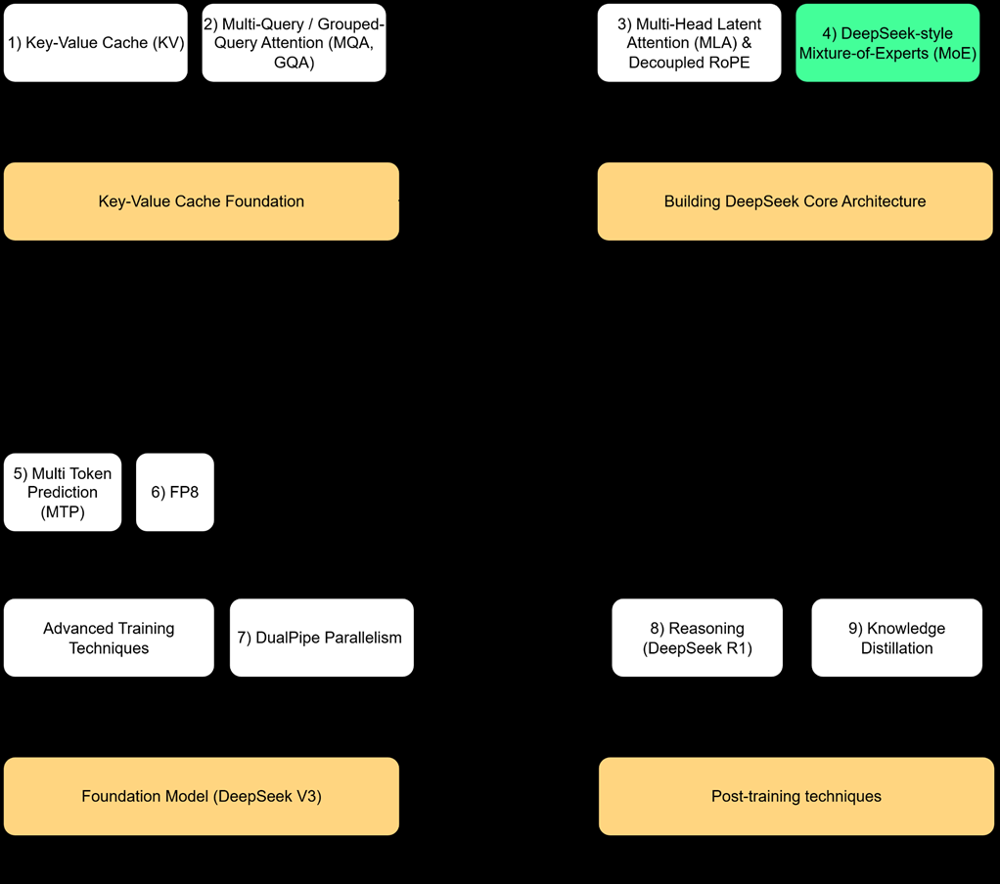

*图4.1 我们构建 DeepSeek 模型的四阶段旅程。本章聚焦于高亮组件——DeepSeek 风格的 Mixture-of-Experts (MoE)，核心架构中的第二项重大创新。*

让我们从理解 MoE 如何融入 Transformer 架构以及使其如此强大的核心思想开始。

## 4.1 混合专家背后的直觉

要理解 Mixture of Experts，我们必须首先审视它在标准 Transformer 块中替代的组件：Feed-Forward Network (FFN)。FFN 充当每个 Transformer 层中的主要处理单元，这是一个密集的神经网络，占据了模型参数和计算工作量的绝大部分。这一变化标志着设计上的一场真正革命。我们不再依赖一个庞大的、通用的神经网络，而是用多个较小的、专门的神经网络来替代它，每个网络都是一个名副其实的 "expert"，MoE 允许模型在不按比例增加计算成本的情况下，变得更大、更有知识。

### 4.1.1 Transformer 中密集 FFN 的问题：高参数量和计算成本

正如我们所知，在 multi-head attention 层和 layer norm 之后，得到的上下文向量由 Feed-Forward Network (FFN) 处理，其架构如图 4.2 所示。FFN 由一个两层神经网络组成，实现了 "expansion-contraction" 序列。如图 4.2 所示，第一个线性层将嵌入维度扩展（例如，乘以 4 倍），而第二个线性层将其收缩回原始大小。这种设计对模型的性能至关重要，因为扩展的中间层为模型提供了一个更丰富、更高维的空间，在输出传递到下一个块之前捕获复杂的模式。

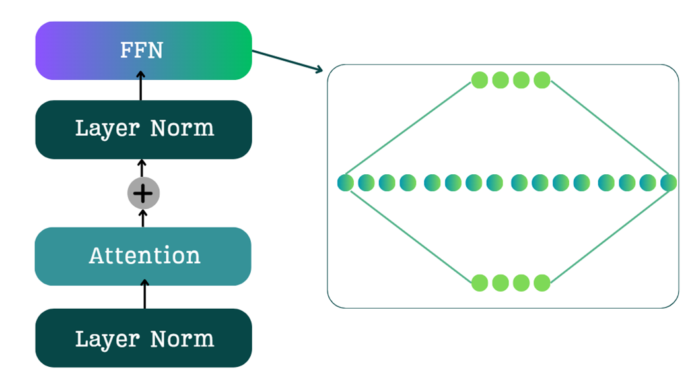

*图4.2 Transformer 块中标准的 Feed-Forward Network (FFN)，采用 expansion-contraction 架构。*

然而，这个 FFN 是密集的。这意味着对于每个输入 token，FFN 中的所有数百万参数都会被激活并参与计算。这带来两个主要后果：

1. **高训练成本**：所有 Transformer 块中 FFN 的大量参数占据了模型总训练时间的很大一部分。
2. **高推理成本**：类似地，在推理期间，这些密集计算显著增加了生成每个新 token 的延迟。

### 4.1.2 稀疏性解决方案：每个 token 只激活一部分 expert

Mixture of Experts 的核心思想是用多个较小的 FFN 集合替代单个大型密集 FFN，我们称这些 FFN 为 "expert"。传统 FFN 是一个单一的密集网络。在 MoE 架构中，这个单一块被一组并行的专家网络替代，如图 4.3 所示。

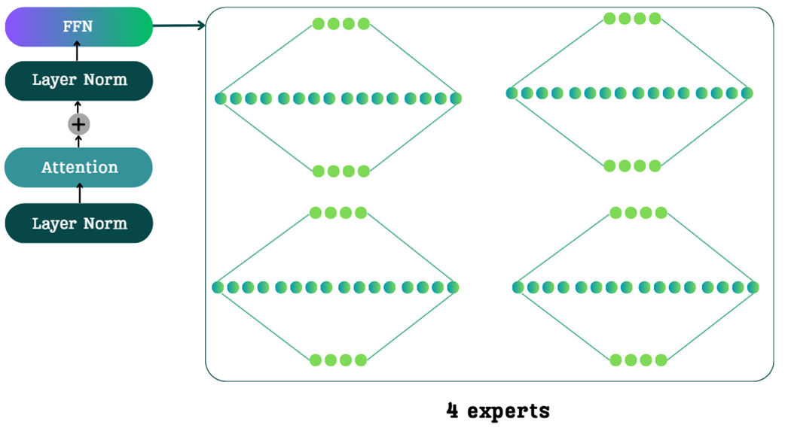

*图4.3 MoE 的架构变更。单一、密集的 FFN 被四个较小的、专门的专家网络集合替代。*

你可能认为用一个网络替换为四个会使计算成本增加四倍，但这正是 MoE 的魔力所在，其驱动力来自一个概念：稀疏性 (sparsity)。

**稀疏性 (Sparsity)**：在 MoE 模型中，对于任何给定的输入 token，只有全部 expert 的一小部分被激活。其余的保持休眠或非活跃状态。

例如，在图 4.3 所示的 4-expert 模型中，一个 token 可能只被路由到其中的一两个 expert。其他 expert 不会用于该特定 token，这意味着它们的参数不会被加载，它们的计算也不会被执行。

这就是 MoE 惊人效率的源泉。我们获得了拥有大量总参数（所有 expert 的总和）的好处，但任何单个 token 的计算成本非常低，因为我们只激活其中的一小部分。这使我们能够构建知识更丰富的模型（更多总参数），而不会按比例增加训练或推理的成本。

### 4.1.3 专家专业化：稀疏性背后的 "为什么"

稀疏性——每个 token 只激活少数 expert 的概念——是 MoE 高效的原因。但为什么这样做有效？为什么我们可以忽略大多数 expert？答案在于 expert 专业化 (expert specialization)。

在大规模预训练过程中，每个 expert 网络学会高度专业化地处理特定类型的信息或执行特定任务。我们不再拥有一个必须知道如何做一切的巨大通用 FFN，而是拥有一个专家委员会。

这种专业化在 2022 年的论文 "ST-MoE: Designing Stable and Transferable Sparse Expert Models" (https://arxiv.org/pdf/2202.08906) 中得到了定量证明，该论文分析了训练模型中不同 expert 学会了做什么。结果令人着迷，为 MoE 模型的思维提供了清晰的窗口。

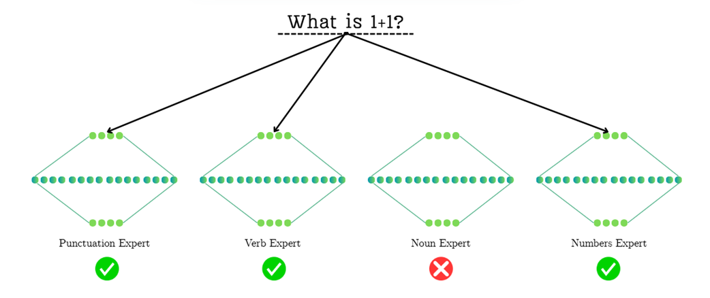

*图4.4 Mixture-of-Experts 模型中 expert 路由的示例。对于输入 "What is 1+1?"，router 必须决定激活哪些专门的 expert。路由机制可能会优先考虑语法成分（如问号和动词 "is"），突出路由如何是基于学习模式的细微决策。*

为了使这一点具体化，让我们追踪模型可能如何处理简单问题 "What is 1+1?"，如图 4.4 所示。路由网络必须查看输入的 token 并从其可用的委员会中选择最合适的专家：

- **标点专家 (Punctuation Experts)**：Router 首先遇到问号 (?)。已经学会识别标点符号，它激活了标点专家。这个 expert 高度专业化于理解标点符号的作用以及它们如何影响序列的含义和结构。
- **动词专家 (Verb Experts)**：该 token 是一个常见动词。Router 识别到这一点，将该 token 发送给动词专家。这个专家学会了与动作和状态相关的语法和语义模式，最适合处理输入的这一部分。
- **休眠专家 (Dormant Experts)（例如名词专家）**：注意名词专家没有被激活。由于查询不包含重要的名词，Router 智能地通过让该 expert 保持休眠来节省计算。专有名词专家也是如此；因为没有像 "Martin" 或 "DeepSeek" 这样的名字，所以不需要那个专家。
- **领域特定专家 (Domain-Specific Experts)**：这就是过程变得更加细粒度的地方。你可能期望数字专家对于处理 "1+1" 最为关键。然而，如图所示，Router 可能已经学到来自问号和动词的信号更强或更立即可识别。在这种情况下，它优先考虑语法专家，让数学专家处于休眠状态。这突出了路由机制所做出的复杂且有时非显而易见的决策，仅基于训练激活它认为与给定 token 最相关的 expert。

这就是 MoE 设计的美妙之处。当一个输入 token 到达时，模型不需要咨询其整个知识库。它使用一个小的、高效的路由网络（我们稍后将会构建）来询问："谁是这种类型 token 的专家？" 然后它只将 token 发送给相关的 expert。

代表逗号的 token 不需要激活专门处理数学动词的 expert。通过只将 token 路由到标点专家，模型节省了大量的计算。

## 4.2 MoE 的机制：动手数学推导详解

现在我们了解了 Mixture of Experts 背后的核心直觉，是时候打开黑箱看看它实际上是如何实现的了。我们将逐步追踪一批 token 的旅程，从进入 MoE 块的输入到它产生的最终输出。

为了使数学尽可能清晰，我们将从之前的概念示例切换到一个新的、标准的输入序列，这样更容易在矩阵形式中可视化。在本次详解的剩余部分，我们将使用输入 "The next day is." 我们的目标是理解模型如何使用稀疏性和路由来高效地组合多个 expert 的知识用于此序列。

### 4.2.1 目标：将多个 expert 输出合并为一个

让我们首先定义我们的设置。我们有一个形状为 (4, 8) 的输入矩阵，表示四个 token（"The"、"next"、"day"、"is"），每个 token 有一个 8 维嵌入。这个矩阵是 Transformer 块中前一个 attention 层的输出。

让我们假设在我们的简化示例中，MoE 层包含三个独立的 expert 网络（E1、E2、E3），尽管在实际模型中这个数字会大得多。如我们所知，每个 expert 是一个完整的 Feed-Forward Network。如果我们将输入矩阵通过每个 expert，我们会得到三个独立的输出矩阵。

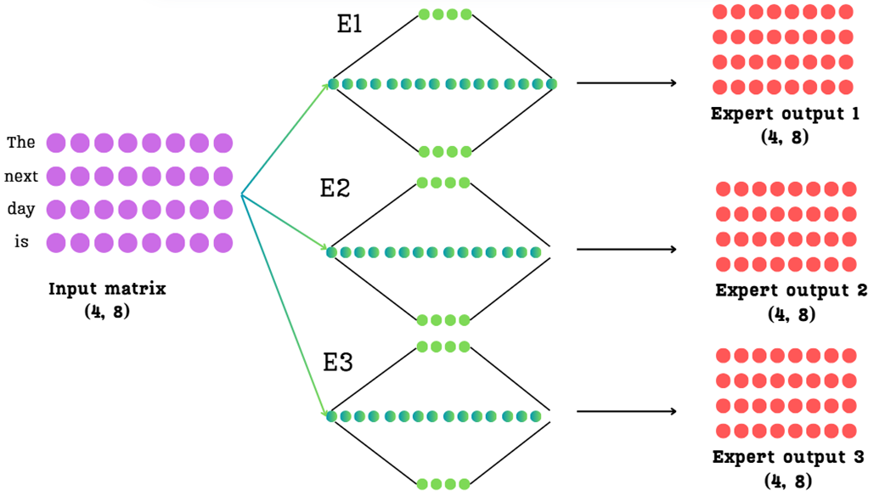

*图4.5 MoE 的初始挑战。输入矩阵通过三个 expert 网络并行处理，产生三个独立的 expert 输出矩阵。*

如图 4.5 所示，这给我们留下了一个挑战。我们从一个 (4, 8) 的输入矩阵开始，但最终得到三个 (4, 8) 的输出矩阵。然而，Transformer 架构只期望一个矩阵传递到下一层。

我们在本节中的全部任务是弄清楚：我们如何智能地将这三个 expert 输出合并为一个形状相同的 (4, 8) 的单一最终输出矩阵？答案在于我们在第 4.1 节中直观介绍的两个关键概念：稀疏性 (sparsity) 和路由 (routing)。

### 4.2.2 稀疏性在行动：用于 load balancing 的 Top-K 选择

使用 Mixture of Experts (MoE) 模型处理 token 的第一步是在合并输出之前选择每个 token 使用哪些 expert。正如我们所讨论的，MoE 的核心效率来自稀疏性：不是每个 token 都由每个 expert 处理。

我们通过一个简单但强大的决策来强制执行这一点：对于每个 token，我们只选择最相关的前 k 个 expert。k 的值是我们选择的超参数。在我们的示例中，我们将设置 k=2。这意味着在我们可用的三个 expert 中，任何给定 token 只有两个会被激活。

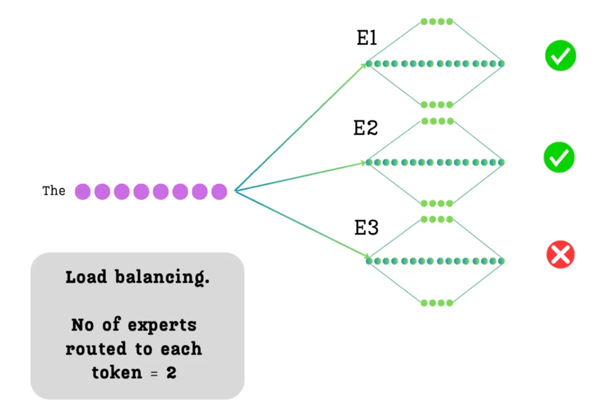

*图4.6 稀疏性或 load balancing 的原则。对于每个 token，我们决定只将其路由到可用 expert 的一个子集 (k=2)。*

如图 4.6 所示，当处理 token "The" 时，它只会被发送到三个 expert 中的两个（在此示例中，选择了 E1 和 E2，而 E3 被忽略）。这种选择性激活的行为阻止了模型对每个 token 执行所有 expert 的完整计算。

这立刻引出了下一个逻辑问题：模型如何决定选择哪两个 expert？一旦选定，它如何知道给每个 expert 分配多少重要性或权重？这就是路由机制的工作。

### 4.2.3 路由机制：从输入到 expert 分数

为了决定哪些 expert 最适合每个 token，模型使用一个小的、可学习的神经网络，称为 router。Router 的工作是查看输入 token 并为每个 token 的每个 expert 生成分数。

这被实现为一个简单的线性层。我们取输入矩阵并将其乘以一个可训练的路由矩阵。

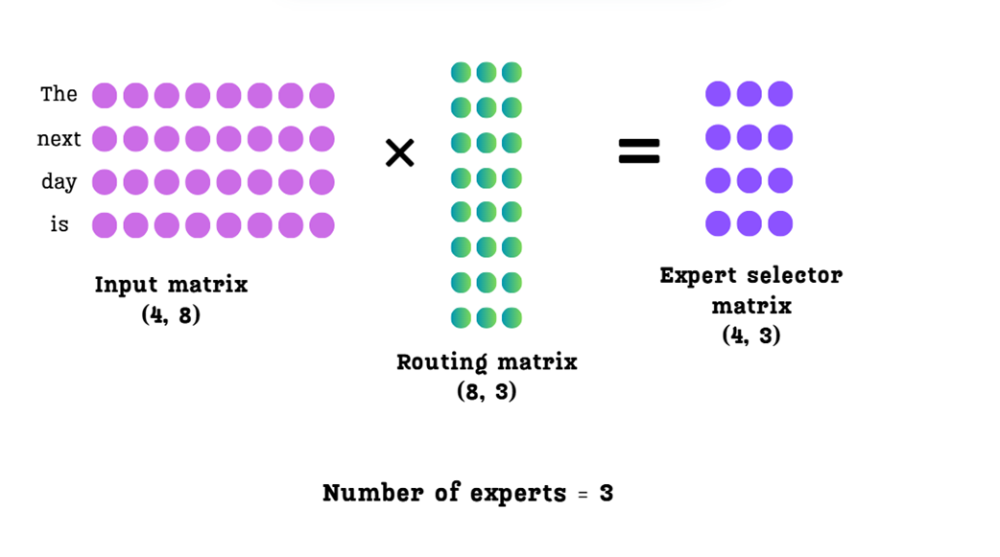

*图4.7 路由机制。输入矩阵乘以一个学习的路由矩阵，产生一个 expert 选择矩阵，其中包含每个 token 对每个 expert 的原始分数。*

让我们分解图 4.7 中显示的维度：

- **输入矩阵**：形状 (4, 8)——四个 token，每个有 8 维嵌入。
- **路由矩阵**：形状 (8, 3)——输入维度必须与输入矩阵匹配 (8)，输出维度是我们拥有的 expert 数量 (3)。这是一个学习的权重矩阵。
- **Expert Selector Matrix**：形状 (4, 3)——乘法的结果。

这个 Expert Selector Matrix（也通常称为 logits 矩阵）是 router 的关键输出。让我们解释其结构：

- 每一行对应我们的一个输入 token（"The"、"next"、"day"、"is"）。
- 每一列对应我们的一个 expert（E1、E2、E3）。
- 每个位置 (行, 列) 的值是一个原始的、未归一化的分数，表示该 expert 对该 token 的适合程度。

例如，第一行第二列的值是将 token "The" 路由到 Expert 2 的分数。现在我们有了这些分数，我们可以用它们来实现我们的 top-k 选择。

### 4.2.4 从分数到权重：Top-K 选择和 softmax 归一化

我们现在有了 Expert Selector Matrix，其中包含原始分数。我们的下一个任务是使用这些分数来实现两个目标：

1. 对每个 token 只选择前 2 个 expert。
2. 将所选 expert 的分数转换为一组总和为 1 的权重。

这是一个三步过程。

**步骤 A：选择 Top-K Expert**

首先，对于每一行（每个 token），我们识别分数最高的 k=2 个 expert。所有其他 expert 的分数被丢弃。

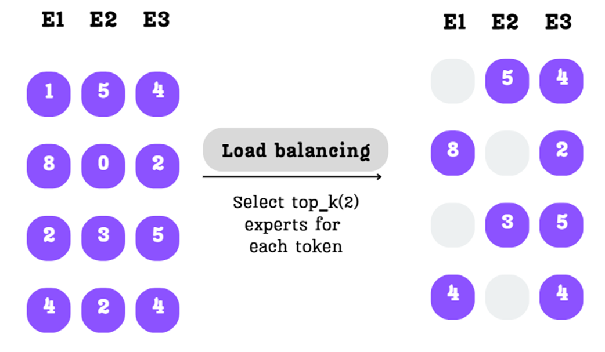

*图4.8 Top-k 选择过程。对于每一行，只保留两个最高分数，其余被屏蔽。*

如图 4.8 所示，对于第一个 token，分数 5 和 4（对应 E2 和 E3）最高，所以分数 1（对应 E1）被屏蔽。这对每个 token 重复执行，满足我们的稀疏性要求。

**步骤 B：用负无穷屏蔽**

为了在数学上消除未选择的 expert，我们用负无穷替换它们的分数。这可能看起来像一个奇怪的选择，但它是一个巧妙的技巧，与下一步的 softmax 函数完美配合。

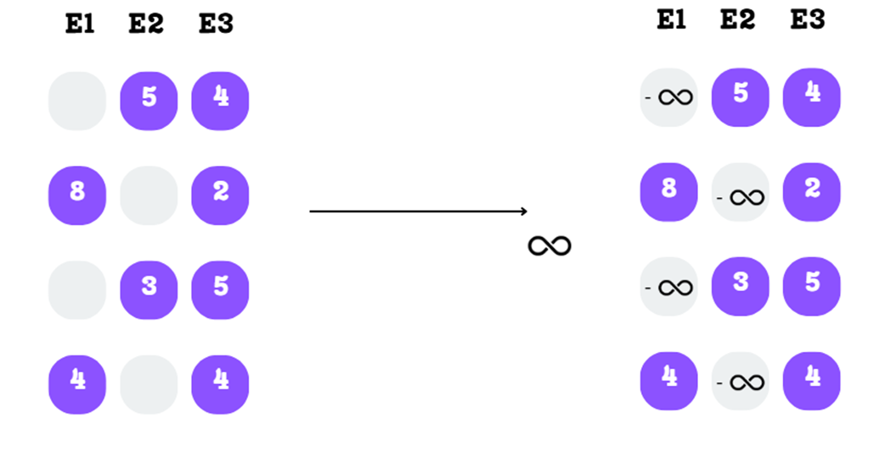

*图4.9 被屏蔽的分数被替换为负无穷，为 softmax 函数做准备。*

**步骤 C：应用 Softmax**

最后，我们对这个新矩阵的每一行应用 softmax 函数。softmax 函数有两个属性完美地满足我们的需求：

1. 它将任何实数转换为概率分布，其中所有值在 0 和 1 之间，每行的值之和恰好为 1。
2. 对于一个非常大的负数（如负无穷），指数函数 e^x 实际上为零。

如图 4.10 所示，对我们的矩阵应用 softmax 做了两件事：

- 未选择 expert 的分数（之前是负无穷）变为零。
- Top-2 所选 expert 的分数被转换为总和为 1 的概率。

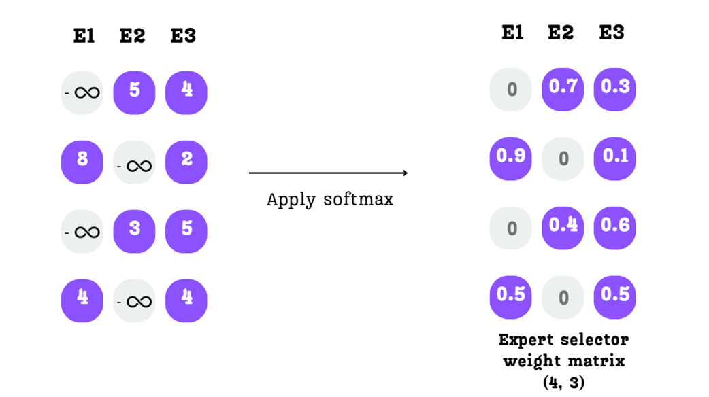

*图4.10 Softmax 函数将分数转换为最终的 expert 选择权重矩阵。*

最终输出是我们的 Expert Selector Weight Matrix。这个矩阵现在包含我们合并 expert 输出所需的所有信息。对于第一个 token "The"，它告诉我们："忽略 Expert 1，将最终输出的 70% 的权重给 Expert 2，30% 给 Expert 3。" 我们现在已经回答了最初的两个问题：使用哪些 expert，以及给它们什么权重。

### 4.2.5 最终输出：创建 expert 输出的加权和

对于每个 token，我们将取其所选 expert 的输出，乘以分配给它们的权重，然后将它们相加。让我们逐步进行第一个 token "The" 的计算。

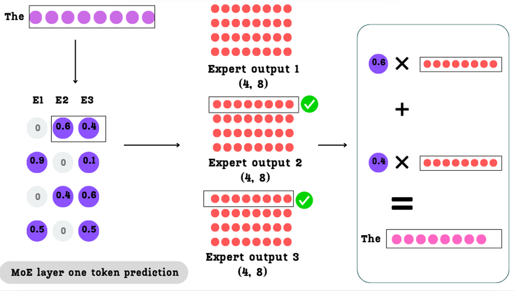

*图4.11 计算单个 token 的最终输出。选择矩阵中的权重用于创建相应 expert 输出的加权和。*

如图 4.11 所示，token "The" 的计算过程如下：

1. **查找权重**：我们查看 Expert Selector Weight Matrix 的第一行。它告诉我们使用 Expert 2（权重为 0.6）和 Expert 3（权重为 0.4）。Expert 1 的权重为 0，将被忽略。
2. **查找 Expert 输出**：我们查看 Expert Output 2 和 Expert Output 3 矩阵的第一行（对应 token "The"）。
3. **执行加权和**：我们执行以下计算：

(0.6 * OutputVector_The_from_E2) + (0.4 * OutputVector_The_from_E3)

结果是一个单一的 (1, 8) 向量，这是 token "The" 的最终的、上下文感知的输出。

同样的过程对我们输入序列中的每个 token 并行执行。

- 对于 "next"，我们取 0.9 * Output_next_E1 + 0.1 * Output_next_E4。
- 对于 "day"，我们取 0.4 * Output_day_E2 + 0.6 * Output_day_E4。
- 依此类推。

当我们把所有这些结果向量堆叠在一起时，我们得到最终的输出矩阵。

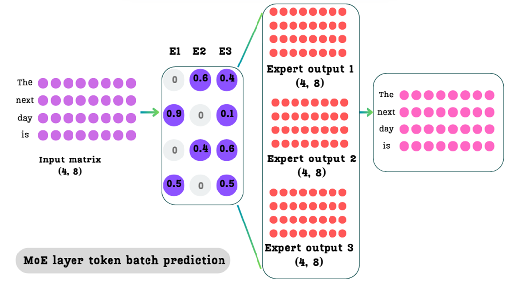

*图4.12 一批 token 的完整 MoE 过程。Expert Selector Weight Matrix 指导 expert 输出的加权和，产生一个与输入形状相同的单一最终输出矩阵。*

如图 4.12 所示，最终输出是一个与我们原始输入矩阵 (4, 8) 形状相同的单一矩阵。我们已经成功地用稀疏的 expert 混合替代了单一的密集 FFN。通过使用 Expert Selector Weight Matrix 对每个 token 的 top-k expert 输出执行加权和，我们的新机制避免了所有未选择 expert 的昂贵计算，使其比密集 FFN 的计算效率大幅提高。

## 4.3 平衡的挑战：确保所有 expert 都有贡献

我们已经成功构建了一个功能性的 Mixture of Experts 层。我们有一个使用稀疏性（top-k 选择）将每个 token 发送到一小部分专门 expert 的路由机制。虽然这种架构是高效的，但它引入了一个新的、微妙的挑战：不均衡路由 (imbalanced routing)。

如果路由网络在训练过程中学会偏好某些 expert 会怎样？这是 MoE 训练中常见的失败模式，通常由自我强化的反馈循环驱动。如果少数 expert 由于偶然或数据分布，在早期训练批次中表现略好，Router 学会向它们发送更多 token。随着它们看到更多 token，这些 expert 变得更加专业化和有效，导致 Router 在后续步骤中更加偏好它们。这个反馈循环可能迅速导致某些 expert 被反复选择，而其他 expert 很少或从未被使用。这种不平衡导致两个重大问题：

- **低效学习**：如果一个 expert 从未被选择，它的参数永远不会被更新。它成为模型中的 "死权重"，对整体知识没有任何贡献。我们希望我们所有的 expert 都是委员会中有贡献的成员。
- **性能退化**：如果少数 expert 成为过度使用的 "热点"，它们可能成为瓶颈，模型的专业化能力被削弱。

理想情况下，我们想要一个平衡的 MoE 模型，其中平均而言，所有 expert 被使用的程度相似。为了实现这一点，已经开发了几种技术来鼓励 Router 更均匀地分配负载。在本节中，我们将探讨三种最重要的平衡技术。

### 4.3.1 尝试 #1：auxiliary loss

鼓励平衡的第一种也是最传统的方法是在模型的主要训练损失中添加一个惩罚项。这个惩罚，称为 auxiliary loss，被设计为当 expert 选择不平衡时值较高，平衡时值较低。

通过将此 auxiliary loss 添加到主要的 next-token prediction loss 中，我们在反向传播期间激励模型调整其路由矩阵，使其导致更均匀的 expert 分布。要理解这个损失是如何计算的，我们必须首先定义衡量每个 expert "重要性" 的指标。

**A. 定义 "Expert Importance"**

我们可以通过查看 Expert Selector Weight Matrix 来衡量一个 expert 的重要性。

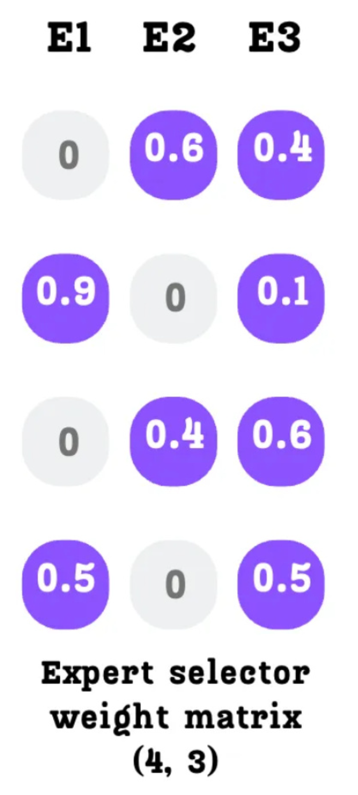

*图4.13 Expert Selector Weight Matrix。每行对应一个 token，每列对应一个 expert。*

如我们所知，此矩阵中的每列对应一个特定的 expert。列中的值表示分配给该 expert 的批处理中每个 token 的概率（或权重）。衡量一个 expert 在给定批次中总重要性的自然方法是简单地对其列中的值求和。

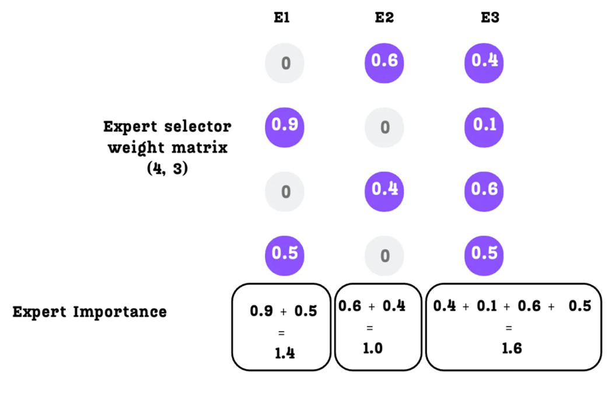

*图4.14 通过对每列概率求和来计算 Expert Importance。*

如图 4.14 所示，对于这个特定批次：

- Expert 1 Importance：0.9 + 0.5 = 1.4
- Expert 2 Importance：0.6 + 0.4 = 1.0
- Expert 3 Importance：0.4 + 0.1 + 0.6 + 0.5 = 1.6

这些值清楚地显示了一个不平衡。Expert 3 被使用得最多，而 Expert 2 被使用得最少。我们的目标是使这些 importance 分数尽可能相似。

**B. 计算 Auxiliary Loss**

我们希望在 expert importance 分数存在较大差异时惩罚模型。衡量一组数值变异的标准统计量是变异系数 (Coefficient of Variation, CV)。它定义为标准差 (σ) 与均值 (μ) 的比率：

CV = σ / μ

CV 是归一化的离散度量。高 CV 意味着值非常分散（不平衡），低 CV 意味着值非常接近（平衡）。

我们的目标是让模型学习一种路由策略，使得 expert importance 分数的 CV 较低。

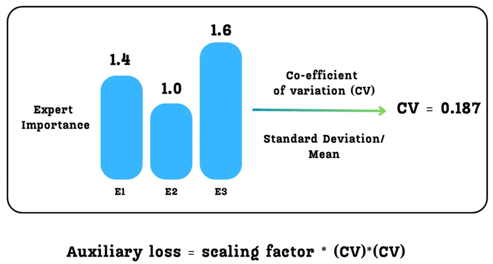

*图4.15 Auxiliary Loss 由 Expert Importance 分数的变异系数计算。*

如图 4.15 所示，我们取三个 importance 分数 (1.4, 1.0, 1.6)，计算它们的 CV（在此情况下结果为 0.187），然后将其代入我们的 auxiliary loss 公式：

Auxiliary Loss = λ * CV

这里，λ (lambda) 是一个缩放因子，我们选择的一个超参数，用于控制我们相对于主要的 next-token prediction loss 对这个平衡损失的关注程度。

这个 Auxiliary Loss 然后直接添加到主要的训练损失中。在反向传播期间，模型现在将从两个来源接收梯度：一个告诉它更好地预测下一个 token，另一个告诉它使 expert importance 分数更均匀。这将路由函数推向更平衡的分布。

然而，正如我们接下来将看到的，简单地平衡 "importance" 并不是全部。它不一定保证发送给每个 expert 的实际 token 数量是平衡的，这引导我们走向一种更复杂的技术。

### 4.3.2 尝试 #2：load balancing loss

虽然 auxiliary loss 有助于鼓励 importance 的平衡，但它有一个微妙但关键的缺陷：为 expert 分配相等的 importance 不一定会导致均匀的 token 路由。

这是一个关键概念。Expert 的 "importance" 是概率之和，而其 "load" 是它实际处理的 token 数量。这两件事是不同的。让我们考虑一个简单的、说明性的例子。

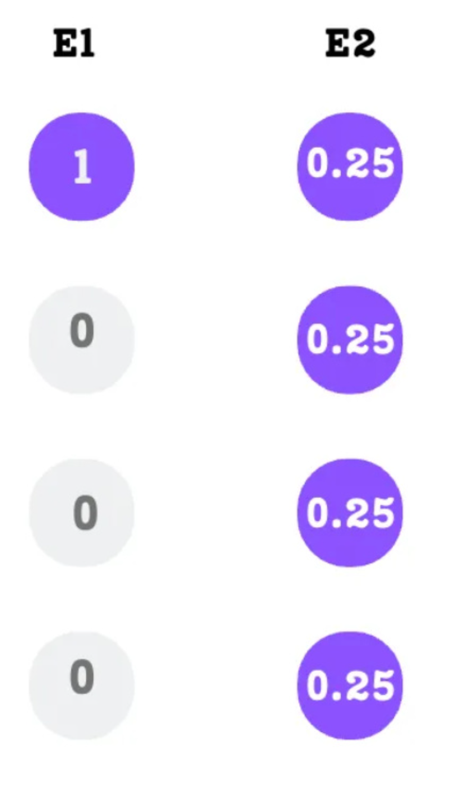

*图4.16 示例说明相等的 expert importance 不保证平衡的 token 负载。*

如图 4.16 所示，我们有一个包含两个 expert 的场景：

- Expert 1：以非常高的概率 (1.0) 接收一个 token。其总 importance 为 1.0。
- Expert 2：接收四个不同的 token，但每个概率很低 (0.25)。其总 importance 为 0.25 * 4 = 1.0。

两个 expert 有相同的 importance 分数，所以 auxiliary loss 将为零，它会认为这种情况完全平衡。然而，实际的工作负载极其不平衡。Expert 2 处理的 token 数量是 Expert 1 的四倍。这仍然可能导致内存问题和 expert 网络的低效使用。

为了解决这个问题，我们需要一个不仅考虑概率，还考虑分派到每个 expert 的实际 token 数量的损失函数。这就是 Load Balancing Loss。

我们旨在最小化的这个损失公式定义为：分派到某个 expert 的 token 比例与 router 选择该 expert 的概率的乘积，对所有 expert 求和。然后乘以 expert 数量 (N) 和一个超参数 λ：

Load Balancing Loss = λ * N * Σ(f_i * p_i)

为了理解最小化此值如何鼓励平衡，我们需要解构其两个关键的、每个 expert 的组成部分：f_i（批次中分派到 expert i 的 token 比例）和 p_i（批次中 router 选择 expert i 的平均概率）。我们将在以下小节中分解这些内容。

**A. 计算 p_i：Router Probability**

第一个组成部分 p_i 表示 router 在整个批次中选择给定 expert 的概率。这是 expert 整体重要性的衡量。我们通过取上一节中导出的 Expert Importance 分数并将其除以批次中的总 token 数来计算此值。

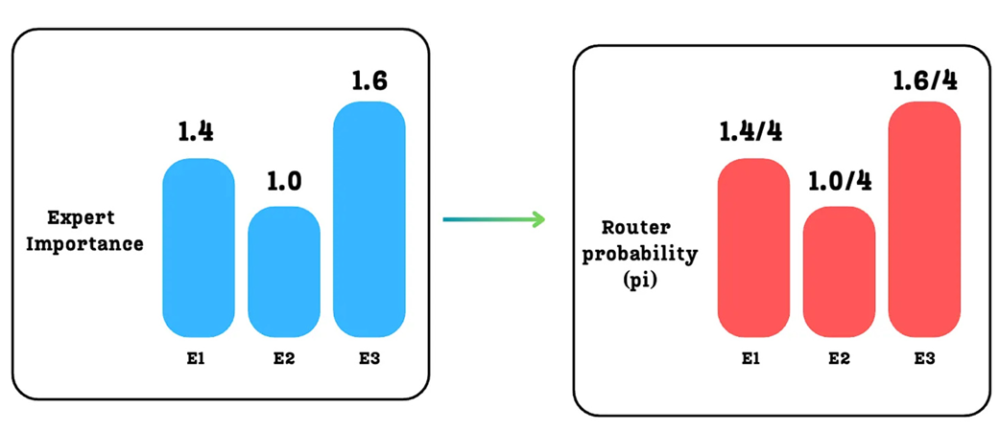

*图4.17 计算每个 expert 的 Router Probability (p_i)。*

对于我们包含 4 个 token 的示例：

- p1 = ExpertImportance_E1 / 4 = 1.4 / 4 = 0.35
- p2 = ExpertImportance_E2 / 4 = 1.0 / 4 = 0.25
- p3 = ExpertImportance_E3 / 4 = 1.6 / 4 = 0.40

这些 p_i 值为我们提供了 expert importance 的归一化视图。

**B. 计算 f_i：分派 Token 的比例**

第二个组成部分 f_i 更直接。它衡量在 top-k 选择后，批次中实际分派到每个 expert 的 token 比例。

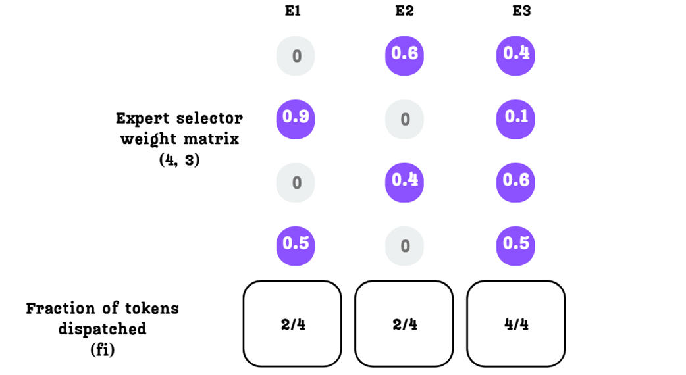

*图4.18 计算每个 expert 的 Token 分派比例 (f_i)。*

基于我们的 Expert Selector Weight Matrix 和 k=2 设置：

- Expert 1 被选择用于 token 2 和 token 4。所以 f1 = 2/4 = 0.5
- Expert 2 被选择用于 token 1 和 token 4。所以 f2 = 2/4 = 0.5
- Expert 3 被选择用于 token 1、2、3 和 4。所以 f3 = 4/4 = 1.0

**C. 最小化损失**

通过最小化乘积 Σ (f_i * p_i)，模型被鼓励对齐这两个分布。理想的、完全平衡的状态是 f_i 和 p_i 都是均匀的（例如，在 3-expert 系统中每个 expert 为 1/3）。当路由在概率和实际 token 数量方面都平衡时，损失最低。这个更复杂的损失项为模型提供了更强的信号，避免某个 expert 成为计算瓶颈，从而导致更稳定和高效的训练。

### 4.3.3 硬性上限：capacity factor

Auxiliary Loss 和 Load Balancing Loss 都是 "软" 约束。它们向训练目标添加惩罚项，鼓励模型随时间学习平衡的路由策略。然而，它们并不严格防止单个 expert 在给定批次中暂时过载的情况。

为了添加一个 "硬" 保护措施，许多 MoE 实现引入了称为 Expert Capacity 的概念。

**EXPERT CAPACITY**：任何单个 expert 在单个批次中被允许处理的最大 token 数量的固定限制。

如果路由到某个 expert 的 token 超过了其容量允许的数量，多余的 token 被视为 "dropped"，不会在该前向传播中被该 expert 处理。

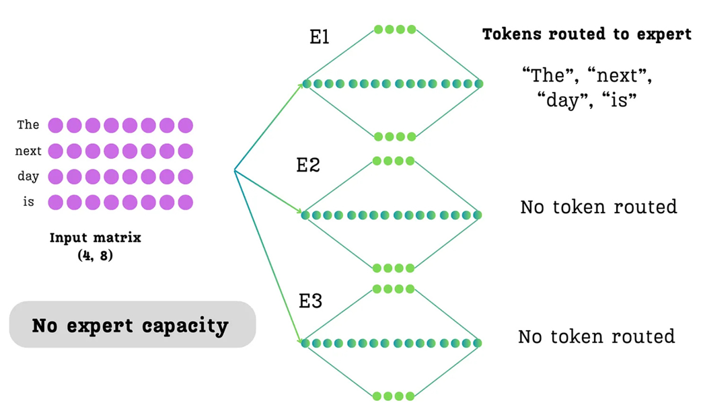

*图4.19 没有 expert capacity 的不平衡路由的图示。在此场景中，Router 将批次中的所有 token 发送给 Expert 1，让其他 expert 空闲。单个 expert 的这种过载是 expert capacity 旨在防止的问题。*

如图 4.19 所示，没有容量限制，Router 可能将所有四个 token 发送给 Expert 1，使 E2 和 E3 在该批次中完全空闲。通过设置容量为 2，我们强制 Router 更均匀地分配 token。

**容量如何计算？**

容量通常计算为比完全均匀分布所需的稍大一些：

Expert Capacity = (Tokens per Batch / Number of Experts) * Capacity Factor

让我们分解这个：

- (Tokens per Batch / Number of Experts)：如果负载完全平衡，每个 expert 的 token "公平份额"。
- Capacity Factor：这是一个超参数，通常是一个略大于 1.0 的值（例如 1.25）。它提供了一个小的缓冲，允许一些轻微的不平衡而不丢弃 token。

设置 Capacity Factor > 1.0 很重要，因为强制完全均匀的分布可能过于限制，可能损害模型性能。允许少量的灵活性通常是有益的。

Capacity Factor 是防止 expert 过载和确保训练稳定性的强大而直接的工具。虽然 DeepSeek-V2 的高级 loss-free balancing 使这不再那么关键，但它是许多传统 MoE 架构中标准且重要的技术。

## 4.4 DeepSeek 的创新：迈向终极专家专业化

DeepSeek 团队不仅仅是采用了现有的 MoE 架构；他们分析了其根本局限性，并在其之上构建了一系列出色的创新。正如他们在论文 "DeepSeekMoE: Towards Ultimate Expert Specialization" (https://arxiv.org/pdf/2401.06066) 中所述，他们的目标是解决阻碍传统 MoE 模型发挥全部潜力的核心问题。

在本节中，我们将看到定义 DeepSeekMoE 架构的三个主要创新：

1. Fine-Grained Expert Segmentation
2. Shared Expert Isolation
3. Auxiliary-Loss-Free Load Balancing（在 DeepSeek-V3 中引入）

要理解这些解决方案，我们必须首先理解它们被设计来解决的两大核心问题。

### 4.4.1 传统 MoE 的核心问题

DeepSeek 团队识别了两个阻碍标准 MoE 模型中 expert 专业化的根本问题。

**问题 1：Knowledge Hybridity（知识混杂）**

传统 MoE 架构通常使用相对较少的 expert（例如 8 个或 16 个）。当拥有庞大而多样的训练数据集但只有少量 expert 时，每个 expert 被迫成为通才。一个 expert 可能必须同时学习标点符号、动词、专有名词和复杂推理。

这导致了知识混杂 (knowledge hybridity)。单个 expert 的参数成为来自许多不同领域知识的集合。这使得 expert 很难在任何单一任务上变得真正专业化和高度有效。

想象一个只有 8 个总 expert 的模型中的一个 expert，我们称它为 Expert 4。在训练期间，它可能被要求处理来自截然不同上下文的 token：

1. 一行 Python 代码：`for i in range(10):`
2. 一份法律合同：`...the party of the first part...`
3. 一段历史文本：`... the Magna Carta was signed in 1215.`

为了处理这三个，Expert 4 的内部参数被拉向三个不同的方向。它必须学习 Python 语法的规则、法律术语的细微差别和历史事实的结构。结果是一种混乱的妥协。它的参数不会为编码、法律或历史而精细调整。相反，它们代表三者的 "混合"。当一段新的、复杂的 Python 代码到达时，Expert 4 缺乏深度的、专业化的知识来以最高准确度处理它，因为其容量被冲突的职责稀释了。

**问题 2：Knowledge Redundancy（知识冗余）**

第二个问题是相反的。许多不同类型的 token（例如动词、名词、数字）可能都需要一些共同的、基础的知识才能被正确处理。在标准 MoE 模型中，这迫使多个不同的 expert 在各自的参数中学习相同的共享知识。

例如，Expert 1（动词专家）和 Expert 2（名词专家）可能都需要学习英语语法的基本规则。这导致了知识冗余 (knowledge redundancy)，相同的信息被浪费地存储在多个 expert 中。这种冗余阻碍了真正的专业化，因为每个 expert 容量的很大一部分被用于重新学习公共知识，而不是专注于其独特任务。

考虑一个拥有两个高度专业化 expert 的模型：

- **Expert 1（Python 专家）**：已经学会成为理解 Python 代码的专家。
- **Expert 2（医学专家）**：已经学会成为理解医学研究论文的专家。

Python 代码注释和医学论文都是用英语写的。因此，为了有效地完成工作，两个 expert 都必须理解基本的英语语法。例如，它们都需要学习主谓一致的概念。

- Expert 1 需要这些知识来正确解释代码注释，如 "This function do xyz"
- Expert 2 需要完全相同的知识来解释论文中的句子，如 "The study demonstrates a significant correlation."

因此，Expert 1 有限参数空间的一部分被用于存储英语语法规则。同时，Expert 2 参数空间的一部分被用于存储相同的规则。这是努力的浪费性重复。那个容量本可以用于深化它们各自的专业化（例如，让 Expert 1 学习一个新的编程库，或者让 Expert 2 了解一类新药物）。这就是知识冗余的本质。

这两个问题——混杂性和冗余性——阻止了模型实现终极 expert 专业化。DeepSeek 的创新是对这两个问题的直接而出色的攻击。

### 4.4.2 创新 #1：Fine-Grained Expert Segmentation（细粒度专家分割）

DeepSeek 识别的传统 MoE 架构的第一个主要问题是 Knowledge Hybridity。当模型拥有有限数量的 expert（例如 8 个或 16 个）时，这个问题就会出现。由于只有这么少的 expert 来处理庞大而多样的训练数据集，每个 expert 被迫成为 "万金油"。它必须在自己的参数集中学习处理与标点符号、动词、专有名词和复杂推理相关的 token。这阻止了任何单个 expert 在特定任务上变得真正专业化和高度有效。

DeepSeek 对此问题的解决方案在概念上简单但在实践中强大：使用大量更小的 expert。这就是 Fine-Grained Expert Segmentation 的核心思想。

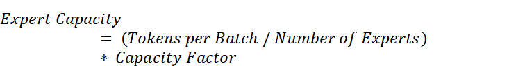

*图4.20 传统 MoE（少数大型 expert，上方）与 DeepSeek 细粒度方法（许多更小的 expert，下方）的比较。*

如图 4.20 所示，不是一个 FFN 被少数大型 expert 替代，而是被一个更大的更小、更专业化的 expert 池替代。

**这在不增加总模型大小或计算成本的情况下是如何工作的？**

这是一个关键点。可学习参数的总数和推理期间的计算成本不一定增加。这是通过随着 expert 总数增长按比例缩小每个单独 expert 的大小来实现的。

例如，假设传统 expert 是一个隐藏维度为 4096 的大型 Feed-Forward Network。

- 在拥有 16 个 expert 的传统 MoE 中，总 "expert 容量" 为 16 * 4096。
- 在 Fine-Grained MoE 中，我们可以有 64 个 expert，但每个 expert 的隐藏维度可能减少到 1024。总容量保持不变（64 * 1024 = 16 * 4096）。

expert 参数的总数和激活参数的数量 (top-k) 可以保持不变。我们没有让模型变得更大；我们只是将其知识划分为更多更专业化的容器。

这一架构变更直接解决了知识混杂问题：

- 随着有大量可用的 expert（例如 64 个或 256 个而不是 16 个），模型不再被迫将多样化知识塞入单个 expert。
- 路由机制现在有了一个更广泛的、更专业化的 expert 池可供选择。它可以学习将 token 发送给高度特定的 expert。现在可以有专门负责 Python 语法错误的 expert、另一个负责法律术语的 expert，还有另一个负责诗歌比喻的 expert。

通过增加可用专家的数量，每个 expert 可以成为其狭窄领域的真正大师。这使模型整体能够实现更加细致和强大的语言理解能力，这是 DeepSeek 在广泛基准测试中表现强劲的关键因素。

### 4.4.3 创新 #2：Shared Expert Isolation（共享专家隔离）

Fine-Grained Segmentation 是增加专业化的强大工具，但它不能解决 DeepSeek 识别的第二个核心问题：Knowledge Redundancy。

这个问题出现是因为许多不同类型的 token 需要一些共同的、基础的知识才能被处理。例如，专门处理 Python 语法的 expert 和专门处理法律合同的 expert 都需要对英语语法的基本理解。在传统 MoE 模型中，这两个 expert 都会被迫浪费其参数容量的一部分来学习和存储相同的冗余语法知识。这阻碍了它们在主要任务上变得更加专业化的能力。

为了解决这个问题，DeepSeek 引入了一个出色的架构变更：Shared Expert Isolation。他们将每个 MoE 层的 expert 分为两个不同的、功能不同的组。

1. **Routed Expert**：这些是我们刚才讨论的细粒度、专业化 expert。它们被稀疏地激活。一个 token 只被发送到由 router 决定的 top-k Routed Expert。这些是专家。
2. **Shared Expert**：这是一个小的、独立的密集 expert 集合。进入 MoE 层的每个 token 都由所有 Shared Expert 处理，不管 router 的决定如何。这些是通才。

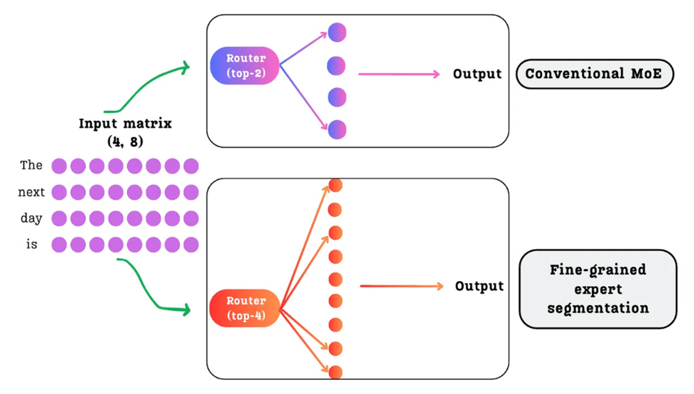

*图4.21 具有 Shared Expert 和 Routed Expert 的 DeepSeekMoE 架构。所有 token 都由密集的 Shared Expert 处理，而 router 选择性地将每个 token 发送到 Routed Expert 的一个稀疏子集。*

这种巧妙的分工是知识冗余问题的直接解决方案：

- Shared Expert 因为看到每个 token，自然地学习跨所有领域所需的共同的、基础的知识（例如一般语法、常识事实、基本推理结构）。它们成为此共享信息的中心存储库，消除了重复的需要。
- Routed Expert 现在从这一负担中解放出来。它们不再需要浪费其容量重新学习冗余信息。它们可以将整个参数预算致力于在其独特的狭窄领域中成为超专业化专家。

最后一步是合并来自两条路径的知识。MoE 层的输出是密集 Shared Expert 的输出之和加上所选 Routed Expert 的输出的加权和。

因此，对于给定 token x 的最终输出为：Final_Output = Residual(x) + Sum(Shared_Outputs) + Weighted_Sum(Routed_Outputs)。

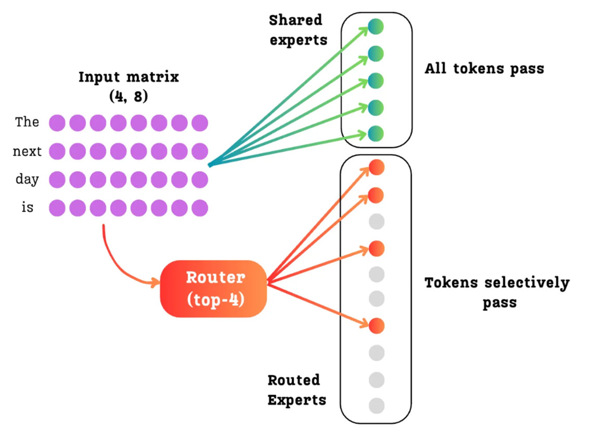

*图4.22 DeepSeekMoE 层的最终输出是密集 Shared Expert 的输出与稀疏 Routed Expert 的输出之和。*

通过将公共知识隔离到一个共享的、密集的路径中，DeepSeek 允许稀疏的 Routed Expert 达到以前不可能的专业化水平。这种细粒度分割和 Shared Expert 的组合使模型既极其有知识又高度高效。然而，他们在 V3 模型中解决的最后一个拼图是 load balancing 机制本身。

### 4.4.4 创新 #3：Auxiliary-Loss-Free Load Balancing（无辅助损失负载均衡）

在第 4.3 节中，我们探讨了确保工作负载在 expert 之间均匀分布的传统方法，即 Auxiliary Loss 和 Load Balancing Loss。虽然这些方法有效，但它们有一个显著的缺点：它们干扰了模型的主要训练目标。

让我们快速回顾这个问题。模型试图最小化的总损失变成了两个不同目标的组合：

Total Loss = Next-Token Prediction Loss + λ * Balancing Loss

这创造了一个困难的权衡：

- 如果缩放因子 λ 太低，平衡损失被忽略，expert 可能变得不平衡，损害性能。
- 如果 λ 太高，模型过于关注平衡 expert，而在其主要学习语言的任务上投入不足，这同样损害性能。

找到完美的平衡很困难，可能会损害模型的最终质量。这就是 DeepSeek 在其 V3 架构中着手解决的问题。他们问：是否可以在完全不使用额外损失项的情况下强制执行 load balance？

答案是肯定的，解决方案是一个他们称为 Auxiliary-Loss-Free Load Balancing 的出色动态调整机制。

**核心思想：使用偏置项动态调整 Router 分数**

这种新技术不是在事后用损失项惩罚模型，而是在选择 expert 之前直接介入路由过程。它通过向 router 产生的原始分数添加一个可学习的偏置项 (bias term) 来实现这一点。

核心逻辑如下：

1. 在每个训练步骤结束时，我们计算每个 expert 的负载。
2. 我们识别哪些 expert 过载（接收的 token 多于平均值）以及哪些负载不足（接收的 token 少于平均值）。
3. 然后我们在下一个训练步骤中调整偏置项：
   - 对于负载不足的 expert，我们增加其偏置。
   - 对于过载的 expert，我们减少其偏置。

这创造了一个自我纠正的动态系统。通过增加负载不足 expert 的偏置，我们在人工上提高其在下一步的分数，使 router 更可能选择它。相反，通过减少过载 expert 的偏置，我们使其更不可能被选择。

让我们用我们的例子逐步来演示这个。

**A. 计算 Expert Load 和 Load Violation**

这个动态过程的第一步是衡量当前训练批次中路由的平衡程度。我们从 Expert Selector Weight Matrix 开始，其中包含每个 token 对每个 expert 的最终概率。

首先，我们确定路由到每个 expert 的 token 总数。为了简化此计算，如果一个 token 对某个 expert 具有非零概率，则认为它被 "路由" 到了该 expert。

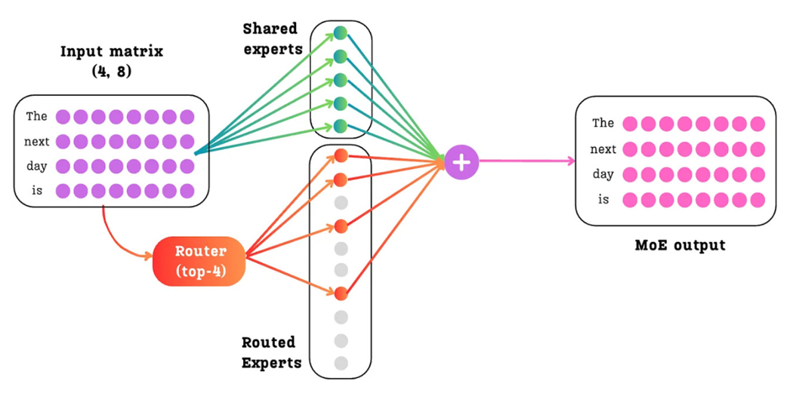

*图4.23 基于 top-k 选择计算路由到每个 expert 的 token 数量。*

如图 4.23 所示：

- Expert 1 被选择用于 2 个 token。
- Expert 2 被选择用于 2 个 token。
- Expert 3 被选择用于 4 个 token。

所有 expert 的路由 token 总数为 2 + 2 + 4 = 8。有 3 个 expert，每个 expert 的平均负载为 8 / 3 = 2.67 个 token。

现在我们可以通过计算 load violation 来确定哪些 expert 过载或负载不足。

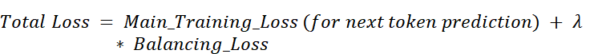

*图4.24 计算每个 expert 的 load violation。*

Load violation 简单地是平均负载与实际负载之间的差异：

- Expert 1：2.67 - 2 = 0.67（正值 = 负载不足）
- Expert 2：2.67 - 2 = 0.67（正值 = 负载不足）
- Expert 3：2.67 - 4 = -1.33（负值 = 过载）

我们现在有了每个 expert 的清晰信号：E1 和 E2 需要被更频繁地选择，E3 需要被较少选择。

**B. 更新偏置项**

接下来，我们使用这个 load violation 信号来更新每个 expert 的持久偏置项 (b_i)。每个 expert 有自己的偏置值，初始化为零。在每个训练步骤结束时，我们使用以下简单公式更新它：

b_i(t+1) = b_i(t) + u * sign(violation_i)

这里，u 是一个小的、预定义的常数（类似学习率），控制调整的幅度。sign() 函数简单地返回 +1（如果 error 为正，表示 expert 负载不足）和 -1（如果为负，表示 expert 过载）。

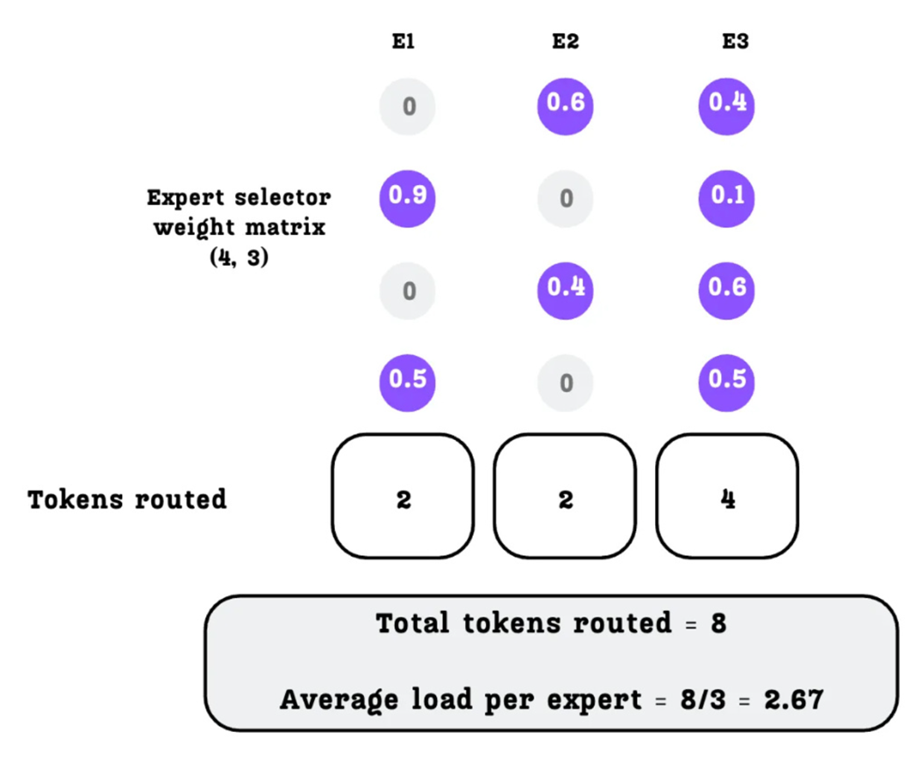

*图4.25 基于 expert 负载状态的偏置更新方向。*

如图 4.25 所示，这个简单规则意味着：

- 对于 Expert 1 和 2（负载不足，正值 violation），我们增加其偏置。
- 对于 Expert 3（过载，负值 violation），我们减少其偏置。

这个更新后的偏置项然后被带入下一个训练步骤。

**C. 将偏置应用于 Router Logits**

这是整个系统协同工作的地方。在下一个训练步骤中，当 Router 计算其原始分数（Expert Selector Matrix 或 logits）时，我们在 top-k 选择和 softmax 归一化之前将我们新更新的偏置项添加到这些分数中。

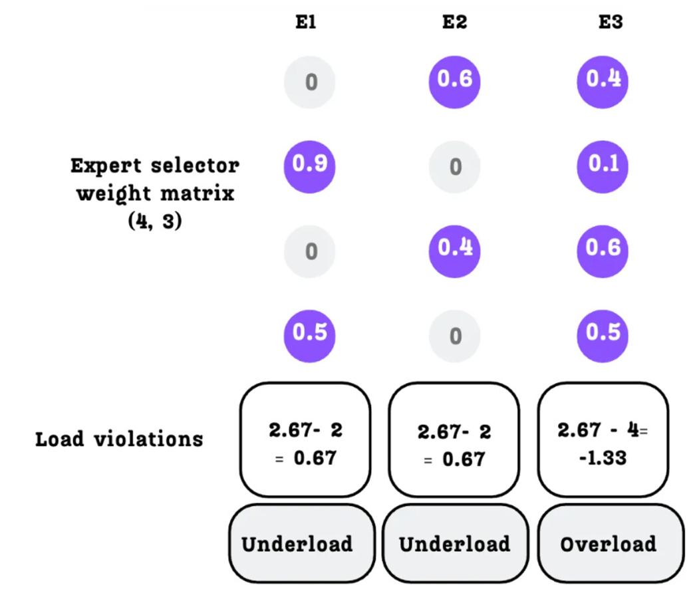

*图4.26 偏置项在 top-k 选择过程之前被添加到原始 router logits 中。*

让我们追踪图 4.26 所示的效果：

1. **原始 Logits**：Router 产生其初始分数。
2. **偏置调整**：我们加上从前一步计算得到的偏置 b。
   a. Expert 1 和 2（之前负载不足）的分数被增加。
   b. Expert 3（之前过载）的分数被减少。
3. **新的 Top-K 选择**：top-k 选择现在基于调整后的分数执行。

效果是立竿见影的。通过增加 E1 和 E2 的分数，我们使它们更有可能成为 Router 选择的前 2 个 expert。通过减少 E3 的分数，我们使其更不可能被选择。

这创造了一个动态的、自我纠正的反馈循环：

- 如果一个 expert 被利用不足，其偏置增加，使其在未来对 Router 更有吸引力。
- 如果一个 expert 被过度利用，其偏置减少，使其在未来对 Router 不那么有吸引力。

在训练过程中，这个系统自然地将 Router 推向均衡状态，确保所有 expert 接收相对平衡的 token 负载。

**Loss-Free 方法的优势**

这是一个惊人的创新，因为它将学习语言的主要目标与 load balancing 的次要任务解耦了。虽然传统方法添加一个竞争的损失项，这种动态偏置调整允许更新模型核心参数（如 attention 权重和 expert FFN）的梯度纯粹来自 next-token prediction loss。这种分离使模型能够将其基于梯度的学习完全集中在主要任务上。结果是一个更稳定、更高效的训练过程，既改善了模型的最终性能，又改善了其整体负载平衡，解决了旧 MoE 架构的核心权衡。

这就是 DeepSeek 论文在说这种方法 "实现了更好的性能和更好的负载平衡" 时的意思。通过解耦两个目标，模型可以自由地将 100% 的基于梯度的学习集中在理解语言的主要任务上，而这个优雅的偏置机制处理保持 expert 平衡的次要任务。

## 4.5 从零开始构建完整的 DeepSeek-MoE 语言模型

我们已经探讨了 Mixture-of-Experts 的核心机制、load balancing 的挑战以及 DeepSeek 开创的高级解决方案。现在，我们将把所有这些概念整合到一个单一的、功能性的 PyTorch 模块中。我们将逐步构建 DeepSeekMoE 类，从其初始化开始。本章的完整代码可在本书的 GitHub 仓库中找到，我们鼓励您跟随操作：https://github.com/Vizuar aAI/DeepSeek-From-Scratch/tree/main/ch04。

让我们可视化整个前向传播。图 4.27 提供了我们即将构建的 DeepSeekMoE 模块的完整路线图，展示了它如何处理输入张量 x。

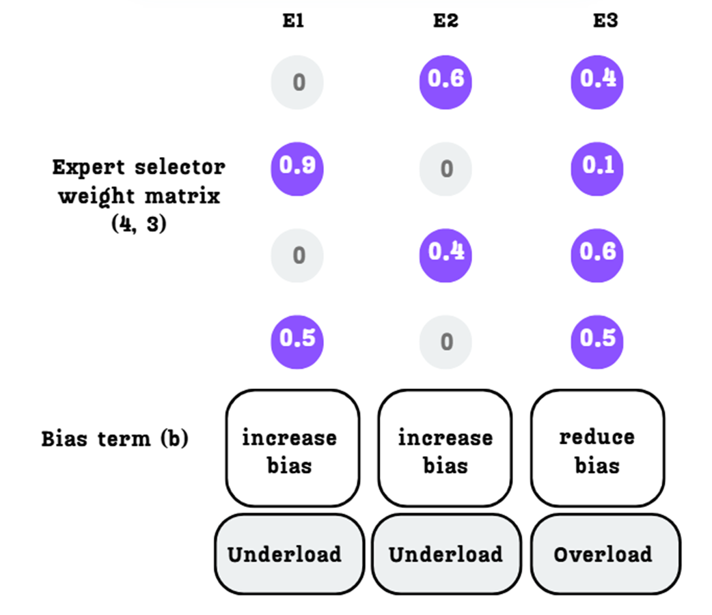

*图4.27 DeepSeekMoE 模块的完整前向传播，展示了三条并行数据路径：密集的 Shared Expert 路径、带有动态 load balancing 的稀疏 Routed Expert 路径，以及残差连接。*

如图所示，我们模块的逻辑围绕三条在最终合并的并行路径构建：

1. **Shared Path**：每个输入 token 由一小组 "通才" Shared Expert 处理。这条密集路径确保了一致地应用共同的、基础的知识。
2. **Routed Path**：这条稀疏路径是 MoE 机制的核心。它涉及一系列步骤：计算 expert 分数 (logits)，应用动态偏置进行 load balancing，选择 top-k expert，最后只通过其分配的专家处理 token。
3. **残差连接 (Residual Connection)**：原始输入 x 的直接路径，这对于稳定训练和保留来自上一层的信息至关重要。

这三个输出然后被求和——x + shared_out + routed_out——产生最终结果。有了这个蓝图，让我们从定义系统的最小构建块开始。

**步骤 1：定义 Expert FFN**

在 DeepSeek 架构中，这是一个两层 MLP，执行与密集模型中相同的 "expansion-contraction" 序列，但通常具有更小的隐藏维度。下面的代码定义了这个 ExpertFFN，它包含一个 GELU 激活函数。

**代码清单 4.1 ExpertFFN 模块**

```python
def _gelu(x: torch.Tensor) -> torch.Tensor:
# Slightly faster GELU (approx)
return 0.5 * x * (1.0 + torch.tanh(math.sqrt(2.0 / math.pi) *
➥(x + 0.044715 * torch.pow(x, 3))))

class ExpertFFN(nn.Module):
    """
    A 2-layer MLP expert. Hidden dim is usually smaller than a dense FFN
    (e.g., 0.25 × d_model in DeepSeek-V3).
    """
    def __init__(self, d_model: int, hidden: int, dropout: float = 0.0):
        super().__init__()
        self.fc1 = nn.Linear(d_model, hidden, bias=False)
        self.fc2 = nn.Linear(hidden, d_model, bias=False)
        self.dropout = nn.Dropout(dropout)

    def forward(self, x: torch.Tensor) -> torch.Tensor:
        return self.fc2(self.dropout(_gelu(self.fc1(x))))
```

MoE 层中每个 "expert" 的核心就是一个标准的 Feed-Forward Network (FFN)。在 DeepSeek 架构中，这是一个两层 MLP，执行与密集模型中相同的 "expansion-contraction" 序列，但通常具有更小的隐藏维度。上面的代码定义了这个 ExpertFFN，它包含一个 GELU 激活函数。

**步骤 2：初始化 MoE 层**

`__init__` 方法设置了我们 MoE 层的所有组件。这包括为我们两组不同的 expert 创建 ModuleList：一小组每个 token 都会看到的 Shared Expert，以及一个更大的将被稀疏使用的 Routed Expert 池。关键是，它还设置了路由机制的参数。这包括 centroids（Router 的可学习权重矩阵）和偏置——一个不可训练的缓冲区，将被动态更新以在没有 auxiliary loss 的情况下强制执行 load balancing。

**代码清单 4.2 DeepSeekMoE __init__ 方法**

```python
#A Creates the large pool of specialized, sparsely-activated experts.
#B Creates the small set of generalist experts, activated for every token.
#C The learnable experts centroid (router). The router calculates expert routes by measuring the similarity (dot
# product) between each token's representation and each expert's centroid vector.
#D The non-trainable bias for auxiliary-loss-free load balancing.

class DeepSeekMoE(nn.Module):
    def __init__(
        self,
        d_model: int,
        n_routed_exp: int,
        n_shared_exp: int = 1,
        top_k: int = 8,
        routed_hidden: int = 2_048,
        shared_hidden: Optional[int] = None,
        bias_lr: float = 0.01,
        fp16_router: bool = False,
    ):
        super().__init__()
        assert top_k <= n_routed_exp, "k must be <= number of routed experts"
        self.d_model = d_model
        self.n_routed = n_routed_exp
        self.n_shared = n_shared_exp
        self.top_k = top_k
        self.bias_lr = bias_lr
        self.fp16_router = fp16_router
        self.routed = nn.ModuleList(
            [ExpertFFN(d_model, routed_hidden) for _ in range(n_routed_exp)]
        )  #A
        hidden_shared = shared_hidden or routed_hidden
        self.shared = nn.ModuleList(
            [ExpertFFN(d_model, hidden_shared) for _ in range(n_shared_exp)]
        )  #B
        self.register_parameter("centroids",
            nn.Parameter(torch.empty(n_routed_exp, d_model)))  #C
        nn.init.normal_(self.centroids, std=d_model ** -0.5)
        self.register_buffer("bias", torch.zeros(n_routed_exp))  #D
```

**步骤 3：前向传播——Shared Expert 路径**

forward 方法首先通过 Shared Expert 处理输入 x。正如我们在理论中讨论的，这是一个密集操作：批次中的每个 token 都通过 self.shared 列表中的每个 expert。

这条路径确保了共同的、基础的知识（如语法或基本事实）由一组一致的参数处理，解决了 "知识冗余" 问题。这些 expert 的输出形成了基础结果，然后将被专业化的 Routed Expert 细化。

在这段代码中，我们首先重塑输入张量以便于处理。然后我们初始化一个输出张量 shared_out 并遍历我们的 Shared Expert 列表，累加它们的结果。注意，为了简单和清晰，我们的实现按顺序在 for 循环中处理 Shared Expert。在生产级框架中，这些 expert 计算将并行执行以最大化吞吐量。每个 token 都由每个 Shared Expert 处理，创建一个捕获整个批次所需的通才知识的密集输出。

**代码清单 4.3 forward 方法中的 Shared Expert 路径**

```python
def forward(self, x: torch.Tensor) -> torch.Tensor:
    B, S, D = x.shape
    x_flat = x.reshape(-1, D)  # [N, D] with N=B*S
    # 1) shared path
    shared_out = torch.zeros_like(x)
    for exp in self.shared:
        shared_out += exp(x)
    # ... (routed path comes next)
```

**步骤 4：前向传播——Routed Expert 路径**

这就是 MoE 架构的稀疏部分发挥作用的地方。在 Shared Expert 处理完 token 之后，路由机制接管，为每个 token 选择一个小的、专业化的 Routed Expert 子集。forward pass 的这一部分处理整个路由和分派逻辑。

该过程涉及四个关键阶段：

1. **计算 Router Logits**：一个线性层（"Router"）为每个 token 的每个 expert 计算一个原始分数。
2. **应用动态偏置**：将 auxiliary-loss-free 偏置项添加到这些分数中，以动态鼓励负载平衡。
3. **Top-K 门控**：一个 top_k 操作选择最佳 expert，softmax 函数将其分数转换为归一化权重。
4. **分派和合并**：每个 token 被发送到其选择的 expert，它们的输出以加权和的方式合并。

**代码清单 4.4 Routed Expert 路径和最终合并**

```python
#A The router calculates raw scores for each expert.
#B The dynamic bias is added to the scores to enforce load balancing.
#C Sparsity in action: top-k selects the experts and softmax computes their weights.
#D Efficiently identifies all tokens that should be routed to the current expert `i`.
#E The weighted outputs from the expert are added back to their original token positions.
#F The final output is the sum of the residual, shared, and routed paths.

# ... (shared path from previous listing)
# 2) router logits in (optional) mixed precision
use_autocast = self.fp16_router and x.is_cuda
device_type = "cuda" if x.is_cuda else x.device.type
with torch.autocast(device_type=device_type, enabled=use_autocast):
    logits = F.linear(x_flat, self.centroids)  #A
    logits = logits + self.bias.to(logits.dtype)  #B
    topk_logits, topk_idx = torch.topk(logits, self.top_k, dim=-1)
    gate = F.softmax(topk_logits, dim=-1, dtype=x.dtype)  #C
# 3) dispatch per expert (correct indexing)
routed_out = torch.zeros_like(x_flat)
for i in range(self.n_routed):
    mask = (topk_idx == i)
    row_idx, which_k = mask.nonzero(as_tuple=True)  #D
    if row_idx.numel() == 0:
        continue
    exp_in = x_flat.index_select(0, row_idx)
    out = self.routed[i](exp_in)
    w = gate[row_idx, which_k].unsqueeze(-1)
    routed_out.index_add_(0, row_idx, out * w)  #E
routed_out = routed_out.view(B, S, D)
return x + shared_out + routed_out  #F
```

这里的逻辑是稀疏分派的高效实现。我们不是逐个发送 token，而是批量处理所有发送到单个 expert 的 token。循环遍历每个 expert i。在循环内部，`(topk_idx == i)` 创建一个布尔掩码来识别哪些 token 选择了 expert i。`nonzero()` 函数给我们这些 token 的索引 (row_idx)。然后我们选择这些 token，将它们通过 expert 处理，使用 gate 值对其输出加权，并使用 `index_add_` 将结果添加回 `routed_out` 张量中的正确位置。

最后，原始输入 x、Shared Expert 的输出 shared_out 和 Routed Expert 的输出 routed_out 被求和，产生 MoE 层的最终输出。

**步骤 5：Auxiliary-Loss-Free 偏置更新**

我们现在已经实现了一个完整的 DeepSeekMoE 前向传播。最后一个组件是确保我们的 expert 随时间保持平衡的动态调整机制。这由 `update_bias` 方法处理，每个训练步骤调用一次。

此函数在 `@torch.no_grad()` 下运行，意味着其操作不会贡献于模型的梯度。其唯一目的是计算当前的 expert 负载，确定哪些 expert 被过度或不足利用，并对 self.bias 缓冲区应用一个小的调整。这个调整将影响下一次前向传播中的路由决策，创建我们在理论中讨论的自我纠正反馈循环。

该逻辑是理论的直接实现：

1. 它重新计算批次的路由 logits，包括当前偏置。
2. 它执行 top_k 选择以找到每个 token 的所选 expert。
3. `torch.bincount` 高效地计算有多少 token 被路由到每个 expert。
4. 它计算每个 expert 的 "load violation"——对于负载不足的 expert 为正值，对于过载的 expert 为负值。
5. 最后，它通过添加这个 violation 的一个小的、缩放后的值来更新 self.bias。`torch.tanh` 函数用于平滑更新并防止极端跳跃，确保稳定的调整过程。

这结束了我们从零开始的 DeepSeekMoE 层实现。通过将代码分解为这四个不同的部分，我们已经看到每个理论概念——Shared Expert、稀疏路由和动态平衡——如何被转化为功能性和高效的 PyTorch 模块。

**代码清单 4.5 用于 Load Balancing 的 update_bias 方法**

```python
#A Recalculates the logits using the current bias to accurately measure the load.
#B Efficiently counts how many tokens were routed to each expert using bincount.
#C Calculates the load violation; a positive value indicates an under-loaded expert.
#D Updates the bias term to influence the next training step's routing decisions.

@torch.no_grad()
def update_bias(self, x: torch.Tensor):
    # Call once per optimizer step on the same tokens seen by forward.
    # Uses the SAME logits (including current bias) to estimate loads.
    N = x.shape[0] * x.shape[1]
    logits = F.linear(x.reshape(-1,
        self.d_model), self.centroids) + self.bias  #A
    _, idx = torch.topk(logits, self.top_k, dim=-1)
    counts = torch.bincount(idx.flatten(),
        minlength=self.n_routed).float()  #B
    avg = counts.sum() / max(1, self.n_routed)
    # Smooth, bounded update; avoids large jumps from sign()
    # violation > 0 => under-loaded (we want to increase its prior)
    violation = (avg - counts) / (avg + 1e-6)  #C
    self.bias.add_(self.bias_lr * torch.tanh(violation))  #D
```

## 4.6 回报：实证的正面比较

在探讨了传统 Mixture-of-Experts 架构的理论基础和 DeepSeek 开创的高级解决方案之后，是时候将我们的知识付诸检验了。理论是一回事，但实证结果提供了最终的判定。为此，我们进行了正面比较，从零开始构建和训练了两个模型：一个使用传统 load balancing loss 的基线 "Standard MoE"，以及我们实现了 Shared Expert 和 auxiliary-loss-free 动态平衡的创新 "DeepSeek-MoE"。

我们的目标是回答一个简单的问题：这些架构创新是否确实带来了更好、更高效的模型？用于运行此实验并生成以下结果的完整代码可在本书的 GitHub 仓库中探索和复制。

Bonus Code Link: https://github.com/Vizuar aAI/DeepSeek-From-Scratch/tree/main/ch04/02-bonus-code

让我们从最重要的指标开始分析：验证损失。这告诉我们每个模型在训练过程中对新未见数据的泛化能力如何。图 4.28 中的图跟踪了两个模型在 5,000 次训练迭代中的验证损失。

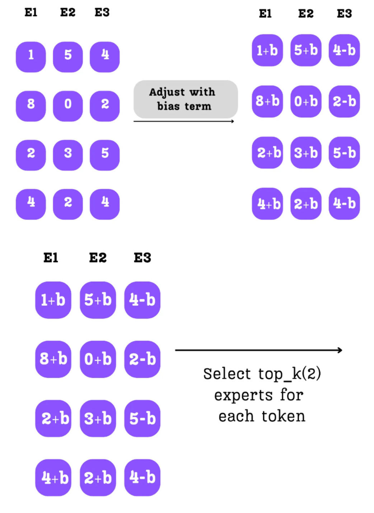

*图4.28 Standard MoE 和 DeepSeek-MoE 模型的验证损失曲线比较。尽管参数数量相似，DeepSeek-MoE 架构一致地实现了更低的损失，表明更优越的学习。两个模型都训练了 5,000 次迭代。*

正如学习曲线所说明的，两个模型都成功地学会了处理 TinyStories 数据集。然而，一个清晰的趋势出现了。从训练的非常早期阶段，DeepSeek-MoE 模型就一致地比其标准对应物实现了更低的验证损失。虽然差异不是很大——相对较小的模型规模和训练数据多样性较低的结果——但这个优势是一致的，并且随时间略微扩大。这是 DeepSeek 架构实现更有效学习的第一份证据。

虽然损失曲线为我们提供了学习性能的绝佳概览，但详细的指标表允许我们通过并排查看性能和计算效率来量化 "总回报"。表 4.1 提供了两个模型训练运行的全面摘要，这两个模型被配置为具有几乎相同数量的可学习参数以确保公平比较。

**表 4.1 训练运行比较**

| 模型 | 参数量 (M) | 训练时间 (min) | 吞吐量 (iter/min) | 最佳验证损失 |
|------|-----------|---------------|-------------------|------------|
| STANDARD_MOE | 101.30 | 14.29 | 350.0 | 1.9854 |
| DEEPSEEK_MOE | 101.28 | 11.67 | 428.6 | 1.9451 |

DeepSeek-MoE 不仅实现了更低的最终验证损失（1.9451 vs. 1.9854），而且显著更快。它在仅 11.67 分钟内完成了训练运行，展示了每分钟 428.6 次迭代的吞吐量，比 Standard MoE 的 350.0 iter/min 高出 22%。这证明了 DeepSeek 架构不仅在学习上更有效，而且计算效率更高。

两个模型之间的关键区别在于其 load balancing 的方法。Standard MoE 使用 auxiliary loss 在整个训练运行中鼓励平衡，而 DeepSeek-MoE 使用动态偏置在更即时的、每个批次的基础上强制执行平衡。

图 4.29 可视化了 Standard MoE 面临的固有挑战。条形图显示了在单个验证批次中，其第一层的 22 个 expert 中每个 expert 被路由到的 token 数量。

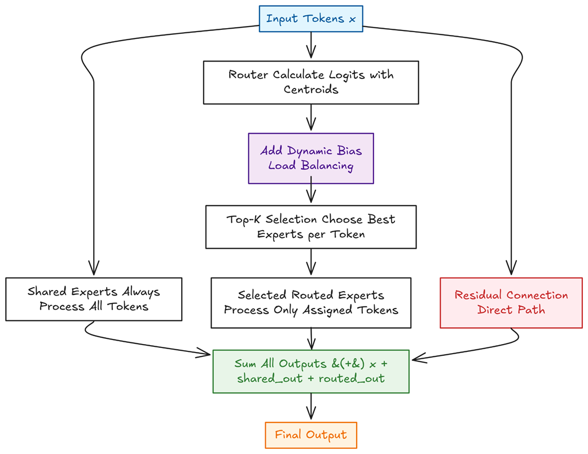

*图4.29 Standard-MoE 模型在样本批次中的 Expert 选择频率。不均匀的分布突出了不均衡路由的问题。*

图表清楚地显示了显著的负载不平衡。一些 expert，如 #7 和 #17，成为了 "热点"，处理了不成比例的大量 token。相反，其他 expert，如 #10 和 #16，被利用不足。虽然 auxiliary loss 旨在数千次迭代中逐渐平衡这一点，但它在防止单个批次中出现这些不平衡方面挣扎。这种低效意味着一些 expert 成为计算瓶颈，而其他 expert 的知识容量被浪费。

现在，图 4.30 显示了相同验证批次的 expert 利用率，但这次由我们的 DeepSeek 模型处理。

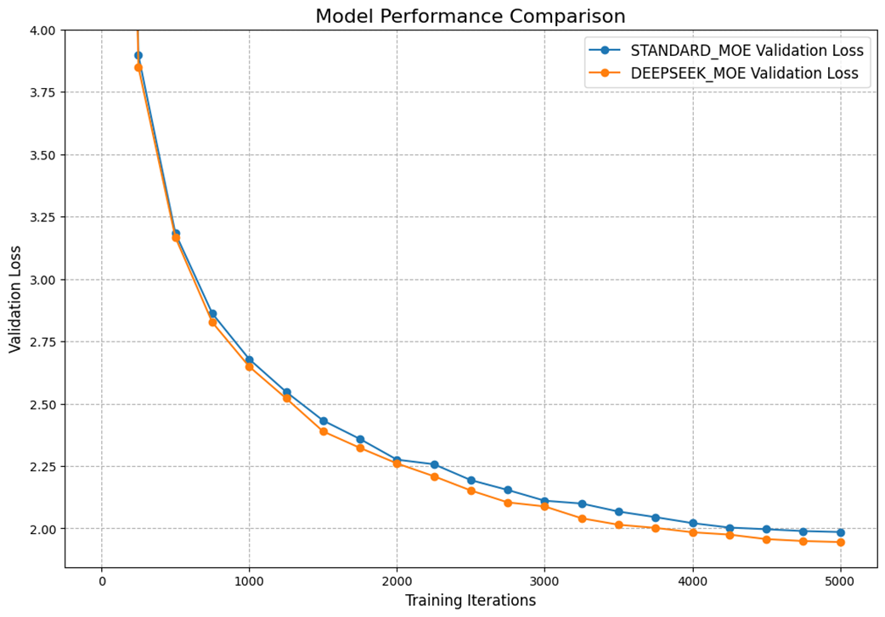

*图4.30 DeepSeek-MoE 模型在样本批次中的 Expert 选择频率。分布非常均匀，展示了动态偏置机制的有效性。*

Auxiliary-Loss-Free 动态偏置机制完美地完成了其工作，导致了非常均匀的负载分布。自我纠正系统——在实时中惩罚过载的 expert 并奖励负载不足的 expert——确保工作负载在所有可用专家之间均匀分布。这是架构效率的有形证明：没有单个 expert 成为瓶颈，专家委员会的全部并行处理能力被有效利用。

我们的正面实验提供了明确的结论。DeepSeek-MoE 模型的架构创新——具体来说，强大的 Shared 通才与用于平衡其专家的优雅 auxiliary-loss-free 机制的组合——不仅仅是理论上的。它们在性能和效率方面都带来了有形的好处。通过将 load balancing 的任务与主要学习目标解耦，模型学得更好、更快。这是允许 DeepSeek 如此高效地扩展智能的核心原则，为大规模语言模型的未来提供了强大的蓝图。

在下一章中，我们将深入进一步的性能和内存优化，探索 Multi-Token Prediction (MTP) 和 FP8 量化等高级技术，这些技术推动了大型语言模型效率的边界。

## 4.7 总结

- 标准 Transformer 中的密集 Feed-Forward Network (FFN) 计算成本高昂，因为其所有参数对每个 token 都被激活，为训练和推理创造了瓶颈。
- Mixture of Experts (MoE) 用一组较小的、专门的 "expert" 网络委员会替代了单一的密集 FFN。
- MoE 的效率来自稀疏性 (sparsity)：对于任何给定的 token，路由机制只激活全部 expert 的一个小子集（例如 top 2），其余保持休眠且其计算不执行。
- 在预训练期间，expert 学会专门化处理特定类型的信息（例如标点符号、动词或 Python 代码），这就是只激活少数 expert 有效的原因。
- 路由机制 (routing mechanism) 是一个小的、可学习的线性层，为每个 expert 生成分数。Top-k 选择识别最相关的 expert，softmax 函数将其分数转换为权重以合并它们的输出。
- 不均衡路由 (imbalanced routing)，其中一些 expert 被过度利用而其他被忽略，导致低效学习和性能退化。
- 传统 MoE 模型使用 Auxiliary Loss 项来惩罚不平衡，但这可能干扰学习语言的主要训练目标。
- DeepSeek 的第一个创新，Fine-Grained Expert Segmentation，使用大量更小的 expert 来解决 Knowledge Hybridity 问题，允许更深度的专业化。
- DeepSeek 的第二个创新，Shared Expert Isolation，使用一小组密集的 "通才" expert 来学习公共知识，解决了 Knowledge Redundancy 问题，释放了 Routed Expert "专家" 的容量。
- DeepSeek 的第三个创新，Auxiliary-Loss-Free Load Balancing，通过偏置项动态调整 router 分数，在不干扰主要训练损失的情况下强制执行平衡，解决了传统平衡方法的核心权衡。
