# 第5章 多token预测与FP8量化

本章涵盖：

- Multi-Token Prediction（多token预测）用于更强的训练信号
- 实现因果MTP架构
- 利用FP8量化优化训练效率

我们已经确立了DeepSeek模型的核心架构支柱：Multi-Head Latent Attention（多头潜在注意力）和Mixture-of-Experts（混合专家）。这些创新定义了模型计算什么。现在，我们将注意力转向一个同样重要的主题，它定义了这些计算如何以惊人的效率执行。这涉及DeepSeek训练方法论中的两个关键技术：Multi-Token Prediction（MTP，多token预测）和FP8 Quantization（FP8量化）。虽然FP8量化在业界已被采用来加速推理，但DeepSeek的关键创新在于证明了它可以成功且稳定地应用于要求更高的大规模训练任务。

本章分为两个主要部分。首先，我们将深入探讨MTP，理解其动机、优势，以及DeepSeek如何实现其先进的因果版本。你将不仅学习理论，还会学习如何构建一个功能性的MTP模块，亲眼见证预测一个token视野如何增强模型的规划能力。在掌握MTP之后，我们将进入第二部分，深入探讨FP8 Quantization框架，该框架使得这些庞大的模型能够以卓越的速度和内存效率进行训练。

现在让我们打开这些机制的黑盒。如图5.1所示，我们的路线图突出了本章将要构建的组件。

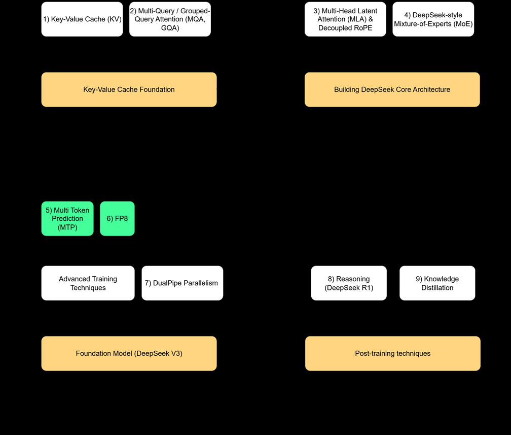

*图5.1 我们构建DeepSeek模型的四阶段旅程。本章聚焦于高亮显示的组件——Multi-Token Prediction（MTP）和FP8，它们是高级训练流程中的主要创新。*

本章结束我们旅程的第三阶段。通过实现这些高效训练技术，你将获得对现代LLM如何大规模训练的实际理解。这些知识不仅是理论性的；它提供了预训练功能性基础模型所需的最后一套工具，为本书最后部分将涵盖的对齐和蒸馏技术奠定了基础。

让我们从探索一次预测多个token这一强大思想开始。

## 5.1 核心思想：从单token预测到多token预测

到目前为止，我们讨论的语言模型的整个训练过程都基于一个简单的目标：Next-Token Prediction（下一个token预测）。在标准方法中，我们给模型一个输入token序列。这些token通过一系列Transformer块（"Shared Transformer Trunk"，共享Transformer主干）进行处理，对于每个输入token，模型的目标是预测紧随其后的那一个token。

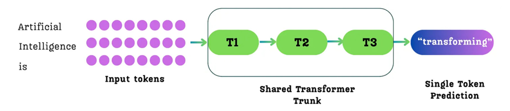

*图5.2 标准的单token预测过程。对于给定的输入token序列，模型仅在每个位置预测单个紧邻的下一个token。*

如图5.2所示，对于像"Artificial Intelligence is"这样的输入，模型处理这三个token。对于token"is"，其主要训练目标是预测单个下一个token"transforming"。虽然它也对其他token做出预测（例如，在"Artificial"之后预测"Intelligence"），但每个位置的学习信号仅聚焦于向未来一步的视野。

Multi-Token Prediction（多token预测），顾名思义，改变了这一基本目标。模型不再是仅预测单个下一个token，而是被训练为同时预测多个未来token。

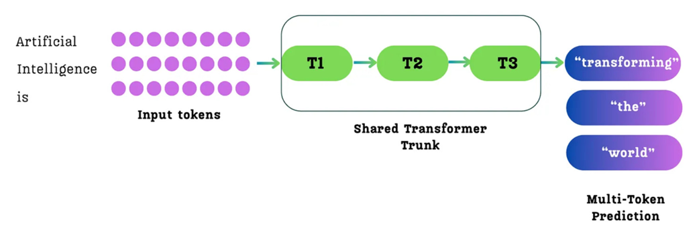

*图5.3 Multi-Token Prediction（MTP）过程。对于给定的输入token序列，模型被训练为从每个位置同时预测多个未来token。例如，从输入token"is"出发，它可能预测序列"transforming"、"the"、"world"。*

如图5.3所示，当模型处理输入"Artificial Intelligence is"时，它从每个token做出预测。在标准的单token方法中（图5.2），token"is"的主要目标将是仅预测下一个token"transforming"。有了MTP，任务被扩展了。从token"is"的位置出发，模型现在被要求预测一整个未来token序列："transforming"、"the"和"world"。然后根据它从该位置预测整个未来序列的好坏来计算损失。

这种从预测一个token到预测多个token的看似简单的改变，对模型的训练过程和最终能力有着深远的影响。它并非由DeepSeek发明，而是在Meta AI研究人员的一篇论文"Better and faster large language models via multi-token prediction"（https://arxiv.org/pdf/2404.19737）中进行了探索。DeepSeek采纳了这一强大的思想，并将其与自身独特的架构创新相结合。

## 5.2 MTP的四大关键优势

将训练目标从预测一个token改为预测多个token，不仅仅是微调；它从根本上改变了模型学习什么以及学习效率。这一架构转变带来了四大主要优势，正如原始MTP论文所展示并为DeepSeek所利用的那样。

### 5.2.1 训练信号的稠密化

第一个也是最重要的优势是，MTP提供了比单token预测更丰富、更稠密的训练信号。在传统训练中，对于每个token，模型基于其预测仅一步前进的能力接收梯度信号。它非常善于学习即时、局部的依赖关系（例如，"Intelligence"很可能跟在"Artificial"之后）。

有了MTP，学习信号更加全面。当模型处理token"Artificial"时，它不仅获得关于预测"Intelligence"的反馈，还获得关于其预见"is"、"transforming"、"the"和"world"能力的反馈。

这意味着从单个训练样本中，模型被迫学习更长范围的结构、语法和连贯性。它同时看到并学习跨多个未来步骤的关系。这种更丰富的梯度信息引导模型的内部表示朝向更好的序列规划和预测。训练过程变得更高效，因为每个训练样本现在包含更多信息供模型学习。

### 5.2.2 提高数据效率

训练信号的稠密化直接带来了第二个好处：提高数据效率。由于每个训练样本现在信息量更大，模型可以在相同的训练数据量下达到更高的性能水平。

这不仅是理论上的好处；它已被定量证明。原始MTP论文在标准编程基准测试如MBPP（Mostly Basic Python Problems）和HumanEval上展示了这一点，如图5.4所示。

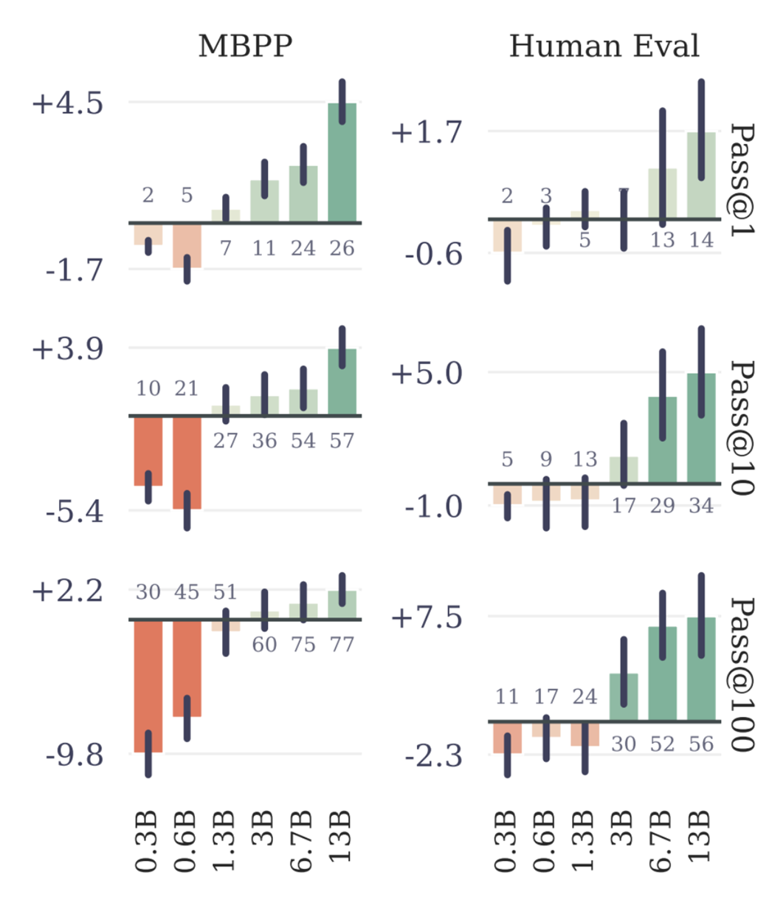

*图5.4 MTP在编程基准测试上相对于单token预测的性能提升。正条表示MTP更优。（来源：Gloeckle et al., 2024）*

数据清楚地显示，随着模型规模扩大（从0.3B到13B参数），MTP的性能优势变得更加显著和一致。这确立了MTP是提高数据效率的强大技术。然而，这引发了一个新问题：如果预测多个token是好的，我们应该预测多少个？同一研究通过改变预测的未来token数量（记为n）来探索这个问题。

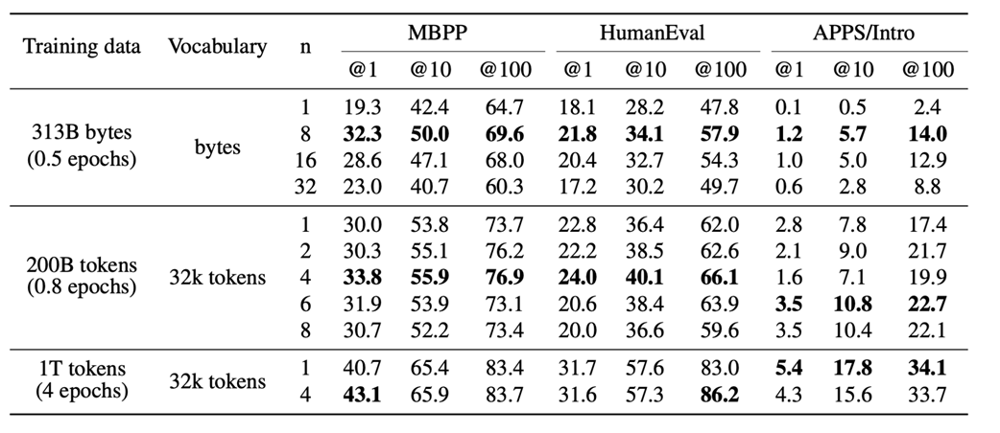

*图5.5 增加预测未来token数量（n）对基准测试性能的影响。（来源：Gloeckle et al., 2024）*

这些结果显示了两个清晰的趋势：

1. 如图5.4所示，虽然MTP在非常小的模型上有时表现更差，但随着模型规模增大，它持续且显著地超越单token基线。
2. 如图5.5所示，对于固定数量的训练数据，增加预测的未来token数量（n）通常会在这些基准测试上带来更好的性能，直到某个点。

这提供了强有力的证据，表明MTP允许模型从相同的数据中更有效地学习，这在庞大的、昂贵的数据集上训练时是一个关键优势。

### 5.2.3 通过优先处理"选择点"实现更好的规划

MTP的第三个优势更为微妙但极其强大：它通过迫使模型更加关注序列中最重要的token来隐式地教会模型更好地规划。

要理解这一点，我们需要引入"选择点"（choice point）的概念。选择点是序列中显著影响未来结果的关键token。大多数转换是简单且可预测的（例如，1 -> 2, 2 -> 3），但一些转换代表了上下文中的重大变化（例如，从数字转换到字母）。

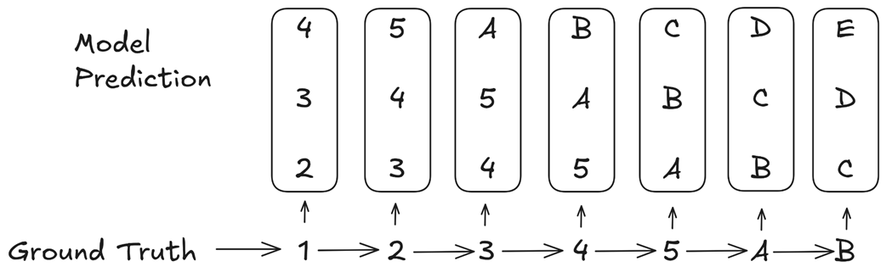

*图5.6 MTP隐式地为关键的"选择点"token分配更高的权重。（来源：Gloeckle et al., 2024）*

让我们分析图5.6中的例子。真实序列是1 -> 2 -> 3 -> 4 -> 5 -> A -> B。从5到A的转换是关键的"选择点"，其中模式从数字变为字母。

现在，考虑MTP损失是如何计算的。当模型看到输入token 3时，它被训练来预测接下来的三个token：4、5、A。与预测A相关的误差是输入3的损失计算的一部分。

当模型看到输入4时，它被训练来预测5、A、B。A的误差再次成为损失的一部分。当它看到5时，它被训练来预测A、B、C，A的误差第三次成为损失的一部分。

与预测关键token A相关的误差在整体损失计算中反复出现，远比简单、不关键的转换的误差频繁。这意味着多token预测损失隐式地为这些关键选择点分配了更高的权重。

因此，训练过程自然地优先确保这些关键的模式转换token被正确预测。这迫使模型发展出更好的内部表示来进行序列规划和预测，因为它学会识别并正确处理文本中最重要的决策点。

### 5.2.4 通过推测解码实现更高的推理速度

第四个也是最后一个优势是，MTP可以显著加快推理速度，在某些任务上观察到高达3倍的加速。这是通过一种叫做speculative decoding（推测解码）的技术实现的。在标准的自回归生成中，我们为每一个token运行一次完整的大语言模型。这安全但缓慢。

Speculative decoding的工作方式不同：

1. 起草：一个小型、快速的"draft"（草稿）模型（或MTP头）一次生成一块多个候选token。
2. 验证：主大语言模型然后在单次前向传播中处理整个块，验证哪些草稿token是正确的。

因为对一块token的单次前向传播比多次顺序前向传播快得多，这可以显著加速生成。MTP与这一过程天然契合，因为MTP头可以作为"草稿"模型，预测多个未来token供主模型验证。

需要注意的是，如DeepSeek V3论文中所述，他们主要在预训练期间使用MTP的好处来获得更稠密信号和更好规划的优势。对于他们的公开发布，推理是使用标准单token预测完成的，丢弃了MTP模块。然而，他们明确指出MTP模块可以重新用于speculative decoding以加速推理，突显了这一强大技术的双重好处。

## 5.3 DeepSeek MTP架构：可视化与数学详解

虽然Meta的原始MTP论文证明了该概念的有效性，但它通过使用独立的输出头来预测多个未来token。这意味着对第二个未来token的预测没有利用对第一个token预测的任何信息。

DeepSeek认识到了一个关键的改进机会。他们的实现被设计为顺序预测额外的token，并在每个预测深度保持完整的因果链。这意味着对未来token t+2的预测受到对token t+1预测的信息启发，创造了一个更连贯、更强大的预测机制。

让我们逐步分解他们的架构，从整个MTP过程的初始输入开始。

### 5.3.1 起点：共享Transformer主干

Multi-Token Prediction过程不是从原始输入token开始的。相反，它始于Transformer的主体已经处理了输入序列之后。一个输入序列（例如，"Artificial Intelligence is"）首先通过原始MTP论文所称的"Shared Transformer Trunk"（共享Transformer主干）。这就是我们已经熟悉的标准Transformer块堆栈（例如，DeepSeek-V3中的61个块）。

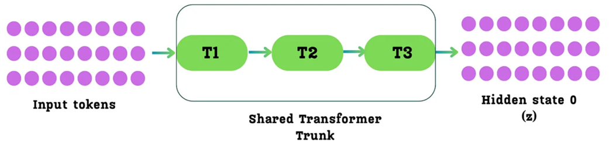

*图5.7 Multi-Token Prediction过程的初始步骤。输入token通过主"Shared Transformer Trunk"（共享Transformer主干），该主干由多个Transformer块组成。输出是隐藏状态的初始矩阵（记为h⁰或z），它作为MTP模块的起点。*

如图5.7所示，这个主干的输出是一个隐藏状态矩阵。让我们精确定义这个术语：

**什么是隐藏状态？** 隐藏状态是Transformer块输出的上下文向量的另一个名称。它是输入token经过处理并通过注意力机制从相邻token收集信息后得到的丰富的、上下文化的表示。

共享主干中最后一个Transformer块的输出是这些隐藏状态的矩阵，每个输入token对应一个。为了MTP的目的，我们将这个初始矩阵称为隐藏状态0，或h0，遵循DeepSeek论文中的符号。

这个h0矩阵是整个MTP过程的起点。它可以被视为一堆隐藏状态向量，输入序列中每个token对应一个。对于每个token，其对应的h⁰向量将被送入一链MTP模块来预测其未来。

### 5.3.2 MTP模块：顺序预测链

DeepSeek架构不是使用预测一个token的单一输出头，而是使用一系列MTP模块，每个我们想要预测的未来token对应一个。如果我们想预测3个未来token（预测深度D=3），我们将有3个MTP模块链接在一起。

这里的关键创新不仅在于这些模块是相互依赖的，还在于这种依赖是如何组织的。与具有独立预测头的方法不同，DeepSeek的模块形成了一个因果链。一个模块的精炼隐藏状态成为下一个模块的输入，允许模型在每个未来步骤顺序精炼其预测。这种级联潜在精炼架构使得预测机制如此强大和连贯。

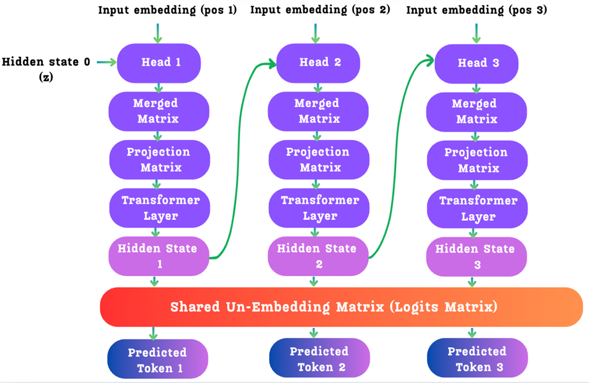

*图5.8 DeepSeek MTP模块的顺序架构。一个模块的隐藏状态作为输入传递给下一个，形成因果链。*

这张图是理解DeepSeek创新的关键。让我们跟踪单个输入token的h⁰向量进入这条链的旅程。我们将聚焦于单个MTP模块内部的操作，例如第一个模块，我们称之为Head 1（或k=1表示预测深度）。

每个MTP头是一套精密的机制，设计用于执行两项任务：

1. 预测一个未来token。
2. 生成一个新的、精炼的隐藏状态传递给链中的下一个头。

让我们深入了解单个头的内部来看看它如何实现这些。

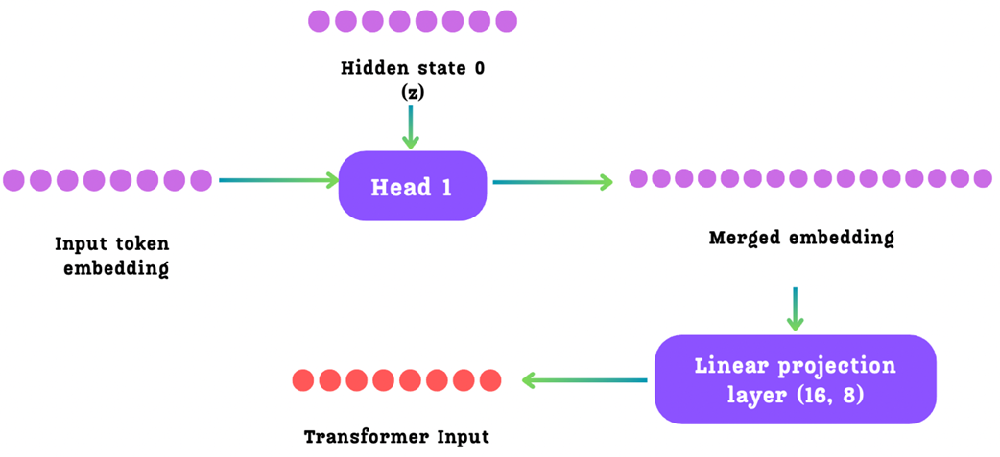

*图5.9 单个MTP头的内部操作。*

每个头(k)内的操作可以分解为以下步骤：

**步骤1：收集输入**

每个头k接收两个不同的输入：

- 来自前一个头的隐藏状态(hᵏ⁻¹)。对于Head 1，这是来自主Transformer主干的初始h⁰。
- 它试图预测的未来token的输入嵌入(Emb(tᵢ₊ₖ))。在训练期间，这是该未来token的真实嵌入。对于Head 1（预测token t+1），它使用token t+1的嵌入。

**步骤2：合并与投影**

这两个输入向量首先通过各自的RMS Norm层，然后连接形成一个合并嵌入。这个合并向量现在包含来自前一步的上下文信息和要预测的下一个token的语义信息。

这个合并向量现在具有两倍的标准维度(2d)，然后通过一个线性投影层（论文中记为Mₖ）将其投影回模型的标准维度(d)。这一步的输出是Transformer Input（Transformer输入）。

整个过程由DeepSeek V3论文的公式21描述。

**公式5.1**

𝒉'ᵢᵏ = Mₖ[RMSNorm(hᵢᵏ⁻¹); RMSNorm(Emb(tᵢ₊ₖ))]

这个公式精确描述了该过程：MTP模块内Transformer块的新输入[h]是通过将归一化的前一个隐藏状态和归一化的未来token嵌入的拼接([;])进行投影(Mₖ)来创建的。

**步骤3：MTP Transformer块**

投影后的向量[h]现在作为MTP模块内单个专用Transformer块(TRMₖ)的输入。


*图5.10 单个MTP模块内的Transformer块。该块将合并并投影后的向量（结合前一个隐藏状态和下一个token的嵌入）作为输入。然后执行完整的Transformer计算，为因果链中的下一步生成新的、精炼的隐藏状态。*

这是一个关键步骤。它不是简单的线性变换；它是一个完整的、深度的计算，涉及多头注意力和前馈网络。这允许模型对前一个隐藏状态和下一个token嵌入的组合进行复杂推理，有效地问："鉴于我目前的理解(hᵏ⁻¹ᵢ)，并知道下一个词是tᵢ₊ₖ，我新的、更新的理解是什么？"

这个Transformer块的输出是新的、精炼的隐藏状态hᵏᵢ。这个过程由论文的公式22描述。

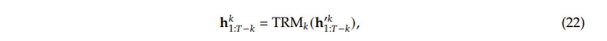

*图5.11 DeepSeek V3论文的公式22。*

**步骤4：生成输出**

这个新的隐藏状态hᵏᵢ现在服务于两个目的，完成闭环：

1. 它作为输入传递——Head 1的h¹成为Head 2的输入隐藏状态。Head 2的h²成为Head 3的输入，以此类推。这是使DeepSeek的MTP实现具有顺序性和强大性的因果链接。关键的是，传递整个精炼的隐藏状态提供了迄今为止序列的丰富、上下文化的摘要——远比单个预测的token ID能提供的信息多。这是DeepSeek因果MTP的关键优势，因为它允许每个后续模块基于对不断演变的上下文更深入的理解来做出预测。
2. 它也被传递到一个共享反嵌入矩阵。这是主模型和所有其他MTP头使用的相同的最终输出/logits层。该层将隐藏状态投影到完整的词汇空间，以产生第k个未来token的logits。

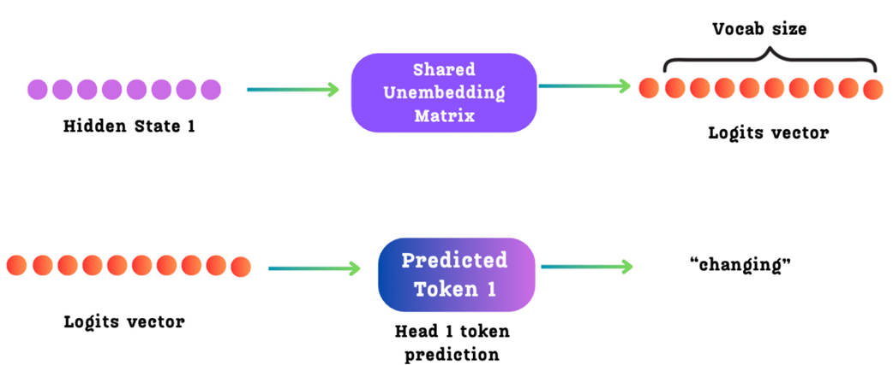

*图5.12 MTP模块内的最终预测步骤。MTP Transformer块生成的新隐藏状态被传递给"Shared Un-Embedding Matrix"（共享反嵌入矩阵）。这将隐藏状态投影到词汇空间以产生logits向量，从中选择该预测步骤的最终token。*

这个过程由论文的公式23描述。

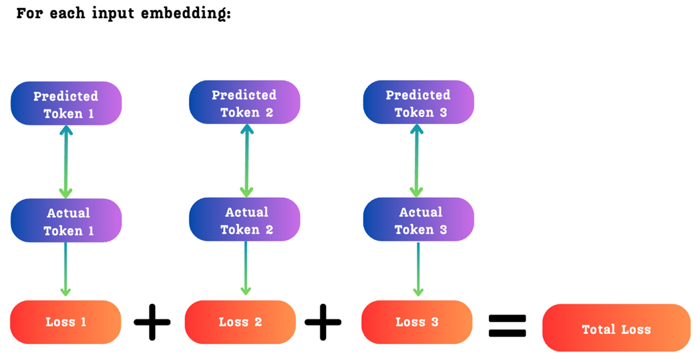

*图5.13 DeepSeek V3论文的公式23。*

该公式说明第k个未来token的概率分布P是通过将第k个MTP模块的隐藏状态通过输出头(OutHead)来生成的。

### 5.3.3 最终损失计算

整个顺序过程对D个预测深度中的每一个都执行。最后，对于单个输入token tᵢ，我们将有D个不同的预测token。在训练期间，我们将这D个预测与输入数据中的D个实际真实token进行比较。

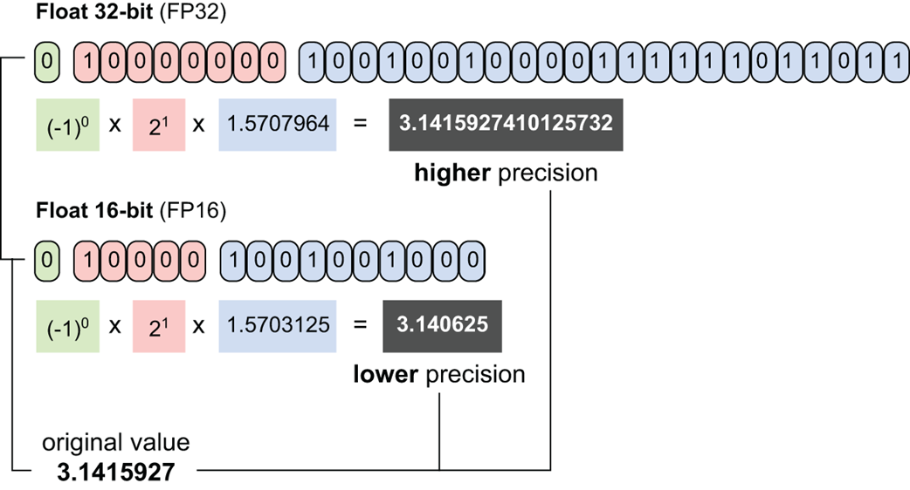

*图5.14 单个输入token的总损失是每个预测未来token的单独交叉熵损失之和。*

如图5.14所示，总损失就是每个预测深度的单独交叉熵损失之和。这意味着模型接收到丰富的、多方面的梯度信号，推动它不仅在即时下一个token预测上变得更好，也在长期预测上变得更好。

## 5.4 从零开始实现因果多token预测模块

我们现在已经探索了Multi-Token Prediction背后的理论，从其核心优势到DeepSeek先进因果架构的具体细节。虽然完整的大规模实现深度集成在复杂的训练框架中，我们可以通过在PyTorch中构建一个功能性的、独立的版本来巩固我们的理解。这种动手实践的方法将把我们刚研究的图表和公式转化为具体的代码。我们将分阶段构建整个MTP系统：

1. MTP模块：处理因果链中一步的核心组件。
2. 主模型：集成主Transformer主干和MTP模块链的包装类。
3. 前向传播与损失：顺序预测和组合损失计算的完整逻辑。

让我们从最重要的新组件开始：MTP模块本身。这个类是图5.9到5.13所示逻辑的直接实现。它接收来自前一步的隐藏状态和下一个token的嵌入，产生一个精炼的隐藏状态和一个预测。

我们首先定义两个关键组件。首先，我们将实现RMSNorm，这是DeepSeek架构中使用的特定归一化层。这是一个基础工具，确保训练期间的数值稳定性。你可以在本章的官方GitHub仓库中找到所有导入和辅助类。

接下来，我们将构建MTP架构的核心：DeepSeekMTPModule。它包含一个专用的Transformer块和必要的投影层。其目的是接收来自前一步的隐藏状态和下一个token的嵌入，为因果链中的下一步产生精炼的隐藏状态。

**代码清单5.1 从零开始实现Multi-Token Prediction模块**

```python
class RMSNorm(nn.Module):
    """
    Implements Root Mean Square Layer Normalization.
    """
    def __init__(self, d_model: int, eps: float = 1e-6):
        super().__init__()
        self.eps = eps
        self.weight = nn.Parameter(torch.ones(d_model))

    def forward(self, x: torch.Tensor) -> torch.Tensor:
        # Calculate the inverse square root of the mean of squares
        norm_x = x * torch.rsqrt(x.pow(2).mean(-1, keepdim=True) + self.eps)
        # Apply the learnable weight
        return self.weight * norm_x
```

现在我们有了DeepSeekMTPModule构建块，可以组装完整模型了。以下代码清单展示了我们的DeepSeekV3WithMTP类的初始化。

**代码清单5.2 因果MTP模块**

```python
class DeepSeekMTPModule(nn.Module):
    def __init__(self, d_model: int, nhead: int, dim_feedforward: int, dropout:
    float = 0.0):
        super().__init__()
        self.d_model = d_model
        self.projection_matrix = nn.Linear(2 * d_model, d_model, bias=False)  #A
        self.transformer_block = nn.TransformerEncoderLayer(  #B
            d_model=d_model,
            nhead=nhead,
            dim_feedforward=dim_feedforward,
            dropout=dropout,
            activation='gelu',
            batch_first=True,
            norm_first=True
        )
        self.norm_hidden = RMSNorm(d_model)  #C
        self.norm_embed = RMSNorm(d_model)  #C

    def forward(self, h_prev: torch.Tensor, future_token_embeds: torch.Tensor) ->
    torch.Tensor:
        h_normed = self.norm_hidden(h_prev)
        embed_normed = self.norm_embed(future_token_embeds)
        concatenated = torch.cat([h_normed, embed_normed], dim=-1)  #D
        h_prime = self.projection_matrix(concatenated)
        h_output = self.transformer_block(h_prime)  #E
        return h_output
```

#A 投影矩阵M_k，将拼接的2D向量映射回模型维度D。
#B 该MTP深度的标准专用Transformer块(TRM_k)。
#C 分别用于前一个隐藏状态和未来token嵌入的RMSNorm层，如官方公式中所规定。
#D 两个归一化输入沿特征维度拼接。
#E 投影后的向量由Transformer块处理，产生新的、精炼的隐藏状态。

请密切注意不同组件的组织方式。模型不仅包含一个，而是一个mtp_modules列表，每个预测深度对应一个。它还定义了主Transformer主干和所有MTP模块都将使用的共享嵌入和输出层，这是架构效率的关键方面。

**代码清单5.3 初始化完整的MTP模型架构**

```python
class DeepSeekV3WithMTP(nn.Module):
    def __init__(
        self,
        vocab_size: int,
        d_model: int,
        num_layers: int,
        nhead: int,
        num_mtp_heads: int,     # D (number of MTP depths)  #A
        dim_feedforward: int,
        dropout: float = 0.0,
        mtp_loss_weight: float = 0.1
    ):
        super().__init__()
        # ... (store parameters) ...
        # Shared components used across the model
        self.shared_embed = nn.Embedding(vocab_size, d_model)  #B
        self.shared_lm_head = nn.Linear(d_model, vocab_size, bias=False)  #C
        # Main transformer backbone (Shared Transformer Trunk)
        self.blocks = nn.ModuleList([  #D
            nn.TransformerEncoderLayer(
                d_model=d_model, nhead=nhead, dim_feedforward=dim_feedforward,
                dropout=dropout, activation='gelu', batch_first=True,
                norm_first=True
            )
            for _ in range(num_layers)
        ])
        self.norm_f = RMSNorm(d_model)
        # Weight tying between embedding and output head
        self.shared_lm_head.weight = self.shared_embed.weight
        # The chain of MTP modules
        self.mtp_modules = nn.ModuleList([  #E
            DeepSeekMTPModule(d_model, nhead, dim_feedforward, dropout)
            for _ in range(num_mtp_heads)
        ])
        # ... (forward method comes next) ...
```

#A 参数num_mtp_heads对应D，即要预测的未来token数量。
#B 单个共享token嵌入层。
#C 单个共享输出头（反嵌入层），将隐藏状态投影到logits。
#D 主Transformer块堆栈，称为"Shared Transformer Trunk"（共享Transformer主干）。
#E DeepSeekMTPModule实例列表，创建MTP的顺序链。

模型结构初始化完成后，我们现在可以实现forward方法。这是整个顺序MTP过程得以实现的地方。逻辑遵循清晰的顺序：

1. 输入token首先通过主Transformer主干产生初始隐藏状态h_main。
2. 模型然后进入一个循环，遍历链中的每个MTP模块。
3. 在循环内部，对于每个预测深度k，它使用来自前一步的隐藏状态(h_prev)和第k个未来token的真实嵌入来生成新的隐藏状态h_curr。
4. 从h_curr计算第k个未来token的logits。
5. 最后，总损失计算为主下一个token预测损失和所有MTP损失加权平均之和。

**代码清单5.4 MTP前向传播与组合损失计算**

```python
# ... (inside the DeepSeekV3WithMTP class) ...
def forward(self, input_ids: torch.Tensor, targets: Optional[torch.Tensor] =
None):
    B, S = input_ids.shape
    # ... (other setup) ...
    # --- Main model forward pass ---
    x = self.get_embedding(input_ids)
    # ... (pass through self.blocks) ...
    h_main = self.norm_f(x)
    logits_main = self.get_output_logits(h_main)
    all_logits = [logits_main]

    h_prev = h_main  #A
    # --- MTP chain: Sequential prediction ---
    for depth_k in range(1, self.num_mtp_heads + 1):
        L = S - depth_k  #B
        if L <= 0: break
        h_prev_sliced = h_prev[:, :L, :]  #C
        future_token_ids = input_ids[:, depth_k:depth_k + L]
        future_token_embeds = self.get_embedding(future_token_ids)  #D
        h_curr = self.mtp_modules[depth_k - 1](h_prev_sliced,
        future_token_embeds)  #E
        logits_k = self.get_output_logits(h_curr)
        all_logits.append(logits_k)
        h_prev = h_curr  #F
    # --- Loss computation ---
    loss = None
    if targets is not None:
        # ... (loss calculation logic) ...
        total_loss = # ... Main model loss ...
        for k, logits_k in enumerate(all_logits[1:], start=1):
            # ... (calculate loss for MTP depth k) ...
```

#A 主干干的输出作为MTP链的初始隐藏状态。
#B 序列长度L在每个深度k缩减，因为可预测的未来token更少。
#C 对前一个隐藏状态进行切片以匹配当前序列长度。
#D 收集当前深度k处未来token的真实嵌入。
#E 核心MTP步骤：调用k-1模块产生新的隐藏状态。
#F 因果链接：输出隐藏状态成为下一次迭代的输入。
#G 实现最终损失公式，对MTP损失取平均并乘以权重λ。

```python
mtp_loss_sum += loss_mtp_k
# Final loss: L = L_main + ( λ /D) * Σ (L_MTP^k)
if self.num_mtp_heads > 0 and mtp_loss_sum > 0:
    mtp_loss_weighted = (self.mtp_loss_weight / self.num_mtp_heads) *
    mtp_loss_sum  #G
    total_loss += mtp_loss_weighted
    loss = total_loss
return {"logits_all": all_logits, "loss": loss}
```

**代码清单5.5 验证因果MTP实现**

```python
def verify_deepseek_v3_mtp():
    # --- Model configuration ---
    vocab_size = 1000
    d_model = 128
    num_layers = 6
    nhead = 8
    num_mtp_heads = 3  # D=3 (predict next 3 tokens)  #A
    dim_feedforward = 512
    mtp_loss_weight = 0.1
    model = DeepSeekV3WithMTP(
        vocab_size=vocab_size, d_model=d_model, num_layers=num_layers,
        nhead=nhead, num_mtp_heads=num_mtp_heads,
        dim_feedforward=dim_feedforward, mtp_loss_weight=mtp_loss_weight
    )
    print(f"Model created with {sum(p.numel() for p in
    model.parameters())/1e6:.2f}M params")
    # --- Test data ---
    batch_size = 2
    seq_len = 20
    input_ids = torch.randint(0, vocab_size, (batch_size, seq_len))  #B
    # --- Forward pass and output verification ---
    outputs = model(input_ids, targets=input_ids)
    all_logits = outputs['logits_all']
    loss = outputs['loss']
    print("\nLogits shapes:")
    for i, logits in enumerate(all_logits):  #C
        pred_type = "Main" if i == 0 else f"MTP k={i}"
        print(f"  {pred_type:10}: {list(logits.shape)}")
    print(f"\nTotal loss: {loss.item():.4f}")  #D
```

#A 我们将MTP头数（预测深度）设为3。
#B 序列长度为20的虚拟批次输入数据。
#C 遍历输出logits列表以打印每个logits的形状。
#D 打印最终的组合损失值。

运行此脚本会产生以下输出。注意logits张量的序列长度（中间维度）在每一步减少一，确认我们的因果链实现正确。

```
Model created with 2.01M params

Logits shapes:
  Main      : [2, 20, 1000]
  MTP k=1   : [2, 19, 1000]
  MTP k=2   : [2, 18, 1000]
  MTP k=3   : [2, 17, 1000]

Total loss: 109.1470
```

至此，我们已经成功实现了DeepSeek的Multi-Token Prediction架构的核心逻辑。我们已经看到如何使用专用Transformer块的因果链来预测一个未来token的视野，提供更丰富的训练信号和更好规划与预测的强大机制。

## 5.5 量化：以精度换取速度和内存

我们已经完成了对DeepSeek模型高层架构支柱的探索：Multi-Head Latent Attention、Mixture of Experts和Multi-Token Prediction。这些创新定义了模型计算什么。现在，我们将注意力转向一个同样重要的主题，它定义了这些计算如何以惊人的效率执行：FP8 Quantization（FP8量化）。

这个主题是理解DeepSeek如何以竞争对手一小部分的成本训练和运行670亿参数模型的最后关键。正如我们将看到的，他们的量化方法是一种复杂的多方面策略，推动了低精度训练的边界。虽然"低精度"听起来像是一种妥协，但它是解锁速度和内存效率巨大增益的基本权衡，使大规模训练成为可能。

我们将首先建立坚实的基础，理解量化是什么以及为什么它是必要的。然后，我们将解构构成DeepSeek FP8训练框架的五大创新。

### 5.5.1 什么是量化？

从本质上说，大语言模型中的每个参数、每个矩阵中的每个权重、每层中的每个偏置都只是一个数字。默认情况下，计算机以很高的精度存储这些数字，通常使用一种叫做32-bit floating-point（32位浮点，FP32）的格式。


*图5.15 以32位浮点（FP32）与16位浮点（FP16）表示的数字的视觉比较。该图说明了分配给指数和尾数的比特数的减少，这导致了更低的精度和更小的内存占用。*

如图5.15所示，一个FP32数字使用32位内存来表示一个值。这允许非常高的精度（很多小数位）和巨大的动态范围（表示非常大和非常小的数字的能力）。

Quantization（量化）是降低这种精度的过程。它是一种将模型参数从较高位宽转换为较低位宽的技术。例如，我们可能将模型从FP32量化到FP16，这意味着每个参数现在仅使用16位内存而不是32位。

这背后的直觉最好通过类比来理解。

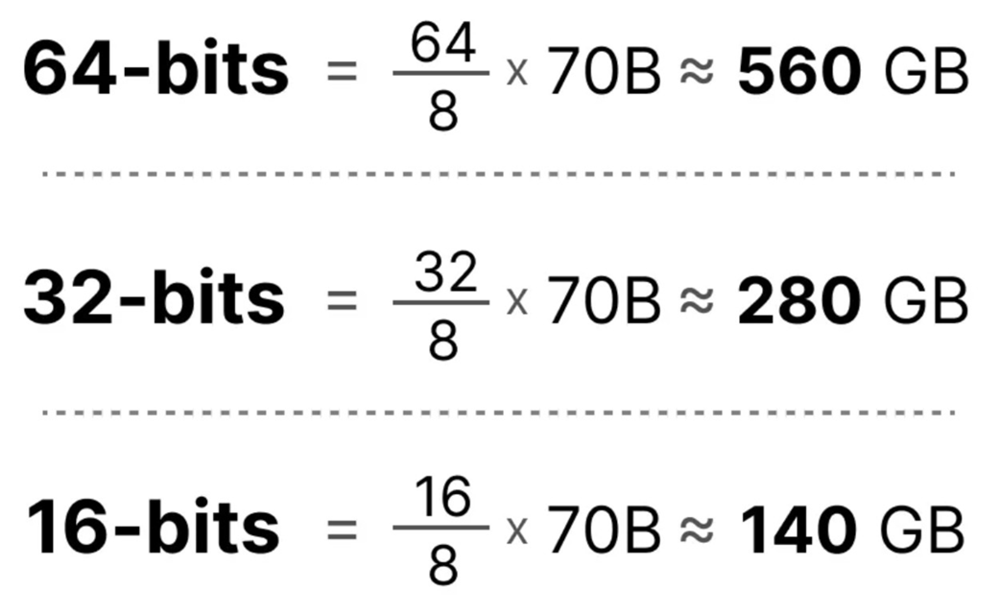

*图5.16 量化后的图像使用远更少的颜色（更少的信息/精度），但仍能有效表示原始图像。*

如图5.16所示，原始图像使用大量的颜色调色板来以完美的保真度表示每个细节。量化后的图像仅使用8色的有限小调色板。虽然近距离检查会揭示细节的损失（像素化），但整体图像仍然清晰可辨。

量化对神经网络做的是同样的事情。它减少了模型可以使用的数字"调色板"。虽然这导致每个参数的精度略有损失，但模型的整体性能通常保持得相当稳健。

### 5.5.2 为什么要量化？高精度参数的内存成本

量化的主要动机是解决与大语言模型相关的巨大内存和计算成本。以高精度存储数十亿参数的代价极其高昂。

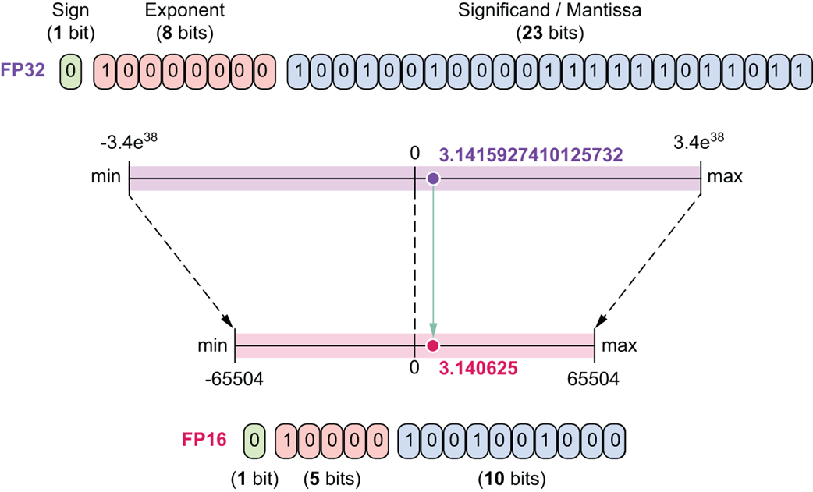

*图5.17 700亿参数模型量化的内存节省。计算表明，将数值精度从64位降低到32位，并进一步到16位，如何显著减少存储模型权重所需的总内存。*

如图5.17所示，内存节省是巨大的。通过将70B参数模型从32位量化到16位，我们将其内存需求减半，从惊人的280GB降至更可管理的140GB。这种内存减少带来两个直接好处：

1. 更快的训练和推理：更小的参数意味着需要从GPU主内存移动到其计算核心的数据更少，这显著加速了每次计算。
2. 可及性：它允许在内存较少的硬件上运行更大的模型。

这是量化的核心交易：我们用少量、通常可接受的精度损失换取内存效率和计算速度的巨大增益。

### 5.5.3 理解数值格式：量化的构建模块

要理解DeepSeek框架的具体细节，我们首先需要熟悉深度学习中常用的不同数字"调色板"或数值格式。每个浮点数在内存中使用三个不同的部分来表示：

- **符号（1位）**：最简单的部分。这单个位决定数字是正（0）还是负（1）。
- **指数**：这些位决定数字的数量级或动态范围。它们通过定义小数点（二进制中）的位置来控制数字可以有多大或多小。更多指数位意味着格式可以表示更广泛的数字范围（例如，从非常接近零到极大）。
- **尾数（或有效数字）**：这些位决定数字的精度。它们表示数字的实际数字。更多尾数位意味着格式可以存储更多有效数字，从而产生更高的精度和可表示数字之间更小的间隔。

让我们看看这些组件在最常见格式中是如何平衡的。

**FP32（32位浮点）**

这是我们的高精度基线。它使用1个符号位、8个指数位和23个尾数位。其大量的尾数位赋予它非常高的精度，8个指数位赋予它巨大的动态范围。

**FP16（16位浮点）**

这是最早的流行降低内存格式之一。它使用1个符号位、5个指数位和10个尾数位。

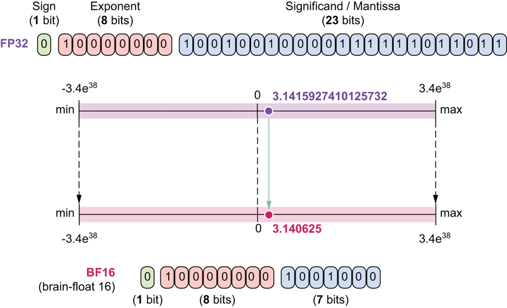

*图5.18 FP32和FP16的比较。*

如图5.18所示，FP16大幅减少了指数和尾数的位数。因此，其范围和精度都显著小于FP32。虽然内存高效，但有时会遭受溢出（数字变得太大超出其有限的指数范围）或下溢（数字变得太小而丢失细节）。

**BF16（16位"Brain Float"）**

这是Google开发的一种巧妙格式，旨在在训练中获得两全其美。它使用1个符号位、8个指数位和7个尾数位。

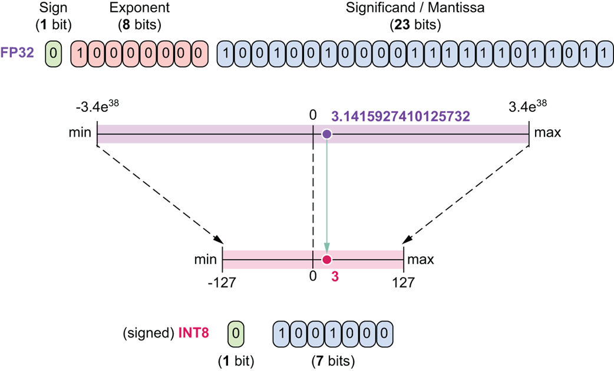

*图5.19 FP32和BFloat16的比较。*

如图5.19所示，BF16使用与FP32相同的8个指数位，赋予它相同的巨大动态范围。它通过将尾数减少到仅7位来节省内存，这意味着它的精度甚至低于FP16。这种格式非常适合训练，因为其宽范围使其对溢出问题具有很强的抵抗力。

**INT8（8位整数）**

这是一种更激进的量化格式。它使用1个符号位和7位值，没有小数精度。

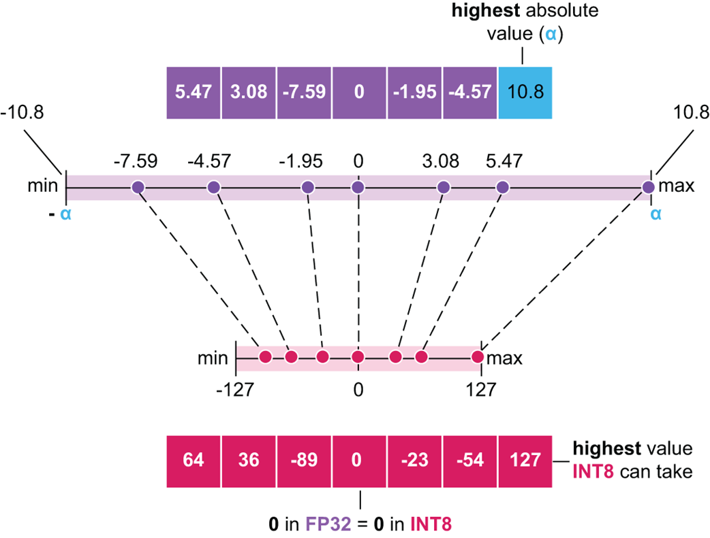

*图5.20 FP32和INT8的比较。*

如图5.20所示，其范围极小，从-127到127。虽然非常高效，但如果原始数字范围很宽，转换为INT8可能导致更显著的信息损失。

**FP8（8位浮点）**

最后，DeepSeek策略核心的格式是FP8。它是一种8位格式，与INT8不同，它仍然保留了符号、指数和尾数（例如，E4M3具有4个指数位和3个尾数位）。它在INT8的极端效率和浮点数的灵活性之间提供了折中。

### 5.5.4 基本机制：缩放

我们如何实际将高精度FP32数字向量转换为像INT8这样的低精度格式？这个过程叫做scaling（缩放）。核心思想是将原始数字的范围映射到新格式的目标范围，而不丢失它们之间的相对关系。

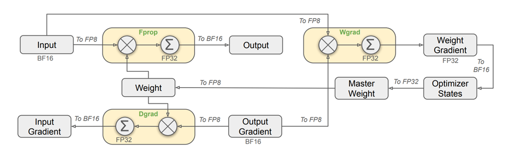

*图5.21 量化的缩放过程。FP32张量的原始范围被映射到INT8格式的目标范围。*

如图5.21所示，该过程涉及几个简单的步骤：

1. 找到最大绝对值(α)：我们首先扫描整个输入向量（或张量）并找到具有最大绝对值的数字。在这个例子中，它是10.8。这个值α定义了我们原始数据的有效范围，从-α到+α。
2. 计算缩放因子：我们想要将这个原始范围映射到INT8格式的目标范围，即-127到127。缩放因子就是target_range_max / original_range_max，即127 / 10.8。
3. 量化：我们将原始向量中的每个数字乘以这个缩放因子，然后四舍五入到最接近的整数。例如，数字-7.59变为round(-7.59 * (127 / 10.8))，结果为-89。这个新整数就是量化表示。
4. 反量化：为了在计算中使用而恢复原始数字（会有一些精度损失），我们只需执行逆操作：将量化整数除以相同的缩放因子。例如，-89 / (127 / 10.8)大约得到-7.59。

这种基于张量中最大值找到缩放因子的概念是理解DeepSeek所用高级技术的最重要前提。正如我们将看到的，他们的第一个重大创新——细粒度量化——是一种巧妙地应用这一基本缩放原理的新方法。

### 5.5.5 DeepSeek FP8训练的五大支柱

现在我们对量化是什么以及涉及的不同数值格式有了坚实的基础理解，我们可以深入了解DeepSeek实现的具体细节。他们的方法不是单一技术，而是一个复杂的多方面框架，由五大关键创新组成，这些创新协同工作，在超低FP8精度下实现稳定且高效的训练。

这五大支柱是：

1. 混合精度框架（Mixed Precision Framework）
2. 细粒度量化（Fine-Grained Quantization）
3. 提高累加精度（Increasing Accumulation Precision）
4. 尾数优先于指数（Mantissa Over Exponents）
5. 在线量化（Online Quantization）

让我们逐一解构每个支柱，解释它们解决的问题以及如何实现，包括可视化方式和数学方式。

### 5.5.6 支柱1：混合精度框架

DeepSeek策略的第一个也是最基础的支柱是混合精度框架（Mixed Precision Framework）。

**核心思想：并非所有数字生而平等**

混合精度背后的核心洞察是，并非神经网络中的所有操作或存储值都需要相同的数值精度。为一个不需要它的值使用具有很多小数位的32位数字将是低效的，就像为一个对微小误差高度敏感的值使用低精度数字将是错误的一样。

因此，混合精度框架是一个策略性系统，对训练过程的不同部分使用不同的数值格式。目标是获得两全其美：

- 对绝大多数计算（如大规模矩阵乘法）使用低精度格式（如FP8），以最大化速度和最小化内存使用。
- 对最敏感和最关键的组件（如更新模型的主权重）使用高精度格式（如FP32），以确保训练过程保持稳定和准确。

DeepSeek的框架是智能平衡这些权衡的大师级作品。让我们逐步了解它如何处理标准线性层在完整前向和反向传播中的不同操作。

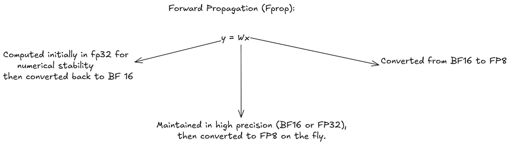

*图5.22 线性算子中使用FP8数据格式的混合精度框架。该图说明了数据流经线性层的过程，展示了输入和权重如何被转换为低精度FP8以进行快速计算，而关键组件如主权重和梯度则保持在高精度FP32以确保稳定性。*

这张图看起来很复杂，但它只是可视化了神经网络层计算的四个关键阶段的数据流。让我们分解每个阶段。

**A. 前向传播（Fprop）**

前向传播是标准的预测步骤，其中output = weights * input。这是推理期间发生的主要计算。

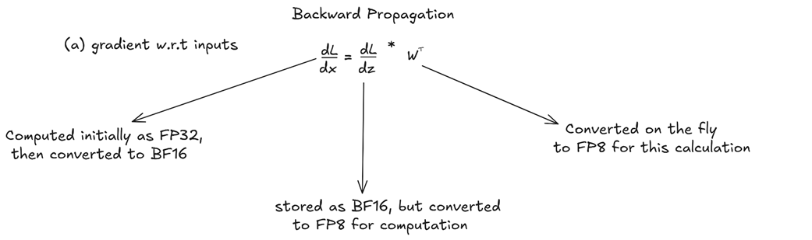

*图5.23 前向传播的数据流和精度格式。*

如图5.23所示，使用了策略性的精度组合：

- 输入(x)：来自前一层的输入激活通常存储在BF16中。对于实际的乘法，它们即时转换为高效的FP8格式。
- 权重(W)：权重的主要"主副本"以高精度FP32（或BF16）维护。对于乘法，这些权重也即时转换为FP8。
- 输出(y)：FP8 x FP8乘法的结果以完整FP32累加，以防止数值错误并保持稳定性。然后这个高精度结果立即转换回BF16进行内存存储。

为什么这种组合？繁重的矩阵乘法以最快、最低精度的格式（FP8）完成，而最终结果以更高精度格式累加和存储，以防止信息丢失。

**B. 反向传播：对输入的梯度（Dgrad）**

前向传播之后，模型计算其误差，学习过程开始。反向传播涉及计算告诉每个权重如何更新以减少误差的梯度信号。这个过程更复杂，涉及为我们的y = Wx层计算两个主要梯度：对输入的梯度（dgrad）和对权重的梯度（wgrad）。

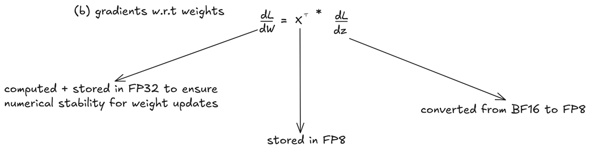

*图5.24 Dgrad计算的数据流。*

对输入的梯度dL/dx是继续反向传播到上一层所需要的。它使用链式法则计算：

dL/dx = (dL/dz) * Wᵀ

这里，dL/dz是来自下一层的梯度，Wᵀ是权重矩阵的转置。DeepSeek在这里应用了类似的混合精度策略：

- 入梯度(dL/dz)，存储为BF16，被转换为FP8进行计算。
- 原始权重矩阵(W)，以高精度存储，也即时转换为FP8进行此计算。
- 结果梯度dL/dx使用FP32累加器计算，然后存储为BF16以传递回上一层。

注意与前向传播的对称性：核心操作是FP8以获得速度，但在层之间传递的结果保持在更稳定的BF16格式中。

**C. 反向传播：对权重的梯度（Wgrad）**

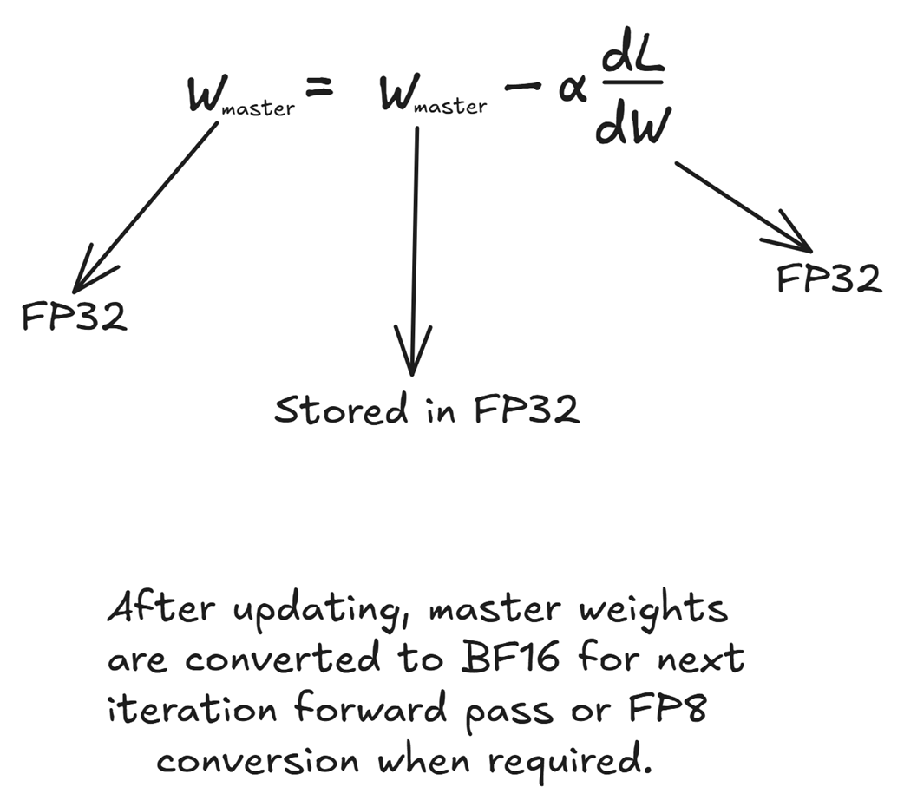

*图5.25 Wgrad计算的数据流。*

这是最关键的梯度，因为它将用于更新模型的实际知识。梯度dL/dW告诉模型如何调整其权重。它计算为：

dL/dW = xᵀ * (dL/dz)

这里，精度策略改变为优先考虑准确性。嘈杂或不精确的权重梯度可能破坏整个训练过程的稳定性。因此，DeepSeek做出了一个关键决策：

- 前向传播期间存储在FP8中的层输入(x)在这里被使用。
- 入梯度(dL/dz)从BF16转换为FP8。
- 结果权重梯度dL/dW被计算，最重要的是，以完整FP32精度存储。

这是"混合"精度框架的关键部分。虽然其他梯度可以存储在BF16中，但权重梯度保持最高保真度，以确保对模型核心参数的更新尽可能准确。

**D. 权重更新**

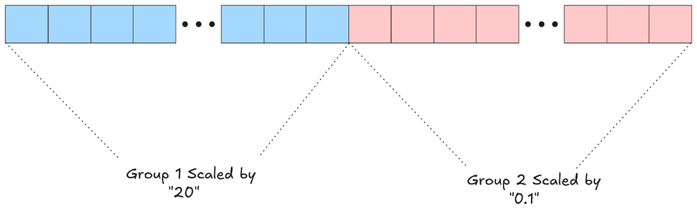

*图5.26 权重更新步骤完全在高精度FP32中执行。*

最后，优化器使用高精度权重梯度来更新主权重。

W_master_new = W_master_old - learning_rate * (dL/dW)

因为这一步直接修改模型的永久知识，稳定性至关重要。因此，此操作的所有组件都保持在FP32中：

- 主权重存储在FP32中。
- 权重梯度(dL/dW)已经在FP32中。
- 优化器的内部状态（如AdamW中的动量和方差）也保持在FP32中。

整个更新在高精度中进行。W_master_new计算完成后，存储这个FP32版本。对于下一次训练迭代的前向传播，这些主权重将再次即时转换为FP8，完成循环。

通过将所有三个主要GEMM（通用矩阵乘法）操作（Fprop、Dgrad、Wgrad）的输入和权重转换为FP8，DeepSeek最大化了吞吐量并利用了现代硬件的全部能力。这提供了相比BF16操作高达2倍的加速。

他们识别了训练循环中最敏感的部分。主权重和优化器状态保持在FP32中，以防止误差累积并确保稳定学习。层间激活和梯度（y和dL/dx）保持在BF16中，提供了比FP32更内存高效但比FP8更安全的稳健中间地带。

DeepSeek团队更进一步。他们识别出Transformer架构中的某些模块对量化误差比其他模块更敏感。因此，他们选择将这些特定模块保持在更高精度（BF16），完全绕过FP8量化。这些敏感组件包括：

- 嵌入模块（包括token和位置嵌入）
- 最终输出头（投影到词汇表）
- Mixture-of-Experts（MoE）门控模块
- 归一化层（如RMSNorm）
- 注意力算子（特别是softmax和上下文向量计算）

这种高速、低精度计算与关键组件高精度存储的平衡，使DeepSeek能够以更少的内存更快地训练庞大模型，而不会陷入困扰简单低精度训练方法的不稳定性。它是FP8框架其他四个支柱建立的基础。

### 5.5.7 支柱2：细粒度量化

混合精度框架定义了模型内特定操作使用哪些数值格式。第二个支柱——细粒度量化（Fine-Grained Quantization）解决了如何以保留尽可能多信息的方式将数字从高精度格式（如BF16）转换为低精度格式（如FP8）。

正如我们在5.5.4节中所介绍的，这种转换的标准机制是缩放。我们找到整个张量中的最大绝对值，并使用该值将张量中的每个数字缩放到目标范围（如FP8的范围），但这确实带来一个问题。

**标准量化中异常值的问题**

这种标准的、张量级缩放方法有一个主要弱点：它对异常值极其敏感。即使是一个庞大张量中的单个大值也可能大幅降低所有其他值的精度。

让我们用一个具体数值例子来说明。假设我们有一个小的激活输出向量，想要量化为8位整数格式（范围-127到127）：[2.0, 3.0, 500.0]。500.0异常值的存在完全破坏了其他值的精度：

1. 找到最大绝对值(α)：最大绝对值是α = 500.0。
2. 计算缩放因子(s)：要将范围[-500, 500]映射到[-127, 127]，我们的缩放因子是s = 127 / 500 = 0.254。
3. 量化：我们将每个元素乘以s并四舍五入到最接近的整数：
   - round(2.0 * 0.254) = round(0.508) = 1
   - round(3.0 * 0.254) = round(0.762) = 1
   - round(500.0 * 0.254) = round(127.0) = 127

   结果量化向量为[1, 1, 127]。2.0和3.0之间的关键区别被完全抹除了。
4. 反量化：当我们通过除以s转换回来时，得到[1/0.254, 1/0.254, 127/0.254]，大约为[3.94, 3.94, 500.0]。

前两个值的相对误差是灾难性的（分别为97%和31%），而异常值几乎完美恢复。这是大语言模型中的一个关键问题，其中激活值可能具有巨大的动态范围。

**DeepSeek的解决方案：分组独立缩放**

为了解决这个问题，DeepSeek实现了一种叫做细粒度量化（Fine-Grained Quantization）的技术。这个想法极其简单：如果整个张量的单个缩放因子有问题，为什么不将张量分成更小的块并为每个块使用单独的缩放因子？

DeepSeek不再为整个张量计算一个最大值，而是将张量分成更小的块（或"组"或"瓦片"），并为每个块独立计算一个单独的缩放因子。这种策略对激活和权重——我们核心矩阵乘法操作的两个输入——不同地应用。

**激活（输入）的细粒度量化**

首先，让我们考虑激活，即给定层的输入向量。大模型中的激活向量可能非常长（例如，DeepSeek-V3中维度为7168）。要量化它，DeepSeek将其分解为更小的、连续的组。

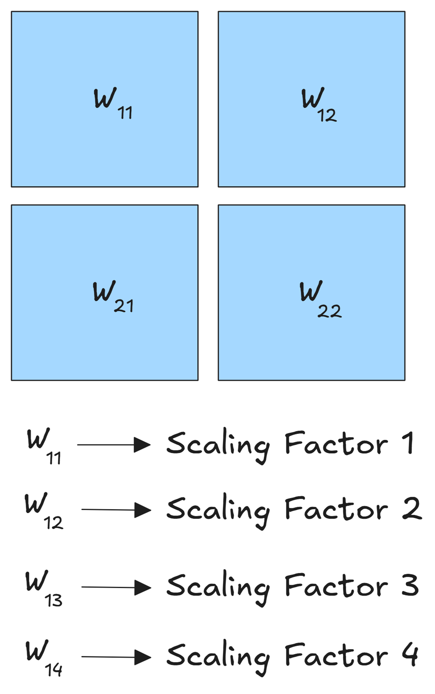

*图5.27 激活向量的细粒度量化。向量被划分为更小的组。每个组基于该组内的最大值独立缩放，为不包含大异常值的组中的值保留精度。*

如图5.27所示，一个组中的异常值不再影响其他组。假设组1包含最大值为"20"的值，而组2包含最大值仅为"0.1"的更小值。使用细粒度量化：

- 组1中的所有元素按20缩放。
- 组2中的所有元素按0.1缩放。

组2中的小值现在被适当缩放，保留了它们的相对差异，确保它们不会被组1中的异常值"压扁"到接近零。这种每组缩放对于保持模型内部表示的保真度至关重要。在他们的实现中，DeepSeek对激活使用128个元素的组大小（Nc），意味着激活向量每128个通道获得自己的私有缩放因子。

**权重的细粒度量化**

类似的原则适用于权重矩阵，但适应了其二维结构。一个大权重矩阵不被视为一个单一整块。相反，它被划分为更小的2D"瓦片"或"块"。

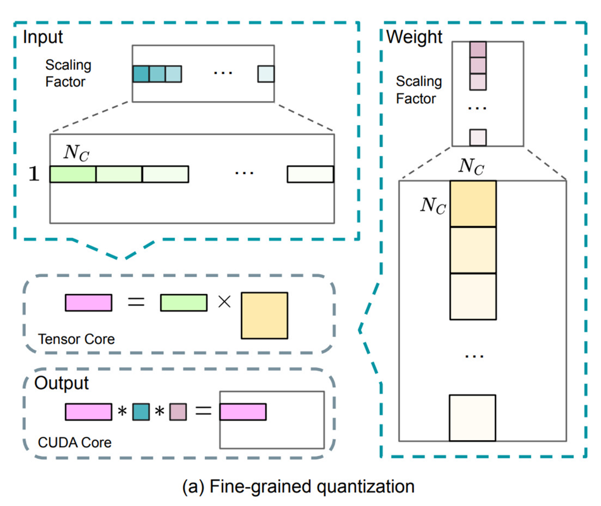

*图5.28 权重矩阵的细粒度量化。矩阵被划分为更小的块（如W₁₁、W₁₂等），每个块以其自己独特的缩放因子独立量化。*

如图5.28所示，矩阵W可能被分解为四个块：W₁₁、W₁₂、W₂₁和W₂₂。每个块完全独立地量化：

- W₁₁按缩放因子1缩放，基于其自身内部最大值。
- W₁₂按缩放因子2缩放，基于其最大值。
- ……其他块以此类推。

这种权重的分块方法确保如果矩阵某个区域中的少数参数学到了非常大的值，它们不会降低其余块中数百万其他权重的精度。对于他们的FP8框架，DeepSeek使用128x128的块大小。

**完整机制的实际运作**

现在我们可以理解DeepSeek团队呈现的完整流程图了。它可视化了这两个细粒度输入如何组合。

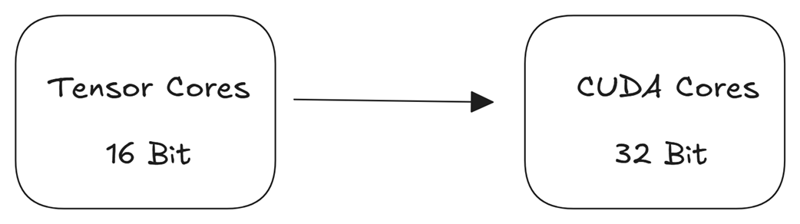

*图5.29 完整的细粒度量化工作流程。*

1. 输入（激活）：输入向量显示在左上角。它被划分为大小为Nc的块。为每个块计算一个唯一的缩放因子（由不同深浅的青色/绿色表示）。
2. 权重：权重矩阵显示在右上角。它被划分为大小为Nc的块（在这种情况下，Nc x Nc）。每个块获得自己的缩放因子（不同深浅的粉色/紫色）。
3. Tensor Core计算：核心矩阵乘法（输出=输入×权重）在专门的、高速的Tensor Core上执行。该操作以量化的FP8值作为输入，产生一个低精度的中间输出（粉色矩形）。
4. CUDA Core反量化：最后一步发生在通用CUDA Core上。来自Tensor Core的低精度输出被反量化。这是通过将其与来自输入和权重的相应缩放因子相乘来完成的，以恢复其原始量级（尽管有一些精度损失）。这个最终的、高精度的输出随后准备好用于框架的下一阶段。

通过将量化过程分解为细粒度的、独立的块，DeepSeek确保数值精度在局部级别得到保持，使整个训练过程对LLM中常见的波动和高动态范围值更加鲁棒。这种简单的"分而治之"策略是大规模稳定FP8训练的关键使能因素之一。

### 5.5.8 支柱3：提高累加精度

第三个支柱解决了现代GPU中一个微妙但关键的硬件限制。虽然GPU非常擅长执行低精度矩阵乘法（如FP8 x FP8），但它们在乘法过程本身期间用于中间结果的精度是有限的。

**问题：累加器中的精度丢失**

让我们重新审视矩阵乘法Y = WX。为了计算输出矩阵Y中的单个元素，我们执行点积：我们将W的一行和X的一列中的对应元素相乘，然后将所有这些乘积相加（或累加）。

Y_ij = W_i1*X_1j + W_i2*X_2j + ... + W_ik*X_kj

当W和X是FP8格式时，每个单独的乘积(W_in*X_nj)被计算。GPU的专用硬件——称为Tensor Core——然后需要将这些乘积加起来。保存这个运行和的内部存储器寄存器称为累加器（accumulator）。

问题在于，在现代硬件如NVIDIA的H800 GPU上，这个内部累加器的精度有限（例如，约14位），显著低于标准的32位（FP32）精度。如果矩阵乘法的内维度k非常大（例如，4096或更多，这在LLM中很常见），我们正在累加数千个这些小乘积。如果累加器没有足够的精度，我们可能遇到下溢问题，其中中间和太小而无法准确表示，最终结果可能有显著的数值误差，高达2%。这可能严重影响模型的准确性。

**DeepSeek的解决方案：提升到CUDA Core**

为了解决这个问题，DeepSeek实现了一种叫做"提升到CUDA Core"（promotion to CUDA Cores）的策略。核心思想是利用现代GPU上可用的两种不同类型的计算单元。Tensor Core高度专用化，设计用于以极高速度但有限精度执行矩阵乘法。相反，CUDA Core是GPU的通用工作马，能够以完整的高精度运行各种任务，尽管速度较慢。

DeepSeek的策略是定期将中间累加结果从快速、低精度的Tensor Core移动到灵活、高精度的CUDA Core，后者然后可以以完整FP32精度执行最终累加。

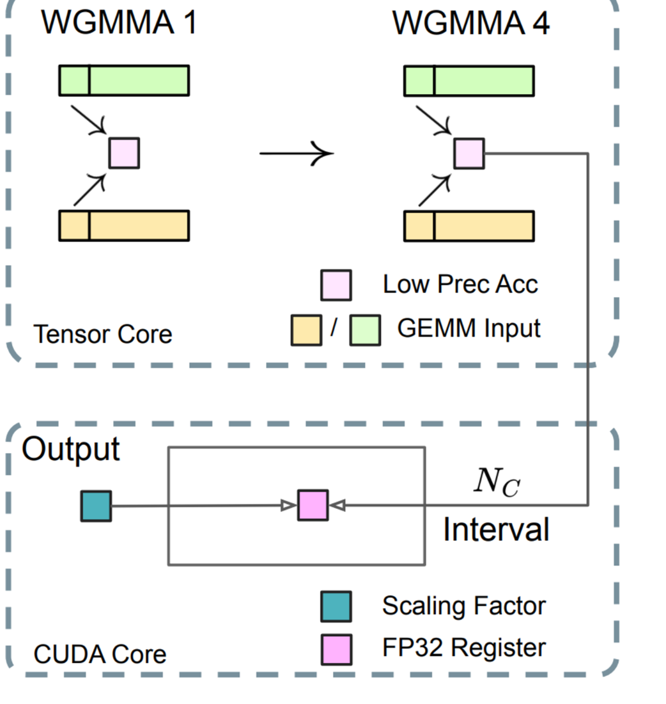

*图5.30 提高累加精度的核心策略：中间结果定期从Tensor Core的低精度环境移动到CUDA Core的高精度环境。*

要真正理解这个机制，我们需要更仔细地看看涉及的具体硬件组件。计算从Tensor Core内开始，它使用一种叫做WGMMA（Warp-Group-level Matrix Multiply-Accumulate）的指令以小突发方式执行高速、低精度乘法。

在每个WGMMA步骤中，中间结果被累加在一个低精度寄存器中，在图中（图5.30）标记为"Low Prec Acc"。挑战是这个累加器的精度有限。DeepSeek的创新是不等到整个计算完成。相反，在固定间隔（Nc），"Low Prec Acc"中的部分和被定期"提升"或传输到通用CUDA Core。

CUDA Core接收这个部分和并将其添加到一个"FP32 Register"（FP32寄存器），该寄存器具有完整的高精度能力。通过在这个高精度寄存器中执行最终累加，DeepSeek显著减少了困扰标准低精度累加的下溢问题风险，确保数值稳定性。


*图5.31 提高累加精度机制的详细视图。低精度累加在Tensor Core上以突发方式进行，结果定期提升到CUDA Core上的高精度FP32寄存器。*

让我们通过这张图逐步跟踪数据的旅程，定义每个组件：

**第1部分：Tensor Core：高速、低精度的工作**

图5.31的顶部标记为"Tensor Core"的部分显示了大部分原始计算发生的地方。

1. **GEMM输入**：这些是顶部的两个矩形块，代表我们矩阵乘法y = Wx的输入。一个块代表输入张量（例如，细粒度激活向量），另一个代表权重矩阵。两者都已经处于快速的FP8格式。
2. **WGMMA（Warp-Group-level Matrix Multiply-Accumulate）**：这是一个高度优化的低级NVIDIA指令，告诉一组GPU线程（一个"warp"）执行矩阵乘法的一块。你可以将WGMMA 1到WGMMA 4看作是更长点积中的顺序步骤。例如，WGMMA 1可能计算Y_ij方程中前32个乘积的和。
3. **Low Prec Acc**：这是标记为"Low Prec Acc"的小方形寄存器，代表低精度累加器。它是Tensor Core内保存运行和的内部硬件寄存器。在WGMMA 1中，第一组乘积被计算并存储在这里。在WGMMA序列的下一步中，下一组乘积将被计算并加到同一个累加器中。关键点是这个寄存器的精度有限（约14位）。

**第2部分：桥梁：定期提升到高精度**

关键的创新是连接Tensor Core到CUDA Core的箭头。这不是计算结束时的单次数据传输；它是一种定期提升。

- **Nc间隔**：DeepSeek不等所有WGMMA步骤完成。相反，在固定间隔Nc的逐元素操作后（论文指定Nc = 128），过程暂停。已经在"Low Prec Acc"寄存器中计算和存储的部分和被从Tensor Core中复制出来。

**第3部分：CUDA Core：低速、高精度的收尾**

图的底部标记为"CUDA Core"的部分是过程最终、数值稳定部分发生的地方。CUDA Core是GPU的通用工作马，能够处理完整FP32操作。

- **FP32寄存器（大粉色方块）**：来自Tensor Core的部分和到达并被放入一个可以存储完整32位浮点数的寄存器中。这个寄存器有充足的精度来保存数千个乘积的和，而不会有任何下溢或精度丢失的风险。随着更多部分和每Nc间隔从Tensor Core到达，它们被安全地添加到这个高精度运行总和中。
- **缩放因子（青色块）**：同时，CUDA Core可以高效地处理反量化。它将在细粒度量化步骤（支柱2）中计算的缩放因子与高精度累加值相乘。
- **输出**：最终结果是一个反量化的、高精度值，数值稳定，准备好存储为BF16用于网络中的下一层。

这种混合方法完美体现了"两全其美"的理念。它为正确的任务使用正确的工具——快速、专用的Tensor Core用于大部分乘法，较慢、通用的CUDA Core用于最终的高精度累加和反量化。这种协同作用使DeepSeek能够同时实现FP8计算的惊人速度和FP32累加的数值准确性。

### 5.5.9 支柱4：尾数优先于指数

正如我们在5.5.3节中讨论的，任何浮点格式都是分配给指数（决定动态范围）和尾数（决定精度）的比特数之间的权衡。

对于8位FP8格式，已经出现了两个主要标准：

1. **E5M2**：使用5位指数和2位尾数。这种格式具有更大的动态范围（它可以表示更宽的数字跨度）但精度较低。
2. **E4M3**：使用4位指数和3位尾数。这种格式具有较小的动态范围但更高的精度。

**常规方法**

在DeepSeek之前，混合精度训练中的常见策略是使用混合方法：

- 对前向传播（Fprop）使用高精度E4M3，其中值更受控。
- 对反向传播（Dgrad和Wgrad）使用高范围E5M2，因为梯度有时可能有非常大的值（异常值），可能导致E4M3较小范围中的溢出。

**DeepSeek的实现：统一E4M3**

DeepSeek团队认为这种混合方法是针对他们已经解决的问题的权宜之计。得益于他们的细粒度量化（支柱2），异常值的问题被显著缓解。

因为他们在小的独立块中缩放激活和权重，一个块中的大异常值不影响其他块的缩放。这防止了通常导致精度丢失的值"压扁"。细粒度缩放因子有效地在局部级别管理动态范围。

这一洞察使他们做出了一个强大的简化：他们选择在所有操作中统一使用更高精度的E4M3格式，包括前向和反向传播。

通过依靠他们的细粒度量化来处理动态范围，他们可以一致地使用具有更多尾数位的格式，从而在整个训练过程中保持更高的精度水平。DeepSeek论文指出：

"通过在更小的元素组上操作，我们的方法有效地在这些分组元素之间共享指数位，减轻了有限动态范围的影响。"

这是一个微妙但重要的创新。它展示了DeepSeek不同的量化技术如何协同工作。他们的细粒度缩放的强度使他们能够在精度方面做出更激进的选择，这是其FP8训练框架稳定性和性能的关键贡献因素。

### 5.5.10 支柱5：在线量化

DeepSeek量化拼图的最后一块解决了何时计算缩放因子的问题。如我们所知，缩放因子源自张量的最大绝对值。但是哪个张量？来自前一步的那个，还是我们当前正在处理的那个？

**常规方法：延迟量化**

许多量化框架使用一种叫做延迟量化（Delayed Quantization）的技术。在这种方法中，用于量化当前张量的缩放因子源自在先前迭代或批次中观察到的最大值。它维护最大值的运行历史，并使用该历史信息来估计当前步骤的良好缩放因子。

这种方法的问题在于数据分布在训练期间可能快速变化。当前批次中的最大值可能与历史最大值显著不同。

- 如果当前最大值远大于历史最大值，使用旧的、较小的缩放因子可能导致溢出，其中量化值超出FP8的可表示范围。
- 如果当前最大值远小于历史最大值，使用旧的、较大的缩放因子可能导致下溢和灾难性的精度损失（我们之前看到的"压扁"问题）。

**DeepSeek的解决方案：在线量化**

为了解决这个问题，DeepSeek使用在线量化（Online Quantization）。这个想法简单而稳健：基于当前张量本身的数据实时计算缩放因子。

不依赖历史信息，工作流程是：

1. 对于当前批次的激活或权重，首先执行快速遍历以找到该特定批次内的最大绝对值。
2. 使用这个"在线"最大值来推导缩放因子。
3. 应用这个新鲜的、完美校准的缩放因子来量化当前张量。

这种即时计算确保缩放因子总是完美适应在那一刻正在处理的数据的动态范围。它完全避免了使用陈旧历史缩放因子导致的溢出或下溢风险。

虽然这增加了一点小的计算开销（寻找最大值的初始遍历），但值得注意的是，在张量中找到最大值比构成计算主体的矩阵乘法快一个数量级。在数值稳定性和准确性方面获得的收益因此是巨大的。这种即使以计算上不昂贵的前遍为代价也坚持使用尽可能准确的实时信息的承诺，是DeepSeek设计中反复出现的主题，也是其FP8训练框架鲁棒性的关键原因。

在下一章中，我们将通过创建一个小规模的、类DeepSeek模型来应用这些知识，演示这些概念如何在实践中协同工作。

## 5.6 总结

- Multi-Token Prediction（MTP）通过训练模型同时预测未来token的视野来提高数据效率，为长程连贯性提供更丰富的梯度信号。
- MTP训练目标隐式地为序列中的"选择点"或关键的模式转换token分配更高权重，从而在模型中发展更好的规划能力。
- DeepSeek的因果MTP实现顺序精炼隐藏状态，其中一个token的预测信息传递给下一个，创建了强大的预测机制。
- 量化对于大规模训练至关重要，通过将高精度参数转换为低精度格式（如FP8）来减少内存使用和计算成本。
- DeepSeek的FP8框架使用混合精度策略，在低精度中执行核心计算，同时将敏感组件（如主权重和优化器状态）存储在高精度中以确保数值稳定性。
- 细粒度量化：为了减轻异常值造成的精度损失，DeepSeek为激活和权重的小块计算单独的缩放因子，在局部级别保持保真度。
- 提高累加精度：DeepSeek将中间结果从低精度Tensor Core提升到高精度CUDA Core，其中累加以完整FP32精度发生，以防止下溢误差。
- 尾数优先于指数：DeepSeek统一使用更高精度的E4M3格式进行前向和反向传播，这得益于细粒度量化，它有效地管理动态范围。
- 在线量化：DeepSeek基于当前批次数据实时计算缩放因子，确保准确的缩放并避免与历史数据相关的不稳定性。
