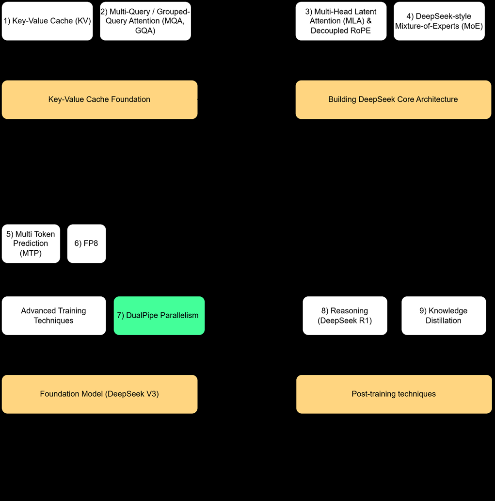
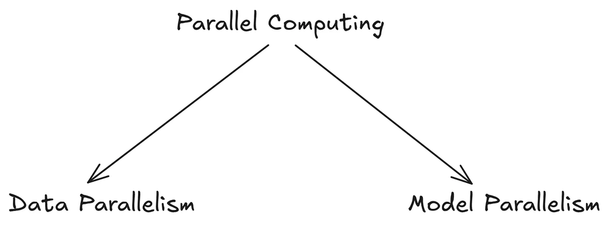
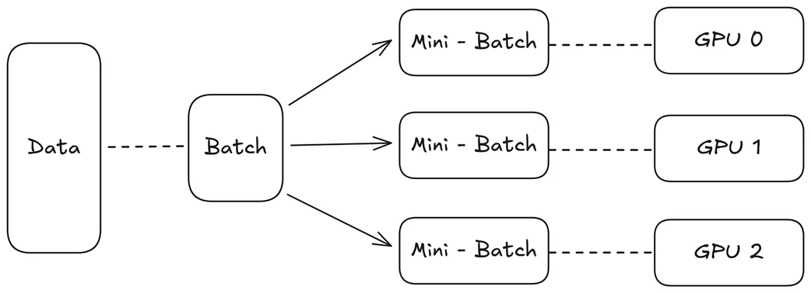
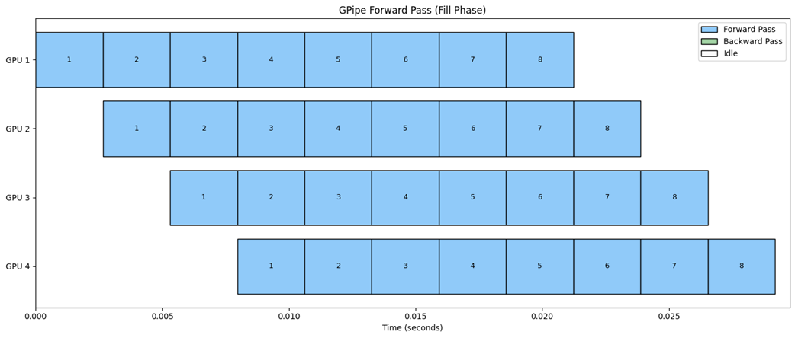
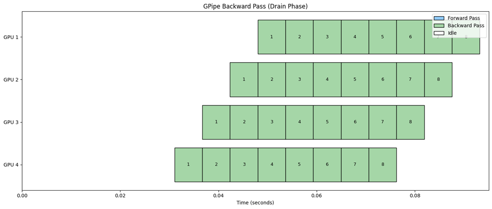
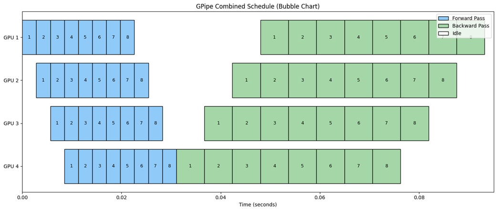
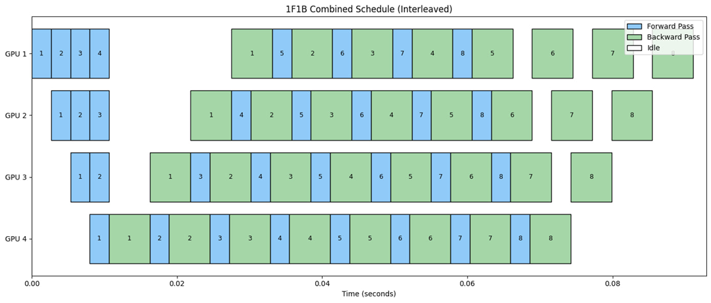
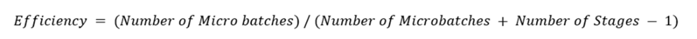
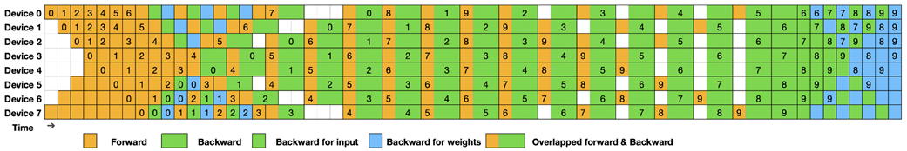

# 第6章 DeepSeek训练流水线：构建基础模型

本章涵盖：
- 组装DeepSeek V3架构
- 构建完整的数据和训练流水线
- DualPipe Parallelism实现高效扩展

我们已经解构了DeepSeek的核心创新：多头潜在注意力（Multi-Head Latent Attention）、解耦RoPE（Decoupled RoPE）、DeepSeek混合专家层（DeepSeek Mixture-of-Experts layer）以及多token预测（Multi-Token Prediction）训练目标。我们探索了相关理论，甚至独立构建了其中一些组件。现在，是时候将它们整合在一起，从单个组件过渡到一个完整、可运行的系统了。

我们将把所有这些先进概念集成到一个PyTorch模型中——一个你可以在自己的硬件上从零开始训练的"迷你DeepSeek V3"。这个动手实践的过程是真正理解这些理论部分在现实训练环境中如何交互的最后一步。我们的旅程涵盖了整个流水线，从原始数据到一个能够生成文本的工作模型。



*图6.1 我们构建DeepSeek模型的四阶段旅程。本章致力于第3阶段的第2部分，我们在此将第2阶段的核心架构与MTP和FP8等先进训练技术相结合，构建一个完整的基础模型。我们还将介绍最终的训练创新——DualPipe Parallelism。*

正如路线图中强调的，这是我们开发的理论和架构与训练的实际现实交汇的地方。我们将组装最终的MiniDeepSeek模型，构建训练它所需的完整脚手架。这包括准备数据集、编写训练脚本，以及最终编写一个从训练好的模型生成文本的脚本，以查看我们努力的成果。

一旦我们拥有了一个完全训练好的模型，我们将探索DeepSeek团队的最后一个关键创新：DualPipe Parallelism。虽然我们的迷你模型设计为在单个GPU上训练，但真正的DeepSeek-V3是一个大规模分布式系统。DualPipe是一种专门的训练策略，通过克服此类系统固有的通信瓶颈，使这种大规模训练成为可能。我们将解构其核心思想，以理解真正的尖端模型是如何大规模训练的。

让我们从为模型设定基础开始：数据。

## 6.1 数据基础：准备TinyStories数据集

在组装模型之前，我们必须首先准备驱动其学习的燃料：训练数据。这是一个关键的多步骤过程，涉及选择合适的数据集、通过tokenization将其原始文本转换为数字格式，以及以允许训练期间高效加载的方式保存它。让我们从零开始构建一个完整的数据准备流水线。

### 6.1.1 选择正确的工具：TinyStories数据集和TikToken

对于我们的项目，我们需要一个数据集，它既高质量且足够大以促进有意义的学习，又足够小以在单个消费级GPU上管理和训练。这就是TinyStories数据集发挥作用的地方。它由Microsoft研究人员在论文"TinyStories: How Small Can Language Models Be and Still Speak Coherent English?"（https://arxiv.org/abs/2305.07759）中介绍，是一个由GPT-3.5和GPT-4生成的短篇故事集合，托管在Hugging Face的roneneldan/TinyStories上。它简单、连贯的英文文本甚至可以让小模型学习语言的基本模式，使其成为我们目的的理想选择。

下一步是tokenization。虽然我们可以使用DeepSeek的官方tokenizer，但其大词汇量（100k+ token）是为大规模、多语言语料库优化的。对于我们较小的、仅英语的TinyStories数据集，更简单的方法效率更高。因此，我们将使用OpenAI的tiktoken库中的标准'gpt2' tokenizer。这个强大的字节对编码（Byte-Pair Encoding, BPE）tokenizer的词汇量为50,257个token，省去了我们训练自己tokenizer的工作，同时为模型提供了坚实的学习基础。我们在代码中的第一步将是下载数据集并使用此tokenizer进行处理。

### 6.1.2 设置环境

在深入代码之前，让我们设置项目环境。本章的所有代码都可以在本书的官方GitHub仓库中找到。我们强烈建议你打开它来跟随实现：

https://github.com/VizuarAI/DeepSeek-From-Scratch

首先，最佳实践是创建一个虚拟环境来管理项目的依赖项。这确保了我们安装的包不会与你系统上的其他Python项目冲突。你可以使用Python内置的venv模块创建一个：

```
python -m venv venv
source venv/bin/activate  # On Windows, use venv\Scripts\activate
```

一旦你的虚拟环境激活，下一步就是安装所需的库。对于本项目，我们需要PyTorch来构建神经网络，numpy用于高效数值运算，datasets用于从Hugging Face下载TinyStories，以及tiktoken用于tokenizer。

你可以创建一个包含以下内容的requirements.txt文件，并使用单个命令安装所有依赖项。

现在，在你的终端中运行以下命令来安装这些包：

```
pip install -r requirements.txt
```

**清单6.1 requirements.txt文件**

```
torch
numpy
datasets
tiktoken
```

环境设置完成后，我们就可以构建准备训练数据的脚本了。

### 6.1.3 prepare.py脚本：逐步解析

我们的第一个任务是创建一个自动化整个数据准备过程的脚本。这个脚本我们称之为prepare.py，它将处理四个关键职责：从Hugging Face下载原始文本、将其拆分为训练集和验证集、将文本tokenize为整数ID，以及以高效的二进制格式保存结果。这个脚本是我们将创建的四个核心文件中的第一个。接下来将是model.py，我们将在其中定义完整的Mini-DeepSeek架构；train.py，它将编排整个训练过程；最后是sample.py，一个加载我们训练好的模型并生成新文本的脚本。

我们将逐块构建prepare.py，以理解每一步背后的逻辑。完整的可执行代码可以在本章的GitHub仓库中找到。让我们从初始导入和配置开始。

**清单6.2 prepare.py中的导入和配置**

```python
import os
import json
from typing import List
import numpy as np
from datasets import load_dataset
import tiktoken
from tqdm import tqdm

# --- Configuration ---
DATASET_NAME = "roneneldan/TinyStories"  #A
TOKENIZER_NAME = "gpt2"  #B
OUTPUT_DIR = "data/tinystories_tokenized"
VAL_RATIO = 0.05  #C
```

#A Hugging Face数据集标识符。
#B 我们tokenizer的引用名称。
#C 我们将使用5%的数据进行验证。

脚本的第一部分定义了我们将使用的核心组件：用于原始文本的DATASET_NAME和用于将该文本转换为数字的TOKENIZER_NAME。我们还设置了VAL_RATIO，保留一小部分数据用于验证集。这使我们能够在训练期间获得一个无偏的衡量指标，了解模型对新的、未见数据的泛化能力。

配置设置完成后，脚本的主要部分执行数据准备工作流。它首先加载数据集，创建训练/验证拆分，然后初始化tokenizer。tiktoken库使加载标准的预训练tokenizer（如gpt2）变得简单。我们还提取并存储vocab_size，因为这是模型在初始化期间需要的关键超参数。

**清单6.3 加载数据和初始化tokenizer**

```python
def main():
    """Main function to download, tokenize, and save the dataset."""
    os.makedirs(OUTPUT_DIR, exist_ok=True)

    # 1. Load the dataset from Hugging Face
    dataset = load_dataset(DATASET_NAME)['train']  #A

    # 2. Create train and validation splits
    split_index = int(len(dataset) * (1 - VAL_RATIO))
    train_dataset = dataset.select(range(split_index))
    val_dataset = dataset.select(range(split_index, len(dataset)))
    print(f"Dataset split into {len(train_dataset):,} train...")

    # 3. Initialize the BPE tokenizer
    enc = tiktoken.get_encoding(TOKENIZER_NAME)  #B
    vocab_size = enc.n_vocab  #C
    print(f"Tokenizer loaded. Vocab size: {vocab_size}")

    # ... (tokenization and saving logic comes next)
```

#A 从Hugging Face加载原始文本数据。
#B 实例化'gpt2' BPE tokenizer。
#C 从tokenizer获取词汇量大小。

下一步是通过tokenizer处理每个故事的原始文本。encode_corpus函数遍历每个文本样本，将其编码为整数ID列表，并附加一个特殊的End-of-Text (EOT) token。这个eot_token充当分隔符，将所有单独的故事连接成一个巨大的token流，同时在训练期间仍然向模型发出文档边界的信号。

生成的token ID流存储为uint16整数的numpy数组。使用uint16（无符号16位整数）是一种内存优化；因为我们的词汇量大小（50,257）小于uint16的最大值（65,535），我们可以使用这种更紧凑的数据类型，而不是标准的32位或64位整数，从而节省大量磁盘空间。

**清单6.4 token编码函数**

```python
def encode_corpus(texts: List[str], enc: tiktoken.Encoding) -> np.ndarray:
    """Encodes a list of texts into a single flat stream of token IDs."""
    all_ids = []
    eot_token = enc.eot_token  #A
    for text in tqdm(texts, desc="Encoding texts"):
        ids = enc.encode(text)
        all_ids.extend(ids)
        all_ids.append(eot_token)  #B
    return np.array(all_ids, dtype=np.uint16)  #C

# Inside main():
# 4. Tokenize the datasets
train_ids = encode_corpus([ex['text'] for ex in train_dataset], enc)
val_ids = encode_corpus([ex['text'] for ex in val_dataset], enc)
```

#A 获取特殊的End-of-Text token ID。
#B 在每个故事后附加EOT token。
#C 使用uint16节省空间。

最后，一旦我们有了tokenized的train_ids和val_ids数组，我们需要将它们保存到磁盘。对于大型数据集，在训练期间将整个文件读入内存是低效的。更好的方法是使用内存映射文件（memmap）。

内存映射文件允许我们将磁盘上的文件作为程序内存的一部分来访问。操作系统在需要时在后台处理从磁盘加载数据到RAM。这对于我们的训练脚本非常高效，因为它一次只需要加载小批量数据。write_memmap函数处理这个过程。我们还会保存一个包含vocab_size的meta.json文件，以便训练脚本可以轻松访问它。

**清单6.5 使用memmap和元数据保存数据**

```python
def write_memmap(path: str, tokens: np.ndarray):
    """Writes a numpy array to a memory-mapped file."""
    # Shape is a tuple, so tokens.size, must be inside one
    arr = np.memmap(path, dtype=np.uint16, mode="w+", shape=(tokens.size,))  #A
    arr[:] = tokens
    arr.flush()  #B

# Inside main():
# 5. Write the tokenized data to binary files
write_memmap(os.path.join(OUTPUT_DIR, "train.bin"), train_ids)
write_memmap(os.path.join(OUTPUT_DIR, "val.bin"), val_ids)

# 6. Save metadata
meta = {"vocab_size": vocab_size}
with open(os.path.join(OUTPUT_DIR, "meta.json"), "w") as f:
    json.dump(meta, f)  #C
print(f"\nPreparation complete. Data is saved in '{OUTPUT_DIR}'")
```

#A 以写模式创建并打开内存映射文件。
#B 确保所有数据从内存缓冲区写入磁盘。
#C 保存词汇量大小供训练脚本使用。

所有部分就位后，你现在可以从终端运行脚本：`python prepare.py`。脚本将下载数据集、处理它，并创建一个新目录data/tinystories_tokenized/，其中包含三个文件：train.bin、val.bin和meta.json。这些文件包含了我们开始训练所需的一切。

我们已成功为项目奠定了数据基础。我们有了一个干净的、tokenized的数据集，以高效格式存储，准备好送入我们的模型。现在，我们可以继续组装完整的MiniDeepSeek架构。

## 6.2 组装Mini-DeepSeek模型

现在让我们构建model.py脚本，它将前面章节的所有架构理论转化为一个单一的功能性PyTorch nn.Module。这个脚本是我们迄今为止旅程的顶点，将MLA、Decoupled RoPE、MoE和MTP集成到一个内聚的架构中。首先，让我们从模型文件所需的导入开始。

**清单6.6 model.py的导入**

```python
import math
from dataclasses import dataclass
from typing import Optional, Tuple
import torch
import torch.nn as nn
from torch.nn import functional as F
```

接下来，我们定义一个ModelArgs数据类。这是管理定义模型架构的众多超参数的最佳实践。我们不再向模型的构造函数传递十几个参数，而是传递一个单一的、有组织的配置对象。这使得我们的代码更清晰，并让我们能够轻松定义不同的模型大小，正如我们稍后在train.py脚本中所做的那样。

**清单6.7 ModelArgs配置数据类**

```python
@dataclass
class ModelArgs:
    # Architecture
    d_model: int = 512
    n_layers: int = 8
    vocab_size: int = 50257  # Placeholder for tiktoken 'gpt2'

    # Attention (MLA)
    num_heads: int = 8
    d_latent: int = 128
    d_rope: int = 32

    # MoE
    moe_n_routed_experts: int = 8
    moe_n_shared_experts: int = 1
    moe_top_k: int = 2
    moe_routed_hidden: int = 512

    # MTP
    n_mtp_modules: int = 1

    # General
    dropout: float = 0.1
    max_seq_len: int = 1024
```

### 6.2.1 构建组件：RoPE、MLA、MoE和MTP

配置定义完成后，我们可以构建架构的核心模块。我们将从内到外构建模型，首先构建RoPE、Attention和MoE层的专门辅助类，然后将它们组装成最终的TransformerBlock。

我们的第一个组件是RotaryPositionalEncoding模块。正如我们在第3章中学到的，RoPE通过旋转Query和Key向量中的维度对来注入位置信息。这个辅助类负责预计算必要的旋转频率（theta），并使用复数乘法高效地应用这些旋转。这里的一个关键更新是添加了position_offset参数，这在缓存推理期间当我们一次只处理一个新token时，对于正确应用位置编码至关重要。

**清单6.8 RotaryPositionalEncoding辅助模块**

```python
class RotaryPositionalEncoding(nn.Module):
    def __init__(self, d_head: int, max_seq_len: int = 2048):
        super().__init__()
        self.d_head = d_head
        theta = 1.0 / (10000 ** (torch.arange(0, d_head, 2).float() / d_head))  #A
        self.register_buffer('theta', theta)
        positions = torch.arange(max_seq_len)
        freqs = torch.outer(positions, self.theta)
        freqs_cis = torch.polar(torch.ones_like(freqs), freqs)  #B
        self.register_buffer('freqs_cis', freqs_cis, persistent=False)

    def forward(self, x: torch.Tensor, position_offset: int = 0):  #C
        seq_len = x.shape[2]
        x_complex = torch.view_as_complex(x.float().reshape(*x.shape[:-1], -1, 2))
        freqs_cis_slice = self.freqs_cis[position_offset : position_offset + seq_len]  #D
        freqs_cis = freqs_cis_slice.unsqueeze(0).unsqueeze(0)
        x_rotated = x_complex * freqs_cis  #E
        x_out = torch.view_as_real(x_rotated).flatten(3)
        return x_out.type_as(x)
```

#A 计算每个维度对的基础频率。
#B 将旋转矩阵预计算为复数。
#C forward方法现在接受position_offset参数。
#D 为当前位置切片预计算的频率。
#E 通过复数乘法应用旋转。

接下来，我们实现DeepSeekAttention模块。这个类是我们在第3章设计的完整Decoupled MLA+RoPE架构的直接转化。它包含两条并行路径：一条使用纯MLA以实现缓存效率的Content Path，以及一条将RoPE应用于专门投影的Position Path。

**清单6.9 DeepSeekAttention模块**

```python
class DeepSeekAttention(nn.Module):
    def __init__(self, args: ModelArgs):
        super().__init__()
        # ... (attribute initializations) …
        self.d_rope = args.d_rope

        # Content Path
        self.W_q_content = nn.Linear(args.d_model, args.d_model, bias=False)  #A
        self.W_dkv_content = nn.Linear(args.d_model, args.d_latent, bias=False)  #A
        self.W_uk_content = nn.Linear(args.d_latent, args.d_model, bias=False)  #A
        self.W_uv_content = nn.Linear(args.d_latent, args.d_model, bias=False)  #A

        # Position Path
        self.W_k_pos = nn.Linear(args.d_model, args.d_rope * args.num_heads, bias=False)  #B
        self.W_q_pos = nn.Linear(args.d_model, args.d_rope * args.num_heads, bias=False)  #B
        self.rope = RotaryPositionalEncoding(args.d_rope, max_seq_len=args.max_seq_len)  #C

        # Output Projection
        self.W_o = nn.Linear(args.d_model, args.d_model, bias=False)
        self.dropout = nn.Dropout(args.dropout)
```

#A 缓存高效内容路径的投影矩阵。
#B 位置路径的专门投影矩阵。
#C 实例化我们的RoPE辅助模块。

__init__方法为两条路径设置了所有必要的权重矩阵。forward方法是decoupled MLA+RoPE逻辑结合的地方。它现在接受一个past_kv参数，该参数将在推理期间保存来自先前步骤的缓存张量。它根据此缓存的长度计算position_offset，确保RoPE为新token应用正确的旋转。两条路径的输出被相加以获得最终的注意力分数，该模块返回最终的上下文向量和新更新的缓存。

现在我们将为这个DeepSeekAttention构建一个forward方法，因为它处理了训练和缓存推理的完整decoupled逻辑。

在推理期间（当提供past_kv时），它计算position_offset并正确地将新计算的潜在向量（c_kv_new和k_r_new）附加到来自先前步骤的缓存张量中。内容分数和位置分数分别计算然后相加。最后，它返回输出和包含更新潜在向量的new_cache，为下一个生成步骤做好准备。

**清单6.10 DeepSeekAttention的forward方法**

```python
def forward(self, x: torch.Tensor, attn_mask: torch.Tensor,
            past_kv: Optional[Tuple[torch.Tensor, torch.Tensor]] = None,
            position_offset: int = 0):
    B, S, D = x.shape
    past_len = past_kv[0].shape[1] if past_kv is not None else 0

    # --- Path A: Content Path ---
    q_c = self.W_q_content(x).view(B, S, self.num_heads, self.d_head).transpose(1, 2)
    c_kv_new = self.W_dkv_content(x)  #A
    c_kv = torch.cat([past_kv[0], c_kv_new], dim=1) if past_kv else c_kv_new  #B
    k_c = self.W_uk_content(c_kv).view(B, past_len + S, ...).transpose(1, 2)
    v_c = self.W_uv_content(c_kv).view(B, past_len + S, ...).transpose(1, 2)

    # --- Path B: Position Path ---
    k_r_unrotated = self.W_k_pos(x).view(B, S, self.num_heads, self.d_rope).transpose(1, 2)
    q_r_unrotated = self.W_q_pos(x).view(B, S, self.num_heads, self.d_rope).transpose(1, 2)
    k_r_new = self.rope(k_r_unrotated, position_offset=position_offset)  #C
    q_r = self.rope(q_r_unrotated, position_offset=position_offset)
    k_r = torch.cat([past_kv[1], k_r_new], dim=2) if past_kv else k_r_new  #D

    # --- Combining Paths ---
    content_scores = (q_c @ k_c.transpose(-2, -1)) / math.sqrt(self.d_head)
    position_scores = (q_r @ k_r.transpose(-2, -1)) / math.sqrt(self.d_rope)
    attn_scores = content_scores + position_scores

    # ... (softmax, dropout, output projection) ...
    output = self.W_o(context_vector)
    new_cache = (c_kv, k_r)  #E
    return output, new_cache
```

#A 计算内容路径的新潜在向量。
#B 将新潜在向量附加到过去的内容缓存。
#C 使用正确的偏移量将RoPE应用于新key。
#D 将新的旋转key附加到过去的位置缓存。
#E 返回为下一步更新的新缓存。

下一个组件是DeepSeekMoE模块。这个类实现了我们在第4章中开发的完整逻辑，包括细粒度的routed experts、共享的generalist experts以及无辅助损失的负载平衡机制。（注意：下面的MTP模块实例化了一个TransformerBlock，我们将在清单6.15中定义，一旦所有子组件就位。）

ExpertFFN是一个简单的两层MLP，作为我们routed experts和shared experts的构建块。主DeepSeekMoE类包含这些expert的列表，将它们分为routed_experts和shared_experts，并定义了gate（一个线性层），它将充当我们的路由器。

DeepSeekMoE模块的forward方法首先处理token的路由和分发。每个token都通过shared_experts以获得基线输出。同时，gate计算routed_experts的router logits。当前的bias项被添加到这些logits中以影响top-k选择，softmax函数将所选expert的分数转换为gate权重。最后，一个高效的稀疏分发循环计算routed experts的加权输出。

**清单6.11 ExpertFFN和DeepSeekMoE的__init__方法**

```python
class ExpertFFN(nn.Module):
    def __init__(self, d_model: int, hidden: int, dropout: float = 0.0):
        super().__init__()
        self.fc1 = nn.Linear(d_model, hidden, bias=False)
        self.fc2 = nn.Linear(hidden, d_model, bias=False)
        self.dropout = nn.Dropout(dropout)

    def forward(self, x: torch.Tensor) -> torch.Tensor:
        return self.fc2(self.dropout(F.gelu(self.fc1(x))))

class DeepSeekMoE(nn.Module):
    def __init__(self, args: ModelArgs):
        super().__init__()
        self.n_routed = args.moe_n_routed_experts
        self.top_k = args.moe_top_k
        self.routed_experts = nn.ModuleList([
            ExpertFFN(args.d_model, args.moe_routed_hidden, args.dropout)  #A
            for _ in range(self.n_routed)
        ])
        self.shared_experts = nn.ModuleList([
            ExpertFFN(args.d_model, args.moe_routed_hidden, args.dropout)  #B
            for _ in range(args.moe_n_shared_experts)
        ])
        self.gate = nn.Linear(args.d_model, self.n_routed, bias=False)  #C
        self.register_buffer("bias", torch.zeros(self.n_routed))  #D
        self.bias_lr = 0.01
```

#A 大型专业化、稀疏激活的expert池。
#B 小型通用型expert集合，对所有token密集激活。
#C 可学习的路由器，计算expert分数。
#D 用于动态负载平衡bias的不可训练缓冲区。

**清单6.12 DeepSeekMoE的forward方法（路由和分发）**

```python
def forward(self, x: torch.Tensor):
    B, S, D = x.shape
    x_flat = x.reshape(-1, D)

    # Shared expert path (dense)
    shared_out = torch.zeros_like(x)
    for exp in self.shared_experts: shared_out += exp(x)

    # --- Routed expert path (sparse) ---
    router_logits = self.gate(x_flat)  #A
    router_logits_with_bias = router_logits + self.bias.to(router_logits.dtype)  #B
    top_k_logits, top_k_indices = torch.topk(router_logits_with_bias, self.top_k, dim=-1)
    gates = F.softmax(top_k_logits, dim=-1, dtype=torch.float).type_as(x)  #C
    routed_out_flat = torch.zeros_like(x_flat)
    for i in range(self.n_routed):  #C
        mask = (top_k_indices == i)
        row_idx, which_k = torch.where(mask)
        if row_idx.numel() == 0:
            continue
        w = gates[row_idx, which_k].unsqueeze(-1)
        exp_in = x_flat[row_idx]
        exp_out = self.routed_experts[i](exp_in)
        routed_out_flat.index_add_(0, row_idx, exp_out * w)

        # ... (bias update and final output comes next)
```

#A self.gate（单数）是线性路由器层。
#B 在选择之前将动态bias应用于router logits。
#C 高效地将token批量分发到其选定的expert。

在主路由完成后，forward方法在训练期间执行最后一个关键任务：为下一次迭代更新动态bias。这整个代码块被包裹在`if self.training:`中，因此在推理期间完全被忽略，而`torch.no_grad()`确保这些操作不会影响模型的梯度。这种分离是"loss-free"方法的关键。最终输出是shared expert和routed expert输出的总和。

**清单6.13 DeepSeekMoE的forward方法（Bias更新和最终输出）**

```python
# ... (sparse dispatch logic from previous listing) ...
if self.training:  #A
    with torch.no_grad():  #B
        avg_load = x_flat.size(0) * self.top_k / self.n_routed
        counts = torch.bincount(top_k_indices.flatten(), minlength=self.n_routed)
        violation = (avg_load - counts) / (avg_load + 1e-6)
        self.bias.add_(self.bias_lr * torch.tanh(violation))  #C

routed_out = routed_out_flat.view(B, S, D)
return shared_out + routed_out
```

#A 此代码块仅在训练期间运行以更新bias。
#B Bias更新不跟踪梯度。
#C 根据当前批次的负载不均衡调整bias。

我们需要的最后一个架构组件是MTPModule。正如我们在第5章中看到的，这个模块负责在因果链中预测更远一步的未来。我们的实现是为了清晰而简化的版本。它包含一个投影层，用于将来自前一步的隐藏状态与下一个token的embedding合并，以及一个专用的TransformerBlock（在清单6.15中描述），用于处理此合并信息并为下一个MTP步骤生成精炼的隐藏状态。

**清单6.14 因果多token预测模块**

```python
class MTPModule(nn.Module):
    def __init__(self, args: ModelArgs):
        super().__init__()
        self.projection = nn.Linear(args.d_model * 2, args.d_model, bias=False)  #A
        self.block = TransformerBlock(args)  #B

    def forward(self, h_prev, next_token_embeds):
        x = torch.cat([h_prev, next_token_embeds], dim=-1)
        x = self.projection(x)
        B, S, D = x.shape
        # Create a causal mask for this step
        mask = torch.triu(torch.ones(S, S, device=x.device, dtype=torch.bool), diagonal=1)
        attn_mask = torch.zeros(S, S, device=x.device).masked_fill(mask, float('-inf'))
        # We don't use KV cache inside MTP during training
        h_k, _ = self.block(x, attn_mask=attn_mask.unsqueeze(0).unsqueeze(0))  #C
        return h_k
```

#A 投影拼接的隐藏状态和embedding。
#B 每个MTP模块包含自己完整的Transformer块。
#C 处理输入以产生下一个隐藏状态。

所有专门组件定义完成后，我们现在可以将它们组装成一个标准的TransformerBlock。这个类遵循熟悉的"pre-norm"架构，即在主操作（attention或feed-forward）之前应用归一化层，之后添加残差连接。

forward方法至关重要，因为它编排数据流，并将past_kv缓存和position_offset正确传递给DeepSeekAttention模块。这确保了我们的KV缓存在推理期间正确工作。attention块的输出被添加回输入（第一个残差连接），DeepSeekMoE前馈层重复相同的过程。

**清单6.15 TransformerBlock模块**

```python
class TransformerBlock(nn.Module):
    def __init__(self, args: ModelArgs):
        super().__init__()
        # Use LayerNorm for simplicity, though DeepSeek uses RMSNorm
        self.norm1 = nn.LayerNorm(args.d_model)  #A
        self.attention = DeepSeekAttention(args)
        self.norm2 = nn.LayerNorm(args.d_model)  #B
        self.feed_forward = DeepSeekMoE(args)

    def forward(self, x: torch.Tensor, attn_mask: torch.Tensor,
                past_kv: Optional[Tuple[torch.Tensor, torch.Tensor]] = None,
                position_offset: int = 0):
        # Attention block with residual connection
        h, new_cache = self.attention(self.norm1(x), attn_mask, past_kv, position_offset)  #C
        x = x + h
        # Feed-forward block with residual connection
        x = x + self.feed_forward(self.norm2(x))  #D
        return x, new_cache
```

#A 预attention归一化层。
#B 预前馈归一化层。
#C 将缓存和偏移量传递给attention模块。
#D MoE层的输出被添加到残差路径。

### 6.2.2 最终架构：MiniDeepSeek

我们现在到达了架构的顶层，即MiniDeepSeek类本身。这个类充当主容器，编排我们刚刚构建的所有组件。

它的__init__方法负责创建模型的核心部分：
1. 一个共享的token embedding层（embed）。
2. 一堆TransformerBlocks，构成模型的主体或"主干"。
3. 一个最终的归一化层（norm_f）。
4. 一个共享的输出层（lm_head），将最终隐藏状态投影到词汇logits。
5. 一链MTPModules，用于训练期间的多token预测。

**清单6.16 初始化MiniDeepSeek模型**

```python
class MiniDeepSeek(nn.Module):
    def __init__(self, args: ModelArgs):
        super().__init__()
        self.args = args

        # Core model components
        self.embed = nn.Embedding(args.vocab_size, args.d_model)  #A
        self.blocks = nn.ModuleList([TransformerBlock(args) for _ in range(args.n_layers)])  #B
        self.norm_f = nn.LayerNorm(args.d_model)
        self.lm_head = nn.Linear(args.d_model, args.vocab_size, bias=False)  #C

        # Multi-Token Prediction chain
        self.mtp_modules = nn.ModuleList([MTPModule(args) for _ in range(args.n_mtp_modules)])  #D

    def causal_mask(self, S: int, device) -> torch.Tensor:  #E
        mask = torch.triu(torch.ones(S, S, device=device, dtype=torch.bool), diagonal=1)
        return torch.zeros(S, S, device=device).masked_fill(mask, float('-inf'))
```

#A token embedding层。
#B N个Transformer块的堆叠。
#C 产生logits的最终输出层。
#D 顺序的MTP模块链。
#E 辅助函数，构建加性因果掩码（对角线上方-inf，其余为0）用于注意力分数。

MiniDeepSeek模型的forward方法是我们两种主要操作模式——训练和推理——在代码中变得明确的地方。该方法使用一个简单但有效的条件：`if targets is None`。在训练期间，我们总是提供targets（正确的下一个token）来计算损失。在推理期间，我们不会，这通知模型使用其优化的KV缓存路径。

**推理路径**

让我们首先检查推理路径。此逻辑旨在文本生成期间实现最大效率。它根据past_kv_cache的长度正确计算position_offset，并将此信息向下传递给每个TransformerBlock中的RoPE模块。这确保了即使我们只处理一个新token，其位置编码也能相对于其在完整序列中的绝对位置正确计算。在所有块处理完成后，它只计算最后一个token的logits，避免不必要的计算。

**清单6.17 forward方法的推理路径**

```python
def forward(self, input_ids: torch.Tensor, targets: Optional[torch.Tensor] = None,
            mtp_weight: float = 0.1, past_kv_cache: Optional[list] = None):
    B, S = input_ids.shape
    x = self.embed(input_ids)

    # --- Inference Path (with KV Cache) ---
    if targets is None:
        position_offset = past_kv_cache[0][0].shape[1] if past_kv_cache else 0  #A
        # Create a mask for the new token(s)
        mask = self.causal_mask(S + position_offset, x.device)[position_offset:, :]
        mask = mask.unsqueeze(0).unsqueeze(0)
        new_kv_cache = []
        for i, blk in enumerate(self.blocks):
            layer_past_kv = past_kv_cache[i] if past_kv_cache else None  #B
            x, new_cache = blk(x, attn_mask=mask, past_kv=layer_past_kv, position_offset=position_offset)
            new_kv_cache.append(new_cache)  #C
        x = self.norm_f(x)
        logits = self.lm_head(x[:, [-1], :])  #D
        return logits, new_kv_cache

    # ... (Training Path comes next) …
```

#A 根据缓存大小计算RoPE的起始位置。
#B 获取当前层的缓存。
#C 收集每个块更新的缓存。
#D 只计算最后一个token的logits以节省计算。

**训练路径**

当提供targets时，模型执行其训练路径。这里，逻辑是不同的。我们不使用KV Cache，因为我们一次处理整个输入序列。输入x通过TransformerBlocks的主堆叠以产生初始的隐藏状态集h_main。从中，我们计算主要的下一个token预测logits和主损失（loss_main）。

这就是MTP链发挥作用的地方。模型进入一个循环，遍历每个MTPModule。在每个步骤k中，它使用来自前一步的隐藏状态（h_prev）和未来token的真实embedding来预测序列中的第k+1个token。每个MTP头的损失被计算并添加到total_loss中，由mtp_weight缩放。这种组合损失提供了丰富的、多方面的梯度信号，帮助模型学习规划和预测。

**清单6.18 forward方法的训练路径**

```python
# ... (Inference Path from previous listing) ...
# --- Training Path (with MTP) ---
mask = self.causal_mask(S, x.device).unsqueeze(0).unsqueeze(0)  #A
for blk in self.blocks:
    x, _ = blk(x, attn_mask=mask)  # KV cache is ignored here

h_main = self.norm_f(x)
logits_main = self.lm_head(h_main)

# Standard next-token prediction loss
loss_main = F.cross_entropy(...)
total_loss = loss_main

# MTP causal chain
h_prev = h_main
for k, mtp_block in enumerate(self.mtp_modules, start=1):  #B
    if S <= k + 1: break  # Cannot predict beyond sequence
    # Slice inputs for the k-th prediction depth
    h_prev_shifted = h_prev[:, :-(k+1), :]
    next_tokens_embed = self.embed(input_ids[:, k:-1])
    h_k = mtp_block(h_prev_shifted, next_tokens_embed)  #C
    logits_k = self.lm_head(self.norm_f(h_k))
    # Calculate loss for this MTP head
    loss_k = F.cross_entropy(...)
    total_loss += mtp_weight * loss_k  #D

return {"logits": logits_main, "loss": total_loss}  #E
```

#A 完整序列的标准因果掩码。
#B 循环遍历每个MTP头以预测更远的未来。
#C 核心因果步骤：使用前一个状态预测下一个状态。
#D 将加权的MTP损失添加到总损失中。
#E 返回用于反向传播的最终组合损失。

训练路径定义完成后，我们的MiniDeepSeek类就完成了。我们已成功将DeepSeek架构实现为一个功能性的PyTorch模块。单个forward方法优雅地处理了快速缓存推理和带MTP的丰富多信号训练过程，根据是否提供targets在两者之间切换。

我们从底层构建了每个组件，从RoPE辅助模块到最终模型容器。本书GitHub仓库中的完整可执行model.py文件包含了本节的所有代码清单，以及一个小的`if __name__ == '__main__':`代码块。此代码块允许你直接运行文件（`python model.py`）以执行快速健全性检查。它将实例化一个小版本的模型，并通过训练和推理的forward传递运行一个虚拟张量，打印输出形状并确认KV Cache正在正确更新。

运行此测试代码块并观察输出形状变化是查看数据如何流经架构的最快方式，也是确认KV缓存按预期更新的最快方式。我们强烈鼓励你探索此测试代码块。运行它并看到输出形状如预期变化是巩固你对数据如何流经这个复杂架构的理解的绝佳方式。模型现在已完全定义，让我们进入下一步：构建训练它的脚本。

## 6.3 训练流水线：让模型活起来

定义了model.py并且prepare.py脚本创建了数据集后，我们现在准备编写：train.py。这个脚本负责加载数据、初始化我们的MiniDeepSeek模型，以及运行优化循环来教模型预测下一个token。

### 6.3.1 配置和系统设置

我们从导入必要的库和设置训练配置开始。脚本的顶部定义了从硬件设置到训练超参数的所有内容。我们启用PyTorch的autocast以进行自动混合精度训练，它使用bfloat16或float16与完整float32精度的组合来加速计算并减少内存使用，而不会牺牲数值稳定性。

我们还定义了关键的训练参数，如batch_size、max_iters以及AdamW优化器的设置。

**清单6.19 train.py中的导入和配置**

```python
import os
import json
import time
from contextlib import nullcontext
import math
import numpy as np
import torch
from model import MiniDeepSeek, ModelArgs  #A

# --- Configuration ---
# System
device = 'cuda' if torch.cuda.is_available() else 'cpu'  #B
dtype = 'bfloat16' if torch.cuda.is_available() and torch.cuda.is_bf16_supported() else 'float16'
pt_dtype = {'float32': torch.float32, 'bfloat16': torch.bfloat16, 'float16': torch.float16}[dtype]
ctx = torch.amp.autocast(device_type=device.split(':')[0], dtype=pt_dtype) if 'cuda' in device else nullcontext()  #C

# Training
out_dir = 'out'
data_dir = 'data/tinystories_tokenized'
max_iters = 5000
eval_interval = 250
log_interval = 20
eval_iters = 100
batch_size = 24
block_size = 256

# AdamW Optimizer
learning_rate = 3e-4  #D
weight_decay = 0.1
beta1 = 0.9
beta2 = 0.95
```

#A 导入我们的完整模型和配置类。
#B 如果可用则自动选择GPU。
#C 设置自动混合精度训练的上下文。
#D 优化器的峰值学习率。

### 6.3.2 加载数据和调度学习率

在开始主训练循环之前，我们需要两个关键的辅助函数。第一个是get_batch。这个函数负责为单个训练步骤加载一个小批量数据。它打开指定拆分（'train'或'val'）的内存映射.bin文件，随机选择batch_size个起始位置，并切出相应的输入序列（x）和目标序列（y）。使用pin_memory()是一种性能优化，允许数据从CPU的RAM更快地传输到GPU的VRAM。

第二个辅助函数是get_lr，它实现了一个学习率调度器。我们不再在整个训练过程中使用固定的学习率，而是改变它。我们的调度器实现了带warmup的余弦衰减策略，这是训练Transformer的一种高效且受欢迎的选择。

该过程有三个阶段：
1. Warmup：在最初的warmup_iters步中，学习率从0线性增加到其峰值。这有助于在训练早期权重仍然随机时稳定模型。
2. Cosine Decay：warmup之后，学习率按照余弦曲线逐渐降低。这允许模型在早期进行大的更新，然后随着接近一个好的解决方案，用更小的更新微调其参数。
3. Final Cooldown：学习率最终衰减到一个小的最小值（min_lr），用于剩余的训练。

**清单6.20 get_batch数据加载函数**

```python
def get_batch(split: str):
    data = np.memmap(os.path.join(data_dir, f'{split}.bin'), dtype=np.uint16, mode='r')  #A
    ix = torch.randint(len(data) - block_size, (batch_size,))  #B
    x = torch.stack([torch.from_numpy((data[i:i+block_size]).astype(np.int64)) for i in ix])
    y = torch.stack([torch.from_numpy((data[i+1:i+1+block_size]).astype(np.int64)) for i in ix])  #C
    if 'cuda' in device:
        return x.pin_memory().to(device, non_blocking=True), y.pin_memory().to(device, non_blocking=True)
    else:
        return x, y
```

#A 为给定拆分打开内存映射数据文件。
#B 为批次中每个序列选择随机起始索引。
#C 通过将输入x偏移一个token来创建目标序列y。

**清单6.21 学习率调度器函数**

```python
def get_lr(it):
    # 1) Linear warmup for warmup_iters steps
    warmup_iters = 200
    if it < warmup_iters:
        return learning_rate * it / warmup_iters  #A

    # 2) If it > lr_decay_iters, return min_lr
    lr_decay_iters = max_iters
    min_lr = learning_rate / 10
    if it > lr_decay_iters:
        return min_lr  #C

    # 3) In between, use cosine decay
    decay_ratio = (it - warmup_iters) / (lr_decay_iters - warmup_iters)
    coeff = 0.5 * (1.0 + math.cos(math.pi * decay_ratio))  #B
    return min_lr + coeff * (learning_rate - min_lr)
```

#A 在warmup阶段线性增加学习率。
#B 计算余弦衰减乘数。
#C 在衰减阶段后返回一个小的恒定学习率。

关于min_lr分支的说明。由于lr_decay_iters = max_iters，训练循环在超过lr_decay_iters之前就会退出，因此`if it > lr_decay_iters: return min_lr`分支是一个防御性守卫，而不是循环在正常操作中会触及的路径。它确保如果你稍后将max_iters扩展超过lr_decay_iters时，get_lr仍然定义良好——例如，当从检查点恢复以在冷却速率下进行几轮额外迭代微调时。如果你更希望冷却在主训练期间实际运行，请将lr_decay_iters设置为大约0.9 * max_iters。

### 6.3.3 主训练脚本

现在我们到达脚本的主执行块。这是我们编排所有部分的地方：我们初始化模型、设置优化器，并运行max_iters次迭代的训练循环。

首先，我们从之前创建的meta.json文件加载vocab_size。然后，我们使用ModelArgs数据类为模型定义一个特定配置。对于这次训练运行，我们正在构建一个约1.3亿参数的"旗舰"模型，这是一个可观的规模，可以从TinyStories数据集中学习有意义的模式，同时仍可在RTX 4090等高端消费级GPU上训练。我们使用这些参数实例化MiniDeepSeek模型，并将其移动到配置的设备（例如GPU）上。

**清单6.22 模型初始化**

```python
if __name__ == '__main__':
    os.makedirs(out_dir, exist_ok=True)

    # 1. Load Metadata and Initialize Model
    meta_path = os.path.join(data_dir, 'meta.json')
    with open(meta_path, 'r') as f:
        meta = json.load(f)
    vocab_size = meta['vocab_size']  #A

    # "FLAGSHIP" CONFIGURATION (~130M parameters)
    model_args = ModelArgs(
        d_model=768,
        n_layers=12,
        num_heads=12,
        # ... other parameters from train.py …
        vocab_size=vocab_size,
        max_seq_len=block_size
    )  #B

    model = MiniDeepSeek(model_args)
    model.to(device)

    # Print parameter count
    total_params = sum(p.numel() for p in model.parameters())
    print(f"\nModel initialized with {total_params/1e6:.2f}M parameters")

    # 2. Setup Optimizer
    optimizer = torch.optim.AdamW(
        model.parameters(), lr=learning_rate,
        weight_decay=weight_decay, betas=(beta1, beta2))  #C
```

#A 从数据准备步骤加载词汇量大小。
#B 为此训练运行定义特定架构。
#C 用模型参数初始化AdamW优化器。

脚本的核心是主训练循环，它从0迭代到max_iters。在此循环内，几个关键操作按顺序执行。

首先，我们从get_lr调度器获取当前学习率并更新优化器。然后是主训练步骤：我们获取一批训练数据，并在autocast上下文中进行混合精度，执行forward传递。因为我们提供了targets（Y），模型执行其训练路径，计算组合的主损失和MTP损失。然后使用此损失执行反向传播（loss.backward()），计算梯度，以及optimizer.step()，更新模型的权重。

**清单6.23 训练和评估循环**

```python
# 3. Training Loop
t0 = time.time()
best_val_loss = float('inf')

for iter_num in range(max_iters):
    # Update learning rate
    lr = get_lr(iter_num)
    for param_group in optimizer.param_groups: param_group['lr'] = lr

    # --- Training Step ---
    model.train()  #A
    X, Y = get_batch('train')
    with ctx:
        outputs = model(X, targets=Y)  #B
        loss = outputs['loss']
    optimizer.zero_grad(set_to_none=True)
    loss.backward()  #C
    optimizer.step()

    # --- Evaluation Step ---
    if iter_num % eval_interval == 0 and iter_num > 0:
        model.eval()  #D
        losses = torch.zeros(eval_iters)
        with torch.no_grad():  #E
            for k in range(eval_iters):
                X, Y = get_batch('val')
                with ctx:
                    outputs = model(X, targets=Y)
                    losses[k] = outputs['loss'].item()
        val_loss = losses.mean()
        print(f"iter {iter_num}: validation loss {val_loss:.4f}")

        # ... (checkpointing logic comes next) …
```

#A 将模型设置为训练模式。
#B 使用targets进行forward传递以获取组合损失。
#C 反向传播以计算梯度。
#D 将模型设置为评估模式（禁用dropout等）。
#E 禁用梯度计算以提高效率。

定期（每eval_interval步），我们暂停训练以在验证集上评估模型的性能。我们将模型切换到评估模式（model.eval()），并在torch.no_grad()上下文中禁用梯度计算，计算几批验证数据的平均损失。这为我们提供了模型泛化能力的无偏衡量。

训练循环的最后一部分是检查点保存。在长时间训练运行中定期保存进度至关重要。如果进程被中断，我们可以从上次保存的检查点恢复，而不是重新开始。

我们的脚本实现了两种检查点策略。首先，每次我们运行评估并发现当前val_loss低于迄今为止的最佳val_loss时，我们将检查点保存为best_ckpt.pt。这确保我们总是拥有最佳性能模型的副本。其次，我们定期保存检查点（例如每500次迭代），无论验证损失如何。这是一种安全措施，提供定期备份。每个检查点不仅是一个包含模型权重（model.state_dict()）的字典，还包含优化器状态和ModelArgs，这些对于正确恢复训练或稍后加载模型进行推理至关重要。

**清单6.24 检查点保存逻辑**

```python
# ... (evaluation logic from previous listing) …

# --- Checkpointing ---
checkpoint = {
    'model': model.state_dict(),
    'optimizer': optimizer.state_dict(),
    'model_args': model_args,
    'iter_num': iter_num,
    'val_loss': val_loss.item(),
}  #A

# 1. Save the best model so far
if val_loss < best_val_loss:
    best_val_loss = val_loss
    print(f"New best val loss. Saving best checkpoint...")
    torch.save(checkpoint, os.path.join(out_dir, 'best_ckpt.pt'))  #B

# 2. Save a periodic checkpoint
save_interval = 500
if iter_num % save_interval == 0 and iter_num > 0:
    print(f"Saving periodic checkpoint...")
    torch.save(checkpoint, os.path.join(out_dir, f'ckpt_iter_{iter_num}.pt'))  #C
```

#A 将模型、优化器和元数据捆绑到一个字典中。
#B 如果验证损失改善则覆盖'best'检查点。
#C 以固定间隔保存新的检查点文件。

train.py脚本完全组装后，我们拥有了一个创建自己语言模型的完整流水线。当你在终端运行此脚本时：

```
python train.py
```

它将初始化我们的MiniDeepSeek模型、加载TinyStories数据并开始训练过程。你将看到定期打印的日志消息，显示训练损失下降以及在每个评估间隔计算的验证损失。max_iters完成后，out目录将包含我们训练模型的最终检查点。

## 6.4 规模的引擎：理解DualPipe Parallelism

我们已成功构建并配置了在单个GPU上训练MiniDeepSeek模型的完整流水线。然而，我们的train.py脚本只是更大拼图的一部分。真正的DeepSeek-V3是在超过2000个GPU的大规模集群上训练的，这一壮举得益于一种名为DualPipe Parallelism的复杂训练策略。

在深入这项高级技术之前，让我们花点时间来建立坚实的基础，看看深度学习并行计算的核心思想。在本节中，我们将逐步介绍用于在多个GPU间分布大型语言模型训练工作负载的基本策略。这将引导我们了解使DualPipe等系统成为可能的创新。

如图6.2所示，深度学习中的并行计算可以大致分为两个主要类别，每个类别解决不同的问题。



*图6.2 深度学习中两种主要并行计算类型。数据并行通过分割数据来加速训练，模型并行通过分割模型本身来绕过内存限制。在现代LLM训练中，这些不是非此即彼的选择，而是结合使用的互补技术，以同时克服时间和硬件的双重约束。*

在其核心，并行计算是同时使用多个处理器（在我们的情况下是GPU）来更快地解决单个更大问题的原则。训练大型语言模型是一个极其缓慢的过程。在单个GPU上处理数万亿token可能需要数月甚至数年。扩展的核心问题是："我们如何使用更多硬件来加速训练？"

在深入如何使用多个GPU之前，我们必须首先理解一种帮助我们最大化甚至单个GPU潜力的关键技术：梯度累积（Gradient Accumulation）。这个概念是理解数据并行和模型并行的先决条件，因为它引入了内存限制的核心问题并提供了一个基于软件的解决方案。

### 6.4.1 标准训练循环及其内存限制

要理解为什么我们需要梯度累积等技术，让我们首先回顾典型训练循环中单次权重更新的标准过程。我们的主要目标是通过调整内部参数（权重和偏置）来最小化模型的误差（损失）。

单步的过程如下：
1. 获取Mini-Batch：我们取一小组训练样本（例如32张图像或文本序列）及其对应的标签。我们使用mini-batch而不是单个样本，因为仅来自一个样本的梯度可能非常嘈杂和误导。
2. Forward Pass：我们将整个mini-batch通过模型以获得一组预测。
3. 计算损失：我们将模型的预测与真实标签进行比较。损失函数对mini-batch中所有示例的"错误程度"取平均。
4. Backward Pass：这是学习的核心。调用loss.backward()计算损失相对于模型中每个权重的梯度。这个梯度代表了为该特定mini-batch减少损失而移动权重的平均最佳方向。
5. 更新权重：优化器（optimizer.step()）获取这些计算的梯度，并沿正确方向微微调整模型的所有权重。
6. 清零梯度：最后，我们清除旧梯度（optimizer.zero_grad()），以免它们干扰下一个mini-batch的计算。

这个循环——forward、backward、step、zero——对数千个mini-batch重复。这个过程完美运行，但有一个硬性的物理限制：整个mini-batch必须适合你的GPU内存（VRAM）。

现代模型非常大，其输入也会消耗大量内存。单个高分辨率图像或长文本序列需要大量VRAM。此外，为了获得稳定和准确的梯度，通常建议使用非常大的batch size，如256、512甚至数千个示例。如果你的GPU内存有限并且尝试使用过大的batch size，你将遇到CUDA"out of memory"错误。

这引出了梯度累积解决的核心问题：我们如何获得大batch size的好处（更稳定、平均的梯度），而不需要大量VRAM一次处理所有数据？

解决方案在于一个简单但强大的洞察。无论是你一次性计算大批量的梯度，还是计算该批量较小"块"的梯度并在执行单次更新步骤之前简单地将它们相加，最终的权重更新在数学上是等价的。这就是梯度累积的原理。

从数学上理解这一点，让我们考虑梯度。单个样本x的梯度g，是损失函数L相对于模型所有参数theta的偏导数向量。它告诉我们当我们微小地改变每个权重时损失如何变化。

```
g = ∇_θ L(x)
```

对于B个样本的标准mini-batch，用于权重更新的最终梯度就是批次中每个样本梯度的平均：

```
g_batch = (1/B) * (g₁ + g₂ + ... + g_B)
```

现在，假设我们期望的batch size B（例如64）对GPU来说太大，而GPU只能处理较小的"物理"batch size b（例如16）。我们可以将大的"有效"批次分成N个较小的块，其中N = B / b。在我们的例子中，64 / 16 = 4个块。

梯度累积指出，我们可以通过首先计算每个较小块的平均梯度（g_chunk_1、g_chunk_2等），将它们求和，然后对最终总和取平均来获得相同的g_batch。关键在于，如果你不清零，PyTorch的loss.backward()调用自然会将新梯度累加（添加）到每个参数的.grad属性中。

### 6.4.2 代码中的梯度累积

让我们比较标准训练循环和梯度累积循环，以看到这个原理的实际运作。我们的目标是使用物理Batch Size为16来实现有效Batch Size为64，这需要4个累积步骤。

标准训练循环会尝试一次处理所有64个样本。如果这适合内存，更新在每个迭代发生。

**清单6.25 标准训练循环（简化版）**

```python
# Desired batch_size = 64, but this would crash on a small GPU
for batch in dataloader:  # Dataloader provides batches of 64
    # 1. Forward pass
    outputs = model(batch)
    loss = loss_function(outputs, batch.labels)
    # 2. Backward pass (calculates gradients for the full batch)
    loss.backward()
    # 3. Update weights (takes a step)
    optimizer.step()
    # 4. Zero the gradients for the next batch
    optimizer.zero_grad()
```

现在，让我们看看梯度累积版本。关键区别在于optimizer.step()和optimizer.zero_grad()的条件执行。

**清单6.26 梯度累积循环（简化版）**

```python
accumulation_steps = 4
# Dataloader now provides small batches of 16
for i, batch in enumerate(dataloader):
    # 1. Forward pass (on the small batch)
    outputs = model(batch)
    loss = loss_function(outputs, batch.labels)
    # Normalize the loss
    loss = loss / accumulation_steps  #A
    # 2. Backward pass (accumulates gradients for the small batch)
    loss.backward()  #B
    # 3. Update weights only after enough steps
    if (i + 1) % accumulation_steps == 0:  #C
        optimizer.step()  #D
        optimizer.zero_grad()  #E
```

#A 对每个小批量的损失进行归一化。
#B 累积梯度；它们被添加到现有梯度上。
#C 检查是否已处理足够的累积步骤。
#D 使用总和梯度更新权重。
#E 仅在权重更新后清除梯度。

**让我们追踪发生了什么**

梯度累积的魔力在于梯度在每次反向传播后不会被清除。让我们追踪前四次迭代：

迭代1 (i=0)：loss.backward()为第一批16个样本计算梯度。这些现在存储在每个参数的.grad属性中。if条件为假，所以跳过step()和zero_grad()。梯度不被清除。

迭代2 (i=1)：loss.backward()在第二批16个样本上再次被调用。PyTorch自动将这些新梯度添加到已存储的梯度中。.grad属性现在持有32个样本的梯度总和。if条件仍然为假。

迭代3 (i=2)：过程重复。.grad属性现在持有48个样本的梯度总和。if条件仍然为假。

迭代4 (i=3)：loss.backward()第四次被调用。.grad属性现在持有所有64个样本的梯度总和。if条件(3 + 1) % 4 == 0现在为真！

optimizer.step()被调用。优化器查看累积的梯度（代表整个64个有效批次）并更新模型的权重。

optimizer.zero_grad()终于被调用，清除.grad属性，以便我们可以开始为下一个有效批次累积。

结果？我们成功使用从64个样本计算的梯度更新了模型，尽管我们在任何给定时间只有16个样本在内存中。

**梯度累积的优缺点**

梯度累积有一个明显的优势：它允许我们在内存受限的硬件上训练大的有效batch size，这在其他情况下是不可能的。由于较大的batch size通常导致更稳定的训练，并能产生泛化更好的模型，这是一个显著的好处。从更大的有效批次计算的梯度提供了对数据集"真实"梯度的更准确估计，减少了权重更新中的噪声，并导致在损失曲面上更平滑的下降路径。

然而，这有一个主要的、不可避免的缺点：它增加了训练时间。在我们的例子中，每次优化器步骤我们执行四次forward传递和四次backward传递。一个能原生处理所有64个样本的GPU只需一次forward和一次backward传递就能完成相同的更新。我们明确地用时间换取内存。

如我们所见，梯度累积是一种绕过内存限制的巧妙技巧，但它实际上使训练循环更慢。这引出了我们下一个关键问题。如果我们有更多硬件，我们如何不仅用它来适应更大的批次，而是从根本上使整个过程更快？这就是并行计算的用武之地。

> 注意：虽然你可以使用我们刚刚涵盖的技术在单个消费级GPU上训练我们的基线Mini-DeepSeek，但运行即将到来的并行计算脚本实际上需要多个GPU。如果你想执行这些多GPU代码清单但不拥有硬件，你不需要在AWS上花费企业级价格；相反，你可以从RunPod或Vast.ai等社区云服务以每小时几美元的价格租用临时多GPU实例。即使你选择只阅读而不租用硬件，理解这些并行扩展技术对于掌握DeepSeek实际如何训练也是至关重要的。

### 6.4.3 数据并行："更多GPU，更少时间"的方法

训练大型模型很慢，而梯度累积虽然解决了内存问题，但实际上增加了训练时间。加速训练最直接的方法是使用更多硬件。这引出了我们第一个主要的并行计算策略：数据并行（Data Parallelism）。

核心思想是直观的：如果一个GPU可以处理一批16个样本，那么四个GPU可以同时处理四批16个样本。通过将大批量数据分布在多个设备上，我们可以并行执行所有块的forward和backward传递。目标是比单个GPU快得多地计算整个批次的梯度。



*图6.3 数据并行的工作流。一个大数据批次被分片为mini-batch，每个GPU使用其本地模型副本处理一个mini-batch。*

如图6.3所示，一个大数据批次首先被分成几个mini-batch，每个mini-batch被分配给不同的GPU。关键的是，每个GPU加载整个模型的相同副本。一旦mini-batch被分发，每个GPU对其本地数据切片执行自己的forward和backward传递。所有设备完成梯度计算后，这些梯度被收集、聚合并在GPU间取平均。这种集体同步确保所有模型副本应用相同的参数更新，保持其权重完美对齐以进行下一次迭代。

在PyTorch中，这种策略有两种主要实现：较旧的nn.DataParallel (DP)和现代工业标准的nn.DistributedDataParallel (DDP)。虽然它们共享相同的高层目标，但其机制不同。让我们看看每种是如何工作的。

### 6.4.4 方法1：nn.DataParallel (DP)

DataParallel，通常称为DP，是较旧的、更容易实现的方法。它使用集中式模型，其中一个GPU被指定为主或"默认"设备（通常是cuda:0）。

使用DP进行单次训练步骤的过程如下：
1. Scatter：完整数据批次首先加载到主GPU上。然后主GPU将批次中较小的块分散到所有其他可用GPU上。它还在每次forward传递时将整个模型从自己复制到每个其他GPU上。
2. 并行Forward Pass：每个GPU对其数据切片执行forward传递。
3. Gather：每个GPU的输出（logits）都发送回主GPU。
4. 集中计算：主GPU收集所有输出，计算总损失，并执行backward传递以计算整个批次的梯度。所有这些工作仅在主GPU上发生。
5. 更新并重复：主GPU使用最终梯度更新其模型权重副本。对于下一个批次，这个新更新的模型必须再次复制到所有其他GPU。

虽然实现简单，但这种集中式设计有严重的缺点，使其不适合严肃的LLM训练。主GPU成为巨大的瓶颈，因为它做的工作远多于任何其他设备，所有网络流量都通过这个单点汇聚。这导致严重的负载不均衡和糟糕的可扩展性。因此，DP很少用于现代大规模训练。

### 6.4.5 方法2：nn.DistributedDataParallel (DDP)

DistributedDataParallel，即DDP，是解决DP根本缺陷的现代工业标准方法。DDP不使用集中式模型，而是将每个GPU视为独立的对等体，为每个GPU启动一个单独的进程。这种去中心化的"委员会"方法导致了一个均衡且高效的系统，在实践中比DP扩展得更好。

以下是逐步的DDP流程：
1. Setup：在训练开始之前，将模型副本放置在每个GPU上，每个在自己的独立进程中。每个进程还初始化自己的优化器，该优化器仅负责其GPU上的模型副本。
2. Shard the Data：数据集被分片，意味着每个进程直接获得批次数据的唯一切片。没有中央GPU管理数据分发。
3. 并行Forward & Backward Pass：每个进程（在每个GPU上）将其数据通过本地模型副本，计算本地损失，并执行backward传递以计算本地权重的梯度。每个GPU的工作负载均匀分布，因为每个进程拥有相同的计算切片。
4. All-Reduce步骤：这是DDP效率的核心。一旦一个进程完成了一层的梯度计算，它立即开始将该梯度通信给其对等体。它们使用高效的通信算法（如Ring-AllReduce）来在所有进程中平均梯度。这种通信通常与backward传递计算重叠，隐藏了大部分延迟。
5. 并行更新：到backward传递完成时，每个进程都拥有相同且平均过的整个全局批次的梯度。它们都可以在本地并行地对其权重副本运行优化器步骤。
6. 保持同步：因为所有模型副本从相同权重开始并应用了相同更新，它们保持同步，为下一个批次做好准备。不需要中央瓶颈，不需要"老板"GPU。

### 6.4.6 DDP的实际实现

DDP需要略微不同的方式来启动训练脚本以及代码中的一些关键设置。DDP需要一个"启动器"来设置分布式环境。这个启动器负责为每个GPU创建一个进程并为每个进程分配唯一ID（称为"rank"）。现代推荐的做法是使用torchrun。

在训练脚本内部，我们需要添加几行代码来启用DDP：

要有效使用分布式数据并行，我们首先初始化进程组。此步骤在所有参与进程之间建立通信通道，相当于设置一个电话会议。

```
# Use torchrun to use all 4 available GPUs on this machine
# and to run the 'train.py' script in each of the 4 processes.
torchrun --nproc_per_node=4 train.py --args
```

接下来，每个进程必须被分配到特定GPU，torchrun等工具提供LOCAL_RANK环境变量以确保每个进程正确绑定到其指定设备。设备映射完成后，我们将标准PyTorch模型包装在DistributedDataParallel (DDP)类中。这个包装器至关重要，因为它拦截backward传递并自动管理梯度同步所需的底层All-Reduce操作。最后，为确保每个GPU接收数据集的唯一部分，我们依赖DistributedSampler，它对数据进行分区，使每个进程在每个训练步骤处理不同的分片。

**清单6.27 PyTorch中关键的DDP设置步骤**

```python
import torch.distributed as dist
from torch.nn.parallel import DistributedDataParallel as DDP
from torch.utils.data.distributed import DistributedSampler

# 1. Initialize the process group
dist.init_process_group(backend='nccl')  #A

# 2. Assign the device for the current process
local_rank = int(os.environ['LOCAL_RANK'])
torch.cuda.set_device(local_rank)

# 3. Wrap the model
model = MiniDeepSeekM().to(local_rank)
ddp_model = DDP(model, device_ids=[local_rank])  #B

# 4. Use the distributed sampler for the dataloader
train_sampler = DistributedSampler(train_dataset)
train_dataloader = DataLoader(train_dataset, batch_size=..., sampler=train_sampler)  #C
```

#A 'nccl'是NVIDIA GPU的标准且高度优化的后端。
#B DDP包装器处理所有梯度同步。
#C 采样器确保每个进程获得唯一的数据分片。

设置完成后，你的训练循环的其余部分看起来与单GPU循环几乎相同，但我们使用ddp_model而不是model。DDP包装器在后台处理所有复杂的通信。

### 6.4.7 DDP + 梯度累积

到此时，我们可以结合解决两个主要瓶颈的方案：内存限制和时间限制。分布式数据并行通过在多个GPU间分布计算来解决时间瓶颈，而梯度累积通过允许我们模拟永远不会适合单个设备的非常大的batch size来解决内存瓶颈。这两种技术共同构成了几乎所有大规模LLM训练的基础扩展策略。

考虑一个实际场景。假设我们的目标有效batch size是4096，这通常是稳定优化所需的，但单个A100 GPU只能容纳8个样本的物理batch。同时，在一个GPU上训练太慢，但我们可以访问一台有八个A100 GPU的机器。通过在所有八个设备上使用DDP运行训练脚本，我们立即将吞吐量大致扩展了八倍，因为每个GPU独立处理自己的批次。由于每个GPU处理8个样本的批次，一次完整forward和backward传递中处理的数据总量——即全局batch size——为：

```
global_batch_size = per_gpu_batch_size * num_gpus
global_batch_size = 8 * 8 = 64
```

然而，我们的目标仍然是4096的有效batch size。要达到它，我们依赖梯度累积。所需的累积步骤数简单地为：

```
accumulation_steps = target_batch_size / global_batch_size
accumulation_steps = 4096 / 64 = 64
```

这意味着每个GPU执行64次forward和backward传递，在本地累积梯度，然后执行一次跨设备的同步更新。结果是我们在享受八个GPU并行运行的吞吐量的同时，实现了batch size为4096的稳定性好处。这两种技术共同解决了内存和时间瓶颈。

## 6.5 模型并行

我们已成功结合数据并行（DDP）和梯度累积来解决训练时间和batch size内存的瓶颈。这是大多数大规模训练的基础。然而，它依赖于一个关键假设：完整的模型副本可以装入单个GPU。

当模型增长到数千亿参数时，这个假设就不成立了。模型参数（权重）、其梯度以及优化器状态（例如Adam的矩量）的庞大体积可能轻松超过单个即使是顶级GPU的VRAM。一个像DeepSeek-V3这样的671B参数模型仅权重就需要超过350GB的VRAM（以半精度计算），远超任何单个GPU所能提供的。

数据并行无法解决这个问题。事实上，由于DDP在每个GPU上复制整个模型，它对模型本身不提供任何内存节省。当模型太大无法装入时，我们必须转向一组统称为模型并行（Model Parallelism）的技术。核心思想很简单：我们不再分割数据，而是分割模型本身，将其分布在多个GPU上。

### 6.5.1 模型并行的关键术语

在探索分割模型的不同策略之前，让我们定义一些关键术语，这些术语对理解这些技术如何工作以及如何评估它们至关重要。

**通信（Communication）**：GPU间需要交换数据（张量）的任何时间。这是并行计算中开销的主要来源。不同策略有不同的通信模式（例如，我们在DDP中看到的All-Reduce）。任何高级并行技术的目标始终是最小化通信量，或者更好的是，将其与计算重叠，使其变得"免费"。

**微批次（Micro-batch）**：数据批次的一个小块。与其一次处理32个批次，你可能将其分成8个大小为4的micro-batch。这个概念对于使Pipeline Parallelism高效至关重要。

**阶段（Stage）**：更大计算流水线的一部分。在模型并行中，一个stage通常是一组放置在单个GPU上的模型层。数据（激活）从Stage 0（GPU 0）流向Stage 1（GPU 1），依此类推。

**"气泡"（或流水线气泡，Pipeline Bubble）**：这是理解Pipeline Parallelism效率最重要的概念。它指的是GPU在等待来自前一stage的数据到达（在forward传递期间）或来自后续stage的梯度信号到达（在backward传递期间）时的空闲时间。大气泡意味着你昂贵的GPU无事可做，这是极其低效的。高级流水线技术的主要目标是最小化这个气泡。

### 6.5.2 流水线并行：装配线方法

最直观且使用最广泛的模型并行形式是流水线并行（Pipeline Parallelism）。Pipeline Parallelism不是在层内分割计算（像张量并行那样），而是在层之间分割模型。它将Transformer块的序列划分为几个连续的称为stage的块，并将每个stage放在不同的GPU上。数据然后从一个GPU流向下一个GPU，就像产品沿着装配线移动一样。

### 6.5.3 朴素调度（GPipe）和流水线气泡

介绍这种技术的基础论文是Google的"GPipe"（论文链接：https://arxiv.org/pdf/1811.06965）。其实现突出了流水线并行的核心挑战："气泡"。要使流水线工作，一个大的训练批次必须被分成更小的micro-batch。然后通过将这些micro-batch一个接一个地送入第一个stage来"填充"流水线。

我们创建了此过程的动手可视化，在四个GPU上训练一个简单模型以生成你在这里看到的时间线图。你可以在本书的GitHub仓库中找到这个实验的完整代码，该实验在四个NVIDIA RTX 4090 GPU上运行。我们鼓励你探索它，以感受这些调度是如何实现的。

让我们从分析GPipe调度的第一阶段开始。

**第一阶段：Forward Pass（填充流水线）**

在这个阶段，所有micro-batch被从第一个stage推到最后一个stage通过流水线。过程是顺序的：GPU 1无法开始处理一个micro-batch，直到GPU 0完成并将产生的激活传递过来。

正如你在"Forward Pass（填充阶段）"图（图6.4）中看到的，这产生了显著的交错。GPU 1空闲一个时间步，GPU 2空闲两个，GPU 3空闲三个，都在等待第一个micro-batch传播通过系统。forward传递开始时的这段初始空闲时间是流水线气泡的前半部分。只有当流水线"填满"——即每个GPU都在处理不同的micro-batch时——系统才达到最大利用率。



*图6.4 朴素流水线调度中的forward传递。每个GPU必须等待前一个完成其在micro-batch上的工作。条形图左侧的空白区域代表流水线填充时的初始空闲时间（"气泡"）。*

这段空闲时间是顺序数据依赖的直接结果。让我们追踪前几个micro-batch的时间步使其具体化。我们假设有8个micro-batch（标记为1到8）和4个GPU：

在时间步1：GPU 1处理micro-batch 1。GPU 2、3和4完全空闲，等待数据。

在时间步2：GPU 1将micro-batch 1的输出发送给GPU 2。当GPU 2处理micro-batch 1时，GPU 1现在可以开始处理micro-batch 2。GPU 3和4仍然空闲。

在时间步3：流水线继续填充。GPU 3开始处理micro-batch 1，GPU 2开始处理micro-batch 2，GPU 1开始处理micro-batch 3。GPU 4仍然空闲。

在时间步4：流水线终于"填满"。GPU 4开始处理micro-batch 1，所有其他GPU在处理后续的micro-batch。

如图所示，最后一个GPU甚至开始工作需要N-1个时间步（其中N是GPU数量）。这种启动延迟是低效性的来源。

**第二阶段：Backward Pass（排空流水线）**

一旦所有micro-batch完成了它们的forward传递，过程就反转为backward传递。梯度必须从最后一个stage（GPU 4）开始计算，并通过流水线向后传播。这是因为任何给定层的梯度计算依赖于其后续层的梯度。

这产生了一个与初始"填充"阶段镜像的"排空"阶段。如图6.5所示，早期stage的GPU（如GPU 1和2）被迫空闲等待梯度信息从后续stage流回。backward传递结束时的这段空闲时间构成了流水线气泡的后半部分。



*图6.5 朴素流水线调度中的backward传递。过程反向进行，从最后一个GPU开始。条形图右侧的空白区域代表流水线排空时的空闲时间。*

这个"排空"过程也是顺序的。micro-batch 8的backward传递必须在GPU 4上完成后，其输入梯度才能发送给GPU 3。然后GPU 3才能计算micro-batch 8的backward传递，依此类推。这种依赖意味着GPU 1必须等待所有其他GPU完成给定micro-batch的backward传递后才能开始自己的工作。

**问题：可视化组合气泡**

当我们将forward和backward传递组合成一个调度时，GPipe方法的低效性就很明显了。模型首先为所有micro-batch执行完整的forward传递，然后才开始整个backward传递。



*图6.6 组合的GPipe调度，展示流水线气泡。forward和backward传递之间的大块空闲时间（空白区域）代表大量浪费的计算资源。*

如图6.6清楚地说明，GPU在总时间的很大一部分内没有工作。"填充阶段"开始的空闲时间和"排空阶段"结束的空闲时间结合在一起，形成了计算调度中间的一个大"气泡"。这个气泡代表昂贵的GPU资源完全未被使用。这个气泡的大小与流水线stage（GPU）的数量成正比增长，使得这种朴素调度对于需要许多stage的深层模型极其低效。这就是下一代流水线并行技术着手解决的缺陷。

### 6.5.4 1F1B调度：消除气泡

GPipe调度的低效性导致了更智能的交错调度方法的发展，通常被称为1F1B（One Forward, One Backward）。这是使现代流水线并行实用化的关键优化，并被所有主要训练框架使用。

1F1B背后的核心直觉很简单：为什么要等待？与其运行所有forward传递然后所有backward传递，为什么不在micro-batch的forward传递完成后立即开始其backward传递？这允许GPU交错forward和backward计算，保持它们忙碌而非空闲。

这个过程将流水线执行分为三个不同的阶段：一个短暂的"warm-up"来填充流水线，一个GPU持续工作的高效"steady state"，以及一个简短的"cool-down"来排空最终的梯度。



*图6.7 1F1B交错调度。Forward（蓝色）和backward（绿色）传递在steady state期间交替进行。注意：此渲染时间线中可见的任何小间隙都是分析分辨率的伪影，不是调度本身的。在真正的1F1B中，每个GPU在cool-down期间连续执行其剩余的backward传递。*

如图6.7所示，视觉上的差异在于比GPipe密度大得多。大块的空闲时间消失了，取而代之的是紧密排列的交替forward和backward任务序列。让我们追踪这是如何工作的，以理解其好处。

1F1B调度不是一个单独阶段而是三个序列。让我们分析流水线中间的GPU（如GPU 2）的时间线，看看它是如何运行的。

1. 阶段1：Warm-up。流水线最初仍然需要被填充。GPU 2必须等待GPU 1处理第一个micro-batch。它执行几个forward传递（例如为micro-batch 1和2）以将数据推下流水线。这种初始的、不可避免的延迟是"warm-up"气泡，在每个GPU时间线开始处可见的小空闲区域。

2. 阶段2：Steady State。这是核心优化发生的地方。一旦一个GPU（例如GPU 2）完成了一个micro-batch i的forward传递，它立即寻找其他工作。与其等待开始micro-batch i+1的forward传递（这可能还没有到达），它检查更早的micro-batch（例如i-1）的梯度是否已从下一stage（GPU 3）到达。如果已到达，GPU立即开始该micro-batch的backward传递。它现在不断交替：Forward -> Backward -> Forward -> Backward。这种交错使GPU在训练步骤的大部分时间内保持利用率。

3. 阶段3：Cool-down。一旦所有forward传递完成，GPU必须完成仍在流水线中向上传播的剩余backward传递。这在最后创建了一个小的"cool-down"气泡，如图所示。

通过消除大的中央气泡，1F1B调度确保GPU在总步骤时间的更大部分内保持忙碌。这直接转化为实际训练速度和吞吐量的巨大提升。micro-batch越多，"steady state"越长，warm-up和cool-down气泡对整体效率的影响越小。

然而，理解这里的一个理论细微差别至关重要。流水线可达到的最大GPU利用率或效率，由计算时间与总时间（计算 + 气泡）的比率决定。流水线效率的公式通常表示为：

```
效率 = 计算时间 / (计算时间 + 气泡时间)
```

理论上，对于给定数量的micro-batch和stage，GPipe和1F1B可达到的最大利用率是相同的。两种调度都遭受相同的(N - 1)个气泡步骤开销，用于填充和排空流水线。如果你有8个micro-batch和4个stage（GPU），气泡大小为4 - 1 = 3，两种调度的理论效率都是8 / (8 + 3) ≈ 73%。

那么如果理论效率相同，为什么1F1B被认为更优并被用作工业标准？答案在于公式未捕捉的一个关键的实际优势：内存效率。

两种调度之间的关键区别在于GPU必须保持forward传递期间计算的中间激活的时间长短。这些激活在backward传递中需要，因此不能立即丢弃。

在GPipe调度中，GPU必须在整个长的、不间断的forward阶段计算并存储所有micro-batch的激活。所需的峰值内存与micro-batch的总数成正比。

在1F1B调度中，GPU处理micro-batch m_i的forward传递，存储其激活，但随后相对较快地，它处理m_i的backward传递并可以立即丢弃该存储的激活。

这种"先进先出"行为意味着1F1B调度在任何给定时刻所需的峰值内存显著降低。通过减少激活的峰值内存占用，1F1B允许我们在相同的VRAM预算内使用更多的micro-batch。

正如我们在效率公式中看到的，增加micro-batch的数量是减少气泡相对影响并将流水线效率推向100%的最有效方式。因此，虽然GPipe和1F1B对于固定数量的micro-batch具有相同的理论效率，但1F1B优越的内存管理允许我们在实践中使用更多的micro-batch，从而导致更高的实际GPU利用率。这就是为什么它是所有现代大规模训练框架的事实标准。

1F1B调度解决了标准Transformer的气泡问题。然而，混合专家（MoE）层的引入，正如我们在第4章看到的，带回了一个巨大的通信瓶颈。在不同GPU上的expert之间洗牌token所需的All-to-All通信甚至可能比流水线气泡本身更耗时。简单地运行1F1B调度是不够的；这个新的、繁重的通信步骤将再次让GPU空闲，等待数据在stage之间交换。这就是DeepSeek团队在训练基础设施中解决的挑战。他们问：我们能否设计一个流水线调度，不仅像1F1B那样交错forward和backward传递，还能同时隐藏昂贵的MoE通信？答案是肯定的，解决方案是一种高度优化的、双向调度，他们称之为DualPipe Parallelism。

### 6.5.5 DeepSeek的创新：DualPipe Parallelism

1F1B调度消除了普通Transformer层的forward-backward流水线气泡。然而，当引入混合专家（MoE）层时，情况变得显著更复杂。MoE层依赖将不同token路由到不同expert，而这些expert很少位于同一GPU上。因此，每个MoE层引入了一个大的跨GPU数据交换步骤，其中token必须被动态重组并发送到托管其选中expert的设备。

这个token洗牌步骤是昂贵的。对于像DeepSeek-V3这样非常大的MoE模型，这种通信的成本可能超过1F1B最初解决的流水线气泡。换句话说，即使流水线本身完美平衡，GPU仍然经历大量空闲时间，因为它们在等待MoE通信完成。朴素的1F1B调度无法隐藏这种成本；需要更先进的技术来将MoE通信与有用计算重叠并保持吞吐量。

使DualPipe成为可能的核心创新是一个我们称之为流水线折叠（pipeline folding）的概念。在标准流水线中，模型的层被顺序分布，就像一条面包从一端到另一端被切片。如果你有8个GPU，GPU 0获得第一片层，GPU 1获得第二片，依此类推。

DualPipe重新排列了这种分配。单个GPU负责两个非连续的stage：一个来自模型的开头，一个来自末尾。这种重新分配使得每个GPU处理一个早期stage和一个晚期stage。对于一个在4个物理GPU（或"rank"）上运行的8阶段流水线，映射将是：

Rank 0 (GPU 0)：持有Stage 0（例如第1-10层）和Stage 7（第71-80层）。

Rank 1 (GPU 1)：持有Stage 1（第11-20层）和Stage 6（第61-70层）。

Rank 2 (GPU 2)：持有Stage 2（第21-30层）和Stage 5（第51-60层）。

Rank 3 (GPU 3)：持有Stage 3（第31-40层）和Stage 4（第41-50层）。

这种折叠布局是解锁更高级调度可能性的关键。虽然DeepSeek论文描述了一个真正的双向DualPipe调度，它同时运行两个数据流，我们将聚焦于他们也开源的一个更常见、更直观的变体：DualPipeV。这也被称为"cut-in-half"或"V-shape"调度。

### 6.5.6 DualPipe调度：隐藏MoE通信

DualPipe的关键创新不仅是其双向调度，更是其细粒度的计算-通信重叠。1F1B交错整个forward和backward传递，而DualPipe将这些传递分解为更小的组成部分——Attention、MLP（Expert）和昂贵的All-to-All通信——并精心重新排列它们。



*图6.8 具有细粒度重叠的DualPipe调度。此图展示了forward、backward和重叠任务如何被调度以保持GPU持续忙碌并隐藏通信延迟。*

如图6.8所示，调度极其复杂。关键要点是调度器旨在确保当一个通信密集的操作（如MoE的All-to-All）正在为一个micro-batch发生时，一个计算密集的操作（如Expert或Attention）正在为另一个micro-batch发生。例如，一个"Backward for weights"计算（蓝色）可能被安排在一个"Forward"计算（橙色）旁边，允许GPU的计算核心和其网络硬件并行工作。双色"Overlapped forward & Backward"块完美地体现了这一点，其中一个micro-batch的forward传递与另一个micro-batch的backward传递同时发生。

这种细粒度重叠是DualPipe有效隐藏大量All-to-All通信成本的方式，解决了大规模训练MoE模型的主要瓶颈。

虽然这种双向调度很强大，但一个更实用的变体DualPipeV提供了类似的好处，且数据流更简单。

### 6.5.7 更实用的实现：DualPipeV调度

虽然完整的双向DualPipe调度很强大，但管理起来可能很复杂，因为它需要向流水线中馈送两个独立的数据流。DeepSeek也提供的一个更常见且更直观的变体叫做DualPipeV。这种方法，也被称为"cut-in-half"或"V-shape"调度，在使用连续micro-batch流的同时实现了类似的流水线气泡减少。

在DualPipeV调度中，一个micro-batch沿折叠流水线的一侧"向下"行进，然后沿另一侧"向上"行进，形成一个明显的"V"形。让我们用8阶段模型在4个GPU上运行来追踪这个过程：

**"下行程"**：一个micro-batch从Device 0（Stage 0）开始，传递给Device 1（Stage 1），然后Device 2（Stage 2），最终到达Device 3（Stage 3）。

**"转向"**：在V的"底部"，Device 3立即将Stage 3的输出馈入Stage 4（它也持有）的输入。流水线在单个设备上"转角"。

**"上行程"**：数据现在反向流动，从Device 3（Stage 4）到Device 2（Stage 5），然后到Device 1（Stage 6），最终在Device 0（Stage 7）完成其forward传递。

Backward传递以相反的相同V形路径进行。通过交错不同micro-batch的forward和backward传递，此调度也大大减少了流水线气泡，就像1F1B一样，但在一半数量的物理设备上完成。



*图6.9 DualPipeV的V形调度。Micro-batch通过前半部分的stage向下流过，然后通过后半部分向上流过，最小化气泡同时仅使用N/2个GPU运行N阶段流水线。*

如图6.9所示，DualPipeV调度保留了交错1F1B风格执行的核心好处，与朴素的GPipe调度相比大幅减少了气泡。其主要优势是硬件效率：它允许在仅N/2个物理GPU上运行完整的N阶段流水线。

然而，这伴随着我们之前识别的关键权衡。因为这种折叠流水线中的每个GPU持有两个stage的层，它还必须存储2倍于标准1F1B流水线的参数数量。这是一个深思熟虑的工程选择：你用增加参数的VRAM使用换取流水线气泡的大幅减少，以及在MoE模型的情况下更好的隐藏通信开销的能力。对于像DeepSeek-V3这样的系统，其他技术（如FP8和Expert Parallelism）已经减少了每GPU的参数内存，这个权衡是非常有利的。

### 6.5.8 权衡

每种解决并行性的技术都是针对特定瓶颈的解决方案，每种都带有自己的一系列权衡。

**梯度累积**：通过用计算时间换取内存来解决batch size内存限制。

**数据并行（DDP）**：通过使用更多硬件来解决训练时间瓶颈，但要求整个模型适合每个GPU。

**流水线并行（GPipe）**：通过在GPU间分割层来解决模型大小瓶颈，但其朴素调度遭受大量GPU空闲时间（气泡）。

**1F1B调度**：通过交错调度解决气泡问题，但其效率在MoE模型中受到All-to-All通信瓶颈的严重阻碍。

**DualPipe / DualPipeV**：通过使用折叠的V形调度解决MoE通信瓶颈，实现细粒度重叠。代价是需要每个GPU 2倍的参数内存。

这一进程展示了清晰的工程模式：一个瓶颈的解决方案往往会揭示另一个。DeepSeek架构结合了Expert Parallelism和DualPipe风格调度，代表了这些权衡的精密平衡，专为以卓越效率训练大规模MoE模型而构建。

建立了对完整训练流水线的理解后，我们可以将注意力转向旅程的最后阶段：后训练（Post-training）。虽然预训练赋予模型其基础知识和能力，但后训练阶段是它被精炼、与人类偏好对齐并教授专门技能的地方。在下一章中，我们将探索DeepSeek使用的关键后训练技术，包括监督微调（Supervised Fine-Tuning）和强化学习（Reinforcement Learning）。

## 6.6 总结

- 构建完整的训练流水线包括准备数据集、定义模型架构、编写训练脚本以优化模型，以及编写采样脚本以生成文本。
- 梯度累积是一种在内存受限硬件上通过顺序处理较小的mini-batch并在执行单次权重更新前累积其梯度来模拟大的有效batch size的技术。
- 数据并行通过在多个GPU上复制整个模型来加速训练，允许每个设备并行处理数据批次的不同分片。
- 数据并行和梯度累积的组合是扩展训练的基础策略，同时解决了适合单个GPU的模型的时间和内存瓶颈。
- 流水线并行是一种模型并行技术，通过将模型的层分割为stage并分布在多个GPU上来解决"模型太大"问题。
- 朴素的GPipe调度由于"流水线气泡"而低效——这是由等待流水线填充和排空而导致的显著GPU空闲时间。
- 1F1B交错调度通过交替forward和backward传递大幅减少了流水线气泡，但其效率在MoE模型中受到All-to-All通信瓶颈的阻碍。
- DualPipe Parallelism——DeepSeek的创新——使用"折叠"流水线布局和细粒度调度将计算与MoE通信重叠，以增加每GPU参数内存为代价实现了大规模MoE模型的高效训练。
