# 第7章 强化学习：从策略梯度到GRPO

本章涵盖

- LLM的强化学习：PPO、奖励、基线、GRPO、R1模型
- 为什么PPO需要策略模型、价值模型、奖励模型和参考模型
- PyTorch GRPO实践：从验证器奖励到训练步骤

在前面的章节中，我们从零开始构建了DeepSeek风格模型的架构骨干。我们实现了多头潜在注意力（Multi-Head Latent Attention）、解耦RoPE（Decoupled RoPE）、混合专家路由（Mixture-of-Experts routing）、多token预测（Multi-Token Prediction），以及将这些组件转化为一个有能力的基座模型的训练流水线。那个基座模型可以预测文本，但单纯的预测并不等同于审慎的问题求解。

本章进入后训练（post-training）阶段：在这个阶段，预训练的语言模型被推向有助于推理的行为。核心工具是强化学习（reinforcement learning）。与仅在数据集中向模型展示下一个token不同，强化学习让模型尝试完整的回复，然后对这些回复赋予奖励。训练更新随后使被奖励的行为在未来生成中更可能出现。

DeepSeek-R1的结果之所以重要，是因为它表明当一个大型基座模型使用组相对策略优化（Group Relative Policy Optimization，即GRPO）和可验证奖励（verifiable rewards）进行训练时，可以发展出长程推理行为。该模型并不是简单地记忆人类编写的思维链（chain-of-thought）示例。它因为解决可客观检验的任务而获得奖励，在这种压力下，它开始产生更长、更具自我修正性的解决方案。

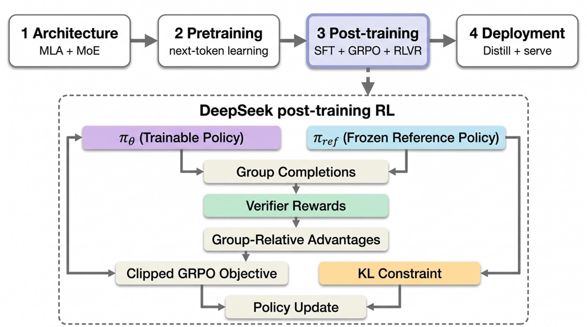
*图7.1 构建DeepSeek模型的四阶段旅程。本章进入后训练阶段，其中强化学习、GRPO、可验证奖励和参考-策略控制成为核心。*

我们将仔细地构建这个思想。首先，我们将把普通的强化学习概念映射到语言生成。然后，我们将推导基本的策略梯度更新，并理解为什么PPO成为一种实用的稳定器。从那里，我们将过渡到GRPO——DeepSeekMath及随后DeepSeek-R1-Zero中所使用的简化方法。最后一节给出具体的PyTorch代码片段，使得下一章可以诚实地建立在实现路径之上，而不仅仅是理论。

## 7.1 强化学习框架

强化学习（Reinforcement learning）是一种从交互中学习的框架。一个智能体（agent）观察环境的当前状态，采取一个动作，接收一个奖励，然后观察一个新状态。经过多次交互，智能体学习到哪些动作倾向于产生更高的奖励。

这与监督学习不同。在监督学习中，每个示例通常带有一个目标答案。模型看到输入并学习模仿目标。强化学习的约束更弱、也更灵活：智能体在每一步可能不会被告诉确切的正确动作。它可能只有在执行若干动作之后才能发现其整体行为是否有用。

这种延迟反馈是强化学习对推理有用的主要原因。当语言模型求解数学问题时，我们通常关心的是最终答案。我们可能不知道模型应该生成的中间token的确切序列。强化学习可以奖励正确的最终答案，并让模型自己发现哪些中间行为有助于达成目标。

### 7.1.1 智能体-环境接口

我们将在本节中使用一个具体示例：一个移动清洁机器人。机器人是智能体，房间是环境。在每一步，机器人观察房间：哪里还有灰尘，哪里有家具阻挡移动，电池是否电量低，以及充电座在哪里。

然后机器人选择一个动作。它可以前进、左转、清洁当前地砖或返回充电座。动作执行后，环境发生变化。一块地砖可能变干净，电池可能减少，或者机器人可能撞到障碍物。环境返回一个奖励信号。清洁灰尘可能产生正奖励。浪费电池或撞墙可能产生负奖励。

重要的特征是循环。机器人不是接收一个静态示例。它行动、观察后果，然后再次行动。策略（policy）是智能体用来从状态选择动作的规则。在神经网络强化学习中，策略由模型参数表示。训练改变这些参数，使导致更高长期奖励的动作变得更可能。

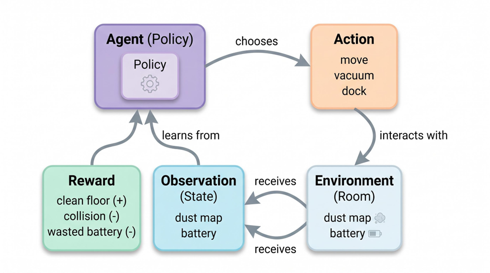
*图7.2 智能体-环境接口。清洁机器人观察房间，选择一个动作，接收奖励，然后从更新后的房间状态重复循环。*

这个示例是刻意平凡的。我们不需要许多不相关的类比。同样的四个对象就够了：状态（state）、动作（action）、奖励（reward）和策略（policy）。本章的其余部分将把这些对象翻译成语言模型的术语。

### 7.1.2 将强化学习映射到语言生成

乍一看，语言模型不像清洁机器人。它不在房间中移动。它预测token。但token生成仍然是一个序贯决策过程。

时刻t的状态是用户给出的提示（prompt）加上模型在当前回复中已生成的所有token。动作是下一个被采样的token。转移很简单：将该token追加到上下文中。新状态是旧状态加上被采样的token。当模型完成回复时，一个奖励函数对回复进行评分。

考虑提示：Roger has 5 tennis balls. He buys 2 more cans of tennis balls. Each can has 3 tennis balls. How many tennis balls does Roger have now? 正确答案是11。在第一个生成步骤，状态仅是提示。模型采样第一个token，也许是'Roger'或'He'。在下一步，状态是提示加上第一个token。这个过程持续直到模型产生完整答案。

"采样"这个词很关键。在普通推理中，我们可能使用贪心解码或低温采样。然而，在强化学习rollout中，采样是核心。模型从其概率分布中采样，以便训练可以探索同一提示的不同回复。如果模型总是选择最可能的单个token，发现替代解路径将会困难得多。

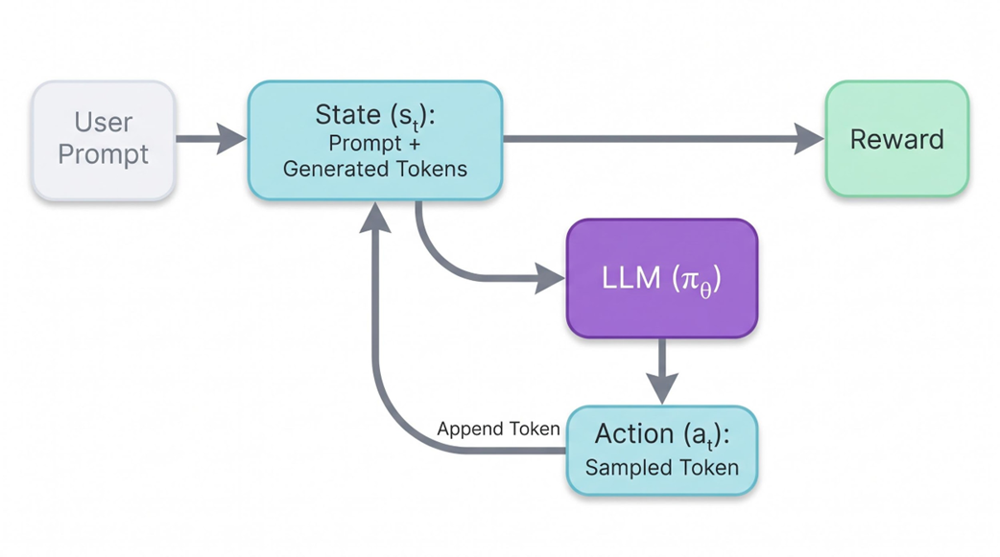
*图7.3 将强化学习概念映射到LLM生成。增长的上下文是状态，每个采样的下一个token是动作，最终回复接收奖励。*

### 7.1.3 稀疏奖励与信用分配

语言模型的强化学习通常使用稀疏奖励（sparse rewards）。当一个奖励仅在一序列动作之后才可用时，它是稀疏的。在Roger问题中，验证器可以评分最终答案，但不一定评分每个中间token。奖励可能是1（如果最终答案是11），否则为0。

稀疏奖励造成了信用分配问题（credit-assignment problem）。如果模型得到了错误答案，是哪个token导致了错误？是算术出错了，模型误读了问题，还是答案格式不好？奖励不直接说明。策略梯度方法通过按结果比例更新所有被采样动作的概率来解决这个问题。后来的改进，如基线（baselines）和优势（advantages），使更新噪声更小。

负学习信号也可能出现，即使原始验证器奖励只有0和1。如果一个回复收到奖励0而该提示的基线是0.5，则其优势为负。模型随后被推离那种被采样的行为。在其他设置中，奖励函数也可能对无效输出、不安全输出或严重的格式违规分配明确的负值。在本章中，我们将保持验证器示例简单，但仍然解释负优势从何而来。

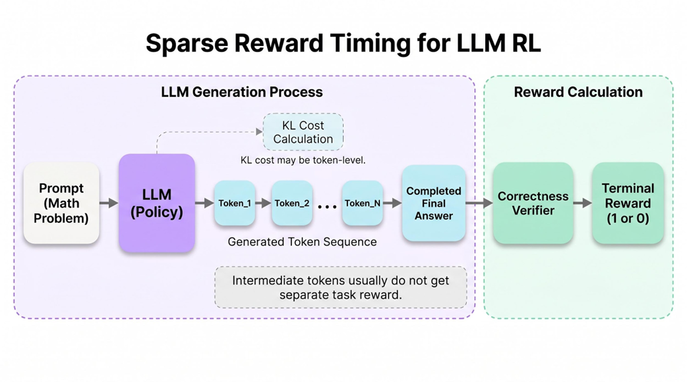
*图7.4 LLM强化学习中的稀疏奖励时序。token逐个生成，但任务奖励通常仅在完整回复完成后才被分配。*

## 7.2 策略梯度方法：用奖励更新LLM

现在核心问题是：我们如何从奖励更新语言模型？模型在每个步骤产生词表上的概率分布。在rollout期间，它从该分布中采样一个token。在回复收到奖励后，我们想要增加有帮助的被采样token的概率，降低有害的被采样token的概率。

这就是策略梯度方法（policy-gradient method）的工作。策略梯度方法估计改变策略参数将如何改变期望奖励。用语言模型的术语来说，策略参数是LLM的权重。策略是模型在下一个token上的概率分布。

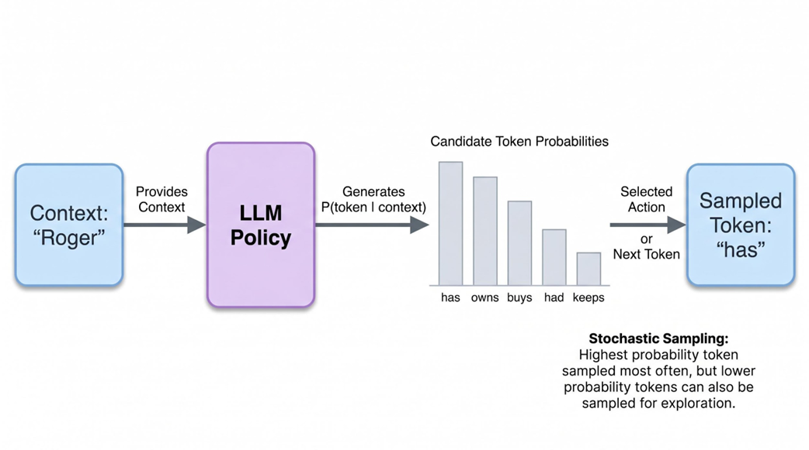
*图7.5 下一个token上的概率分布。在RL训练期间，模型从该分布中采样，而不是总是选择最高概率的token。*

## 7.3 采样动作而非取argmax

假设模型正在决定部分答案之后的下一个token。它可能给'has'分配概率0.42，给'owns'分配0.23，给'will'分配0.11，其余token的概率更小。在rollout期间，token'has'最可能被采样，但不保证。较低概率的token仍然可以被选中。

这种随机性不是实现细节；它是探索所必需的。如果模型从不采样低概率动作，它永远不会知道那些动作是否会导致更好的结果。策略梯度训练依赖于实际被采样动作的对数概率（log probability）。更新要回答的问题是：模型应该为这个被采样状态中的这个被采样动作分配更高还是更低的概率？

对于LLM，这在每个生成的token上重复。一个完整回复是一条轨迹（trajectory）：一系列状态和被采样的动作。奖励附加在轨迹上，更新沿该轨迹改变token概率。

### 7.3.1 基本策略梯度更新

一个简化的策略梯度更新可以写成：

θₜ₊₁ = θₜ + α ∑ₖ ∇θ log πθ(aₖ | sₖ) R

这里θ代表模型参数，α是学习率，sₖ是token步骤k的状态，aₖ是在该步骤采样的token。符号πθ是策略：LLM在参数θ下对下一个token的概率分布。项πθ(aₖ | sₖ)是模型在给定当前状态sₖ下为被采样token aₖ分配的概率。

对数概率的梯度告诉我们如何改变模型参数使被采样动作变得更可能。乘以奖励R控制更新的方向和强度。如果R高，被采样的动作被增强。如果R相对于基线低，被采样的动作被抑制。

这个方程有意保持简洁。一个真实的LLM实现必须处理序列掩码、可变回复长度、旧策略对数概率、KL惩罚和批量计算。但思想已经存在：奖励成为模型实际采样token的学习信号。

### 7.3.2 为什么原始奖励噪声太大

原始奖励（raw reward）是一种粗糙的工具。想象两个提示。一个很简单，大多数补全得到奖励1。另一个很难，大多数补全得到奖励0。在简单提示上奖励为1的补全可能并不出色；在困难提示上奖励为0的补全可能仍然比大多数替代方案更好。仅凭原始奖励并不能告诉我们一个回复相对于该提示的预期有多好。

这就是为什么强化学习算法通常使用优势（advantage）而不是原始奖励。优势衡量一个结果相对于基线好多少或差多少。如果一个回复比预期好，优势为正。如果比预期差，优势为负。

Aₖ = Rₖ - baseline(sₖ)

基线不应该改变哪些动作是最优的，但它可以显著减少方差。更低的方差意味着更新噪声更少，训练更稳定。

近端策略优化（Proximal Policy Optimization，PPO）和组相对策略优化（Group Relative Policy Optimization，GRPO）的主要区别在于它们如何获得这个基线。

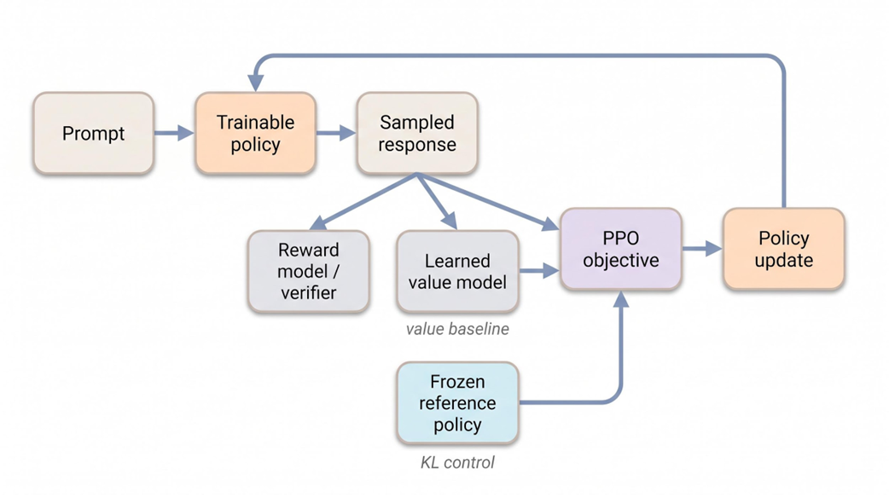
*图7.6 PPO风格的语言模型训练使用可训练策略、奖励信号、学习到的价值基线和冻结参考策略进行KL控制。*

## 7.4 PPO：标准的实用基线

近端策略优化（Proximal Policy Optimization），即PPO，成为一种标准的强化学习算法，因为它在稳定策略更新的同时比旧的信赖域方法更容易实现。PPO由Schulman等人在《Proximal Policy Optimization Algorithms》中引入，https://arxiv.org/abs/1707.06347。它建立在Schulman等人的《Trust Region Policy Optimization》的信赖域思想之上，https://arxiv.org/abs/1502.05477。

信赖域直觉很简单：不要让一次更新将策略移得离产生当前数据批次的策略太远。如果模型在一小批rollout后变化太大，训练信号可能变得不可靠。新策略可能对相同的被采样token分配非常不同的概率，导致更新不稳定。

PPO用概率比率（probability ratio）来控制这一点。该比率比较被采样token在新策略下的概率与其在产生rollout的旧策略下的概率。

ratioₖ(θ) = πθ(aₖ | sₖ) / πold(aₖ | sₖ)

如果比率接近1，新策略对于该被采样动作接近旧策略。如果比率远大于1，新策略使该动作变得更可能得多。如果远小于1，新策略使该动作变得更不可能得多。PPO裁剪这个比率以防止过大的更新。

### 7.4.1 LLM训练的PPO组件

在语言模型后训练中，PPO通常涉及四个组件。第一，可训练的策略模型，即正在被更新的LLM。第二，奖励信号，通常由学习到的奖励模型或验证器产生。第三，价值模型，估计期望未来奖励并提供优势计算的基线。第四，用于KL控制的冻结参考模型。

参考模型通常是RL训练前模型的冻结副本。它为我们提供稳定的锚点。如果训练后的策略偏离参考策略太远，模型可能利用奖励信号、降低语言质量，或偏离有用的指令遵循行为。KL惩罚阻止这种偏离。

价值模型与参考模型不同。它不是冻结的锚点。它被训练来从部分回复预测期望奖励。在许多实现中，它是附加在策略骨干上的价值头，但概念上它是一个评论家（critic）：它估计一个状态有多有希望。PPO使用该估计来计算优势。

### 7.4.2 价值函数从何而来

价值函数Vϕ(sₖ)不是魔法。它是一个学习到的预测器。在rollout期间，训练系统观察部分状态和最终回报。价值模型被训练来预测每个状态的期望回报。如果一个回复的最终奖励高，该回复沿路的状态就成为导致好结果的状态示例。如果最终奖励低，它们就成为导致差结果的状态示例。

Aₖ = Rₖ - Vϕ(sₖ)

这里ϕ表示价值模型的参数。符号与θ分开，因为价值模型和策略概念上是不同的网络，即使在实现中它们共享一些层。策略选择token；价值模型预测当前部分回复预期有多好。

这个价值模型可以有用，但它是昂贵的。它增加了内存、前向传播、训练损失项和工程复杂性。对于非常大的语言模型，即使一个额外的头或评论家路径也很重要。GRPO的设计目的是在保留有用基线的同时移除这个学习到的价值函数模型。

### 7.4.3 为什么参考模型很重要

参考模型之所以存在，是因为奖励函数是不完美的。如果模型仅因最终数学正确性而获得奖励，它可能学到奇怪的格式或过长的回复。如果奖励模型是从偏好数据训练的，策略可能利用奖励模型的怪癖。参考策略提供了一个约束：在任务上改进，但不要偏离预训练模型的分布太远。

在PPO风格的LLM训练中，KL项通常是逐token计算的。系统将训练策略为生成token的对数概率与参考策略为相同token的对数概率进行比较。大的偏离产生惩罚。这不能保证安全性或正确性，但它是一个实用的稳定器。

当我们讨论GRPO时，请把参考模型放在视野中。GRPO移除了价值模型。它没有移除参考模型。参考-策略KL惩罚在DeepSeek风格训练中仍然重要。

## 7.5 GRPO：DeepSeek的价值模型简化

组相对策略优化（Group Relative Policy Optimization），即GRPO，在《DeepSeekMath: Pushing the Limits of Mathematical Reasoning in Open Language Models》中引入，https://arxiv.org/abs/2402.03300。DeepSeek后来在DeepSeek-R1训练方案中使用了相同的思想族。

关键简化是GRPO移除了学习到的价值模型。

GRPO不是训练一个价值模型来估计基线，而是为同一提示采样一组补全。每个补全接收一个奖励。该组中的奖励随后被归一化。如果一个补全比同一提示采样的其他补全更好，它就是好的；如果比组中其他更差，它就是坏的。

这使得基线是提示特定的（prompt-specific），而不需要评论家。对于Roger提示，假设模型采样四个补全。两个以11结尾并获得奖励1。两个以错误答案结尾并获得奖励0。组均值是0.5。正确的补全获得正优势，不正确的补全获得负优势。

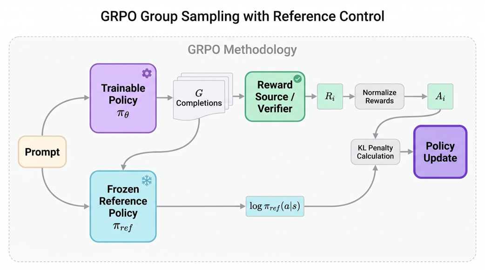
*图7.7 GRPO组采样与参考控制。为同一提示生成多个补全，评分，归一化为优势，并在KL约束下更新。*

### 7.5.1 组相对优势

补全i的组相对优势（group-relative advantage）可以写成：

Aᵢ = (rᵢ - mean(r₁, ..., rG)) / (std(r₁, ..., rG) + ε)

这里，G是为同一提示采样的补全数量，rᵢ是补全i的奖励，ε是为数值稳定性的小常数。如果所有补全获得相同奖励，标准差接近零，因此实现必须避免除以零。

这个方程解释了前面出现的负优势。验证器可能只分配0或1，但在减去组均值后，奖励0可以变为负值。那个负优势告诉优化器相对于同一提示的更好补全，降低被采样轨迹的概率。

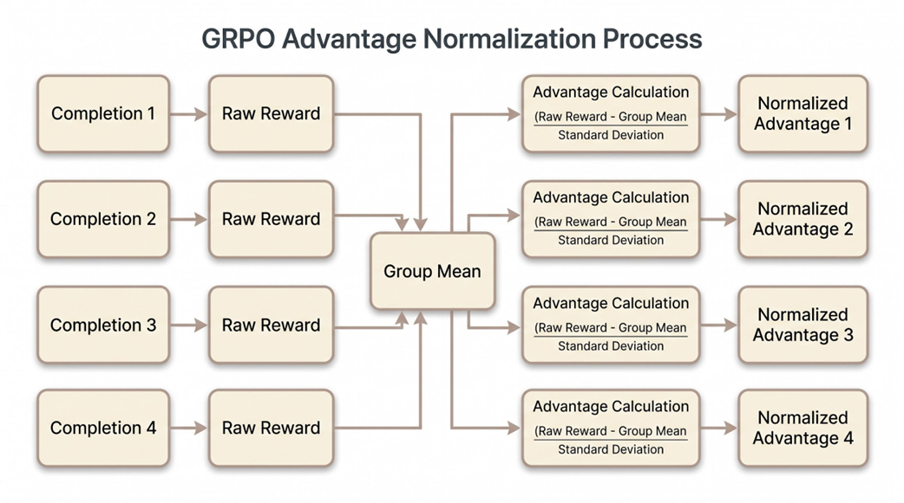
*图7.8 组相对优势计算。对于二元奖励[1, 1, 0, 0]，组均值为0.5，因此正确的补全获得正优势，不正确的补全获得负优势。*

每个token的梯度比这张图能展示的更细致。同一补全级别的优势通常被广播到生成的token上，而掩码确保提示token和填充token不对损失做贡献。生产实现还考虑回复长度、KL惩罚和token级别的对数概率。

### 7.5.2 完整的GRPO目标

将GRPO写成一个简单的带组相对优势的策略梯度更新很诱人。这对直觉有用，但不是完整目标。完整的GRPO风格损失保留了PPO的裁剪比率并添加了针对参考策略的KL项。

LGRPO(θ) = E[min(ratioₖ(θ)Aᵢ, clip(ratioₖ(θ), 1-ε, 1+ε)Aᵢ) - β KL(πθ || πref)]

比率项将当前策略与生成被采样补全的旧策略进行比较。裁剪项限制更新大小。KL项阻止偏离冻结参考策略。

组相对优势取代了价值模型的优势；它不取代稳定器。

当这个目标在PyTorch中实现为最小化损失时，我们通常取其负值。优化器默认最小化，因此最大化目标变成最小化负目标。

### 7.5.3 为什么GRPO比PPO更便宜

GRPO不是更便宜因为它采样更少的补全。事实上，它明确地每个提示采样多个补全。公平的比较是在相同总采样补全数下。在那个比较下，GRPO更便宜因为它消除了学习到的价值模型及其训练路径。

| 组件 | PPO风格训练 | GRPO风格训练 |
|------|-------------|--------------|
| 策略模型 | 可训练LLM | 可训练LLM |
| 奖励信号 | 奖励模型或验证器 | 奖励模型或验证器 |
| 价值模型 | 优势基线所必需 | 已移除；组统计提供基线 |
| 参考模型 | 用于KL控制的冻结模型 | 用于KL控制的冻结模型 |
| 主要节省 | 来自评论家路径无节省 | 无价值模型前向/反向路径 |

这个区别对读者很重要。只有一个采样响应的单个PPO示例在教学上很简单，但实际的PPO训练也使用许多样本。GRPO的优势不在于它避免了采样。而在于它避免了学习一个单独的价值函数。

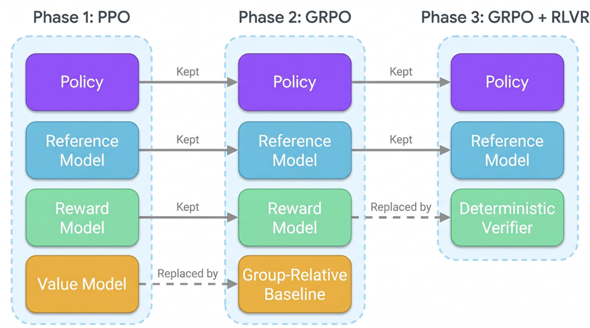
*图7.9 从PPO到GRPO到带可验证奖励的GRPO。GRPO移除价值模型；RLVR仅对可客观检验的任务替换学习到的奖励模型。*

## 7.6 带可验证奖励的强化学习

下一个简化是带可验证奖励的强化学习（Reinforcement Learning with Verifiable Rewards），即RLVR。在RLVR中，奖励由确定性检查器（deterministic checker）而非学习到的奖励模型产生。对于数学问题，检查器可以将最终答案与已知答案比较。对于代码，检查器可以运行单元测试或编译器。对于符号任务，检查器可以对照形式规则验证结果。

这很强大，因为奖励更少主观性。如果提示要求算术问题的答案，正确的最终数字可以自动检查。如果代码问题带有测试，通过测试可以自动评分。模型可以生成许多候选解决方案，无需为每个响应进行人工标注就能获得可靠信号。

RLVR并不能解决每个对齐问题。它仅当正确性可客观验证时适用。开放式对话的有用性、创意写作质量、细微推理、无害性和偏好敏感的助手行为没有确定性检查器。对于这些任务，学习到的奖励模型、偏好数据、人工评估或其他对齐信号仍然是必要的。

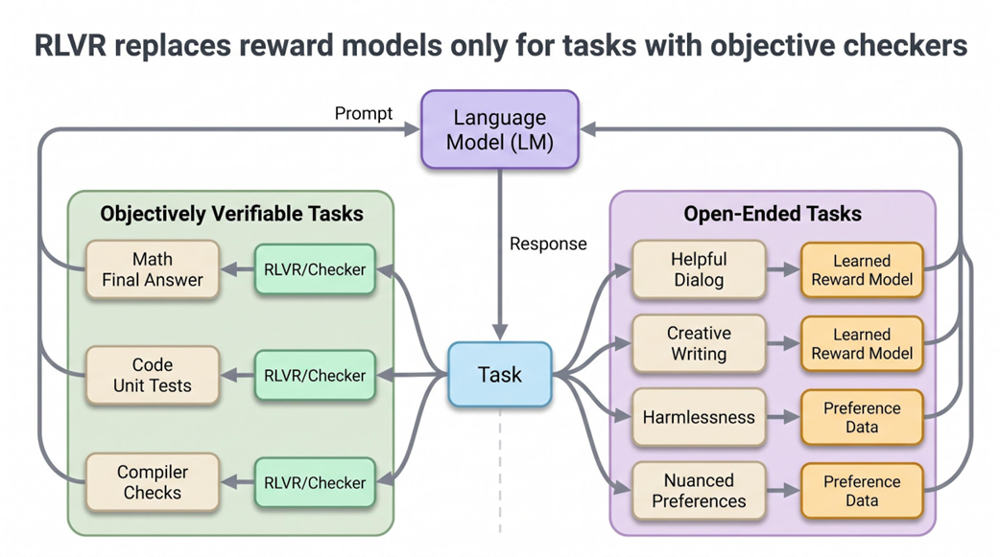
*图7.10 RLVR可以为可客观验证的任务（如数学和代码）替换学习到的奖励模型；开放式助手行为仍需要偏好信号。*

### 7.6.1 设计验证器

验证器应该足够严格以奖励真正的正确性，同时足够灵活以不拒绝无害的格式差异。对于玩具数学任务，我们可以从补全中提取最终数字并与金标准答案比较。对于生产数学验证器，我们可能需要符号等价、单位归一化、小数容差或结构化答案提取。

奖励函数也塑造行为。如果验证器只检查最后一个数字，模型可能学会产生冗长混乱的推理后跟正确的数字。如果验证器也检查格式，模型可能学会将推理与最终答案分离。如果验证器过于脆弱，模型可能因以不同形式书写的正确答案而受到惩罚。

DeepSeek-R1-Zero对推理任务使用基于规则的奖励，包括正确性奖励和格式奖励。格式奖励鼓励回复遵循预期的推理/最终答案结构。正确性奖励检查最终答案是否正确（对于可以验证的任务）。

### 7.6.2 避免过度表述

重要的是不要过度表述RLVR。教训不是奖励模型已经过时。教训是当存在高质量确定性验证器时不需要奖励模型。数学和代码是天然目标，因为许多任务有客观答案。通用助手行为则不同。

DeepSeek-R1本身就反映了这一区别。其后面的训练阶段使用混合奖励设计：对可验证推理任务使用基于规则的奖励，对需要偏好判断的任务（如有用性和无害性）使用学习到的奖励模型。这是实用的方案：在验证器可靠的地方使用验证器，在目标行为不能机械检查的地方使用偏好信号。

## 7.7 推理能力如何在DeepSeek-R1-Zero中涌现

DeepSeek-R1-Zero是R1系列中最干净的实验。它从DeepSeek-V3-Base开始，直接应用大规模强化学习，无需先在监督思维链示例上训练。奖励专注于可验证的推理任务。模型没有被要求模仿人类编写的解题追踪；它因为解决任务而获得奖励。

在训练期间，模型开始为困难问题分配更多token。更长的回复本身并不有价值，但它们给模型空间来尝试一种方法、检查中间结果、注意错误并修正。DeepSeek-R1报告强调了一个"顿悟时刻"（aha moment），模型在其中明确注意到它应该重新评估其方法。

报告中的`<think>`标记标记了模型回复的推理区域。它不是Python标签或特殊的解释器构造。它是一种格式约定，用于将模型的内部推理风格文本与最终答案区域分离。在公开部署中，推理文本可能被隐藏或总结，但在报告中，它被展示以说明在RL期间学到的行为。

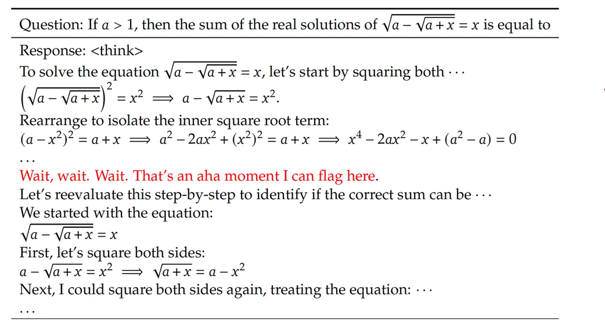
*图7.11 DeepSeek-R1训练中的顿悟时刻示例。`<think>`标记标记模型的推理区域；值得注意的是模型注意到有缺陷的路径并改变策略。*

这个结果应该谨慎解读。R1-Zero表明类推理行为可以在可验证任务的RL压力下涌现。它并不意味着每种推理行为都能保证从任何奖励中涌现。它也不意味着产生的模型是精炼的。报告指出了诸如可读性差和语言混杂等问题。这些问题促成了更工程化的DeepSeek-R1流水线。

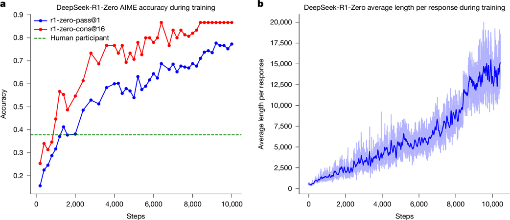
*图7.12 DeepSeek-R1-Zero在RL训练期间的准确率和回复长度。来源：Guo et al., DeepSeek-R1, Figure 1.*

## 7.8 DeepSeek-R1、R1-Zero与蒸馏

DeepSeek-R1系列容易被误解，因为名称相似。DeepSeek-R1-Zero、DeepSeek-R1和DeepSeek-R1-Distill是相关的，但它们不是同一个制品。

DeepSeek-R1-Zero是纯RL实验。它探究一个强大的基座模型是否可以通过带可验证奖励的RL发展推理行为，而无需监督思维链数据。DeepSeek-R1是更可用的最终模型，由一个分阶段流水线产生，结合了冷启动监督微调、面向推理的RL、拒绝采样、混合数据监督微调和最终RL。DeepSeek-R1-Distill模型是在DeepSeek-R1生成的数据上训练的更小学生模型。

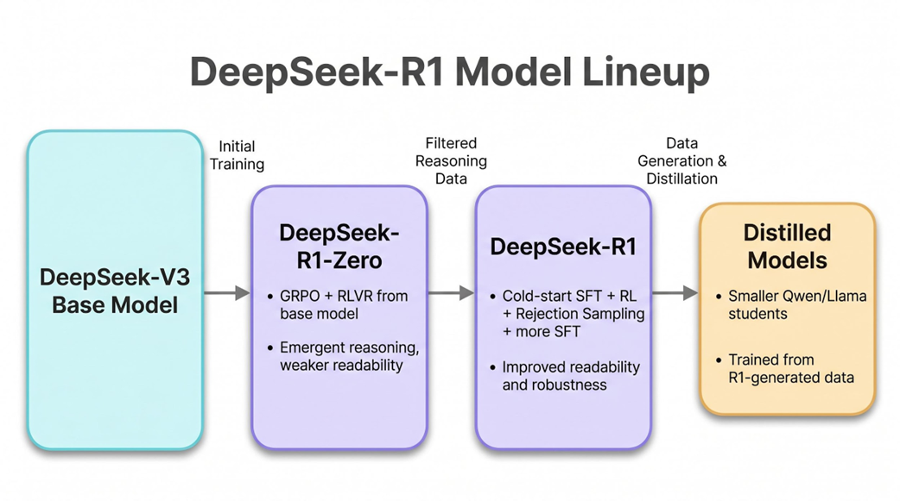
*图7.13 DeepSeek-R1模型阵容。R1-Zero展示涌现推理；R1改善可读性和鲁棒性；Distill将R1生成的推理数据转移到更小的学生模型中。*

### 7.8.1 从R1-Zero到R1

从R1-Zero到R1的箭头是数据流，不是参数流。R1-Zero的输出被采样、过滤并用作训练数据。R1不是简单地将R1-Zero训练更久。它是一个围绕以下洞察构建的分阶段系统：RL可以生成有用的推理追踪，但这些追踪在被变成精炼的助手模型之前需要过滤和改进。

DeepSeek-R1的第一阶段使用冷启动监督数据。DeepSeek创建了一小组具有更可读风格的长思维链示例，并在其上微调基座模型。这为模型在重RL之前提供了更好的初始推理格式。

下一阶段使用带基于规则奖励的面向推理的RL。这个阶段类似于R1-Zero实验，但从一个格式更好的模型开始。它还包括语言一致性奖励以减少R1-Zero中观察到的语言混杂。

之后，DeepSeek使用拒绝采样和监督微调。系统采样许多输出，过滤其正确性和可读性，并将推理数据与更广泛的非推理指令数据混合。这一步恢复了纯验证器RL不直接优化的通用助手行为。

最后的RL阶段使用混合奖励。对于可验证任务，基于规则的奖励仍然适用。对于开放式有用性和无害性任务，学习到的奖励模型提供偏好信号。这就是为什么R1流水线不应被概括为"无奖励模型"。它在可能的地方使用验证器，在必要的地方使用奖励模型。

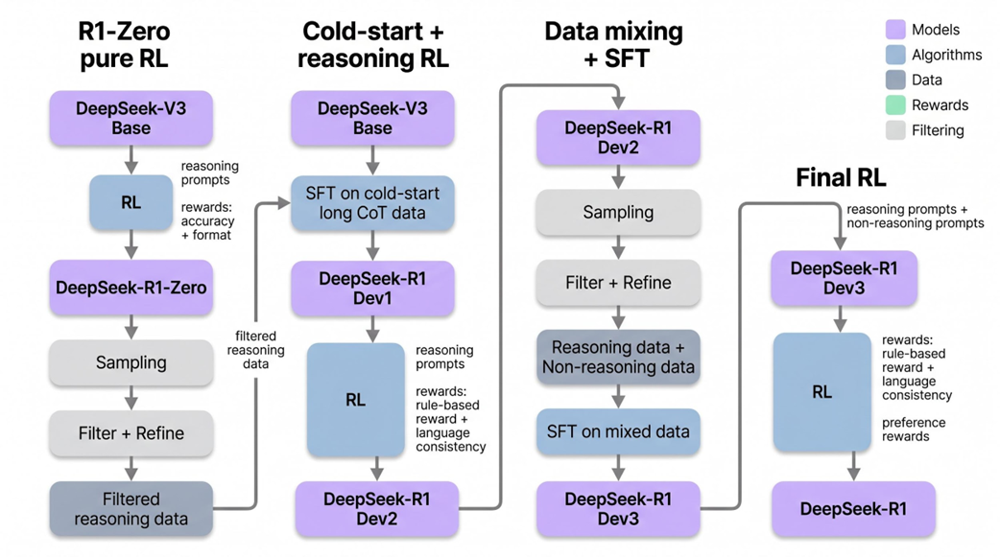
*图7.14 DeepSeek-R1训练流水线，改编自Guo et al., DeepSeek-R1, Figure 2。从R1-Zero到R1的流程代表过滤后的训练数据，不是直接参数转移。*

### 7.8.2 为什么冷启动数据很重要

DeepSeek-R1中的冷启动阶段很容易被跳过，但它解决了一个实际问题。纯RL可以发现有用的行为，但不保证行为令人愉悦地可读、格式一致或符合助手预期的惯例。R1-Zero展示了推理行为，但报告也描述了可读性问题和语言混杂。

冷启动监督示例在主要推理RL阶段之前给模型更好的初始回复风格。与其要求RL从零开始发现正确性和可读格式，不如让模型从少量策划的推理数据开始。这是后训练中的常见模式：使用监督学习设置初始行为分布，然后使用RL在奖励下改进结果。

对我们的目的而言，教训是监督微调和强化学习不是竞争工具。它们解决问题的不同部分。监督微调擅长教授格式、风格和模仿已知示例。强化学习擅长当我们能评分结果时优化行为。DeepSeek-R1两者都用。

小的冷启动数据集也可以减少浪费的探索。如果模型已经知道如何产生带有最终答案区域的结构化解，验证器的工作更容易，RL信号更干净。没有这种结构，模型可能花很多rollout产生难以解析或虽包含有用推理但不符合格式要求的输出。

### 7.8.3 拒绝采样作为数据构建

拒绝采样出现在R1流水线中推理导向RL阶段之后。想法很简单：从强模型采样许多候选回复，保留满足正确性和质量标准的，丢弃其余的。被接受的回复成为监督训练数据。

这本身不是强化学习。它是数据生成和过滤步骤。但它依赖于RL训练过的模型，因为那个模型能产生比原始基座模型更强的推理追踪。流水线用RL来改进生成器，然后用过滤将生成器最好的输出转化为监督数据集。

过滤标准很重要。对于可验证推理任务，正确性可以通过基于规则的验证器检查。对于可读性和通用指令遵循数据，过滤可能涉及启发式、基于模型的判断或人类偏好数据。目标是避免在低质量或不一致的输出上训练下一阶段。

这也是为什么从R1-Zero到R1的流程应该被描述为数据流。模型不是简单地将纯RL实验的权重复制到最终产品中。相反，强输出被收获、过滤，并与其他数据源混合来训练一个更均衡的检查点。

### 7.8.4 恢复通用助手行为

一个在数学和代码验证器上被重度优化的模型可能变得在可验证推理上更好，但作为通用助手变得不够均衡。它可能过度使用长推理，对简单请求回应尴尬，或关注对基准任务有意义但对日常交互不合适的答案格式。

DeepSeek-R1通过在拒绝采样后使用混合监督数据来解决这个问题。训练数据包括推理示例，但也包括非推理指令数据，如写作、编辑、事实问答、角色扮演和其他通用助手任务。这一阶段有助于保持模型的广泛有用性。

这个设计对构建自己系统的读者很重要。如果你仅在可验证数学奖励上训练，你不应该期望模型成为精炼的通用助手。奖励定义压力。狭窄的奖励创造狭窄的改进，除非它与更广泛的数据和对齐信号结合。

在像我们这样的书项目中，这个区别防止了一个过于简单的故事。GRPO加RLVR是关键的算法思想，但最终的R1系统是一个流水线。该流水线结合了数据策划、监督学习、强化学习、拒绝采样和混合奖励。

### 7.8.5 最终的混合奖励阶段

DeepSeek-R1中最后的RL阶段使用混合奖励，因为模型必须处理可验证和不可验证任务。对于数学问题，基于规则的检查器可以评分正确性。对于有用性提示，可能没有单一客观正确的回复。学习到的奖励模型或基于偏好的信号更合适。

这种混合设计是对"RLVR是否取代奖励建模？"这个问题的实际回答。不。RLVR在存在可靠验证器的任务上取代奖励建模。当期望行为是偏好、细微差别、安全性或风格的问题时，奖励建模仍然有用。

最终的R1模型从多个来源继承优势。可验证奖励加强在有客观答案的任务上的推理。监督数据改善格式和通用有用性。面向偏好的奖励将回复与人类在开放式任务上的判断对齐。蒸馏然后将许多这些行为转移到更小的模型中。

主要的工程原则是将奖励来源与任务匹配。在可以精确检查的地方使用精确检查器。在目标不能简化为确定性答案的地方使用学习到的偏好信号。

### 7.8.6 蒸馏到更小模型

DeepSeek-R1-Distill模型回答了一个实际的部署问题：大模型的推理行为如何转移到更小的模型中？蒸馏模型不是通过在小型模型上重复完整的大规模RL流水线来训练的。相反，更小的开源基座模型，包括Qwen和Llama变体，在DeepSeek-R1生成的大型监督数据集上进行微调。

这很重要，因为纯RL可能昂贵且不稳定，特别是对于可能没有与教师相同基座能力的更小模型。蒸馏将教师的解决方案模式打包到监督数据集中。学生学习模仿成功的推理追踪，而不需要通过昂贵的探索重新发现它们。

DeepSeek-R1报告发现蒸馏可以非常有效。蒸馏的更小模型在几个推理基准上可以超过类似大小的仅用RL训练的模型。实际的教训是RL可以在大型有能力的模型中发现或加强推理行为，而蒸馏可以将该行为转移到更便宜的模型中。

蒸馏也改变了训练经济学。RL需要重复采样、评分和策略更新。在蒸馏数据上的监督微调更简单且更可预测。一旦强教师生成了大量高质量推理追踪，许多学生模型可以从该数据集训练而无需再次运行完整的RL流水线。

这不意味着蒸馏总是比RL更好。蒸馏可以转移教师已经有的行为，但通常不会发现超越教师的新行为。当奖励可靠时，RL可以将教师推入新的行为区域。这两种方法互补：RL改进教师；蒸馏分布教师的行为。

## 7.9 最小章节代码

关于强化学习的章节不应停留在概念图上。本章的代码库在ch07/01_main-chapter-code/grpo_rlvr_minimal.py下包含一个紧凑实现。目标不是构建一个生产分布式训练器。目标是让算法部分变得具体：验证器奖励、组相对优势、裁剪GRPO损失、参考-策略KL和一个训练步骤骨架。

你可以使用以下命令从代码库根目录运行章节代码：

```
cd ch07/01_main-chapter-code
pip install -r requirements.txt
python grpo_rlvr_minimal.py
```

该文件刻意保持小巧。一个生产RL训练器需要分布式rollout工作器、跨GPU的批处理、分词器集成、响应掩码、检查点、安全过滤、奖励监控和仔细的KL调度。这些细节很重要，但它们会隐藏核心算法。我们从核心部分开始。

### 7.9.1 最小验证器

第一部分是一个确定性验证器。对于仅答案的数学提示，一个玩具验证器可以从补全中提取最终数字并与金标准答案比较。

```python
import re

def extract_final_number(text: str) -> str | None:
    """Return the last integer or decimal number found in a completion."""
    matches = re.findall(r"-?\d+(?:\.\d+)?", text)
    return matches[-1] if matches else None

def verify_math_answer(completion: str, gold: str) -> float:
    """A toy RLVR reward for answer-only math tasks."""
    predicted = extract_final_number(completion)
    if predicted is None:
        return 0.0
    return 1.0 if predicted == str(gold) else 0.0
```

这个验证器有意保持简单。它足以说明RLVR机制，但不足以用于生产数学训练运行。更强的验证器会解析结构化最终答案、处理等价分数和小数，并拒绝在输出中放置多个冲突答案的补全。

### 7.9.2 计算组相对优势

下一部分是GRPO的组相对基线。假设我们有一批提示，对于每个提示，我们采样了G个补全。奖励张量的形状为[batch_size, group_size]。我们沿组维度归一化。

对于奖励[1, 0, 1, 0]，均值是0.5。正确的补全获得正归一化优势，不正确的补全获得负归一化优势。这就是二元验证器奖励如何成为增强和惩罚信号的过程。

```python
import torch

def group_advantages(rewards: torch.Tensor, eps: float = 1e-6) -> torch.Tensor:
    """Normalize rewards within each prompt group.

    Args:
        rewards: Tensor of shape [batch_size, group_size].
        eps: Minimum standard deviation for numerical stability.

    Returns:
        Tensor of normalized advantages with the same shape as rewards.
    """
    mean = rewards.mean(dim=1, keepdim=True)
    std = rewards.std(dim=1, keepdim=True).clamp_min(eps)
    return (rewards - mean) / std
```

### 7.9.3 裁剪GRPO损失

损失函数将当前策略、生成补全的旧策略、冻结参考策略和优势汇聚在一起。在实际的语言模型训练器中，对数概率是按每个生成token计算的。旧对数概率在rollout期间存储。参考对数概率用冻结参考模型计算。

```python
def grpo_loss(
    logp: torch.Tensor,
    old_logp: torch.Tensor,
    ref_logp: torch.Tensor,
    advantages: torch.Tensor,
    eps: float = 0.2,
    beta: float = 0.04,
) -> torch.Tensor:
    """Compute the clipped GRPO objective as a minimization loss.

    Shapes:
        logp, old_logp, ref_logp: [batch_size, group_size, tokens]
        advantages: [batch_size, group_size]
    """
    ratio = torch.exp(logp - old_logp)
    clipped = ratio.clamp(1.0 - eps, 1.0 + eps)
    adv = advantages.unsqueeze(-1)
    surrogate = torch.minimum(ratio * adv, clipped * adv)
    kl = logp - ref_logp
    return -(surrogate - beta * kl).mean()
```

这个清单仍然是简化的。为清晰起见，它省略了注意力掩码和响应掩码。在真实训练器中，提示token不应该对策略损失做贡献，填充token必须被忽略。KL估计也可能使用更仔细选择的公式。该清单旨在暴露结构，而不是取代生产RL库。

### 7.9.4 一个训练步骤骨架

训练步骤将各部分连接在一起。它采样一组补全，验证它们，计算组相对优势，在当前和参考策略下评分补全，计算GRPO损失，并应用优化器步骤。

```python
def train_step(batch, policy, reference, optimizer, group_size: int = 4):
    """One GRPO + RLVR training step skeleton."""
    prompts, gold_answers = batch

    completions, old_logp = sample_group(policy, prompts, group_size)
    rewards = torch.tensor(
        [
            [verify_math_answer(y, gold) for y in group]
            for group, gold in zip(completions, gold_answers)
        ],
        device=old_logp.device,
    )
    advantages = group_advantages(rewards)

    logp = sequence_logprobs(policy, prompts, completions)
    with torch.no_grad():
        ref_logp = sequence_logprobs(reference, prompts, completions)

    loss = grpo_loss(logp, old_logp, ref_logp, advantages)

    optimizer.zero_grad(set_to_none=True)
    loss.backward()
    optimizer.step()

    return {"loss": float(loss.detach()), "reward": float(rewards.mean())}
```

占位符`sample_group`和`sequence_logprobs`是真实LLM实现会连接到分词器和model.generate风格roll出代码的地方。`sample_group`必须返回补全和旧策略的token对数概率。`sequence_logprobs`必须在当前策略和冻结参考模型下为那些相同的生成token评分。

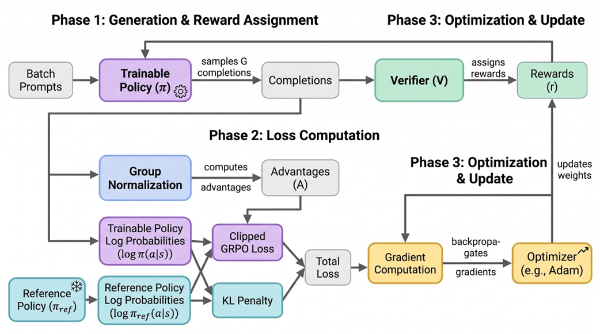
*图7.15 章节代码的实现工作流。提示被采样，补全被验证，奖励被归一化，策略用裁剪GRPO目标加KL控制进行更新。*

这个骨架足以使本章的主张具体化。读者现在可以看到可验证奖励在哪里进入，GRPO如何移除价值模型，为什么参考模型保留，以及策略更新如何计算。

## 7.10 一个GRPO的完整示例

在离开算法之前，让我们用一个完整的GRPO更新走一遍。这个示例使用相同的Roger网球提示，因为算术足够简单，强化学习机制仍然可见。

提示是：Roger has 5 tennis balls. He buys 2 more cans of tennis balls. Each can has 3 tennis balls. How many tennis balls does Roger have now? 正确计算是5 + 2 × 3 = 11。我们要求当前策略为同一提示采样四个补全。

| 补全 | 最终答案 | 验证器奖励 |
|------|---------|-----------|
| A | 11 | 1 |
| B | 10 | 0 |
| C | 11 | 1 |
| D | 16 | 0 |

原始奖励为[1, 0, 1, 0]。组均值为0.5。如果我们对一组四个值使用无偏PyTorch默认值，组标准差约为0.577，如果使用总体定义则为0.5。确切的缩放不如符号和相对大小重要。两个正确的补全在组均值之上；两个不正确的补全在其之下。

归一化后，补全A和C获得正优势。补全B和D获得负优势。因此，策略更新在裁剪和KL控制的前提下，增加A和C中被采样token序列的概率，降低B和D中被采样token序列的概率。

注意算法不知道什么。它不知道补全B犯了加法错误而补全D错误地计算了所有罐数。它只知道它们的最终答案未通过验证器。模型的先前知识和许多未来样本的分布提供了逐渐偏好导向正确答案推理路径的压力。

这就是为什么大规模RLVR需要许多提示。单个提示不能教授算术。但在数千或数百万个可验证任务中，模型反复看到某些推理模式导致奖励而其他模式不会。随着时间的推移，策略变得更可能产生有成效的中间步骤，即使奖励通常只附加在最终答案上。

### 7.10.1 每个token发生了什么？

一个常见的困惑来源是算法奖励单个词还是整个答案。验证器通常评分整个答案。但策略梯度损失是从token对数概率计算的。这意味着同一补全级别的优势被应用到该补全中生成的token上。

如果补全A获得正优势，A中生成的token一起被推高。如果补全B获得负优势，其生成的token一起被推低。这是一个不完美的信用分配信号，但它在统计上变得有用。在成功补全中频繁出现的token和模式变得更可能。在失败补全中频繁出现的token和模式变得更不可能。

KL项略微复杂化了这一点。一个获得正优势的token如果增加其概率会使策略偏离参考模型太远，它仍然可能受到约束。类似地，裁剪项防止一个批次做出过大的变化。最终更新是优势压力、裁剪和参考-策略压力共同作用的结果。

这解释了为什么简化方程和完整目标必须保持分开。简化的策略梯度方程教授方向：奖励加权的对数概率。GRPO目标教授实际的训练规则：带裁剪和参考-策略KL的组相对优势。

### 7.10.2 为什么同一提示的多个样本很重要

GRPO的组结构不仅仅是一个批处理技巧。为同一提示采样多个补全创建了局部比较。模型不仅仅被告知奖励1是好的而奖励0是坏的。它被告知对于同一输入哪些补全更好或更差。

这种局部比较在提示难度不同时特别有用。如果一个提示很容易，许多补全可能正确。如果一个提示很难，大多数补全可能错误。全局基线会将这些情况混在一起。组相对基线在同一提示内比较回复，使优势更感知提示。

这里仍然有权衡。更大的组给出更好的提示特定奖励分布估计，但消耗更多rollout计算。如果组太小，基线噪声大。如果太大，更少的不同提示能放入相同的计算预算。实际训练选择一个平衡这些因素的组大小。

因此，DeepSeek使用GRPO应该被解读为工程折衷和算法思想。它移除价值模型，保留参考模型，并在可比较奖励的补全组上花费rollout计算。

## 7.11 从玩具代码到真实LLM训练器

章节代码有意最小，但它以直接的方式映射到真实训练器。主要区别在于规模和基础设施，而不是概念流程。真实训练器仍然采样补全、存储旧对数概率、验证或评分补全、计算优势、评估当前和参考策略，并应用裁剪的策略梯度更新。

第一个缺失部分是生成。在玩具文件中，`sample_group`是一个占位符。在真实实现中，此函数对提示进行分词，调用策略模型的generate函数（启用采样），并记录生成的token。它还必须记录每个生成token的旧策略对数概率，因为PPO/GRPO比率将新策略与产生rollout的策略进行比较。

第二个缺失部分是对数概率评分。`sequence_logprobs`也是一个占位符。在真实实现中，它在提示加补全序列上运行模型，并收集为每个生成token分配的对数概率。这必须仔细完成：token k的对数概率来自前一个位置的模型输出，提示token应该从损失中掩码掉。

第三个缺失部分是批处理。真实响应有不同的长度。有些补全提前终止；其他使用最大token预算。训练器将序列填充到共同长度并使用掩码，使填充不影响损失。没有正确的掩码，模型可能为从未生成的token接收梯度。

第四个缺失部分是分布式执行。大模型通常不能用同时生成rollout和更新权重的单进程来训练。生产系统将rollout生成、奖励计算、对数概率评分和优化跨设备分离。本章没有实现这种机制因为它会遮蔽算法，但算法数据流是相同的。

| 玩具函数 | 真实训练器等价物 |
|---------|-----------------|
| sample_group | 分词器 + policy.generate + 被采样token和旧对数概率的存储 |
| verify_math_answer | 任务特定验证器、单元测试、编译器、符号检查器或奖励模型 |
| group_advantages | 带数值安全措施的提示-组奖励归一化 |
| sequence_logprobs | 在策略/参考模型下收集token对数概率的前向传播 |
| grpo_loss | 带KL控制和优化器集成的掩码裁剪代理目标 |

以这种映射方式思考有助于防止一个常见的误解。章节代码不是假算法。它是算法的小版本。它省略的是生产系统关注点：吞吐量、内存、鲁棒性、安全过滤和监控。

### 7.11.1 响应格式与验证器可靠性

对于RLVR，响应格式是训练问题的一部分。如果验证器不能可靠地识别最终答案，奖励变得噪声大。模型可能正确解决问题但以验证器无法解析的方式表述答案。或者它可能包含几个候选数字，导致验证器提取错误的那个。

一个常见解决方案是要求结构化的最终答案格式。例如，提示或系统指令可能要求模型在标记如'Final answer:'之后放置最终答案。验证器随后只解析那个区域。DeepSeek-R1报告讨论了鼓励模型将推理与最终答案区域分离的格式奖励。这不是装饰性的；它使奖励分配更可靠。

同样的原则适用于代码。代码验证器可能运行单元测试，但它必须知道要测试哪个文件或函数。如果模型输出混合了散文、markdown围栏和代码，评估器必须提取可运行的程序。一个脆弱的提取器可能产生误导性的奖励信号。因此，RLVR数据集通常定义严格的输出协议。

### 7.11.2 监控训练行为

一个GRPO/RLVR训练运行应该用平均奖励以外的指标来监控。平均奖励可能上升而其他行为退化。例如，响应长度可能暴增，语言质量可能下降，或策略可能偏离参考模型太远。

有用的监控指标包括平均奖励、通过率、响应长度、与参考策略的KL偏离、无效格式率、重复输出率和组内奖励方差。对于代码任务，隐藏测试性能很重要，因为可见测试奖励可能被利用。对于数学任务，一个带有鲁棒答案检查的保留集是必要的。

DeepSeek-R1-Zero训练曲线很有趣，因为它们同时显示了改进的准确率和增加的响应长度。长度增加只有在伴随更好正确性时才有意义。一个只是写更多文本而不解决更多问题的模型不是在改进推理。奖励和评估指标必须区分有成效的推理和冗长。

### 7.11.3 从PPO到GRPO在代码中有什么变化？

如果你已经有一个PPO训练器，转向GRPO不会移除每个PPO思想。旧策略对数概率、概率比率、裁剪目标和参考KL仍然保留。主要的代码变化是优势的来源。

在PPO中，优势通常来自回报减去价值估计。这需要一个价值模型、价值损失、价值模型优化器路径，有时还有广义优势估计。在GRPO中，优势来自被采样组内的奖励。训练器可以移除价值模型并用组归一化取代价值基线计算。

这种替换简化了系统，但也改变了数据要求。GRPO需要每个提示多个补全，使组基线有意义。一个每个提示采样一个响应的PPO风格训练器不能计算有用的组相对优势，除非它改变其rollout结构。

总结：GRPO简化了模型栈，而不是整个训练问题。它仍然需要仔细的rollout生成、奖励设计、KL控制和优化器工程。

## 7.12 本章为本书增添了什么？

在书的这个节点，我们已经构建了基座模型架构和训练循环。本章添加了使模型超越下一个token预测器的后训练逻辑。可运行的代码很小，但它引入了面向推理训练阶段所需的精确钩子。

验证器函数是第一个钩子。它将完成的响应转化为标量奖励。组优势函数是第二个钩子。它将一组标量奖励转化为相对学习信号。GRPO损失是第三个钩子。它将这些学习信号和对数概率转化为策略模型的梯度。训练步骤骨架是第四个钩子。它展示了完整的操作顺序。

这些钩子足以让下一章诚实地讨论蒸馏。一个强推理模型可以为更小模型生成监督数据，因为强化学习首先在教师中创建或加强了推理行为。蒸馏然后使用普通监督微调将该行为打包到学生中。

关键概念桥梁是：强化学习用于在奖励压力下发现或锐化行为；蒸馏用于将该行为转移到更便宜的模型中。DeepSeek-R1-Zero和DeepSeek-R1处于发现侧。DeepSeek-R1-Distill处于转移侧。

## 7.13 实践实现检查清单

如果你要将小的章节脚本扩展为更现实的实验，以下检查清单是思考系统的有用方式。每项对应一个具体的工程要求，而不仅仅是概念思想。

- **从任务分布开始。** 带可验证奖励的GRPO需要结果可以检查的提示。对于数学实验，数据集应包含提示和金标准答案。对于代码实验，数据集应包含测试或另一个可执行正确性信号。如果任务不可验证，你需要学习到的奖励模型或不同的对齐方法。

- **在训练前定义响应协议。** 模型应该知道将最终答案放在哪里。搜索任意自由格式文本的验证器是脆弱的。一个协议如"写推理，然后在Final answer:之后放置最终答案"使奖励提取更可靠。协议应该是提示模板的一部分，如有必要，也应是奖励的一部分。

- **创建参考策略。** 在大多数设置中，这是RL开始前模型的冻结副本。它在RL阶段不应该被更新。它的工作是提供KL锚点，使可训练策略不会偏离太远。

- **生成组，而不是孤立响应。** 对于每个提示，从当前策略采样多个补全。存储生成的token ID、注意力掩码、响应掩码和旧策略对数概率。这些旧对数概率是GRPO目标中裁剪比率所必需的。

- **评分补全。** 在每个补全上运行验证器或奖励模型。对于RLVR任务，记录奖励和有用的诊断信息，如解析失败、无效格式、超时或单元测试失败。诊断使调试不改善的奖励变得更容易。

- **计算组相对优势。** 在每个提示组内归一化奖励。注意所有奖励相同的组。如果每个补全获得相同奖励，该提示可能几乎没有学习信号。实践中，可能需要课程或更难/更容易的提示混合来保持奖励方差有用。

- **计算当前和参考对数概率。** 在相同的生成序列上运行可训练策略和冻结参考模型。仅收集生成响应token的对数概率。应用掩码使提示token和填充不对损失做贡献。

- **应用GRPO损失。** 使用概率比率、裁剪、优势和KL惩罚。跟踪平均奖励、平均KL、响应长度、无效格式率和损失。奖励上升但KL爆炸是警告信号。KL稳定但奖励平坦可能意味着策略被过度约束或奖励太稀疏。

- **在保留任务上评估。** 训练奖励不够。对于数学，使用保留提示和鲁棒答案检查。对于代码，尽可能使用隐藏测试。对于通用助手行为，使用偏好评估或人工审查。模型可能像监督模型对数据集过拟合一样对验证器或提示分布过拟合。

| 步骤 | 扩展前要问的问题 |
|------|----------------|
| 任务 | 结果可以可靠地验证吗？ |
| 格式 | 最终答案可以无歧义地解析吗？ |
| Rollout | 旧对数概率和响应掩码是否正确存储？ |
| 奖励 | 解析失败和无效输出是否分开跟踪？ |
| 优势 | 每个提示组是否有有用的奖励方差？ |
| KL | 策略是否与冻结参考保持足够近？ |
| 评估 | 保留性能是否改善，而不仅仅是训练奖励？ |

这个检查清单也解释了为什么生产RL训练比短的章节代码更复杂。算法可以放在几个函数中；围绕它的可靠系统需要仔细的数据设计、日志记录、分布式执行、评估和安全措施。

## 7.14 审慎解读DeepSeek-R1的声明

因为DeepSeek-R1受到了大量关注，值得通过将强声明与过度声明分开来结束技术讨论。一个强声明是GRPO加可验证奖励可以在有能力的基座模型中诱导推理行为。DeepSeek-R1-Zero为这个声明提供了证据。模型在推理基准上改进，并在RL训练期间表现出更长、更具自我修正性的响应。

另一个强声明是移除价值模型可以简化大规模RL训练。GRPO用组相对奖励归一化取代学习到的价值基线。这减少了模型栈并避免了训练评论家，同时保留裁剪和参考-策略控制。

第三个强声明是蒸馏可以有效地将推理行为转移到更小模型。R1-Distill结果表明在高质量教师生成的推理数据上监督微调可以产生强大的更小模型。

过度声明将是可验证奖励解决所有对齐。它们不解决。它们解决具有客观检查器的任务的奖励规约。一旦我们转向开放式有用性、创意写作、微妙事实判断或安全偏好，确定性验证变得不足。

另一个过度声明将是思维链监督在每个设置中都不必要。R1-Zero表明监督思维链不是纯RL实验产生涌现推理行为所必需的。但DeepSeek-R1仍然使用冷启动监督数据和后来的监督微调阶段来改善可读性和可用性。

更平衡的结论更有用：RLVR为可验证任务给了我们一个强大的可扩展奖励来源；GRPO通过移除价值模型使RL更新更便宜；分阶段的监督学习和偏好奖励仍然被需要，以将产生的行为转化为可用的助手。

## 7.15 常见实现陷阱

最小代码有意紧凑，但一旦实现被扩展，几个细节变得重要。

1. **响应掩码是必需的。** 模型应该在生成响应token上被更新，而不是在数据集提供的提示token上。填充token也应该从损失中排除。

2. **奖励解析必须鲁棒。** 模型可能在响应中包含多个数字。如果验证器提取了错误的数字，奖励变得噪声大。许多RLVR流水线要求模型以特定格式放置最终答案，以便验证器可以可靠地解析它。

3. **KL控制必须被监控。** 如果beta太小，策略可能偏离并利用奖励。如果beta太大，学习可能停滞。实际系统通常基于观察到的偏离来调整KL压力。

4. **组大小是一个权衡。** 更大的组提供更好的提示特定基线，但它们需要每个提示更多采样补全。计算预算必须在提示数量、每个提示的补全数量、响应长度和模型大小之间分配。

5. **奖励操纵（reward hacking）始终是一个风险。** 如果检查器不完整，模型可能学会利用它。对于代码，通过可见测试可能不意味着在隐藏测试上的正确性。对于数学，答案提取可能被模糊输出所欺骗。验证器设计是模型训练的一部分，不是事后的附加。

在下一章中，我们将使用强推理模型的输出作为更小学生模型的训练数据。该蒸馏步骤解释了DeepSeek风格推理行为如何可以被转移到更便宜运行和更容易部署的模型中。

## 7.16 总结

- LLM强化学习将增长的上下文视为状态，每个被采样token视为动作。

- 策略梯度方法按奖励或优势比例更新被采样动作的概率。

- PPO用裁剪稳定策略更新，通常使用学习到的价值模型作为基线。

- 价值函数Vϕ(s)由学习到的价值模型或价值头从rollout回报训练产生。

- GRPO通过在同一提示采样的补全组内归一化奖励来移除学习到的价值模型。

- GRPO在相同总采样补全数下比PPO更便宜，因为它消除了价值模型路径，不是因为它采样更少响应。

- RLVR仅在任务有可客观验证答案时取代学习到的奖励模型，如许多数学和代码任务。

- DeepSeek-R1-Zero展示了GRPO加可验证奖励的涌现推理；DeepSeek-R1添加分阶段SFT和RL使行为更可用。

- 从R1-Zero到R1的流程是数据流：过滤的输出成为训练数据，不是直接参数转移。

- 章节代码为验证器奖励、组相对优势、裁剪GRPO损失和训练步骤骨架提供了具体的钩子。
