# 第8章 知识蒸馏：让强大模型变得实用

本章涵盖：

- 从大型模型中蒸馏知识
- 使用温度缩放的 soft target
- 构建 DeepSeek-R1 的蒸馏模型

在上一章中，我们通过强化学习为 DeepSeek 模型赋予了推理能力。模型现在可以解决复杂的数学问题、编写代码，并通过逐步思考来应对难题。但这里有一个问题，而且是一个大问题。

我们构建的 DeepSeek-R1 模型是一个拥有 6710 亿参数的 Mixture-of-Experts 巨兽。运行它需要一个由八块高端 GPU 组成的集群，每天的计算成本高达数千美元，而且它太大了，无法部署在真正需要推理能力的设备上：笔记本电脑、手机和边缘服务器。如果我们能够把这个庞大模型所学到的一切——它所有的推理能力、数学洞察力、代码编写技能——压缩成一个可以在单块消费级 GPU 上运行的模型呢？如果我们能够把它压缩成一个可以在手机上运行的模型呢？

这正是 knowledge distillation 所做的事情。其结果是非同寻常的：DeepSeek 发布了一个只有 15 亿参数的蒸馏模型，在数学推理基准测试上超越了 GPT-4o。一个大约小 450 倍的模型，击败了世界上最强大的 AI 系统之一。

在本章中，我们将理解这是如何可能的。如图 8.1 所示，我们的路线图将涵盖：

1. knowledge distillation 背后的核心直觉和 teacher-student 范式。
2. temperature scaling 和"dark knowledge"的数学原理。
3. 从朴素到强大，通过三次渐进尝试构建蒸馏损失函数。
4. DeepSeek-R1 如何使用根本不同的方法将推理能力蒸馏到六个开源模型中。
5. 在 PyTorch 中实现经典的 knowledge distillation。
6. 实证回报——面对面的基准比较，证明蒸馏是有效的。

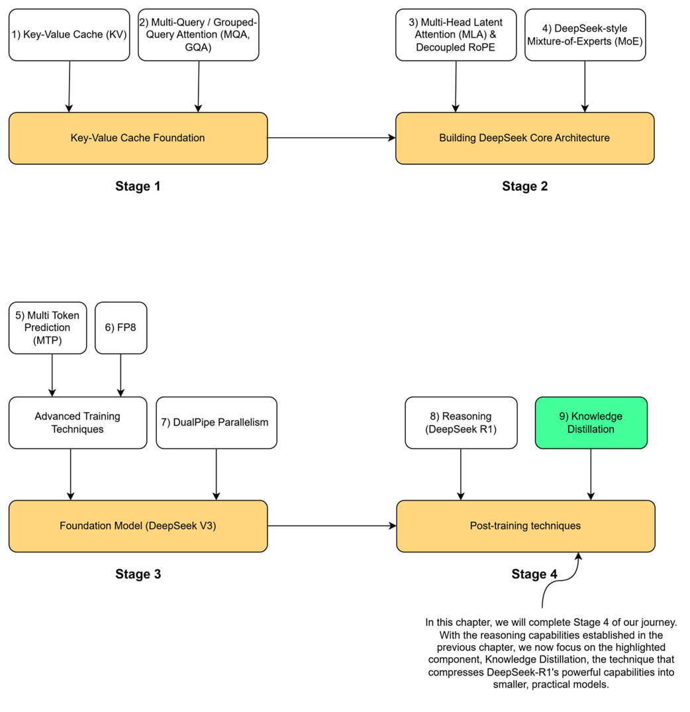

*图8.1 构建 DeepSeek 模型的四阶段旅程。本章重点关注高亮的组件——Knowledge Distillation，即 Stage 4 后训练流水线的最后一块。*

让我们首先理解为什么我们需要蒸馏，以及为什么这个问题比看起来更紧迫。

## 8.1 为什么6710亿参数装不进口袋

在本书的旅程中，我们构建了非凡的东西。我们的 DeepSeek-R1 模型，凭借其 Multi-Head Latent Attention、Mixture-of-Experts 架构以及通过强化学习训练的推理能力，是一个最先进的语言模型。但构建一个强大的模型只是成功了一半。另一半是部署它，让需要它的用户能够使用它。

而这正是我们碰壁的地方。

### 8.1.1 智能的代价

让我们用具体数字来说明这个问题。完整的 DeepSeek-R1 模型有 6710 亿总参数。正如我们在第 4 章构建 Mixture-of-Experts 架构时所学到的，MoE 设计意味着每个 token 只激活 370 亿参数，但完整的模型权重仍然必须驻留在内存中。那 6710 亿参数中的每一个都需要被存储和可访问，即使对于任何给定的 token 只使用其中一小部分。

在半精度（FP16）下，存储 6710 亿参数需要大约 1342 GB 的 GPU 内存。作为参考，NVIDIA 最强大的消费级 GPU RTX 4090 只有 24 GB 内存。专业级 H100 有 80 GB。即使是单块 H100 也无法容纳这个模型。运行 DeepSeek-R1 至少需要两个节点、每节点八块 NVIDIA H100 GPU 协同工作。这种配置的硬件成本超过 200,000 美元，消耗的电力足以供一栋小型公寓楼使用。

而且成本不止于硬件。在推理过程中，模型生成的每个 token 都需要一次通过活跃参数的完整前向传播。以每个 token 370 亿活跃参数计算，加上 KV Cache 对长上下文窗口的额外内存需求（正如我们在第 2 章看到的），生成单个响应的成本从几美分到几美元不等，取决于长度。对于服务数百万用户的公司来说，这累积起来每天数千美元。

如图 8.2 所示，运行完整 teacher model 所需的硬件与真正需要推理能力的部署目标之间存在巨大差距。

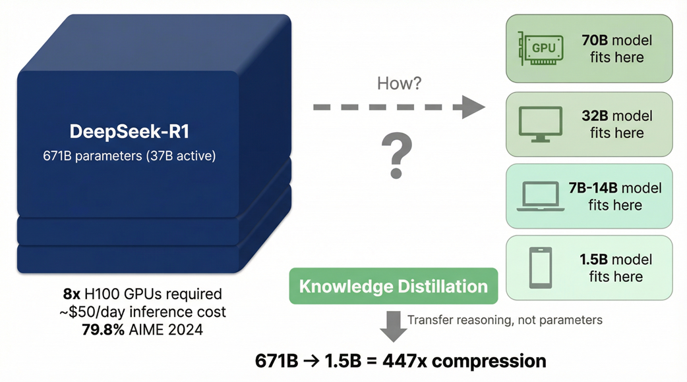

*图8.2 DeepSeek-R1（需要服务器集群）与实际需要推理能力的现实部署目标之间的部署差距，从数据中心 GPU 到移动设备。*

这不仅仅是理论上的担忧。考虑推理模型最有价值的实际场景：

- 一个学生在笔记本电脑上使用数学辅导应用，需要逐步解题——但无法为每个问题支付云 API 调用的费用。
- 一个开发者在本地运行编码助手，需要它适配单块 RTX 4090——而不是一整台服务器机架。
- 一个农村诊所的离线医疗诊断工具，需要在任何可用的硬件上运行。

在所有这些情况下，完整的 671B 模型根本无法使用。智能就在那里，被锁定在 6710 亿参数中，但对于没有数据中心的人来说，它是不可触及的。

这造成了一种令人不安的不平衡。能够负担部署 671B 模型的组织——拥有庞大 GPU 集群的大型科技公司——获得了最先进推理的好处。其他人则被甩在后面。如果我们希望 AI 推理产生广泛影响，我们需要找到一种方法，让它在普通人和组织实际拥有的硬件上运行。

这不仅仅是一个锦上添花的需求。这可以说是现代 AI 中最重要的问题之一：我们如何弥合最强大模型所能做的与实际可以在现实世界中部署的之间的差距？该领域已经探索了几种方法：quantization（我们在第 5 章介绍过）通过降低精度来缩减内存占用，pruning 移除不太重要的权重，架构设计（如第 4 章的 MoE 方法）提高效率。但最强大的方法——产生了最大压缩比同时保留最多能力的方法——是 knowledge distillation。

### 8.1.2 梦想：口袋中的推理

但故事在这里变得有趣了。当 DeepSeek 在 2025 年 1 月发布 R1 论文时，他们不仅仅发布了那个庞大的 671B 模型。他们还发布了六个更小的蒸馏模型，将 teacher 的推理能力压缩成显著更紧凑的形式。图 8.3 展示了这种压缩有多么惊人。

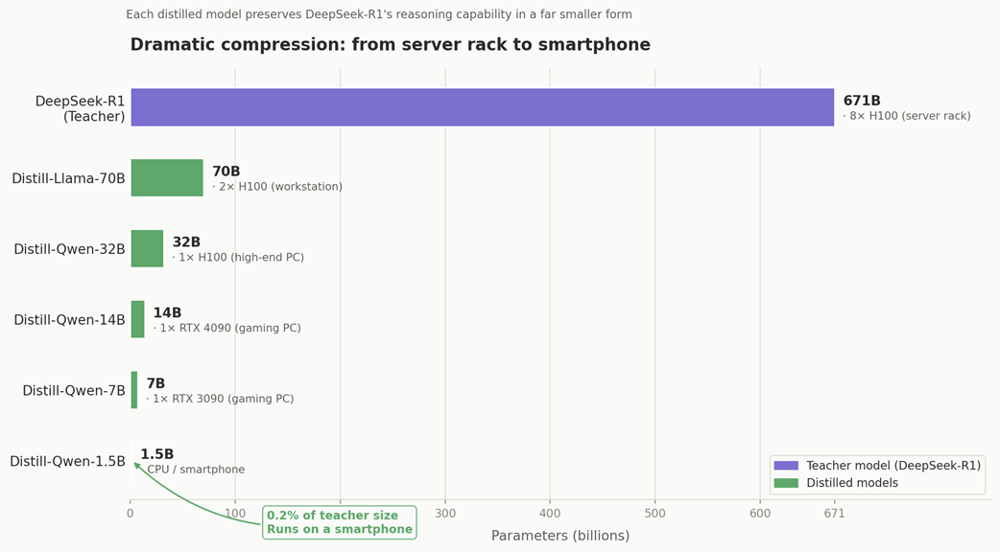

*图8.3 从 671B teacher model 到最小 1.5B 蒸馏模型的内存和 GPU 需求的大幅缩减，1.5B 模型可以在手机上运行。*

其中最小的 DeepSeek-R1-Distill-Qwen-1.5B 只有 15 亿参数，大约是 teacher 大小的 0.2%。它只需要大约 3 GB 内存，可以在 CPU 或移动设备上运行。然而，这个微型模型在 AIME 2024 数学竞赛基准测试上达到了 28.9%，而 GPT-4o 只有 9.3%。

这怎么可能？我们如何将一个 6710 亿参数的模型压缩成小 450 倍的模型，同时还能保持甚至超越前沿模型的推理能力？

你可能会觉得这听起来好得令人难以置信，确实有一个前提。1.5B 模型并不是在所有方面都击败 GPT-4o。它在数学推理方面表现出色（这可以很好地压缩到小模型中），但在编码任务上却有困难（这需要更多的容量）。我们将在 8.8 节详细探讨这些权衡。但头条成果是真实且意义深远的：通过正确的训练策略，推理能力可以被大幅压缩。

答案就是 knowledge distillation，理解它是本章的目标。我们将从第一性原理构建这项技术，从它为何有效的直觉开始，发展 temperature scaling 的数学原理，在 PyTorch 中实现它，最后审视 DeepSeek 产生这些非凡结果的具体方法。

**关于名称的说明。** 这些蒸馏模型中的每一个都保持其基础模型 Qwen2.5 或 Llama-3 的架构和预训练权重完全不变。DeepSeek-R1 贡献的是训练数据：80 万条精选的推理示例（我们将在 8.5 节中审视），用于微调现有的开源基础。所以"Distill-Qwen-1.5B"实际上就是 Qwen2.5-Math-1.5B 在 R1 生成的数据上进行微调。图 8.3 中的压缩因此不是 R1 参数的转换；它是将 R1 的推理行为转移到一个已经存在的、更小的不同模型中。

## 8.2 Teacher-Student 范式

knowledge distillation 背后的思想看似简单。与其从头开始在小模型上用原始数据训练，不如训练它去模仿一个更大的、更有能力的模型。大模型成为 teacher，小模型成为 student。Teacher 已经学习了关于世界的丰富表示。它不仅知道正确答案，还知道为什么这些答案是正确的，哪些替代答案是接近的，以及不同概念之间如何相互关联。蒸馏的目标是将这种丰富的理解转移到 student。

**定义 什么是 knowledge distillation？** Knowledge distillation 是一种模型压缩技术，其中一个小型"student"模型被训练来重现一个更大"teacher"模型的行为，将 teacher 学到的知识转移到一个更紧凑、可部署的形式中。

如图 8.4 所示，基本范式的工作方式如下：teacher model 已经被训练完成，现在被冻结（其参数永不改变），处理与 student 相同的训练数据。但我们不是用 ground-truth 标签训练 student，而是训练它去匹配 teacher 的输出——具体来说，是 teacher 对所有可能输出的完整概率分布。我们称这个分布是 teacher 的"soft target"，与标准训练的 one-hot"hard label"相对应；我们将在 8.2.1 节展开这个方向。

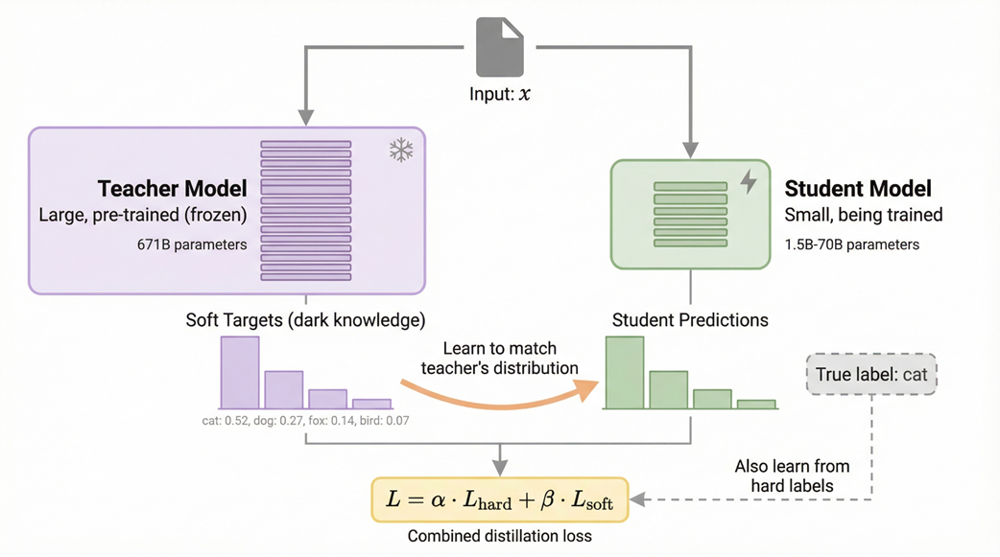

*图8.4 Knowledge distillation 中的 teacher-student 范式。冻结的 teacher 与 student 分享其 soft probability distribution，传递比 hard label 更丰富的信息。*

### 8.2.1 为什么 soft label 携带比 hard label 更多的信息

要理解这种方法为何如此有效，我们需要体会 hard label 和 soft label 之间的微妙区别。

Hard label 是一个 one-hot 向量。当我们训练一个模型对图像进行分类，标签说"猫"时，模型接收到一个类似 [1, 0, 0, 0] 的向量。所有的概率质量都在正确的类别上，其他地方为零。这为模型提供了每个训练样本大约 1 bit 的信息：答案是"猫"，没有别的。模型无法了解哪些错误的类别"几乎是正确的"，也无法了解不同类别之间如何相互关联。

但考虑 teacher 的输出概率分布告诉了我们什么。当一个训练有素的 teacher 看到一张猫的图片并产生分布 [猫: 86%, 狗: 12%, 狐狸: 1.5%, 鸟: 0.5%]，它在传达非常丰富的信息。它在说："这几乎肯定是猫。但我能理解为什么有人可能认为它是狗；两者都是毛茸茸的、四条腿的家养宠物。狐狸的可能性较小，但共享一些视觉特征，如尖脸和小体型。而鸟，另一方面，看起来完全不像这个。"

这个完整的概率分布不仅携带了正确答案，还携带了类别之间的整个关系网。每个训练样本现在提供了相当于 10 或更多 bit 的信息，而不是仅仅 1 bit。Student 接收到一个丰富的、结构化的教学信号，极大地加速了学习。

图 8.5 并排展示了这种差异。

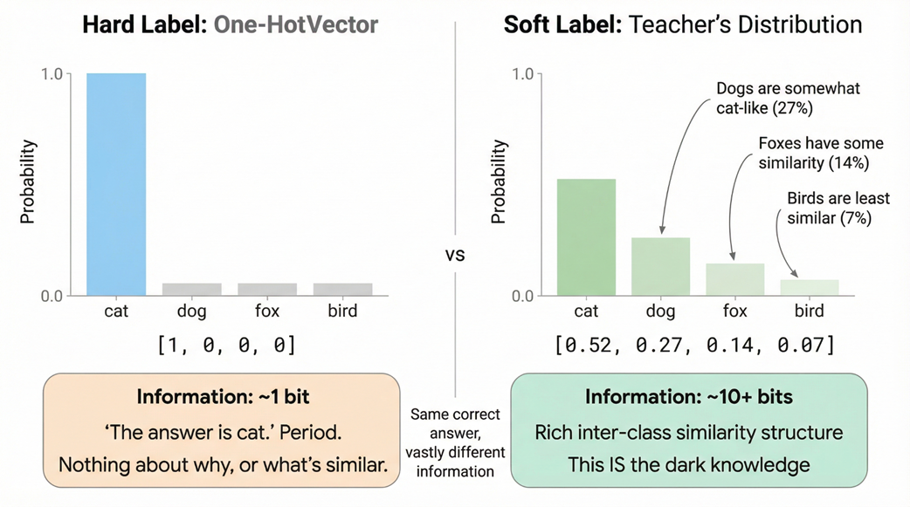

*图8.5 Hard label 每个样本提供约 1 bit 信息（正确或错误），而 teacher 的 soft label 揭示了丰富的类间相似性结构——即 dark knowledge。*

关于哪些错误答案是"几乎正确的"信息，正是 Geoffrey Hinton、Oriol Vinyals 和 Jeff Dean 在他们 2015 年的开创性论文"Distilling the Knowledge in a Neural Network"（论文链接：https://arxiv.org/pdf/1503.02531）中所称的 dark knowledge。

"dark knowledge"这个词是对物理学中暗物质的刻意类比。正如暗物质构成了宇宙质量的大部分但对直接观测是不可见的，dark knowledge 构成了 teacher model 学到内容的大部分，但在 hard label 中是不可见的。只有通过查看 soft probability distribution——teacher 输出的完整光谱，而不仅仅是最顶部的预测——我们才能观察和转移这种隐藏的知识。

这个概念可以追溯到比 Hinton 2015 年论文更早的时期。2006 年，Bucilă、Caruana 和 Niculescu-Mizil 首次提出使用伪标签将集成模型压缩为单个网络。2014 年，Ba 和 Caruana 表明，当在 soft target 上训练时，浅层网络可以匹配深层网络。但正是 Hinton 引入的 temperature scaling 解锁了知识转移的全部潜力，并赋予了这个领域现代形式。

Dark knowledge 在 hard label 中是不可见的，但正是这些信息使 student 能够学得更快、泛化更好。

**定义 什么是 dark knowledge？** Dark knowledge 是指编码在 teacher model 输出分布中错误类别的相对概率中的信息。它捕获了在 hard one-hot label 中不可见的类间相似性关系。

### 8.2.2 大厨类比

为了让这更直观，考虑一个类比。想象你想学做饭，你有两个选择。

**选项 A：一本食谱。** 书告诉你，"这道菜用罗勒。"它给了你正确答案，但仅此而已。你不知道为什么罗勒有效，可以用什么替代，或者不同的香草之间如何相互关联。

**选项 B：一位大厨。** 大厨告诉你，"罗勒在这里是最好的选择，大约占你想要的风味特征的 52%。但牛至可以让你达到大约 27%，百里香大约 14%，迷迭香只有大约 7%。罗勒和牛至共享相似的芳香化合物，这就是为什么它们在某种程度上可以互换。"

图 8.6 说明了这个类比。

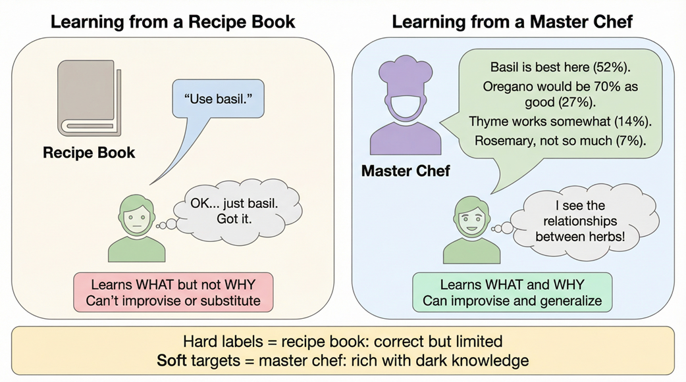

*图8.6 从食谱（hard label）学习给你正确答案但没有上下文，而从大厨（soft label）学习揭示了替代品之间的关系——使深度理解成为可能的 dark knowledge。*

大厨的指导信息量大得多。每一"课"不仅携带正确答案，还携带一个丰富的关系网。这样训练的学徒会发展出更深的烹饪直觉。他们可以即兴发挥、替代，并泛化到他们从未见过的新菜品。

Knowledge distillation 的工作方式相同。Teacher 的概率分布就是大厨的指导，hard label 就是食谱。通过从完整分布中学习，student 获得了比仅从 hard label 中学习所能得到的对问题更丰富的理解。

这种更丰富的理解以一种具体的、可测量的方式表现出来：泛化能力。用 soft target 训练的 student 在从未见过的数据上始终比用 hard label 训练的同一 student 表现更好。这是因为 soft target 不仅教会了 student 答案，还教会了它问题空间的结构——哪些类别相似、哪些不同、以及置信度如何在各种可能性之间分布。这种结构知识可以迁移到新的示例，甚至来自与训练数据略有不同分布的示例。

自 2015 年以来，这个想法的实际影响已被反复证明。最著名的例子之一是 DistilBERT（2019），它将 BERT 语言模型压缩到减少 40% 的参数，同时在 GLUE 基准测试上保留了 97% 的性能，运行速度快 60%。DistilBERT 将 soft-target distillation 与中间层匹配（让 student 模仿 teacher 的隐藏状态，而不仅仅是其输出）相结合，实现了这种显著的压缩。它成为世界上部署最广泛的 NLP 模型之一，证明了蒸馏可以将强大的语言理解带到资源受限的环境中。

但所有这些成功都是在分类或语言理解任务上，其中 teacher 和 student 共享一组固定的输出类别。将蒸馏应用于推理——通过 chain-of-thought 转移模型解决多步问题的能力——是一个更新的、更具挑战性的前沿，DeepSeek-R1 将其推向了新的高度。

在我们讨论 DeepSeek 的具体方法之前，我们需要理解使经典蒸馏生效的数学机制。而这一切都始于一个问题：我们如何从 teacher 中提取 dark knowledge？标准 softmax 输出中的概率通常非常尖锐——正确类别上 86.5%，其他地方接近零。Dark knowledge 就在那里，但它隐藏在微小的概率中。答案就在于一个技巧：temperature。

## 8.3 Temperature 与 dark knowledge

错误类别的相对排序是使蒸馏生效的关键因素。但我们也注意到了一个问题：在标准 softmax（temperature T=1）下，teacher 的输出分布通常非常尖锐。正确类别获得了几乎所有的概率质量，错误类别之间的微妙关系被埋没在接近零的值中。

为了解锁 dark knowledge，Hinton 等人（2015）引入了一个简单的想法：temperature scaling。我们不使用标准 softmax，而是在应用 softmax 函数之前将模型的 logits（原始输出分数）除以一个 temperature 参数 T。

### 8.3.1 Temperature-scaled softmax

标准 softmax 函数将 logits 向量 z 转换为概率分布：

```
p_i = exp(z_i) / Σ_j exp(z_j)
```

Temperature-scaled softmax 添加了一个参数 T：

```
q_i = exp(z_i / T) / Σ_j exp(z_j / T)
```

当 T = 1 时，这就退化为标准 softmax。当 T > 1 时，分布变得更软。概率更均匀地分散，揭示了 logits 的相对大小。当 T → ∞ 时，分布变得完全均匀，丢失所有信息。

**定义 什么是 knowledge distillation 中的 temperature？** Temperature (T) 是一个超参数，控制 softmax 函数产生的概率分布的"软度"。随着 T 增大，分布从尖锐向均匀扩散。存在一个有用的中间范围（通常 T = 2-5），在这个范围内软化暴露了 teacher 的类间相似性结构；超过这个范围，分布变得如此均匀以至于结构被冲刷掉。8.3.5 节的 Goldilocks 讨论使这一点更精确。

### 8.3.2 数值演练：见证 dark knowledge 的浮现

让我们用一个数值示例来说明。假设我们的 teacher model 处理一张图像并对四个类别产生以下 logits：

```
z = [5.0, 3.0, 1.0, -1.0]
```

这些对应于"猫"、"狗"、"狐狸"和"鸟"四个类别。让我们看看在三种不同 temperature 下应用 softmax 会发生什么。

**在 T=1 时（标准 softmax）：**

我们计算 exp([5.0, 3.0, 1.0, -1.0]) = [148.41, 20.09, 2.72, 0.37]，总和为 171.59。除以总和得到：

```
p = [0.865, 0.117, 0.016, 0.002]
```

Teacher 对"猫"有 86.5% 的置信度。Dark knowledge 呢？几乎不可见。"狐狸"（1.6%）和"鸟"（0.2%）的概率如此之小，以至于这些类别之间任何有意义的关系都淹没在噪声中。

如图 8.7 所示，这个尖锐分布看起来几乎与 hard label 完全相同。

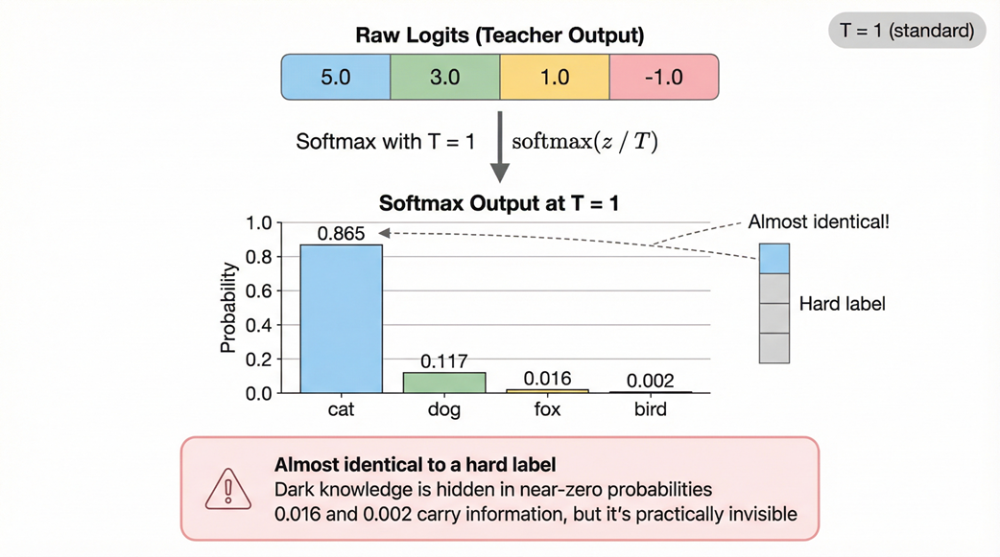

*图8.7 logits [5.0, 3.0, 1.0, -1.0] 在 T=1 时的标准 softmax。分布严重偏向"猫"（86.5%），将 dark knowledge 隐藏在接近零的概率中。*

**在 T=3 时（最佳点）：**

现在我们在应用 softmax 之前将 logits 除以 3。让我们追踪计算的每一步：

- **步骤 1.** 除以 T：z/3 = [5.0/3, 3.0/3, 1.0/3, -1.0/3] = [1.667, 1.000, 0.333, -0.333]
- **步骤 2.** 指数化：exp([1.667, 1.000, 0.333, -0.333]) = [5.30, 2.72, 1.40, 0.72]
- **步骤 3.** 求和：5.30 + 2.72 + 1.40 + 0.72 = 10.14
- **步骤 4.** 归一化：[5.30/10.14, 2.72/10.14, 1.40/10.14, 0.72/10.14]

```
q = [0.523, 0.268, 0.138, 0.071]
```

现在 dark knowledge 清晰可见！Teacher 揭示了：

- "狗"有 26.8% 的概率——teacher 认为狗在某种程度上像猫（两者都是毛茸茸的、四条腿的宠物）。
- "狐狸"有 13.8% 的概率——狐狸与猫共享一些视觉特征（相似的体型、尖耳朵）。
- "鸟"只有 7.1%——在 teacher 学到的表示中，鸟与猫最不相似。

**在 T=10 时（太软）：**

在 T=10 时，分布变平为 [0.329, 0.270, 0.221, 0.181]，接近均匀。信号几乎完全丢失。我们揭示了太多"dark knowledge"，以至于稀释了真正的知识。

图 8.8 并排展示了三种分布，使 temperature 的效果一目了然。

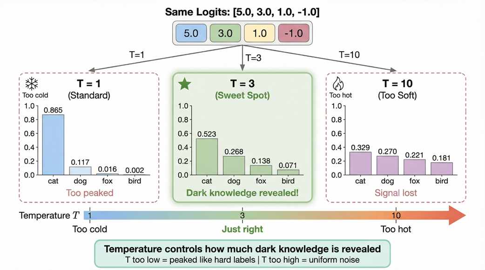

*图8.8 相同的 logits [5.0, 3.0, 1.0, -1.0] 在三种 temperature 下通过 softmax 处理。T=1 时分布太尖锐，T=3 时 dark knowledge 清晰浮现，T=10 时信号在接近均匀的分布中丢失。*

从左到右的进展讲述了 temperature 的完整故事：太冷会隐藏 dark knowledge，恰好会揭示它，太热会破坏信号。

让我们更精确地量化这一点。在 T=1 时，分布的 entropy（衡量其分散程度的指标）相当低，大约 0.59 bits。大部分信息集中在最顶部的类别上。在 T=3 时，entropy 上升到 1.71 bits，几乎是每样本信息量的三倍。在 T=10 时，entropy 达到 1.94 bits，接近 4 类分布的理论最大值 2 bits。但最大 entropy 意味着均匀分布，这根本不携带任何有用信息。

关键的洞察是，我们不想最大化 entropy。我们想最大化有用的 entropy。在 T=3 时，分布的分散程度足以揭示类别的排序（狗 > 狐狸 > 鸟），而不会如此分散以至于排序变得模糊。这就是 Goldilocks 区间的数学基础。

还有另一种思考方式。在 T=1 时，一个训练样本说："这是一只猫。句号。"在 T=3 时，一个训练样本说："这很可能是猫（52%），但也可能是狗（27%）或狐狸（14%）。肯定不是鸟（7%）。"在 T=10 时，一个训练样本说："我不太确定这是什么，四个类别的概率大致相等。"中间的信息量是最大的。

### 8.3.3 Dark knowledge 揭示了什么

让我们仔细看看 T=3 的分布，因为它所揭示的确实是非凡的。图 8.9 说明了 teacher 学到的类间相似性结构。

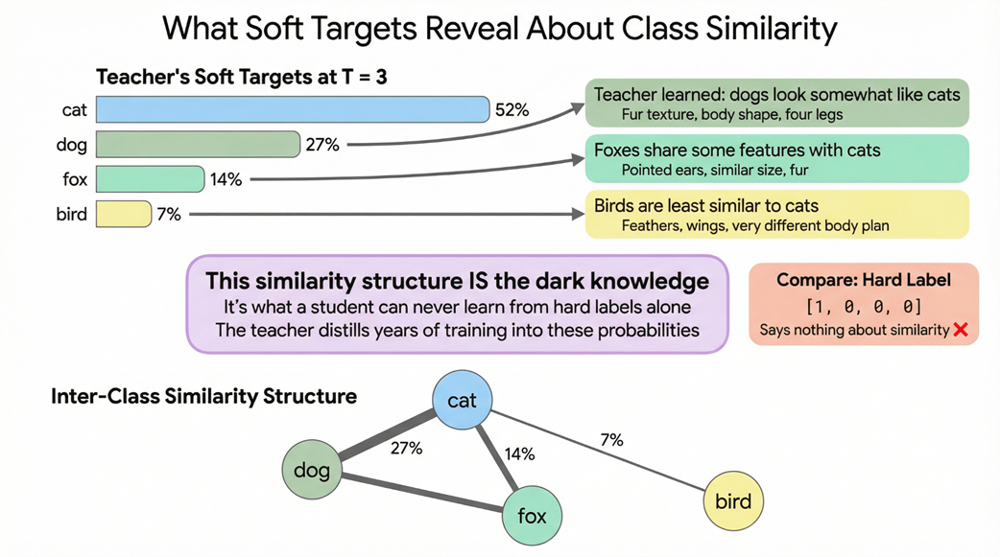

*图8.9 在 T=3 时，teacher 的 soft target 揭示了它学到的类间相似性结构。猫在某种程度上像狗（26.8%），略微像狐狸（13.8%），非常不像鸟（7.1%）。这个相似性结构就是 dark knowledge。*

Teacher 隐式地学习了一个相似性层级：猫 → 狗 → 狐狸 → 鸟，按与"猫"的视觉和语义相似度递减排列。这是 student 从 hard label 单独学习需要更多训练示例才能发现的信息。有了 soft target，student 在每个训练示例中都接收到这种丰富的结构信息——不仅是"答案是猫"，而是"答案是猫，而且这里是每个其他类别如何与它关联的精确信息"。

使用 hard label，student 需要看到许多猫被误认为狗的示例，以及许多猫从未被误认为鸟的示例，才能逐渐建立起类间相似性的统计图景。每个训练示例只提供 1 bit 的方向信息。使用 soft target，每个示例都提供完整的相似性图——所有四个概率同时呈现。学习信号不仅更强；它在质上是不同的。Student 学习的是类别空间的结构，而不仅仅是每个类别在其中的位置。

这就是为什么蒸馏的 student 通常比从头训练的 student 表现更好，即使给它们更少的训练示例。来自 soft target 的更丰富的监督信号弥补了数据量少的不足。在一些实验中，用 10% 数据训练的蒸馏 student 可以匹配使用完整数据集从头训练的 student，因为每个 soft-target 示例携带的信息是 hard-label 示例的 10 倍。

图 8.10 展示了在 T=3 时计算 soft target 的完整数值演练，逐步分解。

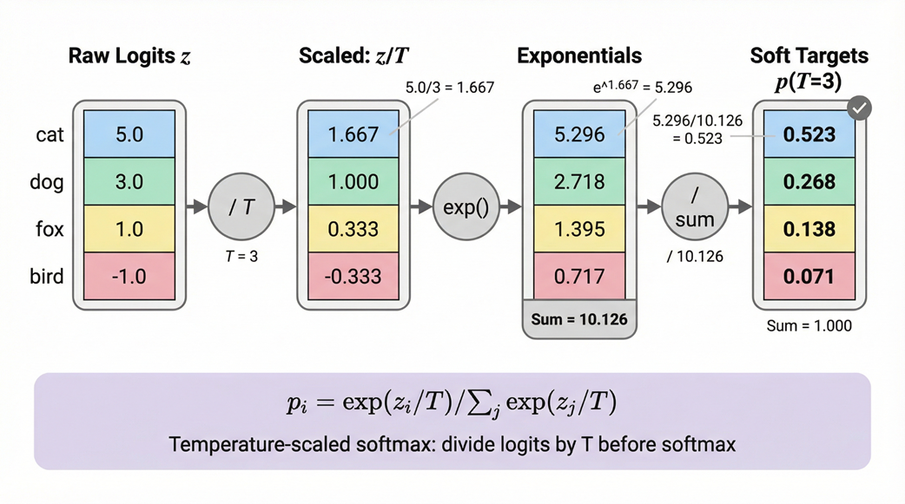

*图8.10 在 T=3 时计算 soft target 的完整逐步过程：logits 除以 T、指数化、归一化以产生最终概率分布。*

### 8.3.4 为什么 T² 缩放很重要

在我们继续之前，让我们讨论一个数学细节：T² 缩放因子。

当我们在应用 softmax 之前将 logits 除以 T 时，KL 损失对 student logit 的梯度会获得两个 1/T 的因子，而不是一个。对 KL(p_T || q_T) 关于 student logit z_s 求导，其中 q_T = softmax(z_s / T)，得到：

```
∂L_soft / ∂z_s ∝ (1/T)(q_T − p_T)
```

第一个 1/T 来自链式法则（softmax 内部的 /T）。第二个来自于随着 T 增大，差异 (q_T − p_T) 本身也在缩小——两个分布都向均匀趋近，因此它们的差距被压缩。两者结合，梯度按 1/T² 缩放。

如果我们不进行补偿，soft-target loss 在更高 temperature 下对学习的贡献将几乎为零，这与我们想要的恰恰相反。将 L_soft 乘以 T² 可将梯度大小恢复到与标准 cross-entropy 相当的水平。事实上，当 T → ∞ 时，T² KL 损失收敛到 student 和 teacher logits 之间的均方误差，这是蒸馏的经典"回归 logits"观点。

在 T=1 时，student logit 的一个微小变化会产生大约大小为 ~1 的梯度。在 T=3 时，相同的变化会产生大约大小为 ~1/9 的梯度，因为 logit 被除了 3 且导数是二次缩放的。在 T=5 时，梯度下降到 ~1/25。如果我们不对此进行补偿，soft-target loss 的贡献在高温下会变得微不足道，恰恰与我们的目标相反。通过将 soft loss 乘以 T²，我们将梯度恢复到其自然大小。这确保了 teacher 的 dark knowledge 对 student 的学习有有意义的影响，无论我们选择哪个 temperature。

这就是为什么完整的蒸馏损失包含 T² 因子：

```
L_soft = T² KL(softmax(z_t / T) || softmax(z_s / T))
```

没有 T²，T=3 时的 soft loss 将比 T=1 时弱 9 倍。有了 T²，所有 temperature 贡献同样强的梯度，唯一的区别是信息的质量（揭示了多少 dark knowledge）。

### 8.3.5 Temperature 的 Goldilocks 区间

正如我们的数值示例所证明的，temperature 不是一个"越多越好"的参数。存在一个 Goldilocks 区间，通常在 T=2 到 T=5 之间，分布足够软以揭示 dark knowledge，但仍然保留有意义的信号。

图 8.11 说明了这种权衡。

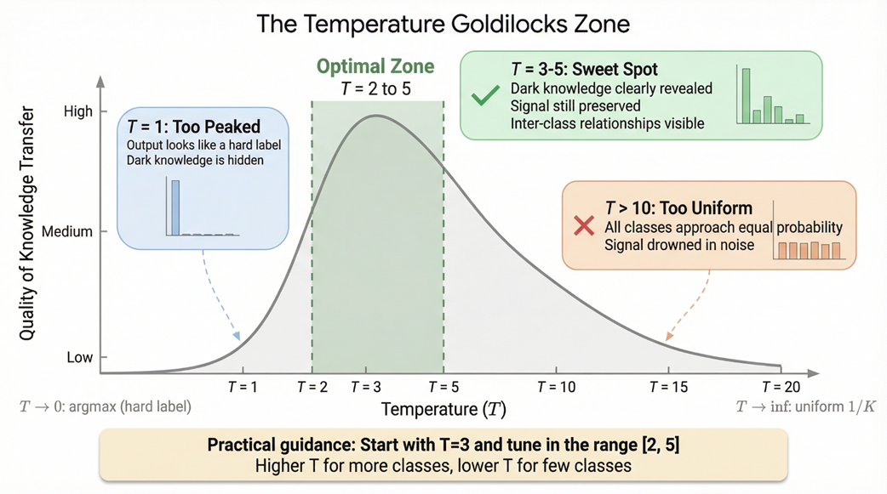

*图8.11 Temperature 的 Goldilocks 区间。T=1 时 dark knowledge 被隐藏，T=2 到 T=5 之间最佳地揭示，超过 T=10 时有用信号丢失。较小的 student model 通常从该范围内的较低 temperature 中获益。*

为什么最佳 temperature 取决于 student 的大小？答案在于 capacity。一个非常软的分布（高 T）包含大量信息——许多类别之间的微妙关系、细粒度的相似性排名、概率中的微小差异。一个拥有许多参数的大型 student model 可以吸收所有这些信息并加以利用。小型 student model 则不能。它缺乏参数来表示所有这些微妙的关系，尝试从过软的分布中学习实际上可能损害其性能，因为用无法存储的信息淹没了它。

在实践中：

- **非常小的 student（1B-3B）：** T=2 或 T=3 效果最好。模型容量有限，受益于更清晰、更聚焦的信号。
- **中型 student（7B-14B）：** T=3 或 T=4 通常最佳。有足够的容量吸收适度的 dark knowledge。
- **大型 student（32B-70B）：** T=4 或 T=5 可能有益。模型有足够的 capacity 利用更软分布中更丰富的信息。

现在我们理解了 temperature 和 dark knowledge，让我们看看如何将它们放入一个真正能教导 student 的训练目标中。

运行以下代码产生的输出与我们之前的数值演练相匹配：

```
T= 1: [0.865, 0.117, 0.016, 0.002]
T= 2: [0.644, 0.237, 0.087, 0.032]
T= 3: [0.523, 0.268, 0.138, 0.071]
T= 5: [0.413, 0.277, 0.186, 0.124]
T=10: [0.329, 0.270, 0.221, 0.181]
```

随着 temperature 从 1 增加到 10，我们可以看到分布从严重偏向平滑过渡到接近均匀。T=3 时的最佳点清楚地显示了类间关系，同时保持了排序。

## 8.4 构建蒸馏损失：从朴素到强大

我们现在理解了高温下的 soft target 携带丰富的 dark knowledge。但我们如何实际使用它们来训练一个 student model 呢？在本节中，我们将逐步介绍三种渐进的方法，每种都在上一种的基础上改进，来构建完整的 knowledge distillation 损失函数。这呼应了我们在第 3 章位置编码中使用的尝试脚手架模式。

**清单 8.1** 可视化 temperature-scaled softmax。

```python
#A Divide logits by temperature T before softmax.
#B The same four logits for "cat", "dog", "fox", "bird."
#C Five temperatures show the full progression from peaked to uniform.
import torch
import torch.nn.functional as F

def visualize_temperature(logits, temps):
    """Show how temperature affects softmax."""
    for T in temps:
        probs = F.softmax(logits / T, dim=-1)  #A
        print(f"T={T:2d}: {probs.tolist()}")

logits = torch.tensor([5.0, 3.0, 1.0, -1.0])  #B
visualize_temperature(logits, [1, 2, 3, 5, 10])  #C
```

### 8.4.1 尝试 #1：用 hard label 从头训练

最简单的方法是完全忽略 teacher，直接用 ground-truth hard label 从头训练 student model，就像我们训练任何模型一样。Student 看到每个训练示例，做出预测，并根据其预测与正确 one-hot label 的差距接收梯度。

如图 8.12 所示，这种方法为每个训练样本提供大约 1 bit 的信息。"答案是猫"或"答案不是猫"。Student 无法了解狗比鸟更像猫，也无法了解某些错误答案"几乎正确"。它必须通过数千个训练示例从零开始发现所有类间关系。

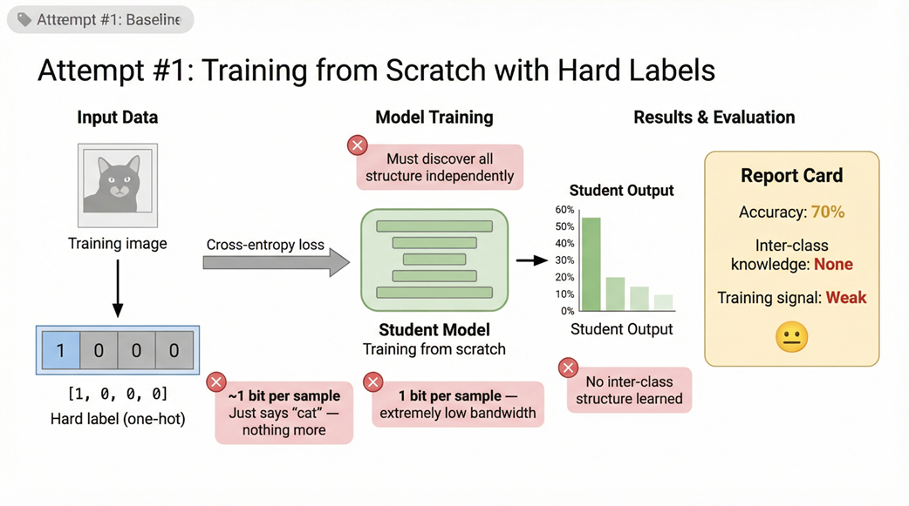

*图8.12 尝试 #1：用 hard label 从头训练 student。每个样本提供约 1 bit 有用信息，student 无法学习类间关系。*

结果呢？Student 学到了，但缓慢且不完美。没有 teacher 的指导，它必须独立重新发现 teacher 已经学到的所有模式和关系。对于一个容量有限的小模型来说，这是一场艰苦的战斗。

具体来说：想象一个在 10,000 张猫、狗、狐狸和鸟类图像上训练的 student model。每张图像只提供 1 bit 的信息。"这是猫"或"这是狗"。要了解猫和狗在视觉上比它们中任何一个与鸟更相似，student 必须在数千个示例中积累统计证据。它最终会从数据分布中学到这一点，但这是一个缓慢的、间接的过程。

现在想象同一个 student 用 teacher 的 soft target 训练。每一个训练示例同时教会：(1) 正确标签，(2) 每个错误答案与正确答案的相似程度，(3) 类别空间的整体结构。用 hard label 需要数千个示例才能学到的内容，现在可以在更短的时间内学到。

### 8.4.2 尝试 #2：在 T=1 时匹配 teacher 的输出

自然的下一步是使用 teacher 的输出概率作为训练目标，而不是（或除了）hard label。毕竟，teacher 的输出比 one-hot label 包含更多信息。

但有一个问题：在 T=1 时，teacher 的 softmax 输出几乎与 hard label 一样尖锐。如图 8.13 所示，当 teacher 输出 [0.865, 0.117, 0.016, 0.002] 时，这比 hard label [1, 0, 0, 0] 好不了多少。

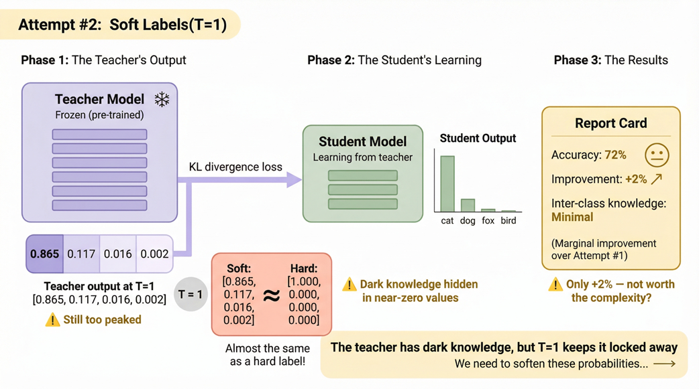

*图8.13 尝试 #2：使用 teacher 在 T=1 时的 soft output probability 作为训练目标。分布仍然太尖锐。Dark knowledge 隐藏在接近零的值中，仅提供相对 hard label 微不足道的改进。*

来自接近零概率（"狐狸"为 0.016，"鸟"为 0.002）的梯度如此之小，对 student 的学习几乎没有影响。我们知道 teacher 已经学到的丰富类间结构在这个 temperature 下实际上是不可见的。

这种尝试比从头训练略好，但改进微不足道。我们可以看到 teacher 的置信度，但看不到其对类别关系的细微理解。

要理解原因，让我们考虑梯度。当 student 尝试从 teacher 的 T=1 分布 [0.865, 0.117, 0.016, 0.002] 学习时，"狐狸"类别（概率 0.016）的梯度贡献大约比"猫"类别（概率 0.865）的梯度小 50 倍。"鸟"类别（0.002）的梯度小 400 倍。这些微小的梯度实际上是噪声。它们对 student 的学习几乎没有贡献。Teacher 学到的丰富类间结构存在于这些微小的数字中，但梯度太小，无法对 student 的权重产生任何影响。

这就是 temperature 解决的根本问题。通过提高 T，我们放大了小概率之间的相对差异，将它们提升到梯度能够有意义地影响 student 学习的大小。

### 8.4.3 Temperature-scaled soft target

解决方案，正如我们在 8.3 节中所建立的，是提高 temperature。通过在 T=3（或 Goldilocks 区间中的另一个值）下应用 softmax，我们将 teacher 尖锐的分布转换为一个丰富的、信息丰富的分布，其中 dark knowledge 清晰可见。

在 T=3 时发生了什么变化？让我们看梯度大小。"狐狸"类别在 T=1 时概率为 0.016，现在概率为 0.138，几乎大了 10 倍。"鸟"类别从 0.002 上升到 0.071，增长了 35 倍。这些放大的概率产生相应更大的梯度，这意味着 student 现在实际上可以从之前埋没在噪声中的类间关系中学习。

关键是，概率的排序被保留了：猫 > 狗 > 狐狸 > 鸟。Temperature 不改变哪个类别最可能。它只改变了在替代选项之间分配了多少概率质量。Student 仍然学到"猫"是正确答案，但现在它还学到了完整的相似性层级。

如图 8.14 所示，效果是好的。在 T=3 时，teacher 的 soft target [0.523, 0.268, 0.138, 0.071] 在每个训练样本中提供了丰富的类间信息。图中可见的组合损失公式（L = α L_hard + β L_soft T²）是完整的 knowledge distillation 目标；我们将在 8.4.4 节推导它。

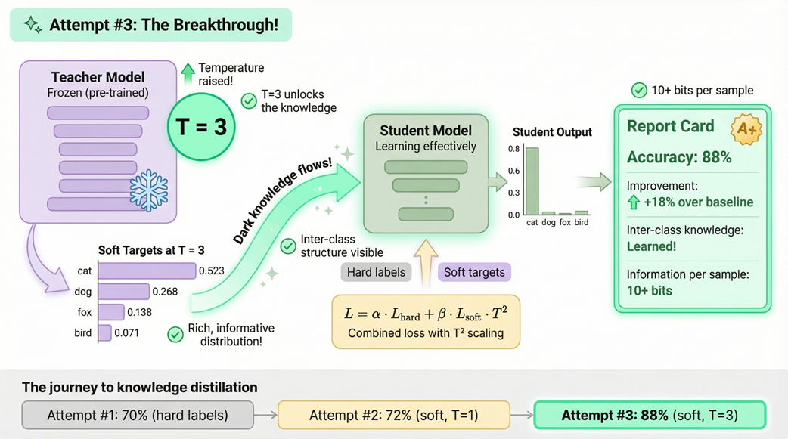

*图8.14 突破：将 temperature T=3 应用于 softmax 解锁了 dark knowledge。Teacher 的概率分布现在揭示了丰富的类间关系，极大地改善了 student 的学习。*

但我们不能简单地用 soft target 替换 hard label 就算了。我们需要两者。Hard label 确保 student 仍然学到正确的答案（基础），而 soft target 转移 teacher 的 dark knowledge（丰富的类间结构）。完整的 knowledge distillation 损失结合了这两个目标。

### 8.4.4 完整的蒸馏损失

最终的蒸馏损失函数，如图 8.15 所示，有两个组成部分：

1. **Hard-label loss (L_hard)：** Student 的预测（在 T=1 时）与 ground-truth 标签之间的标准 cross-entropy。这使 student 保持正确性的基础。
2. **Soft-target loss (L_soft)：** Teacher 的 soft target（在 temperature T 时）与 student 的 soft target（在同一 temperature T 时）之间的 KL divergence。这转移了 dark knowledge。损失乘以 T² 以补偿更高 temperature 下减小的梯度大小。

总损失是一个加权组合：

```
L = α L_hard + β T² KL(teacher_soft || student_soft)
```

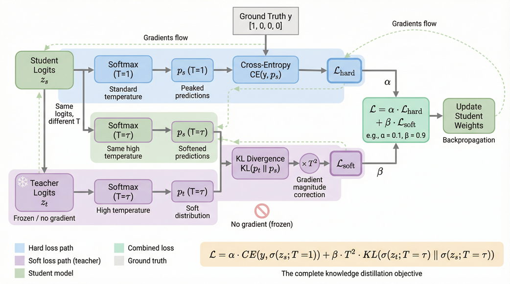

*图8.15 完整的 knowledge distillation 损失函数。两条并行路径——hard-label cross-entropy（基础）和 soft-target KL divergence（知识转移）——组合成一个单一的加权目标。*

**定义 什么是 distillation loss？** Distillation loss 是一个结合两个项的训练目标：一个 hard-label cross-entropy loss 确保 student 学到正确答案，一个 soft-target KL divergence loss（缩放 T²）转移 teacher 关于类间关系的 dark knowledge。

T² 缩放因子是一个微妙但重要的细节。当我们用大 T 除 logits 时，产生的梯度被 1/T² 的因子缩小。为了使 soft-target 梯度的大小与 hard-label 梯度相当，我们将 soft loss 乘以 T²。这确保了不同的 temperature 值产生相当的训练动态。

两个损失之间的权重（α 和 β）是一个超参数，控制 student 在多大程度上依赖 ground truth 与 teacher 的指导。在实践中，soft-target loss 通常比 hard-label loss 获得更多权重（β > α），因为来自 teacher 的 dark knowledge 是 student 相比从头训练所获优势的主要来源。

一个常见的配置是 α=0.3（hard label 上 30% 的权重）和 β=0.7（soft target 上 70% 的权重）。这告诉 student："主要从 teacher 学习，但保持在实际正确答案上的基础。"如果 teacher 有错误或偏差，hard-label 组分充当安全网，防止 student 盲目继承那些错误。

值得一提的是，停下来欣赏这个组合目标有多优雅。通过一个损失函数和两个超参数（T 和 α），我们可以控制：

1. **揭示了多少 dark knowledge（通过 T）：** 更高的 T 揭示更多的类间关系。
2. **Student 在多大程度上信任 teacher（通过 α）：** 更低的 α 意味着更依赖 teacher。
3. **梯度信号有多强（通过 T²）：** 自动缩放以匹配。

这种简单性是 knowledge distillation 被广泛采用的部分原因。它需要对标准训练流水线做最小的修改。你添加 teacher 的前向传播，计算一个额外的损失项，调整两个超参数。其他一切（优化器、学习率调度、数据加载）保持不变。

**清单 8.2** Knowledge distillation 损失函数。

```python
#A Alpha controls the balance: 0.3 for hard labels, 0.7 for soft targets.
#B Soft targets from the teacher at high temperature.
#C Log-probabilities from the student at the same temperature.
#D KL divergence measures how the student's distribution differs from the teacher's.
#E Standard cross-entropy against the ground-truth hard labels.
#F T² compensates for the reduced gradient magnitude at higher temperatures.
import torch.nn.functional as F

def distillation_loss(student_logits,
                       teacher_logits, labels,
                       temperature=3.0, alpha=0.3):  #A
    soft_teacher = F.softmax(
        teacher_logits / temperature,
        dim=-1)  #B
    soft_student = F.log_softmax(
        student_logits / temperature,
        dim=-1)  #C
    kl_loss = F.kl_div(
        soft_student, soft_teacher,
        reduction='batchmean')  #D
    hard_loss = F.cross_entropy(
        student_logits, labels)  #E
    return (alpha * hard_loss
            + (1 - alpha)
            * temperature**2
            * kl_loss)  #F
```

这个损失函数是经典 knowledge distillation 的数学核心。Student 的参数被更新以同时最小化 hard-label 错误和与 teacher 的分布不匹配。

当我们计算这个总损失并触发反向传播时，梯度仅为 student model 计算。Teacher model 完全冻结。它充当一个静止的指南针，指引方向，而 student 的参数完成所有移动。通过仅通过 student 反向传播这个组合损失，我们强制其小参数空间自行组织成 teacher 庞大理解的压缩近似。

## 8.5 DeepSeek-R1 的蒸馏配方

经典 knowledge distillation，正如我们刚刚描述的，在 teacher 和 student 共享相同输出空间的分类任务上效果很好——一组固定的类别及每个类别的概率分布。但语言模型完全是另一种不同的东西。LLM 不是将图像分类为"猫"或"狗"。它生成文本，逐个 token，产生可以跨越数千个 token 的长推理链。

这引出了一个根本性的问题：你如何蒸馏推理？

### 8.5.1 从 logits 到语言：范式转变

在经典蒸馏中，teacher 的价值在于其 logit 分布——它分配给每个类别的概率，特别是错误类别的相对概率（dark knowledge）。Student 通过在高温下匹配这个分布来学习。

但对于像 DeepSeek-R1 这样的推理模型，teacher 的真正价值不在于其逐 token 的概率分布。它在于生成的文本中——具体来说，是展示逐步解题的长 chain-of-thought (CoT) 推理轨迹。

让我们想想这意味着什么。当 DeepSeek-R1 解决一个数学问题，比如"前 100 个质数的和是多少？"时，它不会简单地输出答案"24,133"。它生成一个详细的推理轨迹，可能长达数千个 token，可能看起来像这样：

> "让我一步一步地思考这个问题。首先，我需要确定前 100 个质数。质数从 2, 3, 5, 7, 11, 13 开始……我知道第 100 个质数是 541。为了计算总和，我可以利用……[长推理链]……因此，前 100 个质数的和是 24,133。"

这个输出的价值不在于逐 token 的概率（下一个 token 是"Let"概率 0.83 还是"I"概率 0.12？）。价值在于连贯的推理策略：将问题分解为子问题的决定、每一步应用的数学技术、以及对答案的验证。这就是使 DeepSeek-R1 强大的原因，这也是需要转移到 student 的东西。

这个洞察引导 DeepSeek 采取了一种根本不同的蒸馏方法：他们不是用 KL divergence 和 temperature scaling 来匹配 teacher 的 logit 分布，而是简单地在 teacher 生成的文本上微调 student。Teacher 生成完整的推理轨迹，student 通过标准 supervised fine-tuning 学习产生类似的轨迹——与任何语言模型训练中使用的相同的 next-token prediction 目标。

**定义 什么是 chain-of-thought distillation？** Chain-of-thought distillation 是一种技术，其中 student model 在 teacher model 生成的推理轨迹上进行微调，通过标准 next-token prediction 学习复现 teacher 的逐步解题方法，而不是 logit 匹配。

### 8.5.2 80 万训练数据集：大规模拒绝采样

在这种方法中，训练数据的质量就是一切。DeepSeek 不是简单地为每个 prompt 生成一个响应就使用了。他们使用了一种叫做 rejection sampling 的技术来策划一个质量极高的数据集。

**定义 什么是 rejection sampling？** Rejection sampling 是一种数据筛选技术，为每个 prompt 生成多个候选响应，验证每个的正确性，只保留正确的、格式良好的响应。它是 DeepSeek 蒸馏数据集背后的质量控制机制。

该过程如图 8.17 所示：对于每个 prompt，DeepSeek-R1 teacher 生成多个候选响应。然后检查每个响应的正确性。对于数学问题，最终答案与 ground truth 进行比较；对于代码，解决方案被执行和测试。正确但格式不佳（混合语言、混乱格式）的响应也被过滤掉。只有干净的、正确的响应才能留存。

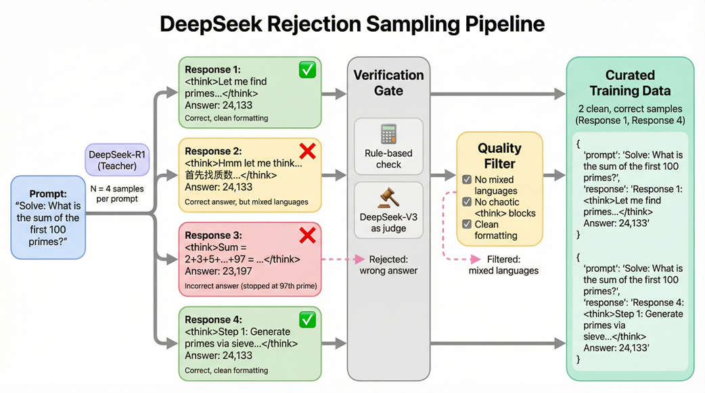

*图8.16 策划 DeepSeek-R1 蒸馏数据集的 rejection sampling 过程。每个 prompt 生成多个响应，验证正确性，过滤质量，只保留干净的、正确的答案。*

蒸馏阶段在 DeepSeek 整体训练流水线中的什么位置？图 8.16 展示了完整的六阶段过程，从预训练到最终蒸馏。

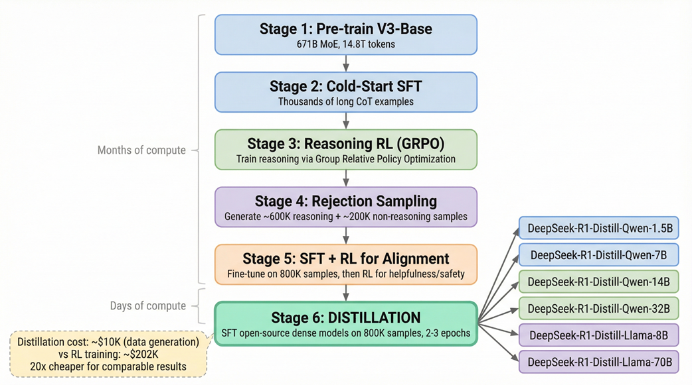

*图8.17 DeepSeek-R1 的完整训练流水线。Distillation（Stage 6）是最终阶段，开源密集模型在通过 rejection sampling 从 teacher 策划的 80 万样本上进行微调。数据生成成本仅 1 万美元，而 RL 训练为 20.2 万美元。（成本数据是根据 DeepSeek-R1 论文披露的 H800 小时数按公开云 GPU 费率估算的；实际内部成本可能有所不同。）*

对于数学和代码 prompt，验证相对直接。答案可以与已知的 ground truth 进行比较，或者代码可以被执行以检查是否产生正确的输出。但如果没有单一正确答案的领域呢，比如 STEM 推理或逻辑谜题？对于这些，DeepSeek 使用 DeepSeek-V3 作为 generative reward model：V3 模型被给予 ground-truth 答案和候选响应，并被要求判断响应是否正确。

质量过滤超越了单纯正确性。技术上正确但"混乱且难以阅读"的响应——表现出混合语言、过多代码块或不连贯格式——也被过滤掉。这种质量控制至关重要，因为 student 将学习模仿训练数据的风格，而不仅仅是其内容。如果训练数据包含格式不佳的响应，student 将学会生成格式不佳的响应。

通过这个细致的过程，DeepSeek 策划了一个大约 804,745 个训练样本的数据集。图 8.18 展示了按领域的分布。

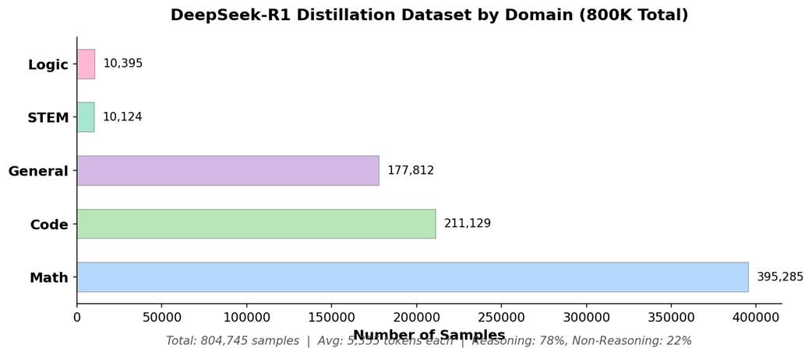

*图8.18 DeepSeek-R1 的 80 万蒸馏数据集按领域的组成。数学以 39.5 万样本（49%）占主导地位，其次是代码 21.1 万（26%），General、STEM 和 Logic 构成其余部分。*

数据集严重偏向推理任务：数学（395K 样本）和代码（211K 样本）合计占总数的 75%。STEM 和逻辑问题虽然数量较少（各约 1 万个），但对于确保蒸馏模型能够跨科学和逻辑领域推理仍然至关重要。

非推理部分（178K 样本的通用内容、写作、事实问答、自我认知和翻译）扮演着重要角色：它确保蒸馏模型不会变成狭窄的专家。没有这些通用数据，一个纯粹在数学和代码推理上蒸馏的模型可能会失去进行正常对话、回答事实问题或遵循指令的能力——这些能力对于实用的 AI 助手来说是必不可少的。

平均样本长度 5,355 个 token 值得注意。这些不是简短的答案。它们是详细的、多步骤的推理轨迹，可以跨越数千个 token。一个典型的数学解可能包括问题复述、几次错误的尝试、纠正、中间计算和最终验证的答案。这种丰富的、冗长的格式正是让 student 不仅能学到给出什么答案，还能学到如何一步一步思考问题的原因。

对于非推理数据，DeepSeek 使用他们的 V3 模型生成响应，有时甚至为简单查询添加 chain-of-thought 推理。对于非常简单的查询如"你好"，则不添加 chain-of-thought。这种精心策划确保每个训练样本都适合其领域——推理任务获得长而详细的轨迹，而简单任务获得简洁、直接的响应。

### 8.5.3 经典 KD 与 DeepSeek 的方法对比

经典 knowledge distillation 与 DeepSeek 方法之间的区别是根本性的，图 8.19 并排展示了这一点。

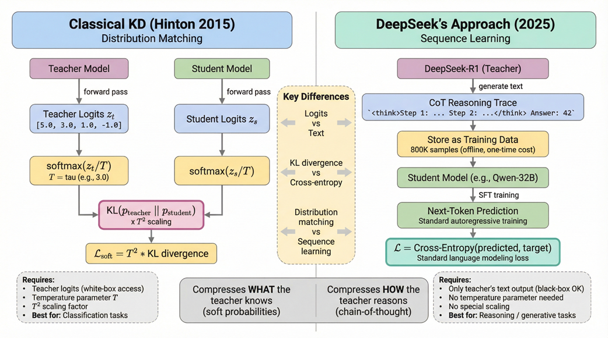

*图8.9 Knowledge distillation 的两种范式。经典 KD（左）通过 logit 匹配与 KL divergence 和 temperature scaling 转移知识。DeepSeek 的方法（右）通过在 teacher 生成的 chain-of-thought 文本上的 supervised fine-tuning 转移知识。*

在经典 KD 中，teacher 和 student 都处理相同的输入，student 使用高温下的 KL divergence 学习匹配 teacher 的输出概率分布。这需要对 teacher logits 的白盒访问，并涉及我们之前讨论的 temperature scaling 和 T² 修正。

在 DeepSeek 的方法中，teacher 生成完整的文本响应（chain-of-thought 推理轨迹）；这些响应通过 rejection sampling 策划，student 使用标准 next-token prediction 在这个策划的数据集上进行微调——与任何语言模型训练中使用的相同的 cross-entropy loss。没有 temperature scaling，没有 KL divergence，也不需要同时访问两个模型。Teacher 仅用于数据生成，student 永远不会看到 teacher 的内部表示。

这里有一个容易被忽略的重要微妙之处。在经典 KD 中，teacher 和 student 在训练期间必须同时运行。Teacher 实时处理每个批次以产生 soft target。这意味着 GPU 必须同时在内存中保持两个模型，当 teacher 很大时这可能是昂贵的。

在 DeepSeek 的方法中，teacher 仅用于数据生成，这在训练开始之前离线完成。一旦 80 万数据集被策划好，就不再需要 teacher 了。Student 在静态数据集上使用标准 SFT 训练。不需要在 student 训练期间加载 671B teacher model。这是一个巨大的实际优势：数据生成步骤（使用 teacher）和训练步骤（训练 student）完全解耦。

DeepSeek-R1 论文对这一设计选择是明确的："对于蒸馏模型，我们仅应用 SFT，不包含 RL 阶段，尽管纳入 RL 可以大幅提升模型性能。"他们刻意保持蒸馏过程简单，以证明其独立的有效性。仅凭 SFT 而没有任何 RL 就能产生超越 o1-mini 的模型，这一事实证明了好的训练数据有多么强大。

### 8.5.4 六个蒸馏模型

使用这种方法，DeepSeek 微调了来自两个架构家族的六个开源模型，如图 8.20 所示。

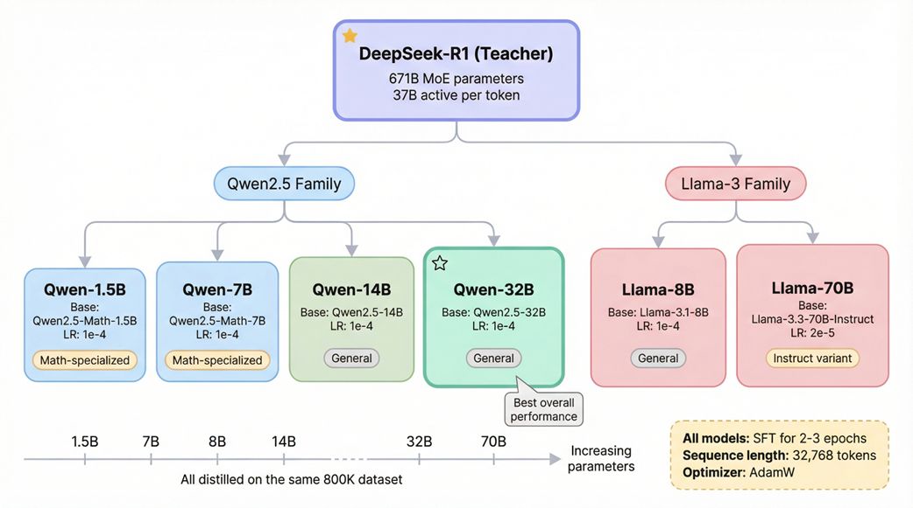

*图8.20 DeepSeek 的六个蒸馏模型跨越两个架构家族：Qwen2.5（1.5B、7B、14B、32B）和 Llama-3（8B、70B）。1.5B 和 7B Qwen 模型使用数学专业化基础模型，而较大模型使用通用基础模型。*

**Qwen2.5 家族：**

- DeepSeek R1 Distill Qwen 1.5B 基于 Qwen2.5 Math 1.5B（数学专业化基础）
- DeepSeek R1 Distill Qwen 7B 基于 Qwen2.5 Math 7B（数学专业化基础）
- DeepSeek R1 Distill Qwen 14B 基于 Qwen2.5 14B（通用基础）
- DeepSeek R1 Distill Qwen 32B 基于 Qwen2.5 32B（通用基础，整体最佳）

**Llama 3 家族：**

- DeepSeek R1 Distill Llama 8B 基于 Llama 3.1 8B
- DeepSeek R1 Distill Llama 70B 基于 Llama 3.3 70B Instruct

一个重要的细节：1.5B 和 7B Qwen 模型使用数学专业化的基础模型（Qwen2.5-Math），给它们在数学推理上的领先优势。这些数学专业化的基础已经在富含数学内容的课程上进行了预训练，因此它们到达蒸馏阶段时已具备内置的数学词汇和模式识别能力。较大的 Qwen 模型（14B 和 32B）和 Llama 模型使用通用基础，从更中性的位置出发。

基础模型的选择不是任意的。DeepSeek 特意选择了 Llama-3.3-70B-Instruct 变体，因为"其推理能力略优于 Llama-3.1"，表明即使是基础模型能力的微小差异也可以通过蒸馏复合产生最终模型中有意义的性能差距。

这个选择很重要，正如我们将在基准结果中看到的——数学专业化的基础在可比大小下始终优于通用基础，基础模型的具体变体（指令调优 vs 基础版、数学专业化 vs 通用）有可测量的影响。

训练配置虽然直接，但展示了深思熟虑的工程选择。所有模型都在 80 万数据集上训练了 2-3 个 epoch，批次大小为 64，余弦学习率衰减逐渐降低到初始值的十分之一，最大上下文长度为 32,768 个 token。学习率根据模型大小精心调整：

| 模型 | 参数 | 初始学习率 |
|------|------|-----------|
| DS-R1-Distill-Qwen-1.5B | 1.5B | 1 × 10⁻⁴ |
| DS-R1-Distill-Qwen-7B | 7B | 8 × 10⁻⁵ |
| DS-R1-Distill-Qwen-14B | 14B | 7 × 10⁻⁵ |
| DS-R1-Distill-Qwen-32B | 32B | 6 × 10⁻⁵ |
| DS-R1-Distill-Llama-8B | 8B | 5 × 10⁻⁵ |
| DS-R1-Distill-Llama-70B | 70B | 2 × 10⁻⁵ |

注意模式：较小的模型使用较高的学习率，较大的模型使用较低的学习率。这是微调中的常见做法；较小的模型需要更大的步长来取得进展，而较大的模型在激进的学习率下面临不稳定的风险。

### 8.5.5 蒸馏的经济学

也许 DeepSeek 方法最引人注目的方面是它的成本效益。整个数据生成过程——运行 teacher model 通过 rejection sampling 产生 80 万高质量响应——大约花费了 10,000 美元的计算成本（5,000 H800 GPU 小时）。

为提供一些背景：

- 从头用纯 RL 训练 DeepSeek-R1-Zero 花费了 202,000 美元（101K GPU 小时）。
- 训练完整的 DeepSeek-R1 流水线花费了 82,000 美元（41K GPU 小时）。
- 生成蒸馏数据花费了 10,000 美元（5K GPU 小时）——大约比 teacher 自己的 RL 训练便宜 20 倍。

而且这个成本是一次性投资。一旦 80 万数据集存在，任意数量的 student model 都可以在相对较小的额外成本下训练（标准 SFT 在密集模型上 2-3 个 epoch）。DeepSeek 在相同数据上训练了六个模型。一个研究实验室可以训练几十个。

这是蒸馏最强大的属性之一：teacher 支付一次学习成本，知识就可以转移给无限数量的 student。经济学强烈倾向于蒸馏，而不是用 RL 独立训练每个小模型。

## 8.6 在 PyTorch 中实现 Knowledge Distillation

我们现在已经详细涵盖了理论——从 temperature scaling 到 dark knowledge 到 DeepSeek 的 rejection sampling 方法。是时候实现我们学到的内容了。在本节中，我们将构建一个完整的、可运行的 knowledge distillation 训练流水线。

遵循本书的模式，我们将使用足够小以手动追踪的玩具维度，但能捕获真实系统本质结构。就像我们在注意力和 MoE 实现中使用 4 个 token 和 8 维嵌入一样，我们的蒸馏代码将使用具有清晰、可追踪计算的小模型。无论模型有 26,000 个参数还是 6710 亿个参数，原理都是相同的；只是规模不同。

我们将构建四样东西：(1) 一个 teacher model，(2) 一个 student model，(3) 蒸馏损失函数，(4) 将它们联系在一起的完整训练循环。在本节结束时，你将拥有一个功能完整的 knowledge distillation 流水线，可以扩展到更大的模型和真实数据集。

**清单 8.3** 用于推理数据筛选的 Rejection sampling。

```python
#A Generate n_samples candidate responses per prompt.
#B Each candidate uses the teacher's own generation settings.
#C Compare the extracted answer to the known ground truth.
#D Filter out responses with mixed languages or chaotic formatting.
#E The result is a curated dataset of only correct, clean responses.
def rejection_sample(teacher, prompts,
                      n_samples=4):  #A
    dataset = []
    for prompt in prompts:
        candidates = []
        for _ in range(n_samples):  #B
            response = teacher.generate(
                prompt, temperature=0.6,
                top_p=0.95,
                max_tokens=32768)
            candidates.append(response)
        for resp in candidates:
            answer = extract_answer(resp)
            truth = get_ground_truth(prompt)  #C
            if verify(answer, truth):
                if is_clean(resp):  #D
                    dataset.append((prompt, resp))
                    break
    return dataset  #E
```

### 8.6.1 定义 teacher 和 student 模型

对于我们的实现，我们将使用本书一直遵循的相同玩具维度方法。我们的模型将足够小以手动推理，但能捕获真实 knowledge distillation 的所有本质结构元素。

我们的 teacher 是一个 4 层网络，带有 128 维隐藏层，包含大约 26,000 个参数。我们的 student 是一个 2 层网络，带有 32 维隐藏层，包含大约 8,800 个参数，大约小 3 倍。这反映了现实世界场景中 teacher 明显大于且更有能力的情况。

两个模型共享相同的嵌入层（100 个词汇 token 映射到 64 维）和相同的输出空间（10 个类别）。关键区别在于隐藏层的深度和宽度。Teacher 有四层 128 个神经元，给它显著更多的表示容量，而 student 只有两层 32 个神经元。Student 必须学习用一小部分参数来近似 teacher 的行为。

**注意** 在像 DeepSeek 这样的真实系统中，teacher 有 6710 亿参数，student 范围从 15 亿到 700 亿。我们的玩具模型在更小的规模上使用相同的架构原理。概念是完全相同的。

图 8.21 并排展示了两种架构。

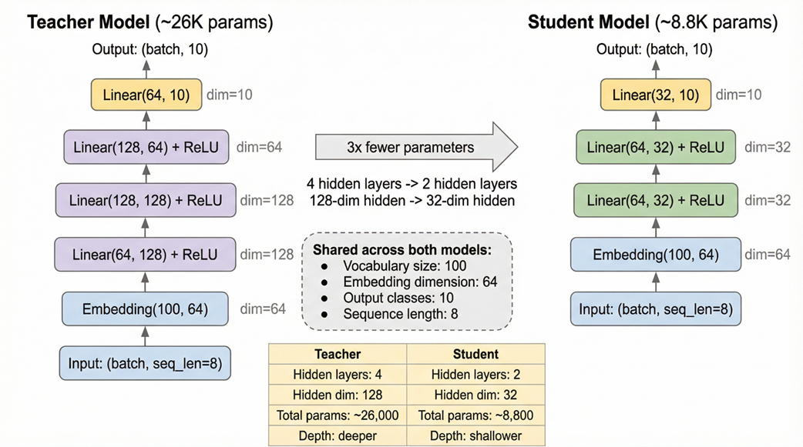

*图8.21 我们实现中使用的玩具大小的 teacher model（4 层，128 维隐藏，约 26K 参数）和 student model（2 层，32 维隐藏，约 8.8K 参数）。Student 小 3 倍但保持相同的输入和输出维度。*

### 8.6.2 训练循环

蒸馏训练循环表面上看起来与标准训练循环相似，但有一个关键的结构差异：两个模型处理相同的输入，但只有其中一个学习。

图 8.22 展示了一个训练步骤的流程。

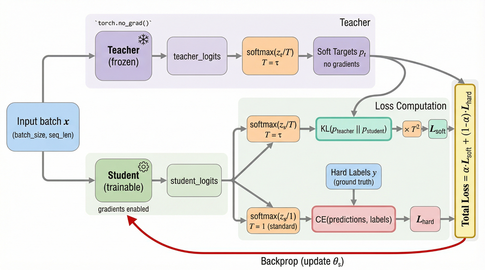

*图8.22 Knowledge distillation 中的一个训练步骤。冻结的 teacher 和可训练的 student 都处理输入。计算并组合两个损失项，仅更新 student 的权重。*

让我们逐步走一遍：

1. **输入批次：** 一批训练数据（输入和标签）进入系统。
2. **Teacher 前向传播：** 输入通过冻结的 teacher model。我们使用 `torch.no_grad()` 来防止 PyTorch 为此传播跟踪梯度。Teacher 的参数永远不会被更新，因此为它计算梯度会浪费内存和计算。
3. **Student 前向传播：** 相同的输入通过 student model。这里需要跟踪梯度，因为我们需要它们来更新 student。
4. **Hard-label loss：** Student 的原始 logits（在 T=1 时）与 ground-truth 标签使用 cross-entropy 进行比较。这产生 L_hard。
5. **Soft-target loss：** Teacher 和 student 的 logits 都除以 T，通过 softmax，使用 KL divergence 进行比较。结果乘以 T² 以补偿梯度缩放。这产生 L_soft。
6. **组合损失：** L = α L_hard + (1-α) T² L_soft
7. **反向传播：** 组合损失被反向传播，仅计算 student 的梯度。
8. **优化器步骤：** Student 的参数被更新。

图 8.23 展示了用实际数字的这种计算，追踪一个从 logits 到最终损失值的具体示例。

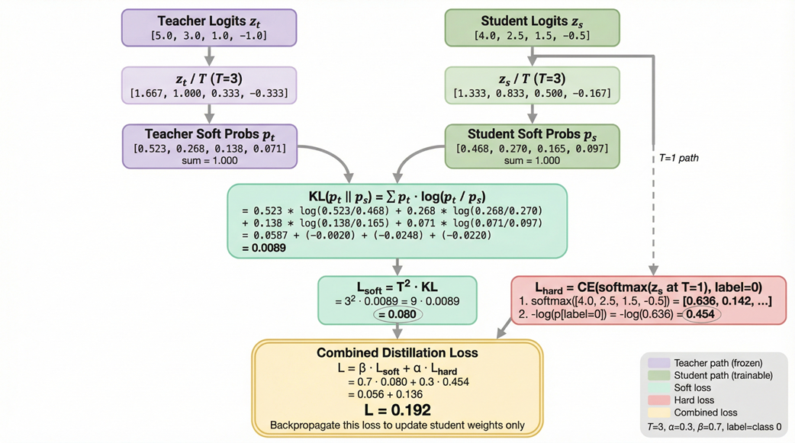

*图8.23 用实际数字逐步计算组合蒸馏损失，展示 teacher 和 student logits 如何通过 T=3 的 softmax、KL divergence、T² 缩放和最终加权组合。*

让我们追踪这个数值示例。假设 teacher 产生 logits [5.0, 3.0, 1.0, -1.0]，student 产生 [4.0, 2.5, 1.5, -0.5]。在 T=3 时应用 softmax(z/T) 得到 teacher 的 soft target [0.523, 0.268, 0.138, 0.071] 和 student 的 soft target [0.442, 0.268, 0.192, 0.099]。这些分布之间的 KL divergence 大约为 0.0199。乘以 T² = 9，soft loss 为 L_soft ≈ 0.179。Hard-label cross-entropy，针对 student 的标准 softmax [0.760, 0.170, 0.062, 0.008] 以真实类别在索引 0 处计算，L_hard ≈ 0.275。当 α = 0.3 时，组合损失为：

```
0.3 × 0.275 + 0.7 × 0.179 ≈ 0.208
```

这里的关键洞察是，soft loss（0.056）在绝对值上小于 hard loss（0.126），但它携带更丰富的梯度信息，将 student 引向 teacher 学到的类关系表示。

现在让我们将这一切整合到代码中。

**清单 8.4** 完整的 knowledge distillation 训练循环。

```python
#A Teacher has 4 layers with 128-dim hidden, ~26K total parameters.
#B Student has only 2 layers with 32-dim hidden, ~8.8K parameters.
#C Freeze the teacher. Its weights never change during distillation.
#D Teacher forward pass runs without gradient tracking.
#E Uses the distillation_loss function from Listing 8.2.
#F Only the student's parameters are updated by the optimizer.
import torch
import torch.nn as nn
import torch.nn.functional as F

class TeacherModel(nn.Module):
    def __init__(self, vocab=100,
                 d=64, classes=10):  #A
        super().__init__()
        self.embed = nn.Embedding(vocab, d)
        self.net = nn.Sequential(
            nn.Linear(d, 128), nn.ReLU(),
            nn.Linear(128, 128), nn.ReLU(),
            nn.Linear(128, 64), nn.ReLU(),
            nn.Linear(64, classes))

    def forward(self, x):
        return self.net(self.embed(x).mean(dim=1))

class StudentModel(nn.Module):
    def __init__(self, vocab=100,
                 d=64, classes=10):  #B
        super().__init__()
        self.embed = nn.Embedding(vocab, d)
        self.net = nn.Sequential(
            nn.Linear(d, 32), nn.ReLU(),
            nn.Linear(32, classes))

    def forward(self, x):
        return self.net(self.embed(x).mean(dim=1))

def train_distill(teacher, student,
                  loader, epochs=10, T=3.0,
                  alpha=0.3, lr=1e-3):
    teacher.eval()  #C
    opt = torch.optim.Adam(
        student.parameters(), lr=lr)
    for epoch in range(epochs):
        total = 0
        for x, y in loader:
            opt.zero_grad()
            with torch.no_grad():
                t_logits = teacher(x)  #D
            s_logits = student(x)
            loss = distillation_loss(
                s_logits, t_logits, y,
                temperature=T,
                alpha=alpha)  #E
            loss.backward()
            opt.step()  #F
            total += loss.item()
        print(f"Epoch {epoch+1}: "
              f"{total/len(loader):.4f}")
```

### 8.6.3 比较三种方法

要看蒸馏的实际效果，我们可以用三种不同方式训练相同的 student 架构并比较结果：

1. **基线（仅 hard label）：** Student 在 ground-truth 标签上训练，没有 teacher 指导。这是 8.4 节中尝试 #1 的方法。
2. **蒸馏（soft target + hard label）：** Student 用清单 8.2 的完整蒸馏损失训练，使用 teacher 在 T=3 时的 soft target 以及 hard label。
3. **Teacher（上界）：** Teacher 自身的性能，代表 student 试图接近的天花板。

结果始终显示相同的模式：蒸馏的 student 显著优于基线 student，尽管它不能完全匹配 teacher。这是 dark knowledge 通过 soft target 转移并改善 student 泛化到未见数据能力的实践证明。

改善在类别模糊或密切相关的示例上特别明显——正是 dark knowledge 提供最大价值的情况。在简单、不模糊的示例上（teacher 的分布即使在高温下也很尖锐），蒸馏的优势较小。在困难、边界示例上（teacher 对多个类别表达了真正的不确定性），优势是戏剧性的。

这种模式反映了我们在 DeepSeek 大规模结果中看到的：蒸馏的优势在 AIME（竞赛数学）等具有挑战性的基准上最为明显，这些需要细微的推理，而在简单基准上则不太明显，因为即使从头训练的模型也能表现良好。

## 8.7 回报：面对面的实证比较

在探索了 knowledge distillation 的理论基础和 DeepSeek 的具体方法之后，是时候检验我们的知识了。理论是一回事，但实证结果提供了最终裁决。而 DeepSeek-R1 蒸馏模型的结果，坦率地说，是非凡的。

### 8.7.1 头条：1.5B 击败 GPT-4o

让我们从 2025 年 1 月震惊全球的数字开始。DeepSeek-R1-Distill-Qwen-1.5B——一个只有 15 亿参数的模型，小到可以在手机上运行——在 AIME 2024 竞赛数学基准测试上达到了 28.9%。GPT-4o，估计有大约 1.8 万亿参数，在同一基准测试上得分 9.3%。

好好消化一下：一个大约小 1.2 万倍的模型在数学推理上超越了世界上最强大的 AI 系统之一。而且不仅仅是 GPT-4o。同一个 1.5B 模型在 AIME 上也超越了 Claude-3.5-Sonnet（16.0%），在 MATH-500 上达到了 83.9%，而 Claude 是 78.3%。

图 8.24 展示了所有模型的完整基准比较。

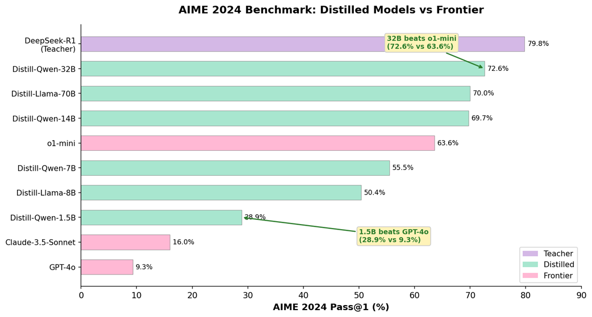

*图8.24 AIME 2024 基准结果，比较 DeepSeek 的蒸馏模型与前沿竞争对手。1.5B 蒸馏模型超越了 GPT-4o（28.9% vs 9.3%），32B 模型超越了 o1-mini（72.6% vs 63.6%）。*

图 8.25 放大了最惊人的对比——1.5B 模型对阵前沿巨头。

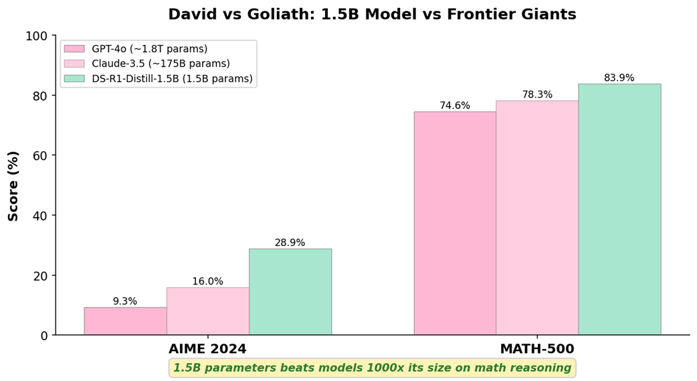

*图8.25 David 对阵 Goliath 的时刻：一个 1.5B 参数的蒸馏模型在数学推理基准上超越了 GPT-4o（约 1.8T 参数）和 Claude-3.5-Sonnet（约 175B 参数）。*

所有六个蒸馏模型的完整基准结果描绘了一幅非凡的图景：

| 模型 | 参数 | AIME 2024 | MATH-500 | GPQA Diamond | LiveCodeBench |
|------|------|-----------|----------|--------------|---------------|
| GPT-4o | ~1.8T | 9.3% | 74.6% | 49.9% | 32.9% |
| Claude-3.5-Sonnet | – | 16.0% | 78.3% | 65.0% | 38.9% |
| OpenAI o1-mini | – | 63.6% | 90.0% | 60.0% | 53.8% |
| DS-R1-Distill-Qwen-1.5B | 1.5B | 28.9% | 83.9% | 33.8% | 16.9% |
| DS-R1-Distill-Qwen-7B | 7B | 55.5% | 92.8% | 49.1% | 37.6% |
| DS-R1-Distill-Qwen-14B | 14B | 69.7% | 93.9% | 59.1% | 53.1% |
| DS-R1-Distill-Qwen-32B | 32B | 72.6% | 94.3% | 62.1% | 57.2% |
| DS-R1-Distill-Llama-8B | 8B | 50.4% | 89.1% | 49.0% | 39.6% |
| DS-R1-Distill-Llama-70B | 70B | 70.0% | 94.5% | 65.2% | 57.5% |
| DeepSeek-R1 (teacher) | 671B | 79.8% | 97.3% | 71.5% | 65.9% |

32B Qwen 蒸馏模型在所有四个基准上超越了 OpenAI 的 o1-mini：AIME（72.6% vs 63.6%）、MATH-500（94.3% vs 90.0%）、GPQA Diamond（62.1% vs 60.0%）和 LiveCodeBench（57.2% vs 53.8%）。

从该表中可以看出几个模式：

1. **数学推理是最强的领域。** 蒸馏模型在 MATH-500 上表现出色，即使是 7B 模型也达到了 92.8%，超越了 o1-mini 的 90.0%。这表明数学推理模式在蒸馏过程中压缩得很好。
2. **编码是小型模型最弱的领域。** 1.5B 模型在 LiveCodeBench 上仅得分 16.9%，远低于其数学表现（83.9%）。这在直觉上是合理的：编码需要处理庞大的语法、API 和架构模式空间，1.5B 模型根本无法存储。
3. **Teacher 保留了明显的领先。** DeepSeek-R1 本身在 AIME 上达到 79.8%，而最佳蒸馏模型为 72.6%。蒸馏非常有效但并非无损；大约 9% 的 teacher 数学表现在压缩到 32B 时丢失。
4. **架构很重要。** 在相似大小下，基于 Qwen 的模型始终优于基于 Llama 的模型：Qwen-7B（55.5% AIME）vs Llama-8B（50.4%），尽管 Llama 模型略大。这种优势可能来自较小变体使用的数学专业化 Qwen2.5-Math 基础模型。

### 8.7.2 关键对比：蒸馏 vs 直接 RL

也许比绝对数字更重要的是蒸馏与直接强化学习在同一架构上的比较。这个实验回答了一个根本性的问题：如果我们有一个 32B 模型，是从头用 RL 训练更好，还是从更强大的 teacher 蒸馏更好？

DeepSeek 直接进行了这个实验。他们用大规模 RL（超过 10,000 个 policy gradient 更新步骤）训练了相同的 Qwen2.5-32B 架构，并将其与仅用 2-3 个 epoch SFT 训练的蒸馏版本进行了比较。图 8.26 展示了结果。

以下比较了从相同 Qwen2.5-32B 基础训练的三个模型。QwQ-32B 是阿里巴巴自己的 Qwen2.5-32B 推理调优变体，用大规模 RL 训练。它作为 RL 在这个基础上能达到什么的独立参考点。DS-R1-Zero-32B 是 DeepSeek 自己在同一基础上从头 RL 训练的结果，DS-R1-Distill-32B 是在 R1 的 80 万推理样本上训练的蒸馏变体。

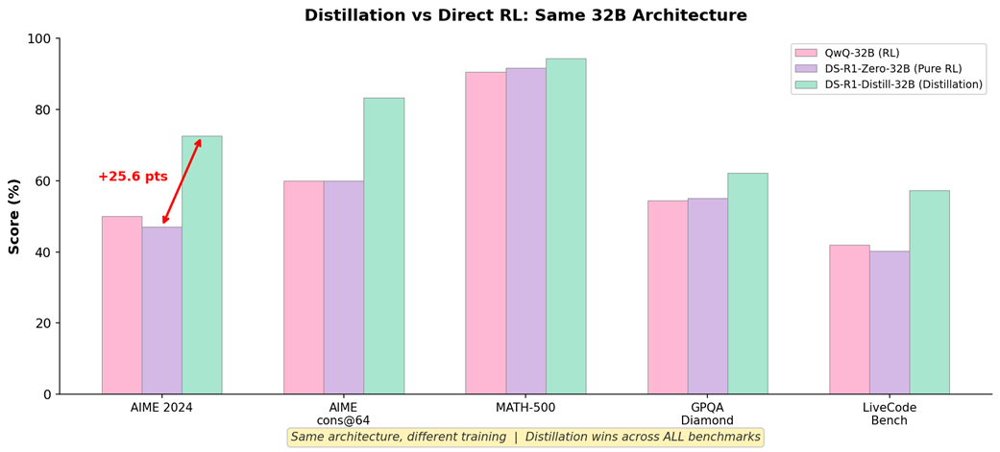

*图8.26 相同 32B Qwen2.5 架构上蒸馏 vs 直接 RL。蒸馏模型（72.6% AIME）比 RL 训练模型（47.0%）高出 25.6 个百分点，在所有基准上一致胜出。*

差距是惊人的：在 AIME 2024 上相差 25.6 个百分点。为提供一些视角，这个性能差距比 GPT-4o（9.3%）和 7B 蒸馏模型（55.5%）之间的差异还大。蒸馏模型不仅在 AIME 上获胜。它在每个基准上都赢了。MATH-500：94.3% vs 91.6%。GPQA Diamond：62.1% vs 55.0%。LiveCodeBench：57.2% vs 40.2%。优势是全面且一致的。

这个结果之所以如此引人注目，是因为两个模型使用的是相同的架构——Qwen2.5-32B。它们有相同数量的参数、相同的层结构、相同的注意力机制。唯一的区别是训练方式。一个用大规模 RL 从头发现推理模式（超过 10,000 个 policy gradient 步骤）。另一个只是用 2-3 个 epoch 在 teacher 的推理轨迹上微调。从 teacher 抄袭的 student 决定性地超越了试图自己弄明白的 student。

此外，注意两个 RL 柱（QwQ-32B 和 DS-R1-Zero-32B）的共同点：尽管用不同的 RL 设置独立训练，它们在几乎每个基准上都落在几乎相同的位置。这种收敛才是真正的信号。它意味着平台是这个规模下基础架构的属性，而不是任何一个团队的 RL 配方的属性。蒸馏是唯一突破那个天花板的柱——而且它完全不使用任何 RL，只是模仿更强大 teacher 的推理轨迹。教训不是 DeepSeek 的 RL 很弱；而是 32B 参数的容量是这个任务上从头 RL 的约束瓶颈，而蒸馏绕过了它。

DeepSeek 论文从这个结果得出两个关键结论：

1. "将更强大的模型蒸馏到更小的模型中产生了出色的结果，而依赖本文提到的大规模 RL 的较小模型需要巨大的计算能力，甚至可能无法达到蒸馏的性能。"
2. "虽然蒸馏策略既经济又有效，但超越智能边界可能仍需要更强大的基础模型和更大规模的强化学习。"

第一个结论告诉我们，蒸馏是创建有能力的 小型模型的实用路径。第二个更微妙的结论告诉我们，蒸馏有局限。它可以转移现有知识，但无法创造超越 teacher 所拥有的新知识。

### 8.7.3 缩放行为

图 8.27 展示了蒸馏模型性能如何随模型大小缩放，x 轴使用对数刻度。

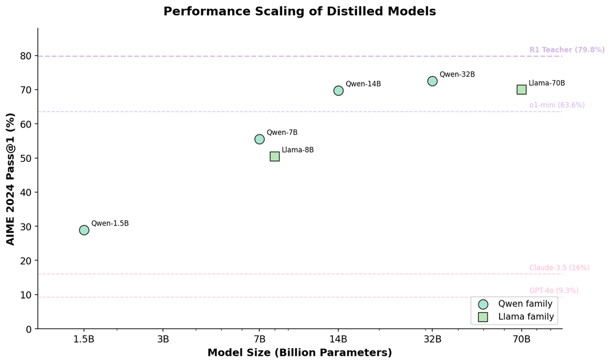

*图8.27 蒸馏模型的性能（AIME 2024）随模型大小平滑缩放。Qwen-Math 基础在相似大小下始终优于 Llama 基础，表明基础模型的预存能力与蒸馏质量相互作用。*

两个模式清晰浮现：

1. **平滑缩放：** 性能随着模型大小的增加稳步提升，从 1.5B 的 28.9% 到 32B 的 72.6%。这是令人鼓舞的。它表明缩放定律适用于蒸馏，就像其他训练范式一样。
2. **基础模型很重要：** Qwen2.5-Math 基础在可比大小下始终优于 Llama 基础（Qwen-7B 的 55.5% vs Llama-8B 的 50.4%）。这告诉我们蒸馏不仅仅是训练的问题——基础模型的预存知识和架构与蒸馏过程相互作用。

一个有趣的异常：Llama-70B 模型（70.0%）实际上得分略低于 Qwen-32B 模型（72.6%），尽管它大了一倍多。这表明 Qwen2.5 的通用预训练在这个规模上数学比 Llama-3 的通用预训练更强，即使 14B 和 32B Qwen 变体都使用 Qwen2.5 的通用基础（不是数学专业化的那个），Qwen2.5 预训练语料中的数学内容似乎给了它一个持久的优势，更多的 Llama 参数无法弥补。基础模型的选择不仅仅是实现细节，它是一个显著影响最终蒸馏模型能力的战略决策。

这一发现对该领域有更广泛的含义。它告诉我们蒸馏不是一个"一刀切"的过程。Student 的预存知识（来自其基础模型的预训练）以重要的方式与蒸馏知识交互。已经具有一些数学能力的基础模型将比从较低基线出发的基础模型更有效地吸收数学推理模式。这类似于人类学习：具有扎实代数基础的学生比没有基础的学生学微积分更快，即使两者接受相同的指导。

**实践要点：** 在选择蒸馏的基础模型时，考虑基础模型已经具备什么能力。对于数学密集的应用，像 Qwen2.5-Math 这样的数学专业化基础值得投入。对于通用应用，像 Llama-3.3-70B-Instruct 这样的更大通用基础可能更合适，即使它在数学基准上得分略低。

**为什么小型模型在直接 RL 上失败了？** 论文揭示了一个重要发现："在我们开发的初始阶段，我们尝试了较小规模的模型，具体是一个 7B 密集模型和一个 16B Mixture-of-Experts (MoE) 模型，作为 RL 训练的基础架构。然而，这些配置在 AIME 基准上始终未能产生有意义的改进……随着响应长度增加，这些较小模型倾向于重复，并且无法有效利用长 chain-of-thought 来提高推理准确性。"

换句话说，小型模型根本缺乏通过 RL 从头发现推理模式的容量。它们陷入重复文本的循环中，无法维持复杂推理所需的长 chain-of-thought。根本问题是 RL 要求模型去探索——尝试不同的方法，有时失败，有时成功，逐渐学习哪些策略有效。一个 7B 模型根本没有足够的参数来存储在探索期间发现的多样策略，同时维持语言理解所需的基础能力。

蒸馏提供了绕过这个探索障碍的捷径。拥有 6710 亿参数的大型 teacher 有足够的容量去探索、失败、恢复，并最终通过 RL 发现有效的推理策略。一旦这些策略被发现并编码在 teacher 的行为中，它们可以通过训练数据直接示范给 student。Student 不需要探索。它只需要模仿。而模仿，事实证明，比探索容易得多。即使是 1.5B 模型也能学会模仿 teacher 的推理轨迹，即使它永远无法通过 RL 自己发现那些推理模式。

这也许是 DeepSeek 工作中最深刻的洞察：探索需要容量，但模仿不需要。蒸馏将探索这个困难问题转化为模仿这个较容易的问题，使推理对比 teacher 小几个数量级的模型变得可达。

## 8.8 蒸馏的局限

Knowledge distillation 是强大的，但不是魔法。在我们结束之前，让我们诚实面对它能做什么和不能做什么。

### 8.8.1 容量差距

第一个局限是容量差距。Student model 只能吸收其架构允许的知识量。当 teacher 远比 student 有能力时，一些知识不可避免地在压缩中丢失。

**定义 什么是 capacity gap？** Capacity gap 是指相对于 teacher 太小的 student model 难以吸收所有 teacher 知识的现象，导致不同任务上的表现不均匀。

证据在 DeepSeek 自己的结果中就很清楚。图 8.28 展示了 1.5B 模型在不同领域的表现。

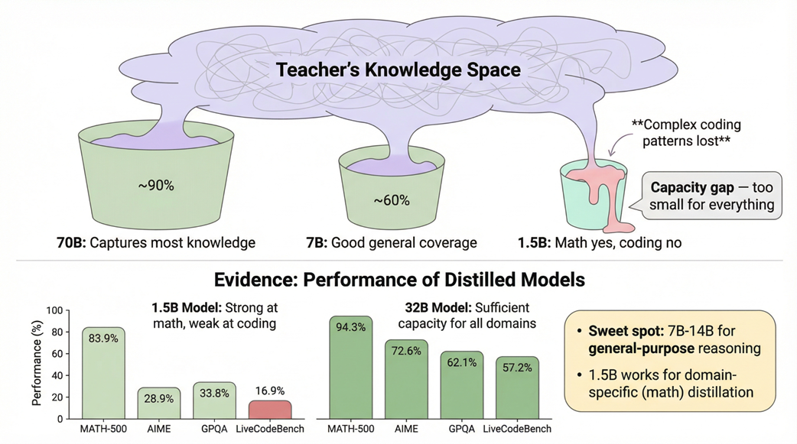

*图8.28 容量差距的实际表现。1.5B 蒸馏模型在数学推理上表现出色（83.9% MATH）但在编码上挣扎（16.9% LiveCodeBench），表明其有限的容量无法均等地吸收所有领域。*

1.5B 模型在 MATH-500（数学推理）上达到了令人印象深刻的 83.9%，但在 LiveCodeBench（编码）上只有 16.9%。数学推理，其相对有约束的模式和明确定义的解题策略，能很好地压缩到小模型中。复杂编码，其庞大的可能方法空间和语法要求，需要更多容量。

最佳点似乎是 7B-14B 用于通用推理，1.5B-7B 用于领域特定（尤其是数学）蒸馏。

**为什么数学比编码压缩得更好？** 答案在于两个领域的本质。数学推理，尽管困难，遵循相对结构化的模式：识别问题类型、应用适当的技术、逐步计算、验证答案。这些模式足够规则，即使是 1.5B 模型也能有效地学会复现它们。相比之下，编码需要语法、API、设计模式、错误处理以及可能程序的巨大多样性的知识。有效代码的空间比有效数学解的空间大得多，将这种知识压缩到非常小的模型中不可避免地会丢失重要细节。

这为选择 student 模型大小提供了一个实用指南：

- **1.5B-3B：** 适用于狭窄、明确定义的推理领域（竞赛数学、基本逻辑）。非常适合移动设备和边缘硬件部署。
- **7B-14B：** 通用推理（包括数学和编码）的最佳点。可在单块消费级 GPU 上运行。
- **32B-70B：** 在大多数领域接近 teacher 的质量。需要专业级硬件，但仍远比 671B teacher 更易部署。

### 8.8.2 知识前沿

第二个、也许更根本的局限是，蒸馏只能转移 teacher 已经拥有的知识。它无法创造新知识或突破 teacher 的能力边界。

这看起来可能显而易见，但影响深远。考虑当蒸馏模型遇到 teacher 自己也无法解决的问题时会发生什么。Teacher 的训练数据不会包含这类问题的正确推理轨迹，因为 rejection sampling 过程只保留正确的响应。仅靠 teacher 成功解题策略训练的 student，没有应对真正新颖挑战的基础。

2025 年 5 月的最近研究使这种区分更加清晰。一篇题为"Reinforcement Learning vs. Distillation: Understanding Accuracy and Capability in LLM Reasoning"的论文发现，teacher distillation 仅当引入基础模型中缺失的新知识时才提高能力。单独蒸馏推理模式（不引入新知识）提高了准确性，但行为类似于强化学习——它不会添加真正的新能力。换句话说，如果基础模型已经知道相关事实，教它 teacher 的推理风格是有帮助的，但不是变革性的。

如图 8.29 所示，蒸馏能实现什么与仍需要强化学习或更强大基础模型之间存在明确的边界。

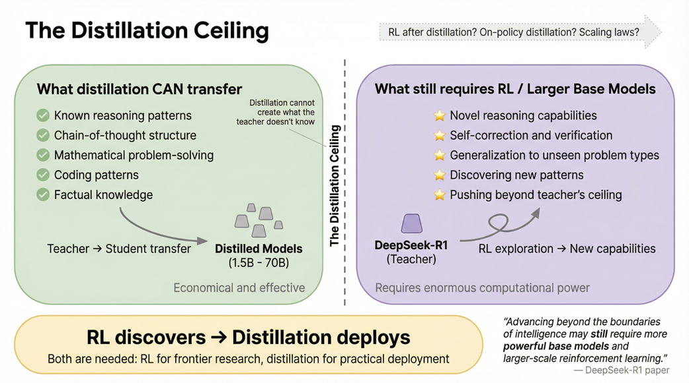

*图8.29 知识前沿。蒸馏高效地转移现有知识（chain-of-thought 模式、事实知识、数学策略），但新颖推理能力和前沿智能仍需要强化学习和更强大的基础模型。*

DeepSeek 论文明确表述了这一点："蒸馏策略既经济又有效，但超越智能边界可能仍需要更强大的基础模型和更大规模的强化学习。"

这在 AI 开发流水线中产生了明确的分工：

- **Reinforcement learning 发现新能力**——它推动模型能做什么的前沿。它是绘制新领域的探险者。
- **Distillation 部署这些能力**——它使它们在实用、高效的模型中可访问。它是将发现带给每个人的桥梁。

两者都是必需的。任何一个都不能替代另一个。只有 RL 的世界将拥有强大但代价高昂的模型。只有蒸馏的世界将拥有高效但停滞的模型，永远受限于其 teacher 已经知道的东西。两者的结合才是使 AI 快速进步成为可能的原因。

### 8.8.3 可复现性差距

还有一个值得一提的局限：复现 DeepSeek 结果的实际困难。虽然 DeepSeek 开源了所有六个蒸馏模型（允许任何人使用它们），但他们没有发布 80 万训练数据集。确切的 prompt、rejection sampling 过程和质量过滤器仍然专有。

这很重要，因为正如我们在 8.5 节讨论的，SFT 蒸馏中训练数据的质量就是一切。没有相同的 prompt 和质量过滤器，尝试复制数据集会产生不同的结果。像 Open-R1 项目这样的社区努力已经尝试使用公开可用的 prompt 和开源 reward model 来复制 DeepSeek 的数据筛选过程，但效果参差不齐。模型是好的，但达不到 DeepSeek 发布的基准数字。

训练超参数（学习率、批次大小、epoch 数）已经公开，但其他细节如优化器、warmup 调度、gradient accumulation 和 weight decay 没有公开。这使得精确复现具有挑战性，尽管总体方法是足够清晰的，许多团队已经成功训练了有竞争力的蒸馏模型。

### 8.8.4 展望未来

在 knowledge distillation 研究的前沿，仍有几个开放问题：

- **蒸馏后的 RL。** DeepSeek 刻意没有对蒸馏模型应用 RL，指出"纳入 RL 可以大幅提升模型性能。"社区将 GRPO 应用于蒸馏模型的努力，特别是对于金融和表格推理等领域特定任务，已经显示了有希望的结果。
- **蒸馏的缩放定律。** 蒸馏效果如何随 teacher 大小、student 大小和数据集大小缩放？来自 Apple 和 Oxford 的研究表明存在幂律关系，但有递减回报——超过一定大小的 teacher 可能不会使小 student 受益。
- **On-policy distillation。** 与在静态 teacher 数据上训练 student 不同，如果 student 生成自己的尝试，teacher 对这些特定尝试提供反馈呢？传统蒸馏是"off-policy"的——student 在 teacher 的数据上训练，这可能不反映 student 自己的优势和劣势。On-policy distillation，即 student 生成响应而 teacher 实时纠正或评分它们，确保训练数据始终与学生接下来需要学习的内容完美对齐。这种方法更昂贵（teacher 必须在 student 训练期间运行），但可能产生更优的结果，特别是当 student 的失败模式与 teacher 不同时。
- **Multi-teacher distillation。** 如果我们同时从多个 teacher 蒸馏呢？不同的 teacher 可能有不同的优势——一个可能在数学上出色，而另一个在编码上出色。通过多 teacher 蒸馏结合它们的知识可以产生在某些领域比任何单个 teacher 都更强的 student。这是一个有前景初步结果的活跃研究领域。
- **Self-distillation。** 一个模型能从自己蒸馏吗？通过在自己的最佳输出（通过 rejection sampling 或 best-of-N 选择）上训练，一个模型可以迭代改进，无需外部 teacher。这与 RL 方法创建了一个有趣的平行——模型本质上将自己的最佳尝试作为训练数据，随时间逐步改进。

Knowledge distillation 是现代 AI 工具箱中最实用、最民主化的技术。它是连接用庞大计算预算进行的前沿研究与人们实际使用设备上的现实部署的桥梁。DeepSeek 团队用非凡的结果证明了这一点：一个微小的 1.5B 模型在数学上超越了 GPT-4o，构建它的训练过程成本低于运行它的硬件的电费。

通过本章，我们完成了从零构建 DeepSeek 四个阶段旅程的全部。从 Stage 1 的 KV Cache 基础，到 Stage 2 的 MLA 和 MoE 核心架构创新，Stage 3 的 MTP 和 FP8 quantization 高级训练技术，最后到 Stage 4 的 supervised fine-tuning、reinforcement learning 以及现在的 knowledge distillation 后训练流水线，我们已经全面理解了使 DeepSeek 成为世界上最强大的开源语言模型之一的每一个组件。

蒸馏的关键教训，也许也是本书的关键教训，是智能不仅仅是规模问题。通过正确的技术，一个 6710 亿参数的庞大模型学到的知识可以被压缩、转移并部署到小到可以装在手机上的模型中。AI 的前沿由不断增大的模型推动，但 AI 的影响力取决于这些前沿知识能多有效地带给每个人。

## 8.9 总结

- Knowledge distillation 通过在 teacher 的 soft probability distribution 上训练 student，而不是 hard one-hot label，将大型 teacher model 的能力转移到更小的 student model。
- Temperature-scaled softmax（T > 1）揭示了 dark knowledge——编码类间相似性结构的错误类别的相对概率，这在 hard label 中是不可见的。
- 经典蒸馏损失结合两项：一个 hard-label cross-entropy loss（基础）和一个 soft-target KL divergence loss 缩放 T²（知识转移），由系数 α 和 β 加权。
- DeepSeek-R1 的蒸馏使用根本不同的方法：在 teacher 通过 rejection sampling 生成的 80 万 chain-of-thought 推理轨迹上进行 supervised fine-tuning，没有 temperature scaling 或 KL divergence。
- DeepSeek 的 80 万训练数据集包含大约 395K 数学、211K 代码、10K STEM、10K 逻辑和 178K 通用样本——通过 rejection sampling 策划，仅保留验证正确的、格式良好的响应。
- 蒸馏的 DeepSeek-R1-Qwen-1.5B 模型在 AIME 2024 上超越了 GPT-4o（28.9% vs 9.3%），证明推理能力可以在参数数量上压缩约 450 倍。
- 蒸馏在同一架构上大幅超越直接强化学习：蒸馏的 32B 模型在 AIME 上达到 72.6%，而仅 RL 变体为 47.0%，差距为 25.6 个百分点。
- Capacity gap 限制了非常小的 student 能吸收什么——1.5B 模型在数学上出色（83.9% MATH）但在编码上挣扎（16.9% LiveCodeBench）。
- Distillation 高效地转移现有知识但无法创造新能力——突破 teacher 的前沿仍需要更强大的基础模型和更大规模的强化学习。
